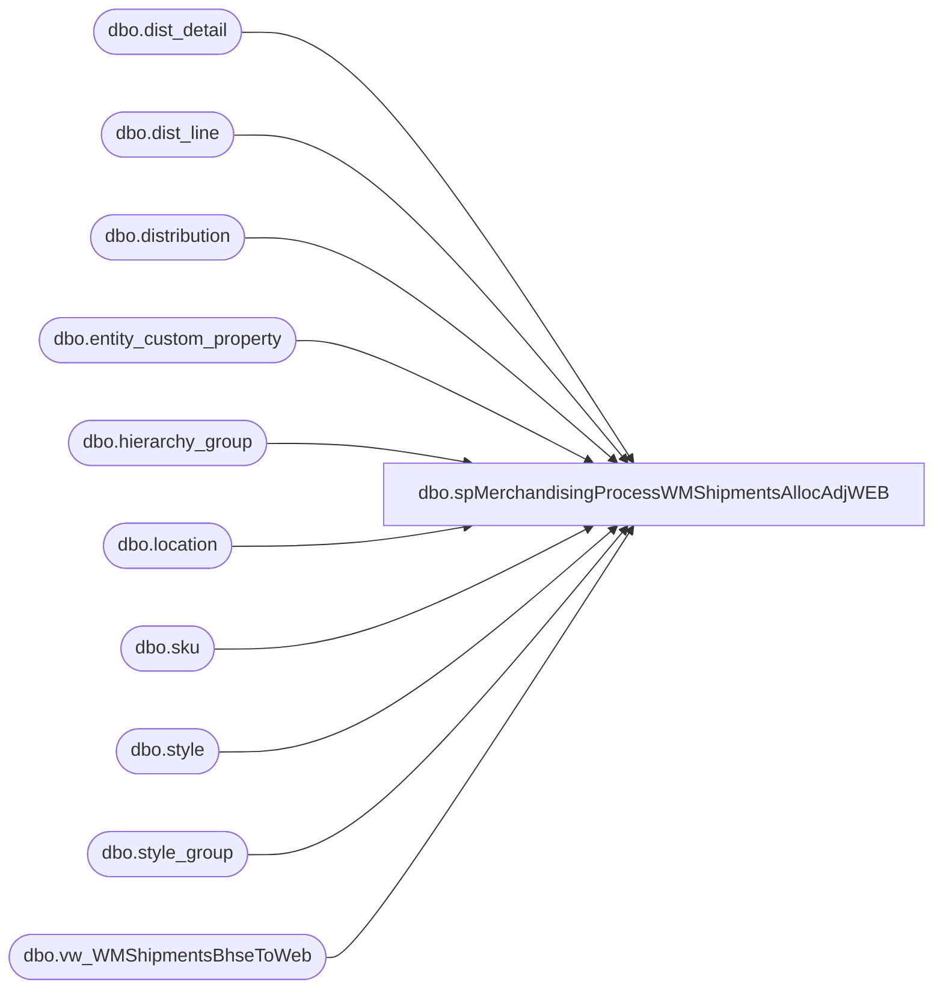

# dbo.spMerchandisingProcessWMShipmentsAllocAdjWEB

**Database:** me_01  
**Server:** bedrockdb02  

## Architecture Diagram



## Table Dependencies

| Referenced Table |
|---|
| dbo.dist_detail |
| dbo.dist_line |
| dbo.distribution |
| dbo.entity_custom_property |
| dbo.hierarchy_group |
| dbo.location |
| dbo.sku |
| dbo.style |
| dbo.style_group |
| dbo.vw_WMShipmentsBhseToWeb |

## Stored Procedure Code

```sql
CREATE proc [dbo].[spMerchandisingProcessWMShipmentsAllocAdjWEB]

as 

-- =====================================================================================================
-- Name: spMerchandisingProcessWMShipmentsAllocAdjWEB
--
-- Description:	Stages shipments and allocation adjustments (980 to web) from WM, executes procs to output the pipeline files
--				 
-- Revision History
--		Name:			Date:			Comments:
--		Dan Tweedie		05/07/2015		created proc
--		Dan Tweedie		11/11/2015		Added explicit calls to process Shipment pipeline, then process Allocation Adjustment pipeline
--		Tim Callahan	04/05/2016		Remarked Out Allocation Adjustment File Creation as it appears it is causing the frequent units stuck in allocation for location 0013
-- =====================================================================================================

set nocount on


IF (Object_ID('tempdb..#ssWeb') IS NOT NULL) DROP TABLE #ssWeb
select	shipment_nbr,
		date_shipped,
		expected_receipt_date,	
		location_code,
		distribution_no, 
		carton_nbr, 
		upc_no,
		sent_units,
		rec_type
into #ssWeb
from wmdb01.wmprod.dbo.vw_WMShipmentsBhseToWeb

if (select count(*) from #ssWeb) > 0

begin

		--STAGE SHIPMENT HEADER
		IF (Object_ID('me_01..tmpHeaderWMweb') IS NOT NULL) DROP TABLE tmpHeaderWMweb
		select shipment_nbr as document_no, 
			   date_shipped, 
			   expected_receipt_date,
			   location_code, 
			   ' ' as external_system_name
		into tmpHeaderWMweb
		from #ssWeb

		---STAGE SHIPMENT DETAIL
		IF (Object_ID('me_01..tmpDetailWMweb') IS NOT NULL) DROP TABLE tmpDetailWMweb
		select 
			   ss.shipment_nbr as document_no,
			   ss.distribution_no,
			   ss.carton_nbr,
			   ss.upc_no,
			   ss.sent_units
		into tmpDetailWMweb
		from #ssWeb ss
		join style s (nolock) on right(ss.upc_no, 6) = s.style_code
		join style_group sg (nolock) on s.style_id = sg.style_id
		join hierarchy_group hg (nolock) on sg.hierarchy_group_id = hg.hierarchy_group_id
		left join entity_custom_property ecp on s.style_id = ecp.parent_id and ecp.custom_property_id = 2 and ecp.parent_type = 1 
		
		---STAGE ALLOCATION DATA
		IF (Object_ID('me_01..tmpAllocationsAdjWMweb') IS NOT NULL) DROP TABLE tmpAllocationsAdjWMweb
		select	ss.upc_no,
				l.location_code,
				d.distribution_number,
				dd.quantity allocated_units,
				sum(ss.sent_units) sent_units,
				cast(sum(ss.sent_units) as int) adj_qty,
				dl.dist_line_id
		into tmpAllocationsAdjWMweb
		from distribution d with (nolock)
		join dist_detail dd with (nolock) on d.distribution_id = dd.distribution_id
		join dist_line dl with (nolock) on d.distribution_id = dl.distribution_id
		join sku sk with (nolock) on dd.sku_id = sk.sku_id
		join location l with (nolock) on dd.location_id = l.location_id
		join style s with (nolock) on sk.style_id = s.style_id
		join style_group sg with (nolock) on s.style_id = sg.style_id
		join hierarchy_group hg with (nolock) on sg.hierarchy_group_id = hg.hierarchy_group_id
		left join entity_custom_property ecp with (nolock) on s.style_id = ecp.parent_id
			and ecp.parent_type= 1
			and ecp.custom_property_id = 2
		join #ssWeb ss on d.distribution_number = ss.distribution_no
			and l.location_code = ss.location_code
			and s.style_code = right(ss.upc_no, 6)
		where d.distribution_status = 6 
		group by ss.upc_no, l.location_code, d.distribution_number, dd.quantity, dl.dist_line_id
		having dd.quantity <> sum(ss.sent_units)


		------------------------
		--OUTPUT SHIPMENT FILE
		------------------------
		declare @query_shipment varchar(1000),
				@date varchar(200),
				@file_name_shipment varchar(100),
				@file_location_shipment varchar(100),
				@server_shipment varchar(20),
				@database_shipment varchar(20),
				@sqlcmd varchar(1000),
				@query_text varchar(1000)

		set @date = convert(varchar, datepart(yyyy, getdate())) + convert(varchar, datepart(mm, getdate())) + convert(varchar, datepart(dd, getdate())) + convert(varchar, datepart(hh, getdate())) + convert(varchar, datepart(mi, getdate())) + convert(varchar, datepart(ss, getdate()))
		set @query_shipment = 'set nocount on exec me_01.dbo.spMerchandisingOutputWMshipmentsWeb'
		set @file_location_shipment = '\\pipeapp01\Company01\Text File to IM Import Tables - Import Store Shipment\'
		set @file_name_shipment = 'NSBIMSTORESHIPMENT.WM.WEB.' + @date + '.GO'
		set @server_shipment = 'bedrockdb02'
		set @database_shipment = 'me_01'
		set @sqlcmd = 'sqlcmd -E -S' + @server_shipment + ' -d' + @database_shipment + ' -Q' + '"' + @query_shipment + '"' + ' -o' + '"' + @file_location_shipment + @file_name_shipment + '"' + ' -w1000 -W'
		exec master..xp_cmdshell @sqlcmd


		EXEC pipeapp01.master..xp_cmdshell 'PipelineScheduleClient Start 16500 0' --shipments -- Added 11/11/2015
		EXEC pipeapp01.master..xp_cmdshell 'PipelineScheduleClient Start 19000 0' --write to prod tables -- Added 11/11/2015

		/*
		------------------------------------
		--OUTPUT ALLOCATION ADJUSTMENT FILE
		------------------------------------
		if (select count(*) from tmpAllocationsAdjWMweb) > 0
		begin
			declare @query_alloc varchar(1000),
					@date_alloc varchar(200),
					@file_name_alloc varchar(100),
					@file_location_alloc varchar(100),
					@server_alloc varchar(20),
					@database_alloc varchar(20),
					@sqlcmd_alloc varchar(1000)

			set @date_alloc = convert(varchar, datepart(yyyy, getdate())) + convert(varchar, datepart(mm, getdate())) + convert(varchar, datepart(dd, getdate())) + convert(varchar, datepart(hh, getdate())) + convert(varchar, datepart(mi, getdate())) + convert(varchar, datepart(ss, getdate()))
			set @query_alloc = 'set nocount on exec spMerchandisingOutputWMAllocAdjWeb'
			set @file_location_alloc = '\\pipeapp01\Company01\Text File to AR Import Tables - Allocation Adjustment\'
			set @file_name_alloc = 'NSBIMALLADJUSTMENT.WM.WEB' + @date_alloc + '.GO'
			set @server_alloc = 'bedrockdb02'
			set @database_alloc = 'me_01'
			set @sqlcmd_alloc = 'sqlcmd -E -S' + @server_alloc + ' -d' + @database_alloc + ' -Q' + '"' + @query_alloc + '"' + ' -o' + '"' + @file_location_alloc + @file_name_alloc + '"' + ' -w1000 -W'
			exec master..xp_cmdshell @sqlcmd_alloc

			EXEC pipeapp01.master..xp_cmdshell 'PipelineScheduleClient Start 16503 0' --alloc adj -- Added 11/11/2015
			EXEC pipeapp01.master..xp_cmdshell 'PipelineScheduleClient Start 65000 0' --write to prod tables -- Added 11/11/2015
		*/
end
```

