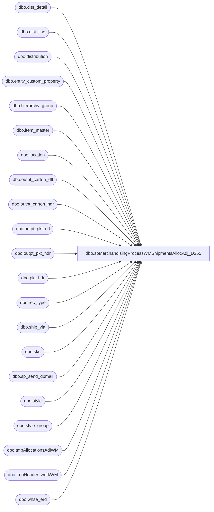

# dbo.spMerchandisingProcessWMShipmentsAllocAdj_D365

**Database:** me_01  
**Server:** bedrockdb02  

## Architecture Diagram



## Table Dependencies

| Referenced Table |
|---|
| dbo.dist_detail |
| dbo.dist_line |
| dbo.distribution |
| dbo.entity_custom_property |
| dbo.hierarchy_group |
| dbo.item_master |
| dbo.location |
| dbo.outpt_carton_dtl |
| dbo.outpt_carton_hdr |
| dbo.outpt_pkt_dtl |
| dbo.outpt_pkt_hdr |
| dbo.pkt_hdr |
| dbo.rec_type |
| dbo.ship_via |
| dbo.sku |
| dbo.sp_send_dbmail |
| dbo.style |
| dbo.style_group |
| dbo.tmpAllocationsAdjWM |
| dbo.tmpHeader_workWM |
| dbo.whse_erd |

## Stored Procedure Code

```sql
CREATE proc  [dbo].[spMerchandisingProcessWMShipmentsAllocAdj_D365]

as

-- =====================================================================================================
-- Name: spMerchandisingProcessWMShipmentsAllocAdj
--
-- Description:	Stages shipments and allocation adjustments from WM, executes procs to output the pipeline files
--				 
-- Revision History
--		Name:			Date:			Comments:
--		Dan Tweedie		04/30/2015		created proc
--		Dan Tweedie		09/10/2015		Added handling for 980-to-960 cartons which have no Pallet ID, to ensure we still generate a shipment number for these 
--		Dan Tweedie		11/11/2015		Added explicit calls to process Shipment pipeline, then process Allocation Adjustment pipeline
--		Tim Callahan	06/28/2018		Added filter to Get Shipment Data from WM step, to exclude shipments with distros that begin with SO or TR 
-- =====================================================================================================

set nocount on


---get list of active styles from Merch
IF (Object_ID('tempdb..#style') IS NOT NULL) DROP TABLE #style
select style_code
into #style
from style with (nolock)
where active_flag = 1

declare @NoPallet varchar(52)
select @NoPallet = 'NoPalletInWM' + convert(varchar, getdate(), 112)

--GET SHIPMENT DATA FROM WM
IF (Object_ID('tempdb..#ss') IS NOT NULL) DROP TABLE #ss
select case when sv.carr_id in ('FEDX', 'FXGD') then isnull(och.trkg_nbr, och.trlr_nbr) 
		when ph.shipto = '0960' then isnull(och.plt_id, @NoPallet)
		else och.trlr_nbr end as document_no,
      convert(varchar(10),och.create_date_time,101) as ship_date_time,
      left(och.store_nbr,4) as location_code,
      opd.po_nbr as distribution_no, 
      och.carton_nbr, 
      '000000' + ocd.style as upc_no, 
      case when im.store_dept = 'SUP'
      then
             ocd.units_pakd/im.std_pack_qty
      else
             ocd.units_pakd
      end as sent_units,
	  ocd.units_pakd unconverted_units,
	  im.store_dept,
	  im.std_pack_qty,
	ph.dsgnated_serv_lvl RecType
into #ss
from wmdb01.wmprod.dbo.outpt_carton_hdr och
join wmdb01.wmprod.dbo.outpt_carton_dtl ocd on och.carton_nbr = ocd.carton_nbr
join wmdb01.wmprod.dbo.outpt_pkt_hdr oph on och.pkt_ctrl_nbr = oph.pkt_ctrl_nbr 
join wmdb01.wmprod.dbo.outpt_pkt_dtl opd on ocd.pkt_ctrl_nbr = opd.pkt_ctrl_nbr 
	and ocd.pkt_seq_nbr = opd.pkt_seq_nbr
join wmdb01.wmprod.dbo.item_master im on ocd.style = im.style
join wmdb01.wmprod.dbo.pkt_hdr ph on och.pkt_ctrl_nbr = ph.pkt_ctrl_nbr
join wmdb01.wmprod.dbo.ship_via sv on och.ship_via = sv.ship_via
join #style s with (nolock) on im.style = s.style_code --excludes shipments of non BAB active product
where datediff(dd, och.create_date_time, getdate()) = 0
and opd.po_nbr is not null
and och.store_nbr is not null       
and ph.dsgnated_serv_lvl not in ('33', '34', '35', '36', '37') --costco
and (opd.po_nbr not like 'SO%' or opd.po_nbr not like 'TR%')-- Added on 6/28/2018
and im.store_dept <> 'SUP' 
order by och.trlr_nbr, och.carton_nbr, location_code


--exclude cartons shipped in invalid qty's - typically a supply item because we convert units to cases when posting to merch
---send email with exception cartons
IF (Object_ID('tempdb..#WMCartonExceptions') IS NOT NULL) DROP TABLE #WMCartonExceptions
select *
into #WMCartonExceptions
from #ss
where round(sent_units, 0) <> sent_units

if (select count(*) from #WMCartonExceptions) > 0

begin

	declare @text nvarchar(max)

	set @text = '<font face =arial size = 2>' + 
		'<b>The cartons below from WM were not posted to Merchandising because they were shipped in invalid qty''s.</b>' +
		'<br><br>'+
		'<table border="1">' +
			'<tr><th>LOCATION</th><th>CARTON</th><th>STYLE</th><th>MERCH or SUPPLY</th><th>CONVERTED SENT UNITS</th><th>UNCONVERTED SENT UNITS</th><th>VALID DISTRIBUTION MULTIPLE</th></tr>' +
			CAST ( ( SELECT td = location_code, '',
							td = carton_nbr,'',
							td = right(upc_no, 6), '',
							td = store_dept,'',
							td = sent_units, '',
							td = unconverted_units,'',
							td = std_pack_qty,''
					  from #ss
					  where carton_nbr in (select carton_nbr from #WMCartonExceptions)
					  FOR XML PATH('tr'), TYPE 
			) AS NVARCHAR(MAX) ) +
			'</font></table></font></p></p>' +
		'<br>' +
			'</font>'
		
	exec msdb.dbo.sp_send_dbmail
		@profile_name = 'merchadmin',
		@recipients = 'merchadmin@buildabear.com',
		@body = @text,
		@subject = 'WM to Merch Shipment Carton Exceptions',
		@body_format = 'HTML',
		@importance = 'high'

	delete from #ss where carton_nbr in (select carton_nbr from #WMCartonExceptions)

end

if (select count(*) from #ss) > 0

BEGIN

		--GET NUMBER OF TRANSIT DAYS FOR EACH SHIPMENT, BASED ON WHSE_ERD TABLE
		IF (Object_ID('me_01..tmpHeader_workWM') IS NOT NULL) DROP TABLE tmpHeader_workWM
		select distinct
			   ss.document_no,
			   convert(varchar, cast(ss.ship_date_time as datetime), 101) date_shipped, 
			   datepart(dw, ss.ship_date_time) day_shipped,
			   case when ss.RecType in ('1','6','8','9','56','61','1006') then isnull(we.truck_980,7)--truck
					when ss.RecType in ('54','58','80','81','82','83','84','1004') then isnull(we.ground_980,7)--ground
					when ss.RecType in ('51','52','73','85','86','1001','1002') then '1'--1 day
					when ss.RecType in ('53','74','87','1003','57','1007','62') then '2'--2 day -- includes courier and intnl priority
					when ss.RecType in ('60','88','1010') then '3'--3 day
					when ss.RecType in ('55','89','1005') then datediff(dd, datepart(dw, ss.ship_date_time),7) -- saturday
					when ss.RecType in ('63') then isnull(we.intnl_econ_980,5)--Intl Economy -- santiago will provide list by store, what's not provided will be 5 days
					when ss.RecType in ('64','65') then '30'--30
					when ss.RecType = '3' then isnull(we.supplySecond_980,7)
					when ss.RecType = '7' then isnull(we.supplyThird_980,7)
					else 7
				end as transit_days,
			   ss.location_code,
			   rt.[message] as external_system_name
		into tmpHeader_workWM
		from #ss ss
		join rec_type rt (nolock) on ss.RecType = rt.rectype
		left join whse_erd we (nolock) on ss.location_code = we.location_code
		where ss.carton_nbr is not null

		--STAGE SHIPMENT HEADER
		--USE TRANSIT DAYS TO DETERMINE EXPECTED RECEIPT DATE, INCLUDES 2 DAY BUFFER FOR WEEKENDS WHERE NEEDED
		IF (Object_ID('me_01..tmpHeaderWM') IS NOT NULL) DROP TABLE tmpHeaderWM
		select document_no, date_shipped, 
		case when (datepart(dw, date_shipped) = 2 and transit_days > 4)
					or (datepart(dw, date_shipped) = 3 and transit_days > 3)
					or (datepart(dw, date_shipped) = 4 and transit_days > 2)
					or (datepart(dw, date_shipped) = 5 and transit_days > 1)
					or (datepart(dw, date_shipped) = 6)
				then convert(varchar, dateadd(day, (transit_days + 2), cast(date_shipped as datetime)), 101)
			when transit_days is NULL then convert(varchar, dateadd(day, (7), cast(date_shipped as datetime)), 101)
			else convert(varchar, dateadd(day, (transit_days), cast(date_shipped as datetime)), 101)
		end as expected_receipt_date,
		location_code, external_system_name
		into tmpHeaderWM
		from tmpHeader_workWM

		---STAGE SHIPMENT DETAIL
		IF (Object_ID('me_01..tmpDetailWM') IS NOT NULL) DROP TABLE tmpDetailWM
		select 
			   ss.document_no,
			   ss.distribution_no,
			   ss.carton_nbr,
			   ss.upc_no,
			   ss.sent_units
		into tmpDetailWM
		from #ss ss
		join style s (nolock) on right(ss.upc_no, 6) = s.style_code
		join style_group sg (nolock) on s.style_id = sg.style_id
		join hierarchy_group hg (nolock) on sg.hierarchy_group_id = hg.hierarchy_group_id
		left join entity_custom_property ecp on s.style_id = ecp.parent_id and ecp.custom_property_id = 2 and ecp.parent_type = 1 

		---------------------------------------------------------------------------------------------------------------------------

		--STAGE ALLOCATION ADJUSTMENT

		--copy data into allocations adjustment staging table 
				----first, stage allocation data
				IF (Object_ID('me_01..tmpAllocationsAdjWM') IS NOT NULL) DROP TABLE tmpAllocationsAdjWM
				select	ss.upc_no,
						l.location_code,
						d.distribution_number,
						dd.quantity allocated_units,
						sum(ss.sent_units) sent_units,
						cast(sum(ss.sent_units) as int) adj_qty,
						dl.dist_line_id
				into tmpAllocationsAdjWM
				from distribution d with (nolock)
				join dist_detail dd with (nolock) on d.distribution_id = dd.distribution_id
				join dist_line dl with (nolock) on d.distribution_id = dl.distribution_id
				join sku sk with (nolock) on dd.sku_id = sk.sku_id
				join location l with (nolock) on dd.location_id = l.location_id
				join style s with (nolock) on sk.style_id = s.style_id
				join style_group sg with (nolock) on s.style_id = sg.style_id
				join hierarchy_group hg with (nolock) on sg.hierarchy_group_id = hg.hierarchy_group_id
				left join entity_custom_property ecp with (nolock) on s.style_id = ecp.parent_id
					and ecp.parent_type= 1
					and ecp.custom_property_id = 2
				join #ss ss on d.distribution_number = ss.distribution_no
					and l.location_code = ss.location_code
					and s.style_code = right(ss.upc_no, 6)
				where d.distribution_status = 6 
				group by ss.upc_no, l.location_code, d.distribution_number, dd.quantity, dl.dist_line_id
				having sum(dd.quantity) <> sum(ss.sent_units)

		------------------------
		--OUTPUT SHIPMENT FILE
		------------------------
		declare @query_shipment varchar(1000),
				@date varchar(200),
				@file_name_shipment varchar(100),
				@file_location_shipment varchar(100),
				@server_shipment varchar(20),
				@database_shipment varchar(20),
				@sqlcmd varchar(1000),
				@query_text varchar(1000)

		set @date = convert(varchar, datepart(yyyy, getdate())) + convert(varchar, datepart(mm, getdate())) + convert(varchar, datepart(dd, getdate())) + convert(varchar, datepart(hh, getdate())) + convert(varchar, datepart(mi, getdate())) + convert(varchar, datepart(ss, getdate()))
		set @query_shipment = 'set nocount on exec me_01.dbo.spMerchandisingOutputWMshipments'
		set @file_location_shipment = '\\pipeapp01\Company01\Text File to IM Import Tables - Import Store Shipment\'
		set @file_name_shipment = 'NSBIMSTORESHIPMENT.WM.' + @date + '.GO'
		set @server_shipment = 'bedrockdb02'
		set @database_shipment = 'me_01'
		set @sqlcmd = 'sqlcmd -E -S' + @server_shipment + ' -d' + @database_shipment + ' -Q' + '"' + @query_shipment + '"' + ' -o' + '"' + @file_location_shipment + @file_name_shipment + '"' + ' -w1000 -W'
		exec master..xp_cmdshell @sqlcmd


		EXEC pipeapp01.master..xp_cmdshell 'PipelineScheduleClient Start 16500 0' --shipments -- Added 11/11/2015
		EXEC pipeapp01.master..xp_cmdshell 'PipelineScheduleClient Start 19000 0' --write to prod tables -- Added 11/11/2015


		------------------------------------
		--OUTPUT ALLOCATION ADJUSTMENT FILE
		------------------------------------
		if (select count(*) from tmpAllocationsAdjWM) > 0

		begin

			declare @query_alloc varchar(1000),
					@date_alloc varchar(200),
					@file_name_alloc varchar(100),
					@file_location_alloc varchar(100),
					@server_alloc varchar(20),
					@database_alloc varchar(20),
					@sqlcmd_alloc varchar(1000)

			set @date_alloc = convert(varchar, datepart(yyyy, getdate())) + convert(varchar, datepart(mm, getdate())) + convert(varchar, datepart(dd, getdate())) + convert(varchar, datepart(hh, getdate())) + convert(varchar, datepart(mi, getdate())) + convert(varchar, datepart(ss, getdate()))
			set @query_alloc = 'set nocount on exec spMerchandisingOutputWMAllocAdj'
			set @file_location_alloc = '\\pipeapp01\Company01\Text File to AR Import Tables - Allocation Adjustment\'
			set @file_name_alloc = 'NSBIMALLADJUSTMENT.WM.' + @date_alloc + '.GO'
			set @server_alloc = 'bedrockdb02'
			set @database_alloc = 'me_01'
			set @sqlcmd_alloc = 'sqlcmd -E -S' + @server_alloc + ' -d' + @database_alloc + ' -Q' + '"' + @query_alloc + '"' + ' -o' + '"' + @file_location_alloc + @file_name_alloc + '"' + ' -w1000 -W'
			exec master..xp_cmdshell @sqlcmd_alloc

			EXEC pipeapp01.master..xp_cmdshell 'PipelineScheduleClient Start 16503 0' --alloc adj -- Added 11/11/2015
			EXEC pipeapp01.master..xp_cmdshell 'PipelineScheduleClient Start 65000 0' --write to prod tables - Added 11/11/2015


		end

END
```

