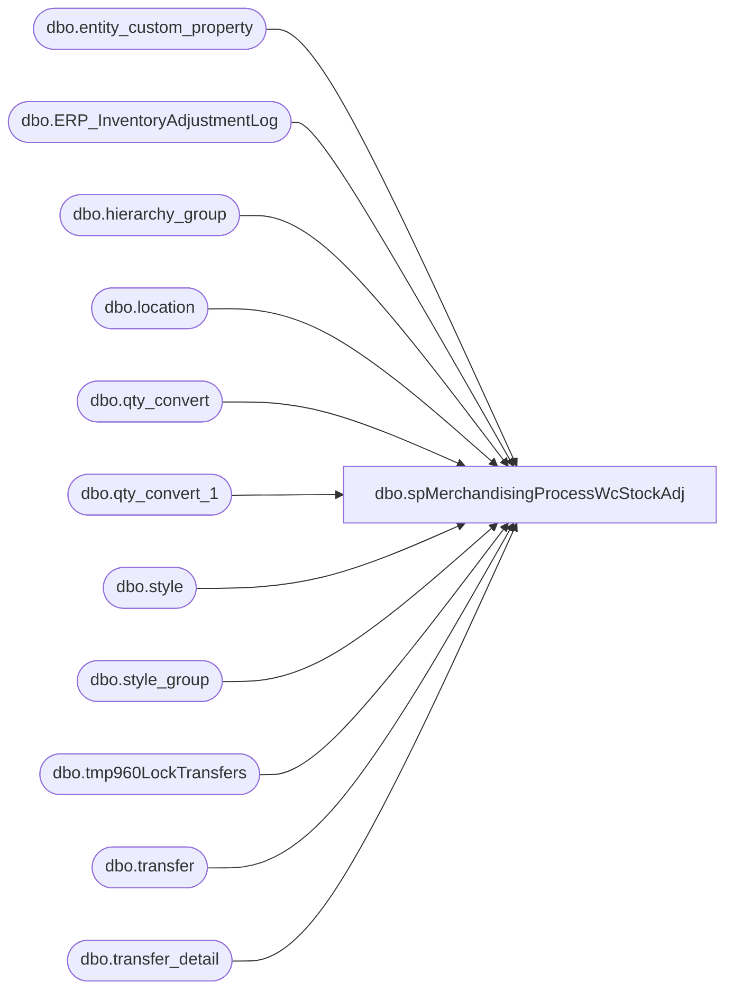

# dbo.spMerchandisingProcessWcStockAdj

**Database:** me_01  
**Server:** bedrockdb02  

## Architecture Diagram



## Table Dependencies

| Referenced Table |
|---|
| dbo.entity_custom_property |
| dbo.ERP_InventoryAdjustmentLog |
| dbo.hierarchy_group |
| dbo.location |
| dbo.qty_convert |
| dbo.qty_convert_1 |
| dbo.style |
| dbo.style_group |
| dbo.tmp960LockTransfers |
| dbo.transfer |
| dbo.transfer_detail |

## Stored Procedure Code

```sql
CREATE proc [dbo].[spMerchandisingProcessWcStockAdj]
as 
-- =====================================================================================================
-- Name: spMerchandisingProcessWcStockAdj
--
-- Description:	Captures data from a stock adjustment file (uploaded by UK Warehouse). 
--				Generates new file, drops file on \\pipeapp01 to process into Merchandising system.
--
-- Input:	Imports file from \\kermode\FileRepository\MERCHANDISING\WC_Distro\STOCKADJ\
--
-- Output: Shrink Adjustment file to meet Epicor requirements.
--			File is dropped at \\pipeapp01\Company01\Text File to IM Import Tables- Import Shrink Adj
--
-- Dependencies: Proc executes bedrockdb02.me_01.spUKStockAdjustment_FileExport 
--
-- Revision History
--		Name:			Date:			Comments:
--		Dan Tweedie		03/29/2011		Created proc.
--		Dan Tweedie		05/14/2015		Added special handling for LOCK and UNLOCK transactions in the file from DDC 
--										Locked units will be transfered to location 1001, Unlocked units will be transfered from 1001 to 0960
--		Dan Tweedie		07/14/2015		Pointed to Kermode instead of Oursmerchdb01
--		Dan Tweedie		2018-07-03		Added Stage Data For Dynamics
-- =====================================================================================================


set nocount on

/*****************************************************************************************
 ****PROCESS ONE: IMPORT DATA FROM FILE, MASSAGE DATA, STORE HISTORICAL RECORD OF FILE****
 *****************************************************************************************/
--------------------------
----BEGIN PROCESS ONE-----
--------------------------

-----see if there's a file waiting

---first check to see if stock adjustment file exists
IF (Object_ID('tempdb..#dir') IS NOT NULL) DROP TABLE #dir
create table #dir (output varchar(1000))

declare @dir varchar(1000)
set @dir = 'dir \\kermode\FileRepository\MERCHANDISING\WC_Distro\STOCKADJ /b'

insert #dir
exec master..xp_cmdshell @dir

if (select count(*) from #dir where output like 'IA%.txt') > 0

BEGIN

		--rename file to strip datestamp (to make it easy to bulk insert in the next step)
		declare @rename1 varchar(1000)
		set @rename1 = 'ren \\kermode\FileRepository\MERCHANDISING\WC_Distro\STOCKADJ\*.txt STOCKADJUSTMENT.txt'
		exec master..xp_cmdshell @rename1
		--<><><><><><><><><><><><><><><><><><><><><><><><><><><><><><><><><><><><><><><><><>--

		--bulk insert
		IF (Object_ID('tempdb..#import') IS NOT NULL) DROP TABLE #import
		create table #import (style varchar(6), qty int, description varchar(52))

		bulk insert #import
		from '\\kermode\FileRepository\MERCHANDISING\WC_Distro\STOCKADJ\STOCKADJUSTMENT.txt'
		with 
		(
		FIRSTROW = 1, 
		FIELDTERMINATOR = ',',
		ROWTERMINATOR = '\n'
		)
		--<><><><><><><><><><><><><><><><><><><><><><><><><><><><><><><><><><><><><><><><><>--

		--rename file to add datestamp (so we can keep historical files)
		declare @rename2 varchar(1000)
		set @rename2 = 'ren \\kermode\FileRepository\MERCHANDISING\WC_Distro\STOCKADJ\*.txt STOCKADJUSTMENT%date:~10%%date:~4,2%%date:~7,2%.txt'
		exec master..xp_cmdshell @rename2
		--<><><><><><><><><><><><><><><><><><><><><><><><><><><><><><><><><><><><><><><><><>--

		--move file
		declare @move varchar(1000)
		set @move = 'move \\kermode\FileRepository\MERCHANDISING\WC_Distro\STOCKADJ\*.txt \\kermode\FileRepository\MERCHANDISING\WC_Distro\STOCKADJ\done'
		exec master..xp_cmdshell @move
		--<><><><><><><><><><><><><><><><><><><><><><><><><><><><><><><><><><><><><><><><><>--

		---convert value to +/- and convert supply qty's to cases
		IF (Object_ID('me_01..qty_convert_1') IS NOT NULL) DROP TABLE qty_convert_1
		create table qty_convert_1 (style varchar(6), description varchar(52), orig_qty int, converted_qty int)

		insert qty_convert_1
		select right(('000000' + i.style), 6) style, left(i.description, 20) description, i.qty orig_qty, 
			case when substring(hg.hierarchy_group_code,7,2)='60' 
				then (i.qty * -1) / ecp.custom_property_value
				else (i.qty * -1)
			end as converted_qty
		from #import i
			inner join style s (nolock) on right(('000000' + i.style), 6) = s.style_code
			inner join style_group sg (nolock) on s.style_id = sg.style_id
			inner join hierarchy_group hg (nolock) on sg.hierarchy_group_id = hg.hierarchy_group_id
			left outer join	entity_custom_property ecp on s.style_id = ecp.parent_id and ecp.custom_property_id = 2 and	ecp.parent_type = 1


		----remove rows that have value of '0' for qty
		IF (Object_ID('me_01..qty_convert') IS NOT NULL) DROP TABLE qty_convert
		create table qty_convert (style varchar(6), description varchar(52), orig_qty int, converted_qty int)

		insert qty_convert
		select style, description, sum(orig_qty) orig_qty, sum(converted_qty) converted_qty
		from qty_convert_1 
		group by style, description
		having sum(orig_qty) <> 0

		-----------------------------------------------------
		--ARCHIVE DATA FOR DYNAMICS
		------------------------------------------
		if (select count(*) from #import) > 0
		begin
			insert ERP_InventoryAdjustmentLog 
			select 	
				'0960' as LocationCode, 
				right(('000000' + style), 6) as Style, 
				qty as Qty,
				left(description, 20) as Description, 
				getdate()
			from #Import 
		end
		---------------------------------------------------------------------
		----------------------------------------

			-----------------------------------------------------------------------------------------------------------------------------------------------
			---stage Lock and Unlock records - code added 05/14/2015
			IF (Object_ID('me_01..tmp960LockTransfers') IS NOT NULL) DROP TABLE tmp960LockTransfers
			create table tmp960LockTransfers (style varchar(6), description varchar(52), orig_qty int, abs_qty int)

			insert tmp960LockTransfers
			select style, description, orig_qty, abs(converted_qty) abs_qty --removes +/-
			from qty_convert
			where description in ('Lock', 'Unlock')
			order by style

			--remove Lock and Unlock records from original staging table -> We don't want to process these with the other records, which is why we staged them into tmp960LockTransfers
			delete from qty_convert
			from qty_convert
			where description in ('Lock', 'Unlock')

			--generate transfer file for pipline for lock/unlock records
			if (select count(*) from tmp960LockTransfers) > 0
			BEGIN
						declare @query52 varchar(1000),
								@date52 varchar(200),
								@file_name52 varchar(100),
								@file_location52 varchar(100),
								@server52 varchar(20),
								@database52 varchar(20),
								@sqlcmd52 varchar(1000),
								@query_text52 varchar(1000)

						select @query_text52 = 'exec bedrockdb02.me_01.dbo.spMerchandisingSelect960LockTransfers'

						set @date52 = convert(varchar, datepart(yyyy, getdate())) + convert(varchar, datepart(mm, getdate())) + convert(varchar, datepart(dd, getdate()))
						set @query52 = @query_text52
						set @file_location52 = '\\pipeapp01\Company01\Text File to IM Import Tables - Import Outbound Xfers\'
						set @file_name52 = 'STSIMOUTBOUNDTRANSFER.960_LockUnlock' + convert(varchar, @date52) +'.GO'
						set @server52 = 'bedrockdb02'
						set @database52 = 'me_01'
						set @sqlcmd52 = 'sqlcmd -E -S' + @server52 + ' -d' + @database52 + ' -Q' + '"' + @query52 + '"' + ' -o' + '"' + @file_location52 + @file_name52 + '"' + ' -s"," -w100 -W'
						exec master..xp_cmdshell @sqlcmd52

				EXEC pipeapp01.master..xp_cmdshell 'PipelineScheduleClient Start 16002 0'

			--generate carton batch receipt file for pipeline for the transfers created for lock/unlock records
						IF (Object_ID('tempdb..##transferz') IS NOT NULL) DROP TABLE ##transferz
						select	distinct
								'BC' BC,
								'A' A,
								td.carton_no,
								tl.location_code,
								'099060199' Code
						into ##transferz
						from	transfer t 
								join transfer_detail td on t.transfer_id = td.transfer_id
								join location fl on t.from_location_id = fl.location_id
								join location tl on t.to_location_id = tl.location_id
						where ((fl.location_code = '0960' and tl.location_code = '1001')
								or (fl.location_code = '1001' and tl.location_code = '0960'))
						AND td.units_received is NULL
				
						if (select count(*) from ##transferz) > 0
						begin
							declare @queryCBR varchar(1000),
									@dateCBR varchar(200),
									@file_nameCBR varchar(100),
									@file_locationCBR varchar(100),
									@serverCBR varchar(20),
									@databaseCBR varchar(20),
									@bcpCBR varchar(1000),
									@query_textCBR varchar(1000)

							select @query_textCBR = 'set nocount on select * from ##transferz'

							set @dateCBR = convert(varchar, datepart(yyyy, getdate())) + convert(varchar, datepart(mm, getdate())) + convert(varchar, datepart(dd, getdate()))
							set @queryCBR = @query_textCBR
							set @file_locationCBR = '\\pipeapp01\Company01\Text File to IM Import Tables  - Batch Carton\'
							set @file_nameCBR = 'STSIMCTN.960_LockUnlock' + convert(varchar, @dateCBR) +'.DAN'
							set @serverCBR = 'bedrockdb02'
							set @databaseCBR = 'me_01'
							set @bcpCBR = 'bcp "' + @queryCBR + '" queryout "' + @file_locationCBR + @file_nameCBR + '"  -T -c -S' + @serverCBR 

							exec master..xp_cmdshell @bcpCBR
						end
			END
			-----------------------------------------------------------------------------------------------------------------------------------------------


		--<><><><><><><><><><><><><><><><><><><><><><><><><><><><><><><><><><><><><><><><><>--
		--------------------------
		-----END PROCESS ONE------
		--------------------------
		--<><><><><><><><><><><><><><><><><><><><><><><><><><><><><><><><><><><><><><><><><>--

		/**********************************************************************************************************
		 ***PROCESS TWO: TAKE DATA FROM PROCESS ONE, GENERATE SHRINK ADJUSTMENT FILE, DROP ON PIPELINE DIRECTORY***
		 **********************************************************************************************************/
		--------------------------
		----BEGIN PROCESS TWO-----
		--------------------------
		---executes stored proc spUKStockAdjustment_FileExport:

		if (select count(*) from qty_convert) > 0
			begin

				declare @file varchar(1000) 
				select @file = 'sqlcmd -E -Sbedrockdb02 -dme_01 -Q"exec spMerchandisingSelectWcStockAdj" -o"\\pipeapp01\Company01\Text File to IM Import Tables- Import Shrink Adj\STSIMSA.WC.%date:~10%%date:~4,2%%date:~7,2%%time:~0,2%%time:~3,2%%time:~6,2%.GO" -w1000'
				exec master..xp_cmdshell @file
	
			end


		EXEC pipeapp01.master..xp_cmdshell 'PipelineScheduleClient Start 16506 0'

END
```

