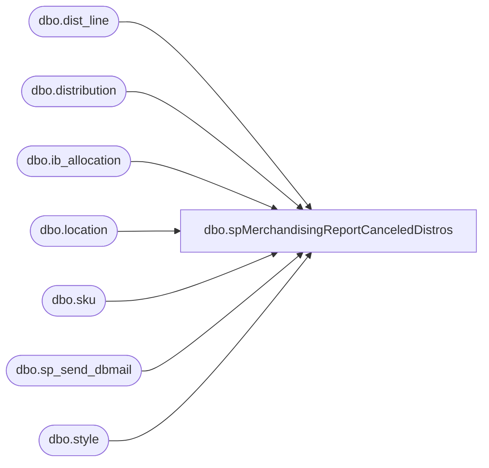

# dbo.spMerchandisingReportCanceledDistros

**Database:** me_01  
**Server:** bedrockdb02  

## Architecture Diagram



## Table Dependencies

| Referenced Table |
|---|
| dbo.dist_line |
| dbo.distribution |
| dbo.ib_allocation |
| dbo.location |
| dbo.sku |
| dbo.sp_send_dbmail |
| dbo.style |

## Stored Procedure Code

```sql
CREATE procedure [dbo].[spMerchandisingReportCanceledDistros]
as
set nocount on
-- =====================================================================================================
-- Name: spMerchandisingReportCanceledDistros
--
-- Description: Email
--
-- Input:	
--
-- Output: 
--
-- Dependencies: 
--				 
-- Revision History
--		Name:			Date:			Comments: Replaces DTS pkg on Beehive called Report_Canceled_Distro_Doc_V1
--		Dan Tweedie	    03/02/2015		Created proc.	
--		Dan Tweedie		03/19/2015		Removed MerchAdmin from recipient list
--		Keith Lee		05/13/2015		Added line to excluded old/recycled distros in cancelled status
-- =====================================================================================================

IF (Object_ID('tempdb..##MahiTemp_Csv') IS NOT null) DROP TABLE ##MahiTemp_Csv
SELECT D.DISTRIBUTION_NUMBER
	,D.RELEASE_DATE
	,S.STYLE_CODE
	,S.SHORT_DESC
	,L.LOCATION_CODE
	,SUM(ALLOCATED_UNITS) AS CANCELLED_UNITS
INTO ##MahiTemp_Csv
FROM ib_allocation ia(NOLOCK)
INNER JOIN distribution d(NOLOCK) ON d.distribution_number = ia.allocation_number
INNER JOIN dist_line dl(NOLOCK) ON d.distribution_id = dl.distribution_id
INNER JOIN sku sk(NOLOCK) ON sk.sku_id = ia.sku_id
INNER JOIN style s(NOLOCK) ON sk.style_id = s.style_id
INNER JOIN location l(NOLOCK) ON ia.location_id = l.location_id
WHERE D.DISTRIBUTION_STATUS IN (9)
	AND IA.TRANSACTION_TYPE_CODE IN (830)
	AND D.RELEASE_DATE IS NOT NULL
	AND CAST(CONVERT(VARCHAR, D.STATUS_DATE, 101) AS DATETIME) = CAST(CONVERT(VARCHAR, GETDATE() - 1, 101) AS DATETIME)
	and DATEDIFF(dd,D.RELEASE_DATE,GETDATE())> 30 -- KL 5/13/2015
GROUP BY S.STYLE_CODE
	,S.SHORT_DESC
	,D.DISTRIBUTION_NUMBER
	,L.LOCATION_CODE
	,D.RELEASE_DATE
HAVING SUM(ALLOCATED_UNITS) <> 0
ORDER BY D.DISTRIBUTION_NUMBER


if (SELECT count(*) FROM ##MahiTemp_Csv) > 0

----output a file for Physical Inventory team, 
BEGIN

	DECLARE @1query VARCHAR(1000)
		,@1file_name VARCHAR(100)
		,@1file_location VARCHAR(100)
		,@1server VARCHAR(20)
		,@1database VARCHAR(20)
		,@1sqlcmd VARCHAR(1000)
		,@1query_text VARCHAR(1000)
		,@1file VARCHAR(1000)
		,@1body VARCHAR(1000)
		,@1subj VARCHAR(1000)

	SELECT @1query_text = 'set nocount on select * from ##MahiTemp_Csv'

	SET @1query = @1query_text
	SET @1file_location = '\\kermode\FileRepository\MERCHANDISING\DBCompare\'
	SET @1file_name = 'Canceled_Distro_Doc_Report.csv'
	SET @1server = 'bedrockdb02'
	SET @1database = 'me_01'
	SET @1sqlcmd = 'sqlcmd -S' + @1server + ' -d' + @1database + ' -Q' + '"' + @1query + '"' + ' -o' + '"' + @1file_location + @1file_name + '"' + ' -s"," -w1000 -W'
    EXEC master..xp_cmdshell @1sqlcmd


	EXEC msdb.dbo.sp_send_dbmail 
	@profile_name = 'MerchAdmin',
	@recipients = 'tamib@buildabear.com;markd@buildabear.com',
	@file_attachments = '\\kermode\FileRepository\MERCHANDISING\DBCompare\Canceled_Distro_Doc_Report.csv',
	@body = 'Please see the attached report for Cancelled Distribution Documents. If you have any questions about the report, please contact retailsystems@buildabear.com. This report is managed from bedrockdb02 via SQL Agent Job Report - Canceled Distributions',
	@subject = 'Canceled Distribution Documents '

END
```

