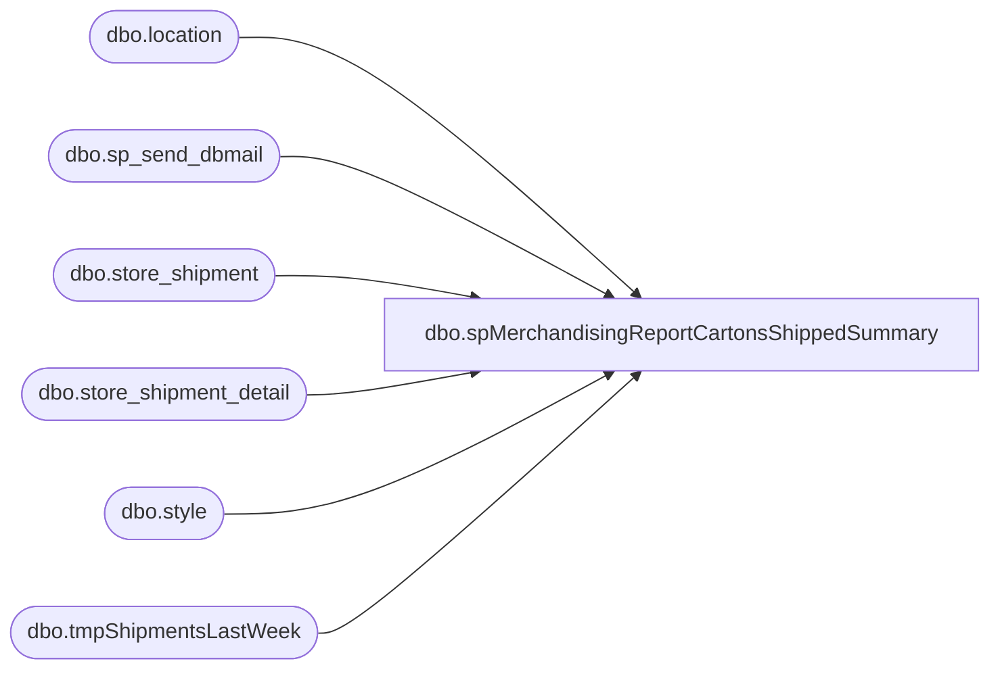

# dbo.spMerchandisingReportCartonsShippedSummary

**Database:** me_01  
**Server:** bedrockdb02  

## Architecture Diagram



## Table Dependencies

| Referenced Table |
|---|
| dbo.location |
| dbo.sp_send_dbmail |
| dbo.store_shipment |
| dbo.store_shipment_detail |
| dbo.style |
| dbo.tmpShipmentsLastWeek |

## Stored Procedure Code

```sql
CREATE proc [dbo].[spMerchandisingReportCartonsShippedSummary]

as 

-- =====================================================================================================
-- Name: spMerchandisingReportCartonsShippedSummary
--
-- Description:	Sends email w/report to the Logistics team. Will run on Sunday, so gathers data from previous week.
--
--
-- Revision History
--		Name:			Date:			Comments:
--		Dan Tweedie		07/27/2015		Created proc.
-- =====================================================================================================


set nocount on

if (object_id('me_01..tmpShipmentsLastWeek') is not null) drop table tmpShipmentsLastWeek
select l.location_code as WHSE, s.style_code as STYLE, count(ssd.carton_no) as CARTONS, datepart(wk, ss.ship_date) as SHIP_WEEK
into tmpShipmentsLastWeek
from store_shipment ss with (nolock)
join location l with (nolock) on ss.from_location_id = l.location_id
join store_shipment_detail ssd with (nolock) on ss.store_shipment_id = ssd.store_shipment_id
join style s with (nolock) on ssd.style_id = s.style_id
where l.location_code in ('0960', '0980', '2970')
and datepart(wk, ss.ship_date) = datepart(wk, getdate()-1) --assumes report is run on Sunday, so looks at previous week
group by l.location_code, s.style_code, datepart(wk, ss.ship_date)


if (select count(*) from tmpShipmentsLastWeek) > 0

begin

	exec msdb.dbo.sp_send_dbmail
		@profile_name = 'MerchAdmin',
		@recipients = 'MikeSc@buildabear.com;LindaB@buildabear.com',
		@body = '<font face=arial>See attached cartons shipped summary for last week.</font>',
		@subject = 'Shipment Carton Count Summary',
		@body_format = 'HTML',
		@query = 'set nocount on select * from me_01.dbo.tmpShipmentsLastWeek order by whse, style',
		@attach_query_result_as_file = 1,
		@query_attachment_filename = 'CartonsShippedSummary.csv',
		@query_result_width = '1000',
		@query_result_separator = '	'

end
```

