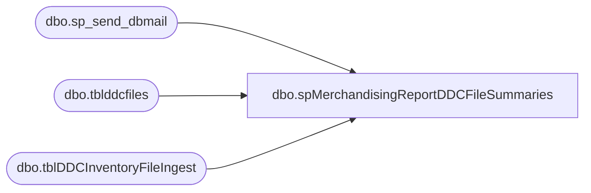

# dbo.spMerchandisingReportDDCFileSummaries

**Database:** me_01  
**Server:** bedrockdb02  

## Architecture Diagram



## Table Dependencies

| Referenced Table |
|---|
| dbo.sp_send_dbmail |
| dbo.tblddcfiles |
| dbo.tblDDCInventoryFileIngest |

## Stored Procedure Code

```sql
CREATE proc [dbo].[spMerchandisingReportDDCFileSummaries]
as 
-- =====================================================================================================
-- Name: spMerchandisingReportDDCFileSummaries
--
-- Description:	Sends email with summary of data transmitted from DDC and processed by BAB for inventory reporting purposes
--
-- Input:
--
-- Output: 
--		
--
-- Dependencies: spMerchandisingSelectPOReceiptSummary, 
--				 spMerchandisingSelectShipmentSummary, 
--				 spMerchandisingSelectShrinkAdjustmentSummary,
--				 spMerchandisingNightlySyncPostSummary
--
-- Revision History
--		Name:			Date:			Comments:
--		Dan Tweedie		10/20/2011		Created proc.
--		Dan Tweedie		07/14/2015		Pointed to Kermode instead of Oursmerchdb01
-- =====================================================================================================

set nocount on

--------------------------------------------------------------
--capture inventory file into table
truncate table tblDDCInventoryFileIngest

declare @inventoryfilename varchar(52),
		@inventoryfilepath varchar(100),
		@bulkinsert nvarchar(max)

select @inventoryfilename = ddcfilename 
from tblDDCFiles 
where ddcfiletype = 'Inventory' 
and (
	(datediff(dd, capture_date, getdate()-1) = 0
		and datepart(hh, capture_date) = 22)
	or 
	(datediff(dd, capture_date, getdate()) = 0 
	 and datepart(hh, capture_date) = 1)
	)

select @inventoryfilepath = '\\kermode\FileRepository\MERCHANDISING\WC_Distro\INVENTORY\DONE\'
select @bulkinsert = 'bulk insert tblDDCInventoryFileIngest from ''' + @inventoryfilepath + @inventoryfilename + ''' with (ROWTERMINATOR = ''\n'')'
exec (@bulkinsert)
--------------------------------------------------------------

declare	@date varchar(200),
		@server varchar(20),
		@database varchar(20),
		@file_location varchar(100),
		
		@shipmentquery varchar(1000),
		@receiptquery varchar(1000),
		@adjustmentquery varchar(1000),
		@syncquery varchar(1000),
		@inventoryquery varchar(1000),
		
		@shipmentfile_name varchar(100),
		@receiptfile_name varchar(100),
		@adjustmentfile_name varchar(100),
		@inventoryfile_name varchar(100),
		@syncfile_name varchar(100),
				
		@shipmentsqlcmd varchar(1000),
		@receiptsqlcmd varchar(1000),
		@adjustmentsqlcmd varchar(1000),
		@inventorysqlcmd varchar(1000),
		@syncsqlcmd varchar(1000),
		
		@email_attachments varchar(1000)


select @date = convert(varchar, datepart(yyyy, getdate())) + '-' + convert(varchar, datepart(mm, getdate())) + '-' + convert(varchar, datepart(dd, getdate()))
select @server = 'bedrockdb02'
select @database = 'me_01'
select @file_location = '\\kermode\FileRepository\MERCHANDISING\WC_Distro\Reports\'

select @shipmentfile_name = 'DDC_Shipments_' +@date + '.csv'
select @receiptfile_name = 'DDC_Receipts_' +@date + '.csv'
select @adjustmentfile_name = 'DDC_Adjustments_' +@date + '.csv'
select @syncfile_name = 'DDC_SyncAdjustments_' +@date + '.csv'
select @inventoryfile_name = 'DDC_InventoryFile_' +@date + '.csv'

select @shipmentquery = 'set nocount on select * from bedrockdb02.me_01.dbo.tblShipmentFilePostSummary where whse = ''0960'' order by process_start, shipment, style'
select @receiptquery = 'set nocount on select * from bedrockdb02.me_01.dbo.tblReceiptFilePostSummary where whse = ''0960'' order by process_start, po, style'
select @adjustmentquery = 'set nocount on select * from bedrockdb02.me_01.dbo.tblShrinkAdjustmentFilePostSummary where whse = ''0960'' order by process_start, style'
select @syncquery = 'set nocount on select * from bedrockdb02.me_01.dbo.tblNightlySyncFilePostSummary where whse = ''0960'' order by process_start, style'
select @inventoryquery = 'set nocount on select * from bedrockdb02.me_01.dbo.tblDDCInventoryFileIngest order by stylecode'

select @shipmentsqlcmd = 'sqlcmd -S' + @server + ' -d' + @database + ' -Q' + '"' + @shipmentquery + '"' + ' -o' + '"' + @file_location + @shipmentfile_name + '"' + ' -s"," -w500 -W'
select @receiptsqlcmd = 'sqlcmd -S' + @server + ' -d' + @database + ' -Q' + '"' + @receiptquery + '"' + ' -o' + '"' + @file_location + @receiptfile_name + '"' + ' -s"," -w500 -W'
select @adjustmentsqlcmd = 'sqlcmd -S' + @server + ' -d' + @database + ' -Q' + '"' + @adjustmentquery + '"' + ' -o' + '"' + @file_location + @adjustmentfile_name + '"' + ' -s"," -w500 -W'
select @syncsqlcmd = 'sqlcmd -S' + @server + ' -d' + @database + ' -Q' + '"' + @syncquery + '"' + ' -o' + '"' + @file_location + @syncfile_name + '"' + ' -s"," -w500 -W'
select @inventorysqlcmd = 'sqlcmd -S' + @server + ' -d' + @database + ' -Q' + '"' + @inventoryquery + '"' + ' -o' + '"' + @file_location + @inventoryfile_name + '"' + ' -s"," -w500 -W'


---output shipment data to csv
exec master..xp_cmdshell @shipmentsqlcmd
--output receipt data to csv
exec master..xp_cmdshell @receiptsqlcmd
--output adjustment data to csv
exec master..xp_cmdshell @adjustmentsqlcmd
--output sync adjustment data to csv
exec master..xp_cmdshell @syncsqlcmd
--output inventory sync adjustment data to csv
exec master..xp_cmdshell @inventorysqlcmd

----------------------------------------------------------------------------------------------------------------------------------------------

----------------------------------------------------------------------------------------------------------------------------------------------
--send email

declare @to varchar(1000),
		@cc varchar(1000),
		@today varchar(12),
		@yesterday varchar(12),
		@subj varchar(52),
		@text nvarchar(max)
		
select @to = 'wcdclogistics@buildabear.com'
select @today = convert(varchar, getdate(), 101)
select @yesterday = convert(varchar, getdate()-1, 101)
select @subj = 'DDC to BAB Data Summary: ' + @today

if (select count(*) 
	from tblDDCFiles
	where (datediff(dd, capture_date, getdate()-1) = 0
			and datepart(hh, capture_date) = 22)
	or 
		(datediff(dd, capture_date, getdate()) = 0 
			 and datepart(hh, capture_date) = 1)
	) > 0


	select @text = '<font face =arial size = 2><B>DDC Data Files</B><br>' +
		'The following files were retrieved from DDC during the evening hours between ' + @yesterday + ' and ' + @today + '.<br>' + 
		'Please see the attached summaries for details.<br>' +
	'</font>' +
		'<table border="1">' +
			'<tr><th><font face =arial size = 2>File Type</font></th>' +
				'<th><font face =arial size = 2>File Name</font></th></tr>' +
	'<font face =arial size = 2>' +
		CAST ( ( SELECT distinct 
						td = ddcfiletype, '',
						td = ddcfilename, ''
				from bedrockdb02.me_01.dbo.tblddcfiles 
				where (datediff(dd, capture_date, getdate()-1) = 0
						and datepart(hh, capture_date) = 22)
				or 
					(datediff(dd, capture_date, getdate()) = 0 
						 and datepart(hh, capture_date) = 1)
				order by ddcfiletype, ddcfilename
				  FOR XML PATH('tr'), TYPE 
		) AS NVARCHAR(MAX) ) +
		'</font></table></font></p></p>'

else 
	select @text = '<font face =arial size = 2><B>DDC Data Files</B><br>' +
		'Zero files were retrieved from DDC during the evening hours between ' + @yesterday + ' and ' + @today + '.<br>' 

----------------------------------------------------------------------------------------------------------------------------------


set @email_attachments = @file_location + @shipmentfile_name + ';' + @file_location + @receiptfile_name + ';' + @file_location + @adjustmentfile_name + ';' + @file_location + @syncfile_name + ';' + @file_location + @inventoryfile_name

exec msdb.dbo.sp_send_dbmail
	@profile_name = 'MerchAdmin',
	@recipients = @to,
	--@copy_recipients = @cc,
	@subject = @subj,
	@body = @text,
	@file_attachments = @email_attachments,
	@body_format = 'html'


--exec master..xp_cmdshell 'move \\kermode\FileRepository\MERCHANDISING\WC_Distro\Reports\*.csv \\kermode\FileRepository\MERCHANDISING\WC_Distro\Reports\History'

exec master..xp_cmdshell 'move \\kermode\FileRepository\MERCHANDISING\WC_Distro\Reports\*.csv "\\sharebear1\shared\DDC Activity"'
```

