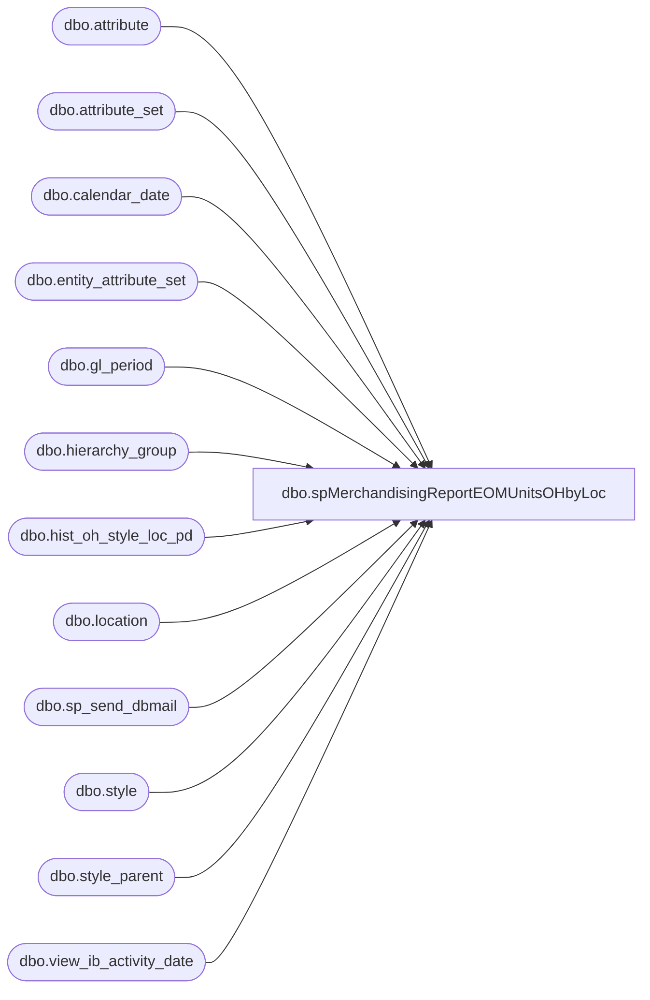

# dbo.spMerchandisingReportEOMUnitsOHbyLoc

**Database:** me_01  
**Server:** bedrockdb02  

## Architecture Diagram



## Table Dependencies

| Referenced Table |
|---|
| dbo.attribute |
| dbo.attribute_set |
| dbo.calendar_date |
| dbo.entity_attribute_set |
| dbo.gl_period |
| dbo.hierarchy_group |
| dbo.hist_oh_style_loc_pd |
| dbo.location |
| dbo.sp_send_dbmail |
| dbo.style |
| dbo.style_parent |
| dbo.view_ib_activity_date |

## Stored Procedure Code

```sql
-- =============================================
-- Author:		Keith Lee
-- Create date: 6/3/2016
-- Description:	Automates the Smartlook Shortcut "SBC EOM Units OH by Loc" since it takes a long time to run.
-- Revision History
--		Name:			Date:			Comments:
--		Lizzy Timm		10/12/2020		Added #SVWORKV3_3  and #SVWORKV3_4 to account for the licensor style attribute as request in SR 28315

-- =============================================
CREATE PROCEDURE [dbo].[spMerchandisingReportEOMUnitsOHbyLoc]

AS
BEGIN

	SET NOCOUNT ON;


select min(calendar_date) as calendar_date
into #keith_temp--
from	calendar_date 
group by merch_year, merch_period


if (select count(*) from #keith_temp where convert(varchar, getdate(), 101) = convert(varchar, calendar_date, 101)) > 0

BEGIN


declare @current_period varchar(6)

set @current_period = (select cast(merch_year as varchar(4)) + right('00' + cast(merch_period as varchar(2)),2) from calendar_date where 
		convert(varchar, calendar_date, 101)= convert(varchar, getdate()-2, 101))

SELECT DISTINCT a.style_id as Field_a INTO #SVWORKQ3_1  
FROM ma_01.dbo.style a 

SELECT DISTINCT a.location_id as Field_a INTO #SVWORKQ3_2  
FROM ma_01.dbo.location a 
--WHERE a.location_code in
--(select location_code from location where active_flag = 1)


SELECT DISTINCT b.Field_a as Field_a ,a.Field_a as Field_b INTO #SVWORKQ3  
FROM #SVWORKQ3_1 a ,#SVWORKQ3_2 b 

DROP TABLE #SVWORKQ3_1  

DROP TABLE #SVWORKQ3_2  

UPDATE STATISTICS #SVWORKQ3 

SELECT SUM((a.on_hand_units) * (1 - abs (sign (merch_year_pd - @current_period)))) as Field_f, SUM((a.on_hand_cost) * (1 - abs (sign (merch_year_pd - @current_period)))) as Field_g, Q1.Field_a as QField_a, Q1.Field_b as QField_b INTO #SVWORK1  
FROM ma_01.dbo.hist_oh_style_loc_pd a,#SVWORKQ3 Q1 
WHERE Q1.Field_a = a.location_id 
    AND Q1.Field_b = a.style_id 
GROUP BY Q1.Field_a, Q1.Field_b 

SELECT max(a.last_sale_date) as Field_i, max(a.last_po_receipt_date) as Field_j, Q1.Field_a as QField_a, Q1.Field_b as QField_b INTO #SVWORK2  
FROM ma_01.dbo.view_ib_activity_date a,#SVWORKQ3 Q1 
WHERE Q1.Field_a = a.location_id 
    AND Q1.Field_b = a.style_id 
GROUP BY Q1.Field_a, Q1.Field_b 

SELECT QField_a, QField_b INTO #SVWORK3  
FROM #SVWORK1 UNION SELECT QField_a, QField_b 
FROM #SVWORK2  

SELECT DISTINCT QField_b as QField_b INTO #SVWORK3_T  
FROM #SVWORK3 

UPDATE STATISTICS #SVWORK3_T 

SELECT DISTINCT a.style_code as Field_a, a.short_desc as Field_b, b.hierarchy_group_code as Field_c, b.hierarchy_group_label as Field_d, a.active_flag as Field_e, a.style_id as Field_f INTO #SVWORKV3_1  
FROM ma_01.dbo.style a, ma_01.dbo.hierarchy_group b, ma_01.dbo.style_parent c, #SVWORK3_T U1 
WHERE a.style_id = c.style_id and c.hierarchy_level_id = 10000005 
    AND c.parent_hierarchy_group_id = b.hierarchy_group_id  
    AND (a.style_id = U1.QField_b) 

DROP TABLE #SVWORK3_T  

SELECT DISTINCT QField_a as QField_a INTO #SVWORK3_Temp  
FROM #SVWORK3 

UPDATE STATISTICS #SVWORK3_Temp 

SELECT DISTINCT a.location_code as Field_a, a.location_id as Field_b INTO #SVWORKV3_2  
FROM ma_01.dbo.location a, #SVWORK3_Temp U1 
WHERE (a.location_id = U1.QField_a) 

DROP TABLE #SVWORK3_Temp  

SELECT DISTINCT s.style_code as Field_a, s.style_id as Field_b, a.attribute_label as Field_c, ats.attribute_set_label as Field_d 
  INTO #SVWORKV3_3  
  FROM ma_01.dbo.style s
	JOIN ma_01.dbo.entity_attribute_set eas ON eas.parent_id = s.style_id
	JOIN ma_01.dbo.attribute_set ats ON eas.attribute_set_id = ats.attribute_set_id
	JOIN ma_01.dbo.attribute a ON ats.attribute_id = a.attribute_id and a.attribute_type = 1
 WHERE a.attribute_code IN ('LICNSR')

SELECT a.Field_a as Field_a, a.Field_b as Field_b, a.Field_c as Field_c, a.Field_d as Field_d, a.Field_e as Field_e, a.Field_f as Field_f, ISNULL(b.field_d,'') as Field_g
  INTO #SVWORKV3_4 
  FROM #SVWORKV3_1 a 
	LEFT JOIN #SVWORKV3_3 b ON a.field_f = b.field_b 

SELECT	V1_2.Field_a as "Location Code", 
		V1_1.Field_a as "Style Code", 
		replace(V1_1.Field_b,',',' ') as "Style Short Desc", 
		V1_1.Field_c as "Department Code", 
		V1_1.Field_d as "Department Label",
		V1_1.Field_g as "Licensor Label",
		isnull(a.Field_f,0) as "EOP OH Units Total (1 Period(s) Ago", 
		isnull(a.Field_g,0) as "EOP OH Cost: Total (1 Period(s) Ago", 
		V1_1.Field_e as "Style Active Flag", 
		isnull(convert(varchar(10),b.Field_i,101),'') as "Last Sales Date", 
		isnull(convert(varchar(10),b.Field_j,101),'') as "Last PO Receipt Date"
--		V1_1.Field_f as, 
--		V1_2.Field_b  as
into	##keith_temp
FROM	#SVWORK3 U1 
--left outer join #SVWORKV3_1 V1_1 on U1.QField_b = V1_1.Field_f
left outer join #SVWORKV3_4 V1_1 on U1.QField_b = V1_1.Field_f
left outer join #SVWORKV3_2 V1_2 on U1.QField_a = V1_2.Field_b  
left outer join #SVWORK1 a on U1.QField_a = a.QField_a and U1.QField_b = a.QField_b  
left outer join #SVWORK2 b on U1.QField_a = b.QField_a AND U1.QField_b = b.QField_b  
where (isnull(a.Field_f,0) <> 0 or isnull(a.Field_g,0) <> 0.00)

DROP TABLE #SVWORK1  

DROP TABLE #SVWORK2  

DROP TABLE #SVWORK3  
DROP TABLE #SVWORKQ3

DROP TABLE #SVWORKV3_1  

DROP TABLE #SVWORKV3_2  

DROP TABLE #SVWORKV3_3  
DROP TABLE #SVWORKV3_4 

		declare @query varchar(1000),
				@date varchar(200),
				@file_name varchar(100),
				@file_location varchar(100),
				@server varchar(20),
				@database varchar(20),
				@sqlcmd varchar(1000),
				@query_text varchar(1000),
				@file varchar(1000),
				@max datetime,
				@body varchar(1000),
				@subj varchar(1000)

  		select @max = max(date_closed) from gl_period


				select @query_text = 'set nocount on select * from ##keith_temp order by 1,2'
				set @date = convert(varchar, datepart(yyyy, getdate())) + '-' + convert(varchar, datepart(mm, getdate())) + '-' + convert(varchar, datepart(dd, getdate())) 
				set @query = @query_text
				set @file_location = '\\kermode\FileRepository\MERCHANDISING\EOMOnHandUnitsByLoc\'  
				set @file_name = 'EOMOnHandUnitsByLoc' + @date + '.csv'
				set @server = 'bedrockdb02'
				set @database = 'me_01'
				set @sqlcmd = 'sqlcmd -S' + @server + ' -d' + @database + ' -Q' + '"' + @query + '"' + ' -o' + '"' + @file_location + @file_name + '"' + ' -s"," -w1000 -W'
				exec master..xp_cmdshell @sqlcmd

				select @file = @file_location + @file_name

				select @body = 'Follow the link to find the EOM On Hand Units By Location Report'
				+ '<br> -> ' + @file + '<br><br><br>This report was generated by BEDROCKDBO2.me_01.dbo.spMerchandisingReportEOMUnitsOHbyLoc'
				select @subj = 'EOM On Hand Units By Location Report'

				exec msdb.dbo.sp_send_dbmail
				@profile_name = 'merchadmin',
				@recipients = 'bearap@buildabear.com;', 
				@body = @body,
				@subject = @subj,
				@body_format = 'HTML'
				
		drop table ##keith_temp


END

END
```

