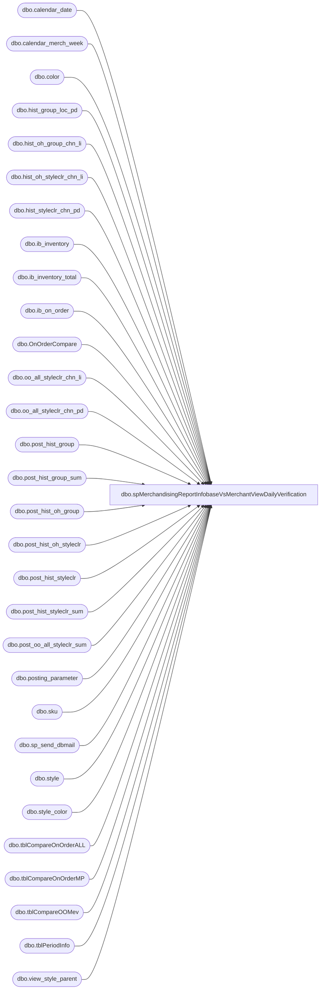

# dbo.spMerchandisingReportInfobaseVsMerchantViewDailyVerification

**Database:** me_01  
**Server:** bedrockdb02  

## Architecture Diagram



## Table Dependencies

| Referenced Table |
|---|
| dbo.calendar_date |
| dbo.calendar_merch_week |
| dbo.color |
| dbo.hist_group_loc_pd |
| dbo.hist_oh_group_chn_li |
| dbo.hist_oh_styleclr_chn_li |
| dbo.hist_styleclr_chn_pd |
| dbo.ib_inventory |
| dbo.ib_inventory_total |
| dbo.ib_on_order |
| dbo.OnOrderCompare |
| dbo.oo_all_styleclr_chn_li |
| dbo.oo_all_styleclr_chn_pd |
| dbo.post_hist_group |
| dbo.post_hist_group_sum |
| dbo.post_hist_oh_group |
| dbo.post_hist_oh_styleclr |
| dbo.post_hist_styleclr |
| dbo.post_hist_styleclr_sum |
| dbo.post_oo_all_styleclr_sum |
| dbo.posting_parameter |
| dbo.sku |
| dbo.sp_send_dbmail |
| dbo.style |
| dbo.style_color |
| dbo.tblCompareOnOrderALL |
| dbo.tblCompareOnOrderMP |
| dbo.tblCompareOOMev |
| dbo.tblPeriodInfo |
| dbo.view_style_parent |

## Stored Procedure Code

```sql
CREATE proc [dbo].[spMerchandisingReportInfobaseVsMerchantViewDailyVerification]

as 

-- =====================================================================================================
-- Name: spMerchandisingReportInfobaseVsMerchantViewDailyVerification
--
-- Description:	Replaces DTS Job on WMETL01 called 'Daily_02_Infobase-MerchantView Daily Data Integrity Verification Group and StyleClr v.4 (MERCH 4.2 LIVE)'
--				Compares inventory totals between me_01 and ma_01, reports variances.
-- Dependencies: 
--
-- Revision History
--		Name:			Date:			Comments:
--		Dan Tweedie		09/17/2015		Created proc
--		Keith Lee		08/05/2016		Added Enterprise Selling Sales (605)
--		Tim Callahan	08/22/2016		Added Enterprise Selling Returns (615)
-- =====================================================================================================


set nocount on

-- Create temp table called OnOrderCompare from IB 
IF (Object_ID('me_01..OnOrderCompare') IS NOT NULL) DROP TABLE OnOrderCompare
SELECT      d.style_code, 
            e.color_code, 
            a.receipt_date, 
            SUM(a.on_order_units) as on_order_units, 
            SUM(a.on_order_valuation_retail) as on_order_retail 
into OnOrderCompare
FROM ib_on_order a with (nolock)
join sku f01 with (nolock) on f01.sku_id = a.sku_id
join style d with (nolock) on d.style_id = f01.style_id
join style_color c with (nolock) on c.style_color_id = f01.style_color_id
join color e with (nolock) on c.color_id = e.color_id
join view_style_parent g01 with (nolock) on d.style_id = g01.style_id
	AND g01.hierarchy_level_id = 10000007
GROUP BY d.style_code, e.color_code, a.receipt_date 
order by d.style_code

-- Create table called tblCompareOnOrderMP from IB and add Merch period and year by accessing calendar_date
IF (Object_ID('me_01..tblCompareOnOrderMP') IS NOT NULL) DROP TABLE tblCompareOnOrderMP
select   a.style_code, a.color_code, a.receipt_date, a.on_order_units, b.merch_period, b.merch_year
into tblCompareOnOrderMP
from OnOrderCompare a
join calendar_date b with (nolock) on convert (char,a.receipt_date,111) = convert (char,b.calendar_date,111)

-- Gather and create tblCompareOnOrderAll from CompareOnOrder
--me_01
IF (Object_ID('me_01..tblCompareOnOrderALL') IS NOT NULL) DROP TABLE tblCompareOnOrderALL
select 	a.style_code, 
	a.color_code,
	a.current_on_order,
	b.on_order_1,
	c.on_order_2,
	d.on_order_3,
	e.total_on_order
into tblCompareOnOrderALL 
from 
	(select   style_code, color_code, isnull(sum(on_order_units),0) as current_on_order
		from      tblCompareOnOrderMP with (nolock)
		where   merch_period <= 
			(select merch_period 
				from calendar_date  with (nolock)
				where convert (char,getdate(),111) = convert (char,calendar_date,111)) 
				or convert (char,receipt_date,111) <= convert (char,getdate(),111) 
				and merch_year <= datepart(yy,getdate())
		GROUP BY style_code,color_code)as a
left join 
	(select style_code, color_code, isnull(sum(on_order_units),0) as on_order_1
		from 	tblCompareOnOrderMP
		where	merch_period =	
			(select merch_period
				from 	calendar_date  with (nolock)
				where 	convert (char,getdate(),111) = convert (char,calendar_date,111))+1
				and merch_year = datepart(yy,getdate())
			GROUP BY style_code,color_code)as b
on 	a.style_code = b.style_code
	and a.color_code = b.color_code
left join
	(select style_code, color_code, isnull(sum(on_order_units),0) as on_order_2
		from 	tblCompareOnOrderMP
		where	merch_period = 
			(select merch_period
				from 	calendar_date  with (nolock)
				where 	convert (char,getdate(),111) = convert (char,calendar_date,111))+2
				and merch_year = datepart(yy,getdate())
		GROUP BY style_code,color_code)as c
on a.style_code = c.style_code
	and a.color_code = c.color_code
left join
	(select style_code, color_code, isnull(sum(on_order_units),0) as on_order_3
		from 	tblCompareOnOrderMP
		where	merch_period = 
			(select merch_period
				from 	calendar_date  with (nolock)
				where 	convert (char,getdate(),111) = convert (char,calendar_date,111))+3
				and merch_year = datepart(yy,getdate())
				GROUP BY style_code,color_code)as d
on a.style_code = d.style_code
	and a.color_code = d.color_code
full join
	(select  style_code,color_code, isnull(sum(on_order_units),0) as total_on_order
		from      tblCompareOnOrderMP
		GROUP BY style_code,color_code)as e
on a.style_code = e.style_code
	and a.color_code = e.color_code

UPDATE ma_01.dbo.tblPeriodInfo
	SET l1_wk = (  SELECT MAX(merch_year * 100 + merch_week)  
					FROM ma_01.dbo.calendar_merch_week m with (nolock), ma_01.dbo.tblPeriodInfo   
					WHERE this_week > ((m.merch_year * 100 ) + m.merch_week) ) 

UPDATE ma_01.dbo.tblPeriodInfo  
	SET l2_wk = (  SELECT MAX(merch_year * 100 + merch_week)  
					FROM ma_01.dbo.calendar_merch_week m with (nolock), ma_01.dbo.tblPeriodInfo   
					WHERE l1_wk > ((m.merch_year * 100 ) + m.merch_week) ) 

UPDATE ma_01.dbo.tblPeriodInfo  
	SET l3_wk  = (  SELECT MAX(merch_year * 100 + merch_week)  
					FROM ma_01.dbo.calendar_merch_week m with (nolock), ma_01.dbo.tblPeriodInfo   
					WHERE l2_wk > ((m.merch_year * 100 ) + m.merch_week) )

UPDATE ma_01.dbo.tblPeriodInfo  
	SET n2_pd = (  SELECT MIN(merch_year * 100 + merch_period)  
					FROM ma_01.dbo.calendar_merch_week m with (nolock), ma_01.dbo.tblPeriodInfo   
					WHERE n1_pd < ((m.merch_year * 100 ) + m.merch_period) )

UPDATE ma_01.dbo.tblPeriodInfo  
	SET n1_pd = (  SELECT MIN(merch_year * 100 + merch_period)  
					FROM ma_01.dbo.calendar_merch_week m with (nolock), ma_01.dbo.tblPeriodInfo  
					WHERE this_period < ((m.merch_year * 100 ) + m.merch_period) )

UPDATE ma_01.dbo.tblPeriodInfo  
	SET n3_pd = (  SELECT MIN(merch_year * 100 + merch_period)  
					FROM ma_01.dbo.calendar_merch_week m with (nolock), ma_01.dbo.tblPeriodInfo    
					WHERE n2_pd < ((m.merch_year * 100 ) + m.merch_period) ) 

IF (Object_ID('me_01..tblCompareOOMev') IS NOT NULL) DROP TABLE tblCompareOOMev
CREATE TABLE [tblCompareOOMev] (
	[STYLE_CODE] [varchar] (20) NOT NULL ,
	[COLOR_CODE] [varchar] (3) NOT NULL ,
	[Total_OO] [int] NULL ,
	[OO_CURRENT] [int] NULL ,
	[OO_1] [int] NULL ,
	[OO_2] [int] NULL ,
	[OO_3] [int] NULL 
) ON [PRIMARY]

insert tblCompareOOMev
SELECT s.style_code, c.color_code,
	   Sum(a.on_order_units) as Total_OO,
	   SUM(a.on_order_units * (sign (1-SIGN (merch_year_pd  -p.this_period)))) OO_current, 
	   SUM(a.on_order_units * (1 - ABS (SIGN (merch_year_pd - p.n1_pd)))) OO_1,  
	   SUM(a.on_order_units *(1 - ABS(SIGN (merch_year_pd - p.n2_pd)))) AS OO_2,  
	   SUM(a.on_order_units * (1 - ABS (SIGN (merch_year_pd -p.n3_pd)))) OO_3
FROM ma_01.dbo.oo_all_styleclr_chn_pd a with (nolock) 
join ma_01.dbo.style_color b with (nolock) on b.color_id = a.color_id
	and b.style_id = a.style_id
join ma_01.dbo.color c with (nolock) on b.color_id = c.color_id 
join ma_01.dbo.style s with (nolock) on s.style_id = b.style_id
join ma_01.dbo.tblPeriodInfo p with (nolock) on 1=1
group by s.style_code, c.color_code
order by s.style_code

-----------------------------------------------------------------------------------
-----------------------------------------------------------------------------------
--ma_01
declare @to_ib_inventory_id decimal(12, 0),
		@iohunits_mev_group bigint,
		@iOnhand_MeV_StyleClr bigint,
		@iCountUnfinishedOH_styleclr bigint,
		@iUnfinishedJobs bigint,
		@iohunits_ib bigint,
		@iintransit_ib bigint,
		@iintransit_mev_group bigint,
		@ilntransit_Mev_styleclr bigint,
		@iAllocationUnits_mev_styleclr bigint,
		@icountunfinishedalloc_styleclr bigint,
		@dBeginPeriod smalldatetime, 
	    @dEndPeriod smalldatetime,
		@maTotalOnOrder bigint,
		@ibTotalOnOrder bigint,
		@iReceipts_Mev_styleclr bigint,
	    @iSales_Mev_styleclr bigint,
	    @iReturns_Mev_styleclr bigint,
		@iUnfinished_Receiptsetc_styleclr bigint,
		@iCountSumRowsStyleclr bigint,
		@iReceipts_mev bigint,
		@iSales_mev bigint,
		@iReturns_mev bigint,
		@iReceipts_ib bigint,
		@iSales_ib bigint,
		@iReturns_ib bigint,
		@iUnfinishedJobs_Receiptsetc bigint,
		@iCountSumRowsGroup bigint

select @to_ib_inventory_id = to_ib_inventory_id 
from ma_01.dbo.posting_parameter with (nolock)
where id = (select max(id)
            from ma_01.dbo.posting_parameter with (nolock)
            where oh_posting_flag=1)

select @iohunits_mev_group = sum(on_hand_units) 
from ma_01.dbo.hist_oh_group_chn_li with (nolock)

select @iOnhand_MeV_StyleClr = sum(on_hand_units) 
from ma_01.dbo.hist_oh_styleclr_chn_li with (nolock)

select @iCountUnfinishedOH_styleclr = count(*) 
from ma_01.dbo.post_hist_oh_styleclr with (nolock)

select @iUnfinishedJobs = count(*) 
from ma_01.dbo.post_hist_oh_group with (nolock)

select @iohunits_ib = sum(total_on_hand_units) - isnull((select sum(transaction_units) 
															from ib_inventory with (nolock) 
															where ib_inventory_id > @to_ib_inventory_id),0) 
from ib_inventory_total with (nolock)

select @iintransit_ib = sum(total_on_hand_units) - isnull((select sum(transaction_units) 
															from ib_inventory with (nolock) 
															where ib_inventory_id > @to_ib_inventory_id 
															and inventory_status_id = 2),0) 
from ib_inventory_total with (nolock) 
where inventory_status_id = 2

--ma_01
select @iintransit_mev_group = sum(on_hand_units) 
from ma_01.dbo.hist_oh_group_chn_li with (nolock)
where inventory_status_id = 2

select @ilntransit_Mev_styleclr = sum(on_hand_units) 
from ma_01.dbo.hist_oh_styleclr_chn_li with (nolock)
where inventory_status_id = 2

select @iAllocationUnits_mev_styleclr = sum(allocation_units) 
from ma_01.dbo.oo_all_styleclr_chn_li with (nolock)

select @icountunfinishedalloc_styleclr = count(*) 
from ma_01.dbo.post_oo_all_styleclr_sum with (nolock)

--me_01
select @dBeginPeriod = min(c1.calendar_date), 
	   @dEndPeriod = max(c1.calendar_date)
from calendar_date c1 with (nolock)
join calendar_date c2 with (nolock) on c1.merch_year=c2.merch_year
	and c1.merch_period=c2.merch_period
where c2.calendar_date = cast(cast(Month(getdate()) as varchar(2)) + '/' + cast(Day(getdate()) as varchar(2)) + '/' + cast(Year(getdate()) as varchar(4)) as datetime)

select @maTotalOnOrder = sum(Total_OO)
from tblCompareOOMev with (nolock)

select @ibTotalOnOrder = sum(total_on_order)
from tblCompareOnOrderALL with (nolock)

select @iReceipts_Mev_styleclr = sum(h.received_units),
	   @iSales_Mev_styleclr = sum(h.sales_total_units), 
	   @iReturns_Mev_styleclr = sum(h.return_units)
from ma_01.dbo.hist_styleclr_chn_pd h with (nolock)
join ma_01.dbo.calendar_date c with (nolock) on h.merch_year_pd = (convert(varchar,c.merch_year) + REPLICATE('0', 2 - LEN(convert(varchar,c.merch_period)))+ convert(varchar,c.merch_period))
where c.calendar_date =  cast(convert(varchar,getdate(),1) as smalldatetime)

--ma_01
select @iUnfinished_Receiptsetc_styleclr = count(*) 
from ma_01.dbo.post_hist_styleclr with (nolock)

select @iCountSumRowsStyleclr = count(*) 
from ma_01.dbo.post_hist_styleclr_sum with (nolock)

select  @iReceipts_mev = sum(h.received_units), 
        @iSales_mev = sum(h.sales_total_units), 
		@iReturns_mev = sum(h.return_units)
from    ma_01.dbo.hist_group_loc_pd h with (nolock)
join ma_01.dbo.calendar_date c with (nolock) on h.merch_year_pd = (convert(varchar,c.merch_year) + REPLICATE('0', 2 - LEN(convert(varchar,c.merch_period)))+ convert(varchar,c.merch_period))
where c.calendar_date =  cast(convert(varchar,getdate(),1) as smalldatetime)
 
select @iReceipts_ib = isnull(sum(transaction_units),0) 
from ib_inventory with (nolock) 
where ib_inventory_id <= @to_ib_inventory_id
and transaction_date between @dBeginPeriod and @dEndPeriod
and transaction_type_code = '200'

select @iSales_ib = isnull(sum(transaction_units),0) 
from ib_inventory with (nolock) 
where ib_inventory_id <= @to_ib_inventory_id
and transaction_date between @dBeginPeriod and @dEndPeriod
and transaction_type_code in ('600','605')

select @iReturns_ib = isnull(sum(transaction_units),0) 
from ib_inventory with (nolock) 
where ib_inventory_id <= @to_ib_inventory_id
and transaction_date between @dBeginPeriod and @dEndPeriod
and transaction_type_code in ('610','615') -- Added 615 on 8/22/2016 - TC 

select @iUnfinishedJobs_Receiptsetc = count(*) 
from ma_01.dbo.post_hist_group with (nolock)

select @iCountSumRowsGroup = count(*) 
from ma_01.dbo.post_hist_group_sum with (nolock)


----FORMAT REPORT
DECLARE @text nvarchar(max)
set @text = 
'<font face =arial size = 2>' + 
'<b>Infobase-MerchantView Daily Verification Results' +
'<br>' +
'Period Begins: </b>' + convert(varchar, @dBeginPeriod) +
'<br>' +
'<b>Period Ends: </b>' + convert(varchar, @dEndPeriod) +
'<br>' +
'<br>' +
'<br>' +
'<b>MA Total On Order Group: </b>' + cast(@maTotalOnOrder as varchar) +
'<br><b>IB Total On Order : </b>' + cast(@ibTotalOnOrder as varchar) +
'<br>-------------------------------------' +
'<br><b>Difference : </b>' + cast(@maTotalOnOrder - @ibTotalOnOrder as varchar) +
'<br>' +
'<br>' +
'<br>' +
'<b>MA On Hand Units Group : </b>' + cast(@iohunits_mev_group as varchar) +
'<br><b>MA On Hand Units StyleClr: </b>' + cast(@iOnhand_MeV_StyleClr as varchar) +
'<br><b>IB On Hand Units : </b>' + cast(@iohunits_ib as varchar) +
'<br>-------------------------------------' +
'<br><b>Difference : </b>' + cast(@iohunits_mev_group - @iohunits_ib as varchar) +
'<br><b>Difference : </b>' + cast(@iOnhand_MeV_StyleClr - @iohunits_ib as varchar) +
'<br>' + 
'<br>' +
'<br>' +
'<b>MA Intransit Group: </b>' + cast(@iintransit_mev_group as varchar) +
'<br><b>MA Intransit StyleClr: </b>' + cast(@ilntransit_Mev_styleclr as varchar) +
'<br><b>IB Intransit       : </b>' + cast(@iintransit_ib as varchar) +
'<br>-------------------------------------' +
'<br><b>Difference Between MA Group and IB: </b>' + cast(@iintransit_mev_group - @iintransit_ib as varchar) +
'<br><b>Difference Between MA Style and IB: </b>' + cast(@ilntransit_Mev_styleclr - @iintransit_ib as varchar) +
'<br>' + 
'<br>' +
'<br>' +
'<b>MA Receipts Group : </b>' + cast(@iReceipts_mev as varchar) +
'<br><b>MA Receipts StyleClr: </b>' + cast(@iReceipts_MeV_styleclr as varchar) +
'<br><b>IB Receipts : </b>' + cast(@iReceipts_ib as varchar) +
'<br>-------------------------------------' +
'<br><b>Difference : </b>' + cast(@iReceipts_mev - @iReceipts_ib as varchar) +
'<br><b>Difference : </b>' + cast(@iReceipts_MeV_styleclr - @iReceipts_ib as varchar) +
'<br>' + 
'<br>' +
'<br>' +
'<b>MA Returns Group: </b>' + cast(@iReturns_mev as varchar) +
'<br><b>MA Returns StyleClr: </b>' + cast(@iReturns_Mev_styleclr as varchar) +
'<br><b>IB Returns : </b>' + cast(@iReturns_ib as varchar) +
'<br>-------------------------------------' +
'<br><b>Difference : </b>' + cast(@iReturns_mev - @iReturns_ib as varchar) +
'<br><b>Difference : </b>' + cast(@iReturns_Mev_styleclr - @iReturns_ib as varchar) +
'<br>' + 
'<br>' +
'<br>' +
'<b>MA Sales : </b>' + cast(@iSales_mev as varchar) +
'<br><b>MA Sales StyleClr: </b>' + cast(@iSales_MeV_styleclr as varchar) +
'<br><b>IB Sales : </b>' + cast((@iSales_ib * -1) as varchar) +
'<br>-------------------------------------' +
'<br><b>Difference : </b>' + cast(@iSales_mev - (@iSales_ib * -1) as varchar) +
'<br><b>Difference : </b>' + cast(@iSales_MeV_styleclr - (@iSales_ib * -1) as varchar) +
'<br>' + 
'<br>' +
'<br>' +
'<b>Technical Details:' +
'<br>SQL Agent Job on Kermode:</b> MERCHANDISING - Report - Infobase-MerchantViewDailyVerification' +
'<br><b>SQL Stored Procedure on Bedrockdb02.me_01:</b> spMerchandisingReportInfobaseVsMerchantViewDailyVerification' +
'<br>The contents of this message can be found in a text file located here: \\kermode\FileRepository\MERCHANDISING\InfobaseVsMerchantview . ' + 
'<br>' +
'</font>'


--OUTPUT FILE
declare @query varchar(1000),
		@file_name varchar(100),
		@file_location varchar(100),
		@server varchar(20),
		@database varchar(20),
		@sqlcmd varchar(1000),
		@query_text varchar(1000)

select @query_text = 'exec me_01.dbo.spMerchandisingReportInfobaseVsMerchantViewDailyVerificationExportFile @iohunits_mev_group = ''' + cast(@iohunits_mev_group as varchar) + ''', @iOnhand_MeV_StyleClr = ''' + cast(@iOnhand_MeV_StyleClr as varchar) + ''', @iohunits_ib = ''' + cast(@iohunits_ib as varchar) + ''', @iintransit_ib = ''' + cast(@iintransit_ib as varchar) + ''', @iintransit_mev_group = ''' + cast(@iintransit_mev_group as varchar) + ''', @ilntransit_Mev_styleclr = ''' + cast(@ilntransit_Mev_styleclr as varchar) + ''', @dBeginPeriod = ''' + cast(@dBeginPeriod as varchar) + ''', @dEndPeriod = ''' + cast(@dEndPeriod as varchar) + ''', @maTotalOnOrder = ''' + cast(@maTotalOnOrder as varchar) + ''', @ibTotalOnOrder = ''' + cast(@ibTotalOnOrder as varchar) + ''', @iReceipts_Mev_styleclr = ''' + cast(@iReceipts_Mev_styleclr as varchar) + ''', @iSales_Mev_styleclr = ''' + cast(@iSales_Mev_styleclr as varchar) + ''', @iReturns_Mev_styleclr = ''' + cast(@iReturns_Mev_styleclr as varchar) + ''', @iReceipts_mev = ''' + cast(@iReceipts_mev as varchar) + ''', @iSales_mev = ''' + cast(@iSales_mev as varchar) + ''', @iReturns_mev = ''' + cast(@iReturns_mev as varchar) + ''', @iReceipts_ib = ''' + cast(@iReceipts_ib as varchar) + ''', @iSales_ib = ''' + cast(@iSales_ib as varchar) + ''', @iReturns_ib = ''' + cast(@iReturns_ib as varchar) + ''''

set @query = @query_text
set @file_location = '\\kermode\FileRepository\MERCHANDISING\InfobaseVsMerchantview\'
set @file_name = 'InfobaseVsMerchantview.TXT'
set @server = 'bedrockdb02'
set @database = 'me_01'
set @sqlcmd = 'sqlcmd -S' + @server + ' -d' + @database + ' -Q' + '"' + @query + '"' + ' -o' + '"' + @file_location + @file_name + '"' + ' -w1000 -W'

exec master..xp_cmdshell @sqlcmd

--EMAIL REPORT
declare @subj varchar(1000)
select @subj = case when @maTotalOnOrder - @ibTotalOnOrder <> 0
	or @iohunits_mev_group - @iohunits_ib <> 0
	or @iOnhand_MeV_StyleClr - @iohunits_ib <> 0
	or @iintransit_mev_group - @iintransit_ib <> 0
	or @ilntransit_Mev_styleclr - @iintransit_ib <> 0
	or @iReceipts_mev - @iReceipts_ib <> 0
	or @iReceipts_MeV_styleclr - @iReceipts_ib <> 0
	or @iReturns_mev - @iReturns_ib <> 0
	or @iReturns_Mev_styleclr - @iReturns_ib <> 0
	or @iSales_mev - (@iSales_ib * -1) <> 0
	or @iSales_MeV_styleclr - (@iSales_ib * -1) <> 0
then 
	'Infobase-MerchantView Daily Verification Results - PROBLEM'
else 
	'Infobase-MerchantView Daily Verification Results - NO PROBLEM'
end 


exec msdb.dbo.sp_send_dbmail
	 @profile_name = 'merchadmin',
	 @recipients = 'poll@buildabear.com',
	 @body = @text,
	 @subject= @subj,
	 @body_format = 'HTML'
```

