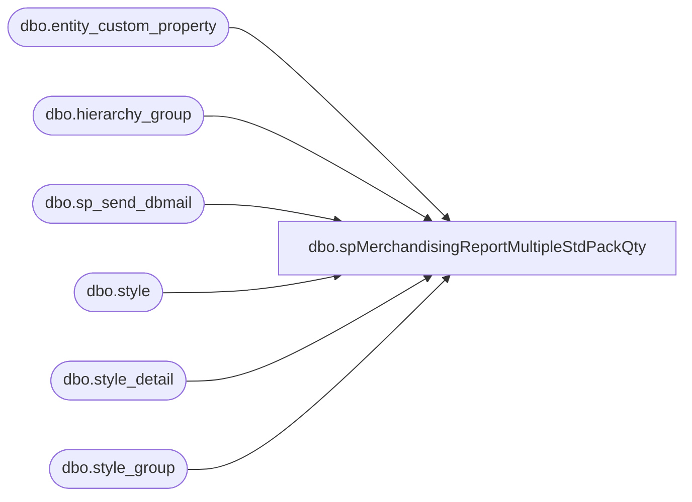

# dbo.spMerchandisingReportMultipleStdPackQty

**Database:** me_01  
**Server:** bedrockdb02  

## Architecture Diagram



## Table Dependencies

| Referenced Table |
|---|
| dbo.entity_custom_property |
| dbo.hierarchy_group |
| dbo.sp_send_dbmail |
| dbo.style |
| dbo.style_detail |
| dbo.style_group |

## Stored Procedure Code

```sql
CREATE procEDURE [dbo].[spMerchandisingReportMultipleStdPackQty]
AS
SET NOCOUNT ON

-- =====================================================================================================
-- Name: spMerchandisingReportMultipleStdPackQty
--
--				 
-- Revision History
--		Name:			Date:			Comments: This Proc is replaces existing DTS pkg on Beehive called Validation_MEW_Multiple_STD_Pack_QTY.
--		Dan Tweedie	    03/04/2015		Created proc.	
-- =====================================================================================================
IF (Object_ID('tempdb..##MAHITEMP77_CSV') IS NOT null) DROP TABLE ##MAHITEMP77_CSV
SELECT s.style_code AS style
	,hg.hierarchy_group_code
	,count(s.style_code) AS Occurances
into ##MAHITEMP77_CSV
FROM style s(NOLOCK)
INNER JOIN style_detail sd(NOLOCK) ON s.style_id = sd.style_id
INNER JOIN style_group sg(NOLOCK) ON s.style_id = sg.style_id
INNER JOIN hierarchy_group hg(NOLOCK) ON sg.hierarchy_group_id = hg.hierarchy_group_id
INNER JOIN entity_custom_property ecp(NOLOCK) ON s.style_id = ecp.parent_id
WHERE ecp.custom_property_id = 2
	AND ecp.parent_type = 1
GROUP BY s.style_code,hg.hierarchy_group_code
HAVING (count(s.style_code) > 1)
ORDER BY s.style_code


if (select count(*) from ##MAHITEMP77_CSV) > 0

begin
	    DECLARE @1query varchar(1000),
            @1file_name varchar(100),
            @1file_location varchar(100),
            @1server varchar(20),
            @1database varchar(20),
            @1sqlcmd varchar(1000),
            @1query_text varchar(1000),
            @1file varchar(1000),
            @1body varchar(1000),
            @1subj varchar(1000)

            select @1query_text = 'set nocount on select * from ##MAHITEMP77_CSV'
            set @1query = @1query_text
            set @1file_location = '\\kermode\FileRepository\MERCHANDISING\DBCompare\'  
            set @1file_name = 'StdPackProblem.csv'
            set @1server = 'bedrockdb02'
            set @1database = 'me_01'
            set @1sqlcmd = 'sqlcmd -S' + @1server + ' -d' + @1database + ' -Q' + '"' + @1query + '"' + ' -o' + '"' + @1file_location + @1file_name + '"' + ' -s"," -w1000 -W'
            exec master..xp_cmdshell @1sqlcmd


	EXEC msdb.dbo.sp_send_dbmail 
		@profile_name = 'MerchAdmin',
		@recipients= 'merchadmin@buildabear.com',
		@body = 'If you have any problems with this report, please contact EntSysSupport@buildabear.com',
		@subject = 'Multiple STD PACK QTY - PROBLEM',
		@file_attachments ='\\kermode\FileRepository\MERCHANDISING\DBCompare\StdPackProblem.csv'

end
```

