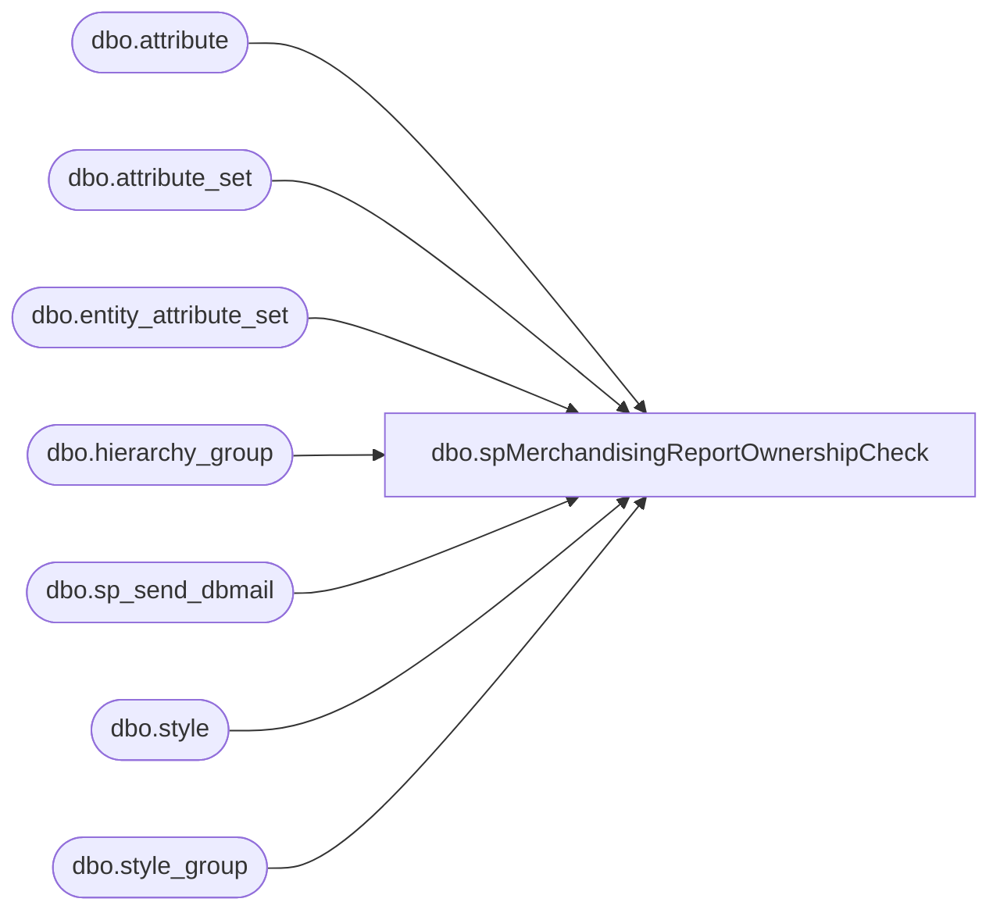

# dbo.spMerchandisingReportOwnershipCheck

**Database:** me_01  
**Server:** bedrockdb02  

## Architecture Diagram



## Table Dependencies

| Referenced Table |
|---|
| dbo.attribute |
| dbo.attribute_set |
| dbo.entity_attribute_set |
| dbo.hierarchy_group |
| dbo.sp_send_dbmail |
| dbo.style |
| dbo.style_group |

## Stored Procedure Code

```sql
CREATE procEDURE [dbo].[spMerchandisingReportOwnershipCheck]
AS
SET NOCOUNT ON
-- =====================================================================================================
-- Name: spMerchandisingReportOwnershipCheck
--
--				 
-- Revision History
--		Name:			Date:			Comments: This Proc is replaces existing DTS pkg on Beehive called Validation_Mew_Ownership_Check V1
--		Dan Tweedie	    03/05/2015		Created proc.	
--		Tim Callahan	02/16/2016		Modified Variables As this job was failing to create the files necessary. 
-- =====================================================================================================

IF (Object_ID('tempdb..##MAHITEMP16_TXT') IS NOT NULL) DROP TABLE ##MAHITEMP16_TXT
select s.style_code as "Style Code",
s.short_desc as "Description",
ats.attribute_set_code as "Current OWNRSP",
'UK' as "Correct OWNRSP"
INTO ##MAHITEMP16_TXT
from style s (NOLOCK)
JOIN style_group sg (NOLOCK) ON s.style_id = sg.style_id 
JOIN hierarchy_group hg (NOLOCK) ON sg.hierarchy_group_id = hg.hierarchy_group_id
JOIN entity_attribute_set EAS (NOLOCK) ON  s.style_id = eas.parent_id
JOIN attribute_set ats (NOLOCK) ON eas.attribute_set_id = ats.attribute_set_id 
where eas.attribute_id = 1
and	eas.attribute_set_id not in (100010,100008) --UK, NOSEND
and s.style_code in 
(select s.style_code
	from style s (nolock)
	join entity_attribute_set eas (nolock) on s.style_id = eas.parent_id
	join attribute_set att (nolock) on eas.attribute_set_id = att.attribute_set_id
	join attribute a (nolock) on att.attribute_id = a.attribute_id and a.parent_type = 1
	where a.attribute_code = 'AVAILB'
	and att.attribute_set_code = 'UK')
order by s.style_code

if (select count(*) from ##MAHITEMP16_TXT) > 0

BEGIN
	DECLARE @1query VARCHAR(1000)
		,@1file_name VARCHAR(100)
		,@1file_location VARCHAR(100)
		,@1server VARCHAR(20)
		,@1database VARCHAR(20)
		,@1sqlcmd VARCHAR(1000)
		,@1query_text VARCHAR(1000)
		,@1file VARCHAR(1000)
		,@1body VARCHAR(1000)
		,@1subj VARCHAR(1000)

	SELECT @1query_text = 'set nocount on select * from ##MAHITEMP16_TXT'

	SET @1query = @1query_text
	SET @1file_location = '\\kermode\FileRepository\MERCHANDISING\DBCompare\'
	SET @1file_name = 'UK_OWNRSP.csv'
	SET @1server = 'bedrockdb02'
	SET @1database = 'me_01'
	SET @1sqlcmd = 'sqlcmd -S' + @1server + ' -d' + @1database + ' -Q' + '"' + @1query + '"' + ' -o' + '"' + @1file_location + @1file_name + '"' + ' -s"," -w1000 -W'

	EXEC master..xp_cmdshell @1sqlcmd

	EXEC   msdb.dbo.sp_send_dbmail
		@profile_name = 'MerchAdmin',
		@recipients='MichelleH@buildabear.com;Michelleko@buildabear.com;Helenh@buildabear.com;purchasing@buildabear.com;jackm@buildabear.com',  
		@file_attachments ='\\kermode\FileRepository\MERCHANDISING\DBCompare\UK_OWNRSP.csv',
		@body = 'The attached Styles have the wrong OWNRSP assigned',
		@subject = 'UK OWNSP Check - PROBLEM'

END


---------------------------------------------------------------------- US ----------------------------------------------------	

IF (Object_ID('tempdb..##MAHITEMP16US_TXT') IS NOT NULL)DROP TABLE ##MAHITEMP16US_TXT
SELECT s.style_code AS "Style Code"
	,s.short_desc AS "Description"
	,ats.attribute_set_code AS "Current OWNRSP"
	,'US' AS "Correct OWNRSP"
INTO ##MAHITEMP16US_TXT
FROM style s(NOLOCK)
INNER JOIN style_group sg(NOLOCK) ON s.style_id = sg.style_id
INNER JOIN hierarchy_group hg(NOLOCK) ON sg.hierarchy_group_id = hg.hierarchy_group_id
INNER JOIN entity_attribute_set EAS(NOLOCK) ON s.style_id = eas.parent_id
INNER JOIN attribute_set ats(NOLOCK) ON eas.attribute_set_id = ats.attribute_set_id
WHERE eas.attribute_id = 1
AND eas.attribute_set_id NOT IN (100001,100008) --US, NOSEND
	AND s.style_code IN (
		SELECT s.style_code
		FROM style s(NOLOCK)
		INNER JOIN entity_attribute_set eas(NOLOCK) ON s.style_id = eas.parent_id
		INNER JOIN attribute_set att(NOLOCK) ON eas.attribute_set_id = att.attribute_set_id
		INNER JOIN attribute a(NOLOCK) ON att.attribute_id = a.attribute_id
			AND a.parent_type = 1
		WHERE a.attribute_code = 'AVAILB'
			AND att.attribute_set_code = 'US'
		)
ORDER BY s.style_code

if (select count(*) from ##MAHITEMP16US_TXT) > 0

BEGIN
	DECLARE @2query VARCHAR(2000)
		,@2file_name VARCHAR(200)
		,@2file_location VARCHAR(200)
		,@2server VARCHAR(20)
		,@2database VARCHAR(20)
		,@2sqlcmd VARCHAR(2000)
		,@2query_text VARCHAR(2000)
		,@2file VARCHAR(2000)
		,@2body VARCHAR(2000)
		,@2subj VARCHAR(2000)

	SELECT @2query_text = 'set nocount on select * from ##MAHITEMP16US_TXT' -- Changed from @1query_text

	SET @2query = @2query_text -- Changed from @1query_text
	SET @2file_location = '\\kermode\FileRepository\MERCHANDISING\DBCompare\'
	SET @2file_name = 'US_OWNRSP.csv'
	SET @2server = 'bedrockdb02'
	SET @2database = 'me_01'
	SET @2sqlcmd = 'sqlcmd -S' + @2server + ' -d' + @2database + ' -Q' + '"' + @2query + '"' + ' -o' + '"' + @2file_location + @2file_name + '"' + ' -s"," -w1000 -W'

	EXEC master..xp_cmdshell @2sqlcmd

	EXEC msdb.dbo.sp_send_dbmail 
		@profile_name = 'MerchAdmin',
		@recipients='MichelleH@buildabear.com;Michelleko@buildabear.com;Helenh@buildabear.com;purchasing@buildabear.com;jackm@buildabear.com' ,
		@file_attachments = '\\kermode\FileRepository\MERCHANDISING\DBCompare\US_OWNRSP.csv',
		@body = 'The attached Styles have the wrong OWNRSP assigned',
		@subject = 'US OWNSP Check - PROBLEM'

END		
------------------------------------------------------------------------- CAN ------------------------------------------------------------------

IF (Object_ID('tempdb..##MAHITEMP16CAN_TXT') IS NOT NULL) DROP TABLE ##MAHITEMP16CAN_TXT
select s.style_code as "Style Code",
s.short_desc as "Description",
ats.attribute_set_code as "Current OWNRSP",
'CAN' as "Correct OWNRSP"
Into ##MAHITEMP16CAN_TXT
from style s (NOLOCK)
JOIN style_group sg (NOLOCK) ON s.style_id = sg.style_id 
JOIN hierarchy_group hg (NOLOCK) ON sg.hierarchy_group_id = hg.hierarchy_group_id
JOIN entity_attribute_set EAS (NOLOCK) ON  s.style_id = eas.parent_id
JOIN attribute_set ats (NOLOCK) ON eas.attribute_set_id = ats.attribute_set_id 
where 	eas.attribute_id = 1
and	eas.attribute_set_id not in (100007,100008) -- CAN, NOSEND
and s.style_code in 
(
	select s.style_code
	from style s (nolock)
	join entity_attribute_set eas (nolock) on s.style_id = eas.parent_id
	join attribute_set att (nolock) on eas.attribute_set_id = att.attribute_set_id
	join attribute a (nolock) on att.attribute_id = a.attribute_id and a.parent_type = 1
	where a.attribute_code = 'AVAILB'
	and att.attribute_set_code = 'CA'
)
order by s.style_code

if (select count(*) from ##MAHITEMP16CAN_TXT) > 0

BEGIN
	DECLARE @3query VARCHAR(1000)
		,@3file_name VARCHAR(100)
		,@3file_location VARCHAR(100)
		,@3server VARCHAR(20)
		,@3database VARCHAR(20)
		,@3sqlcmd VARCHAR(1000)
		,@3query_text VARCHAR(1000)
		,@3file VARCHAR(1000)
		,@3body VARCHAR(1000)
		,@3subj VARCHAR(1000)

	SELECT @3query_text = 'set nocount on select * from ##MAHITEMP16CAN_TXT' --Changed from @1query_text

	SET @3query = @3query_text --Changed from @1query_text
	SET @3file_location = '\\kermode\FileRepository\MERCHANDISING\DBCompare\'
	SET @3file_name = 'CAN_OWNRSP.csv'
	SET @3server = 'bedrockdb02'
	SET @3database = 'me_01'
	SET @3sqlcmd = 'sqlcmd -S' + @3server + ' -d' + @3database + ' -Q' + '"' + @3query + '"' + ' -o' + '"' + @3file_location + @3file_name + '"' + ' -s"," -w1000 -W'

	EXEC master..xp_cmdshell @3sqlcmd

	EXEC   msdb.dbo.sp_send_dbmail
		@profile_name = 'MerchAdmin',
		@recipients='MichelleH@buildabear.com;Michelleko@buildabear.com;Helenh@buildabear.com;purchasing@buildabear.com;jackm@buildabear.com'  ,
		@file_attachments ='\\kermode\FileRepository\MERCHANDISING\DBCompare\CAN_OWNRSP.csv',
		@body = 'The following Styles have the wrong OWNRSP assigned',
		@subject = 'CAN OWNSP Check - PROBLEM'	

END
```

