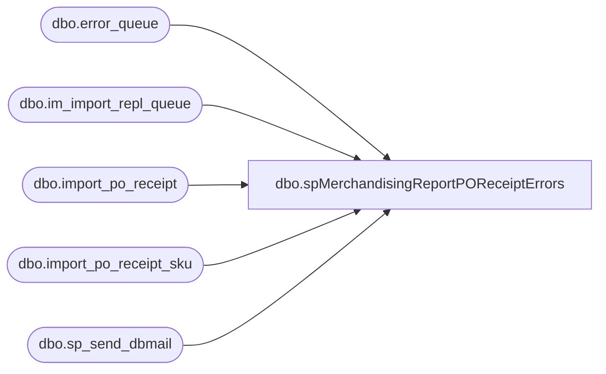

# dbo.spMerchandisingReportPOReceiptErrors

**Database:** me_01  
**Server:** bedrockdb02  

## Architecture Diagram



## Table Dependencies

| Referenced Table |
|---|
| dbo.error_queue |
| dbo.im_import_repl_queue |
| dbo.import_po_receipt |
| dbo.import_po_receipt_sku |
| dbo.sp_send_dbmail |

## Stored Procedure Code

```sql
CREATE procedure [dbo].[spMerchandisingReportPOReceiptErrors]
as
set nocount on
--===================================================================================
-- Name: spMerchandisingReportPOReceiptErrors
--
-- Description: Get PO Receipt Rejections / Email Report Out
--				 
-- Revision History
--		Name:			Date:			Comments: This Proc replaces DTS pkg on Beehive called Report_PO_Receipts_ErrorDaily_V1
--		Dan Tweedie	    03/03/2015		Created proc.	
--		Tim Callahan	06/20/2016		Modified Proc to remove carriage a returns (char 13) and commas from Error Message results, caused formatting issues with report. 
--		Tim Callahan	08/22/2017		Modified proc to remove line feeds (char 10) from error message results, also had to change substring as how Pipeline formats the error has changed 
-- =====================================================================================================

/*
IF (Object_ID('tempdb..##MAHITEMP7_CSV') IS NOT null) DROP TABLE ##MAHITEMP7_CSV
SELECT ipr.po_no AS "PO Number"
	,substring(eq.error, 157, CHARINDEX('.', substring(eq.error, 157, 500), 1) + 1) AS "Error Message"
	,ipr.receive_date AS "Receipt Date"
	,ipr.packing_list_no AS "ASN"
	,iprs.upc_number AS "UPC"
	,iprs.units_received AS "Units"
INTO ##MAHITEMP7_CSV
FROM im_import_repl_queue iirq(NOLOCK)
INNER JOIN import_po_receipt ipr(NOLOCK) ON iirq.entity_id = ipr.import_po_receipt_id
INNER JOIN import_po_receipt_sku iprs(NOLOCK) ON ipr.import_po_receipt_id = iprs.import_po_receipt_id
INNER JOIN pipeapp01.PipelineRepository.dbo.error_queue eq on iirq.im_import_repl_queue_id = eq.sequence_id
WHERE iirq.entity_code = 20
and iirq.entity_id IN (SELECT substring(entity_key, 1, CHARINDEX('~', substring(entity_key, 1, 30), 1) - 1)
							FROM pipeapp01.PipelineRepository.dbo.error_queue
							WHERE segment_id = 19000 AND entity_code = 20)
ORDER BY ipr.po_no

*/
-- ***Above code remarked out and replaced on 8/22/2017***

IF (Object_ID('tempdb..##MAHITEMP7_CSV') IS NOT null) DROP TABLE ##MAHITEMP7_CSV
SELECT ipr.po_no AS "PO Number"
	,substring(eq.error, 0, 160) AS "Error Message"
	,ipr.receive_date AS "Receipt Date"
	,ipr.packing_list_no AS "ASN"
	,iprs.upc_number AS "UPC"
	,iprs.units_received AS "Units"
INTO ##MAHITEMP7_CSV
FROM im_import_repl_queue iirq(NOLOCK)
INNER JOIN import_po_receipt ipr(NOLOCK) ON iirq.entity_id = ipr.import_po_receipt_id
INNER JOIN import_po_receipt_sku iprs(NOLOCK) ON ipr.import_po_receipt_id = iprs.import_po_receipt_id
INNER JOIN pipeapp01.PipelineRepository.dbo.error_queue eq on iirq.im_import_repl_queue_id = eq.sequence_id
WHERE iirq.entity_code = 20
and iirq.entity_id IN (SELECT substring(entity_key, 1, CHARINDEX('~', substring(entity_key, 1, 30), 1) - 1)
							FROM pipeapp01.PipelineRepository.dbo.error_queue
							WHERE segment_id = 19000 AND entity_code = 20)
ORDER BY ipr.po_no


-- Update Temp Table to Remove Carriage Returns
update ##MAHITEMP7_CSV
set [Error Message] = replace([Error Message],char (13),'')

-- Update Temp Table to Remove Line Feeds
update ##MAHITEMP7_CSV
set [Error Message] = replace([Error Message],char (10),'')

-- Update Temp to Remove Commas which break the tsql procedure below
update ##MAHITEMP7_CSV
set [Error Message] = replace([Error Message],',','')


if (SELECT count(*) FROM ##MAHITEMP7_CSV) > 0

BEGIN 


    DECLARE @1query varchar(1000),
            @1file_name varchar(100),
            @1file_location varchar(100),
            @1server varchar(20),
            @1database varchar(20),
            @1sqlcmd varchar(1000),
            @1query_text varchar(1000),
            @1file varchar(1000),
            @1body varchar(1000),
            @1subj varchar(1000)
			
            select @1query_text = 'set nocount on select * from ##MAHITEMP7_CSV'
			set @1query = @1query_text
            set @1file_location = '\\kermode\FileRepository\MERCHANDISING\DBCompare\'  
            set @1file_name = 'po_receipt_rejections.csv'
            set @1server = 'bedrockdb02'
            set @1database = 'me_01'
            set @1sqlcmd = 'sqlcmd -S' + @1server + ' -d' + @1database + ' -Q' + '"' + @1query + '"' + ' -o' + '"' + @1file_location + @1file_name + '"' + ' -s"," -w1000 -W'
            exec master..xp_cmdshell @1sqlcmd


		EXEC   msdb.dbo.sp_send_dbmail
				@profile_name = 'MerchAdmin',
				@recipients= 'physicalinventory@buildabear.com;markd@buildabear.com;',
				@subject = 'PO Receipt Rejections Report',
				@body = '"If you have any problems with this report, please contact EntSysSupport@buildabear.com"',
				@file_attachments= '\\kermode\FileRepository\MERCHANDISING\DBCompare\po_receipt_rejections.csv'	

				
END
```

