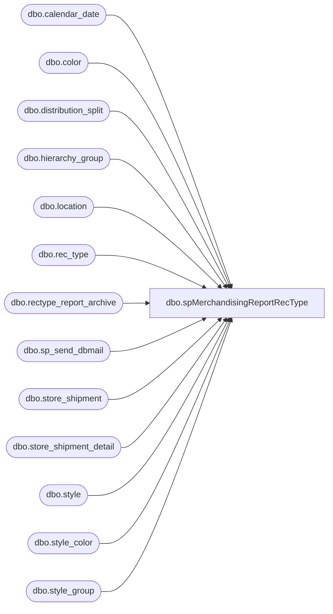

# dbo.spMerchandisingReportRecType

**Database:** me_01  
**Server:** bedrockdb02  

## Architecture Diagram



## Table Dependencies

| Referenced Table |
|---|
| dbo.calendar_date |
| dbo.color |
| dbo.distribution_split |
| dbo.hierarchy_group |
| dbo.location |
| dbo.rec_type |
| dbo.rectype_report_archive |
| dbo.sp_send_dbmail |
| dbo.store_shipment |
| dbo.store_shipment_detail |
| dbo.style |
| dbo.style_color |
| dbo.style_group |

## Stored Procedure Code

```sql
-- =============================================
-- Author:		Keith Lee
-- Create date: July 7th, 2016
-- Description:	Generates and archives Rec Type report for Tami Barieau
--				Updated how we grab the rec type code.
-- Revision History
--		Name:			Date:			Comments: 
--		Lizzy Timm		04/04/2022		Removed Keith Lee from recipients
-- =============================================
CREATE PROCEDURE [dbo].[spMerchandisingReportRecType]

AS
BEGIN
	-- SET NOCOUNT ON added to prevent extra result sets from
	-- interfering with SELECT statements.
	SET NOCOUNT ON;


select min(calendar_date) as calendar_date
into #keith_temp--
from	calendar_date 
group by merch_year, merch_period


if (select count(*) from #keith_temp where convert(varchar, getdate(), 101) = convert(varchar, calendar_date, 101)) > 0

BEGIN

	select 	fl.location_code as "From Location",
				hg.hierarchy_group_code as "Hierarchy Group Code",
				hg.hierarchy_group_label as "Hierarchy Group Label",
				s.style_code as "Style Code",
				s.short_desc as "Short Description",
				sum(ssd.units_sent) as "Quantity Shipped",
				rt.rectype as "Rec Type",
				l.location_code as "Location",
				ssd.distribution_no as "Distribution #",
				ss.create_date as "Create Date"
		into	##rectype_report
		from 	store_shipment ss,
				store_shipment_detail ssd,
				style s,
				style_color sc,
				color c,
				location l,
				location fl,
				rec_type rt,
				style_group sg,
				hierarchy_group hg,
				calendar_date cd,
				(select style_code, distribution_number, rec_type from distribution_split where release_date > '2016-01-01' group by style_code, distribution_number, rec_type) ds
		where	ss.location_id = l.location_id
		and	ss.store_shipment_id = ssd.store_shipment_id
		and	ssd.style_id = s.style_id
		and	ssd.style_color_id = sc.style_color_id
		and	sc.color_id = c.color_id
		and ss.from_location_id = fl.location_id
		and	s.style_id = sg.style_id
		and	sg.hierarchy_group_id = hg.hierarchy_group_id
		and s.style_code = ds.style_code
		and ssd.distribution_no = ds.distribution_number
		and	ds.rec_type = rt.rectype
		and	rt.rectype in (53,54,55,57,1001,1002,1003,1004,1005,1007,62,63)
		and convert(varchar, ss.create_date, 101) = convert(varchar, cd.calendar_date, 101) 
		and	cd.merch_period = (select	merch_period
							from	calendar_date 
							where	convert(varchar, getdate()-1, 101) = convert(varchar, calendar_date, 101))
		group by fl.location_code,				hg.hierarchy_group_code,
				hg.hierarchy_group_label,
				s.style_code,
				s.short_desc,
				rt.rectype,
				l.location_code,
				ssd.distribution_no,
				ss.create_date

		declare @query varchar(1000),
				@date varchar(200),
				@file_name varchar(100),
				@file_location varchar(100),
				@server varchar(20),
				@database varchar(20),
				@sqlcmd varchar(1000),
				@query_text varchar(1000),
				@file varchar(1000),
				@body varchar(1000),
				@subj varchar(1000)


				select @query_text = 'set nocount on select * from ##rectype_report order by 10,4'
				set @date = convert(varchar, datepart(yyyy, getdate())) + '-' + convert(varchar, datepart(mm, getdate())) + '-' + convert(varchar, datepart(dd, getdate())) 
				set @query = @query_text
				set @file_location = '\\kermode\FileRepository\MERCHANDISING\RecTypeReport\'  
				set @file_name = 'RecTypeReport' + @date + '.csv'
				set @server = 'bedrockdb02'
				set @database = 'me_01'
				set @sqlcmd = 'sqlcmd -S' + @server + ' -d' + @database + ' -Q' + '"' + @query + '"' + ' -o' + '"' + @file_location + @file_name + '"' + ' -s"," -w1000 -W'
				exec master..xp_cmdshell @sqlcmd

				select @file = @file_location + @file_name

				select @body = 'Follow the link to find the Rec Type Report'
				+ '<br> -> ' + @file + '<br><br><br>This report was generated by BEDROCKDBO2.me_01.dbo.spMerchandisingReportRecType'
				select @subj = 'Rec Type Report'

				exec msdb.dbo.sp_send_dbmail
				@profile_name = 'merchadmin',
				@recipients = 'tamib@buildabear.com;', 
				@body = @body,
				@subject = @subj,
				@body_format = 'HTML'


		drop table ##rectype_report
		drop table #keith_temp

---- Archive into table for future analysis

				insert into	rectype_report_archive
				 select 		fl.location_code as from_location_code,
								hg.hierarchy_group_code,
								hg.hierarchy_group_label,
								s.style_code,
								s.short_desc,
								sum(ssd.units_sent) as qty_shipped,
								rt.rectype,
								l.location_code,
								ssd.distribution_no,
								ss.create_date
						from 	store_shipment ss,
								store_shipment_detail ssd,
								style s,
								style_color sc,
								color c,
								location l,
								location fl,
								rec_type rt,
								style_group sg,
								hierarchy_group hg,
								calendar_date cd,
								(select style_code, distribution_number, rec_type from distribution_split where release_date > '2016-01-01' group by style_code, distribution_number, rec_type) ds
						where	ss.location_id = l.location_id
						and	ss.store_shipment_id = ssd.store_shipment_id
						and	ssd.style_id = s.style_id
						and	ssd.style_color_id = sc.style_color_id
						and	sc.color_id = c.color_id
						and ss.from_location_id = fl.location_id
						and	s.style_id = sg.style_id
						and	sg.hierarchy_group_id = hg.hierarchy_group_id
						and s.style_code = ds.style_code
						and ssd.distribution_no = ds.distribution_number
						and	ds.rec_type = rt.rectype
						and	rt.rectype in (53,54,55,57,1001,1002,1003,1004,1005,1007,62,63)
						and convert(varchar, ss.create_date, 101) = convert(varchar, cd.calendar_date, 101) 
						and	cd.merch_period = (select	merch_period
											from	calendar_date 
											where	convert(varchar, getdate()-1, 101) = convert(varchar, calendar_date, 101))
						group by fl.location_code,				hg.hierarchy_group_code,
								hg.hierarchy_group_code,
								hg.hierarchy_group_label,
								s.style_code,
								s.short_desc,
								rt.rectype,
								l.location_code,
								ssd.distribution_no,
								ss.create_date

END
END
```

