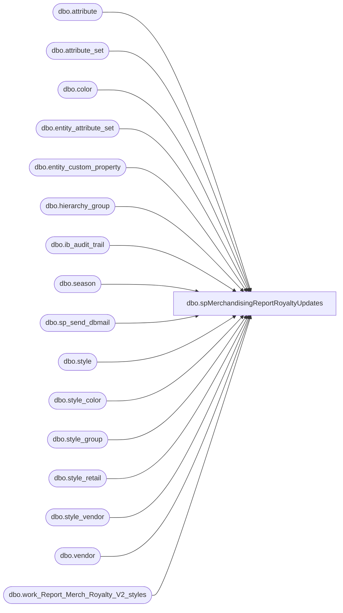

# dbo.spMerchandisingReportRoyaltyUpdates

**Database:** me_01  
**Server:** bedrockdb02  

## Architecture Diagram



## Table Dependencies

| Referenced Table |
|---|
| dbo.attribute |
| dbo.attribute_set |
| dbo.color |
| dbo.entity_attribute_set |
| dbo.entity_custom_property |
| dbo.hierarchy_group |
| dbo.ib_audit_trail |
| dbo.season |
| dbo.sp_send_dbmail |
| dbo.style |
| dbo.style_color |
| dbo.style_group |
| dbo.style_retail |
| dbo.style_vendor |
| dbo.vendor |
| dbo.work_Report_Merch_Royalty_V2_styles |

## Stored Procedure Code

```sql
CREATE proc [dbo].[spMerchandisingReportRoyaltyUpdates]

as

-- =====================================================================================================
-- Name: spMerchandisingReportRoyaltyUpdates
--
-- Description:	Sends emails with styles with updates made to royalty attribute
--
-- Input:	NA
--
-- Output: 
--
-- Dependencies: NA
--				 
-- Revision History
--		Name:			Date:			Comments:
--		Dan Tweedie		02/18/2013	 	Created proc.	
--		Dan Tweedie		11/24/2014		Added factory_code
--		Dan Tweedie		01/16/2015		Since Hierarchy no longer determines country, we store this as a style attribute. I added logic to reference this instead of R-B-D, R-B-U, etc for country
--		Dan Tweedie		05/12/2015		Changed implicit joins to explicit 
--		Keith Lee		07/18/2016		Added FOB Royalty (7000006) to attribute set as per Lisa W.
--		Lizzy Timm		04/24/2019		Altered proc to remove Donna Robinson (donnar@buildabear.com) from email recepients
-- =====================================================================================================

set nocount on

IF (Object_ID('tempdb..#attribute') IS NOT NULL) DROP TABLE #attribute
select s.style_code, att.attribute_set_code
into #attribute
from style s (nolock)
join entity_attribute_set eas (nolock) on s.style_id = eas.parent_id
join attribute_set att (nolock) on eas.attribute_set_id = att.attribute_set_id
join attribute a (nolock) on att.attribute_id = a.attribute_id and a.parent_type = 1
where a.attribute_code = 'AVAILB'
order by s.style_code

--- STEP ONE WAS Originally coded in DTS on Beehive as Report_Merch_Royalty_V2
--Output a file and send email for all new styles which have a royalty attibute
--BEGIN STEP ONE

IF (Object_ID('tempdb..#fact') IS NOT NULL) DROP TABLE #fact
select s.style_code, att.attribute_set_code Factory_Code
into #fact
from style s (nolock)
join style_group sg (nolock) on s.style_id = sg.style_id
join hierarchy_group hg (nolock) on sg.hierarchy_group_id = hg.hierarchy_group_id
join entity_attribute_set eas (nolock) on s.style_id = eas.parent_id
join attribute_set att (nolock) on eas.attribute_set_id = att.attribute_set_id
join attribute a (nolock) on att.attribute_id = a.attribute_id and a.parent_type = 1
where a.attribute_code = ('FACTRY')
order by style_code, a.attribute_code

		
IF (Object_ID('tempdb..##roayalyReport') IS NOT NULL) DROP TABLE ##roayalyReport
select 	s.short_desc as "Style DESC",
	s.style_code as "STYLE Code",
	hg.hierarchy_group_code as "Sub Class",
	hg2.hierarchy_group_label as "Class Label",
	hg.hierarchy_group_label as "Sub Class Label",
	v.vendor_code as "Vendor Code",
	c.color_code as "Color Code",
	se.season_code as "Season Code",
	'$' + cast (sv.current_cost as varchar(10)) as "Cost (USD)",
	case when s.style_code in (select style_code from #attribute where attribute_set_code = 'UK')
	then
		'€' + cast (sre.original_selling_retail  as varchar(10)) 
	else ''
	end as "EURO",
	case when s.style_code in (select style_code from #attribute where attribute_set_code = 'UK')
	then
	'£' + cast (sru.original_selling_retail as varchar(10))--as "Retail w/ VAT",		
	when s.style_code in (select style_code from #attribute where attribute_set_code = 'CA')
	then
		'$' + cast (src.original_selling_retail as varchar(10)) 
	else	
		'$' + cast (sr.original_selling_retail as varchar(10)) 
	end "Retail (w/ VAT)",
	s.distribution_multiple as "ICASE",
	s.order_multiple as "OCASE",
	att.attribute_set_label as "WEB",
	isnull(ecpi.custom_property_value,'TBD') as "IN DATE",
	isnull(ecpo.custom_property_value,'TBD') as "OUT DATE",
	att_royalty.attribute_set_label as "LICENSE",
	f.factory_code
into ##roayalyReport
from style s with (nolock)
join style_group sg with (nolock) on s.style_id = sg.style_id
join style_vendor sv with (nolock) on s.style_id = sv.style_id
join style_color sc with (nolock) on s.style_id = sc.style_id
	and sc.reorder_flag = 1
join style_retail sr with (nolock) on s.style_id = sr.style_id
	and sr.jurisdiction_id = 1
join style_retail sru with (nolock) on s.style_id = sru.style_id
	and sru.jurisdiction_id = 2
join style_retail src with (nolock) on s.style_id = src.style_id
	and src.jurisdiction_id = 3
join style_retail sre with (nolock) on s.style_id = sre.style_id
	and sre.jurisdiction_id = 4
join color c with (nolock) on sc.color_id = c.color_id
join vendor v with (nolock) on sv.vendor_id = v.vendor_id
	and sv.primary_vendor_flag = 1
join season se with (nolock) on s.season_id = se.season_id
join hierarchy_group hg with (nolock) on sg.hierarchy_group_id = hg.hierarchy_group_id
join hierarchy_group hg2 with (nolock) on hg.parent_group_id = hg2.hierarchy_group_id
join hierarchy_group hg3 with (nolock) on hg2.parent_group_id = hg3.hierarchy_group_id
	and hg3.hierarchy_level_id = 10000005
join entity_attribute_set eas with (nolock) on s.style_id = eas.parent_id
join attribute_set att with (nolock) on eas.attribute_set_id = att.attribute_set_id
	and att.attribute_id = 104
left join entity_custom_property ecpi with (nolock) on s.style_id = ecpi.parent_id
	and	ecpi.custom_property_id = 5
	and	ecpi.parent_type = 1
left join entity_custom_property ecpo with (nolock) on s.style_id = ecpo.parent_id
	and	ecpo.custom_property_id = 6
	and	ecpo.parent_type = 1
join entity_attribute_set eas_royalty with (nolock) on s.style_id = eas_royalty.parent_id
	and eas_royalty.attribute_set_id in (7000003, 7000005, 7000006)
join attribute_set att_royalty with (nolock) on eas_royalty.attribute_set_id = att_royalty.attribute_set_id
join #fact f with (nolock) on s.style_code = f.style_code
where (substring(hg.hierarchy_group_code,7,2) <> '60' and substring(hg.hierarchy_group_code,7,2) <> '47' )
and s.style_code not in (select style_code from work_Report_Merch_Royalty_V2_styles)
order by hg3.hierarchy_group_code, s.style_code


if (select count(*) from ##roayalyReport) > 0

begin
	declare @query varchar(1000),
		@date varchar(200),
		@file_name varchar(100),
		@file_location varchar(100),
		@server varchar(20),
		@database varchar(20),
		@sqlcmd varchar(1000),
		@query_text varchar(1000),
		@file varchar(1000),
		@body varchar(1000),
		@subj varchar(1000)

		select @query_text = 'set nocount on select * from ##roayalyReport order by 2'
		set @date = convert(varchar, datepart(yyyy, getdate())) + '-' + convert(varchar, datepart(mm, getdate())) + '-' + convert(varchar, datepart(dd, getdate())) 
		set @query = @query_text
		set @file_location = '\\kermode\FileRepository\MERCHANDISING\DBCompare\'  
		set @file_name = 'MerchReportRoyalty' + @date + '.csv'
		set @server = 'bedrockdb02'
		set @database = 'me_01'
		set @sqlcmd = 'sqlcmd -S' + @server + ' -d' + @database + ' -Q' + '"' + @query + '"' + ' -o' + '"' + @file_location + @file_name + '"' + ' -s"," -w1000 -W'
		exec master..xp_cmdshell @sqlcmd

		select @file = @file_location + @file_name
		select @body = 'If you have any problems with this report, please contact EntSysSupport@buildabear.com'
		select @subj = 'Merchandising New Royalty Styles Weekly Report'

		exec msdb.dbo.sp_send_dbmail
		@profile_name = 'merchadmin',
		@recipients = 'MitziJ@buildabear.com;EmilyT@buildabear.com;LindsayM@buildabear.com;HelenH@buildabear.com;physicalinventory@buildabear.com;jessicar@buildabear.com;MeredithO@buildabear.com;chadv@buildabear.com;mistyj@buildabear.com;tonyas@buildabear.com', 
		@body = @body,
		@subject = @subj,
		@file_attachments = @file
		--@body_format = 'HTML'

	end

--rebuild the reference table with all of the styles with a royalty attribute
truncate table work_Report_Merch_Royalty_V2_styles

insert into	work_Report_Merch_Royalty_V2_styles
select s.style_code
from style s with (nolock)
join style_group sg with (nolock) on s.style_id = sg.style_id
join style_vendor sv with (nolock) on s.style_id = sv.style_id
join style_color sc with (nolock) on s.style_id = sc.style_id
	and sc.reorder_flag = 1
join style_retail sr with (nolock) on s.style_id = sr.style_id
	and	sr.jurisdiction_id = 1
join style_retail sru with (nolock) on s.style_id = sru.style_id
	and	sru.jurisdiction_id = 2
join style_retail src with (nolock) on s.style_id = src.style_id
	and	src.jurisdiction_id = 3
join style_retail sre with (nolock) on s.style_id = sre.style_id
	and	sre.jurisdiction_id = 4
join color c with (nolock) on sc.color_id = c.color_id
join vendor v with (nolock) on sv.vendor_id = v.vendor_id
	and sv.primary_vendor_flag = 1
join season se with (nolock) on s.season_id = se.season_id
join hierarchy_group hg with (nolock) on sg.hierarchy_group_id = hg.hierarchy_group_id
join hierarchy_group hg2 with (nolock) on hg.parent_group_id = hg2.hierarchy_group_id
join hierarchy_group hg3 with (nolock) on hg2.parent_group_id = hg3.hierarchy_group_id
	and hg3.hierarchy_level_id = 10000005
join entity_attribute_set eas with (nolock) on s.style_id = eas.parent_id
join attribute_set att with (nolock) on eas.attribute_set_id = att.attribute_set_id
	and att.attribute_id = 104
left join entity_custom_property ecpi with (nolock) on s.style_id = ecpi.parent_id
	and	ecpi.custom_property_id = 5
	and	ecpi.parent_type = 1
left join entity_custom_property ecpo with (nolock) on s.style_id = ecpo.parent_id
	and	ecpo.custom_property_id = 6
	and	ecpo.parent_type = 1
join entity_attribute_set eas_royalty with (nolock) on s.style_id = eas_royalty.parent_id
	and eas_royalty.attribute_set_id in (7000003, 7000005, 7000006)
join attribute_set att_royalty with (nolock) on eas_royalty.attribute_set_id = att_royalty.attribute_set_id
where (substring(hg.hierarchy_group_code,7,2) <> '60' and substring(hg.hierarchy_group_code,7,2) <> '47' ) --DanT 1/16/2015
order by hg3.hierarchy_group_code, s.style_code
--END STEP ONE
---------------------------------------------------------------------------------------------------
---BEGIN STEP TWO - New Request by Sara Cole to show styles created more than 7 days ago, but have a change Yes/No added to LICEN attribute
IF (Object_ID('tempdb..##royaltyNew') IS NOT NULL) DROP TABLE ##royaltyNew
select distinct iat.application_identifier style_code,
iat.application_level attribute_code,
iat.application_key, convert(varchar, iat.entry_date, 101) Attribute_date
INTO ##royaltyNew
from ib_audit_trail iat (nolock)
join style s (nolock) on iat.application_identifier = s.style_code
where iat.application = 'PROD'
and iat.field_affected = 'style attribute'
and iat.application_level = 'licen'
and datediff(dd, iat.entry_date, getdate()) <= 7
and datediff(dd, s.create_date, getdate()) > 7
order by iat.application_identifier, convert(varchar, iat.entry_date, 101)

if (select count(*) from ##royaltyNew) > 0

	begin
	declare @2query varchar(1000),
		@2date varchar(200),
		@2file_name varchar(100),
		@2file_location varchar(100),
		@2server varchar(20),
		@2database varchar(20),
		@2sqlcmd varchar(1000),
		@2query_text varchar(1000),
		@2file varchar(1000),
		@2body varchar(1000),
		@2subj varchar(1000)

		select @2query_text = 'set nocount on select * from ##royaltyNew order by style_code'
		set @2date = convert(varchar, datepart(yyyy, getdate())) + '-' + convert(varchar, datepart(mm, getdate())) + '-' + convert(varchar, datepart(dd, getdate())) 
		set @2query = @2query_text
		set @2file_location = '\\kermode\FileRepository\MERCHANDISING\DBCompare\'  
		set @2file_name = 'RoyaltyAttributeUpdate' + @2date + '.csv'
		set @2server = 'bedrockdb02'
		set @2database = 'me_01'
		set @2sqlcmd = 'sqlcmd -S' + @2server + ' -d' + @2database + ' -Q' + '"' + @2query + '"' + ' -o' + '"' + @2file_location + @2file_name + '"' + ' -s"," -w1000 -W'
		exec master..xp_cmdshell @2sqlcmd

		select @2file = @2file_location + @2file_name
		select @2body = 'The attached report shows styles which were created more than 7 days ago and had the LICEN royalty attribute updated within the past 7 days.'
		select @2subj = 'Royalty/LICEN Attribute Updates'

		exec msdb.dbo.sp_send_dbmail
		@profile_name = 'merchadmin',
		@recipients = 'physicalinventory@buildabear.com;', 
		@body = @2body,
		@subject = @2subj,
		@file_attachments = @2file

	end

--END STEP TWO
```

