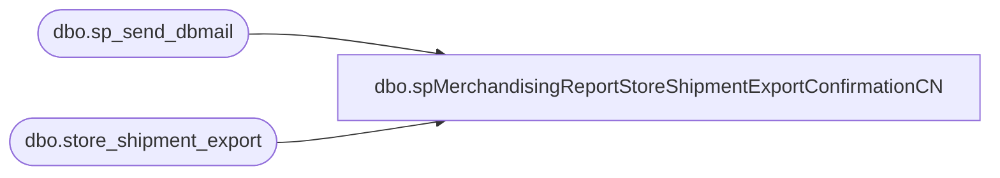

# dbo.spMerchandisingReportStoreShipmentExportConfirmationCN

**Database:** me_01  
**Server:** bedrockdb02  

## Architecture Diagram



## Table Dependencies

| Referenced Table |
|---|
| dbo.sp_send_dbmail |
| dbo.store_shipment_export |

## Stored Procedure Code

```sql
CREATE proc [dbo].[spMerchandisingReportStoreShipmentExportConfirmationCN]

as 

-- =====================================================================================================
-- Name: spMerchandisingReportStoreShipmentExportConfirmationCN
--
--				 
-- Revision History
--		Name:			Date:			Comments: This Proc replaces existing DTS pkg on Beehive called Report_Warehouse_Store_Shipment_Confirmation_V1
--		Dan Tweedie 	03/31/2016		Created proc.	
--		Tim Callahan	06/02/2016		Added Expected_Ship_Date Field to Report for Reference 
--		Tim Callahan	06/08/2016		Added TamiB as a recipient to the Report E-mail 
--		Tim Callahan	05/22/2018		Added Icn Chen as recipient, moved MerchAdmin to CC line, removed CorieB
--		Tim Callahan	06/08/2018		Added 8502 and 8505 warehouses to job logic
--		Tim Callahan	01/29/2019		Modified report to use Kerry term "DSO" for shipment number and add distribution number field to report as well
-- =====================================================================================================

set nocount on

IF (Object_ID('tempdb..##CNExport') IS NOT NULL) DROP TABLE ##CNExport
select	
		document_number as "DSO",
		distribution_number as "Dynamics or Aptos Document Number",
		warehouse as "Warehouse",
		location_code as "Store Number",
		rec_type as "REC TYPE",
		rec_label as "REC Label",
		style_code as "Style Code",
		quantity as "Quantity",
		expected_ship_date as "Expected Ship Date"
into ##CNExport
from	store_shipment_export 
where	warehouse in ('3970','3980','8502','8505')
and exported is null

if (select count(*) from ##CNExport) > 0

begin
	DECLARE @1query VARCHAR(1000)
		,@1file_name VARCHAR(100)
		,@1file_location VARCHAR(100)
		,@1server VARCHAR(20)
		,@1database VARCHAR(20)
		,@1sqlcmd VARCHAR(1000)
		,@1query_text VARCHAR(1000)
		,@1file VARCHAR(1000)
		,@1body VARCHAR(1000)
		,@1subj VARCHAR(1000)
		,@date varchar(14)
		,@attach varchar(152)

	select @date = replace(replace(replace(convert(varchar, getdate(), 120), '-', ''), ':', ''), ' ', '')
	SELECT @1query_text = 'set nocount on select * from ##CNExport'

	SET @1query = @1query_text
	SET @1file_location = '\\kermode\FileRepository\MERCHANDISING\CN_Distro\OUTBOUND\StoreShipmentConfirmation\'
	SET @1file_name = 'CN_store_shipments.' + @date + '.csv'
	SET @1server = 'bedrockdb02'
	SET @1database = 'me_01'
	SET @1sqlcmd = 'sqlcmd -S' + @1server + ' -d' + @1database + ' -Q' + '"' + @1query + '"' + ' -o' + '"' + @1file_location + @1file_name + '"' + ' -s"," -w1000 -W'

	EXEC master..xp_cmdshell @1sqlcmd

	select @attach = @1file_location + @1file_name

	EXEC msdb.dbo.sp_send_dbmail 
		@profile_name = 'MerchAdmin',
		@recipients= 'BABit@oceaneast-logistics.com;yujia.zhang@oceaneast-logistics.com;jasonlu@buildabear.com;vickyw@buildabear.com',
		@body = 'If you have any problems with this report, please contact EntSysSupport@buildabear.com',
		@subject = 'CN Store Shipment Confirmation',
		@file_attachments = @attach --'\\kermode\FileRepository\MERCHANDISING\CN_Distro\OUTBOUND\StoreShipmentConfirmation\CN_store_shipments.csv'

	update store_shipment_export 
	set exported = 1 
	where exported is null
	and warehouse in ('3970','3980','8502','8505')
	
	exec master..xp_cmdshell 'move \\kermode\FileRepository\MERCHANDISING\CN_Distro\OUTBOUND\StoreShipmentConfirmation\*.csv \\kermode\FileRepository\MERCHANDISING\CN_DISTRO\OUTBOUND\StoreShipmentConfirmation\done'

end
```

