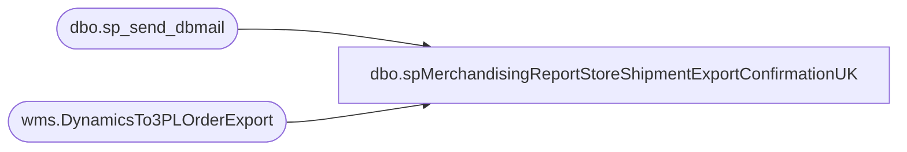

# dbo.spMerchandisingReportStoreShipmentExportConfirmationUK

**Database:** me_01  
**Server:** bedrockdb02  

## Architecture Diagram



## Table Dependencies

| Referenced Table |
|---|
| dbo.sp_send_dbmail |
| wms.DynamicsTo3PLOrderExport |

## Stored Procedure Code

```sql
CREATE proc [dbo].[spMerchandisingReportStoreShipmentExportConfirmationUK]

as 

-- =====================================================================================================
-- Name: spMerchandisingReportStoreShipmentExportConfirmationUK
--
--				 
-- Revision History
--		Name:			Date:			Comments: This Proc replaces existing DTS pkg on Beehive called Report_Warehouse_Store_Shipment_Confirmation_V1
--		Dan Tweedie 	    03/20/2015		Created proc.	
--		Tim Callahan		08/08/2018		Updated proc to include distribution number field to help users cross reference as Clipper doesn't use this number
--											Added Eric Donald to recipients, removed CorieB  
--		Tim Callahan		2022-08-02		Updated Proc to point to new source table with integration of 3PW to Dynamics 
--		Tim Callahan		2022-08-04		Updated proc to leverage a new field on source data table and to update as exported after email send. 
-- =====================================================================================================

set nocount on

IF (Object_ID('tempdb..##ukExport') IS NOT NULL) DROP TABLE ##ukExport
--select	
--		document_number as "Store Shipment Number",
--		distribution_number as "Aptos or D365 Document Number",
--		location_code as "Store Number",
--		rec_type as "REC TYPE",
--		rec_label as "REC Label",
--		style_code as "Style Code",
--		quantity as "Quantity"
--into ##ukExport
--from	store_shipment_export 
--where	warehouse = '2970' 
--and exported is null
select document_number as "Store Shipment Number", 
distribution_number as "Aptos or D365 Document Number",
destid as "Store Number", 
rec_type as "REC Type", 
[message] as "REC Label", 
style_code as "Style Code", 
quantity as "Quantity"
--, ExportDate
into ##ukExport
from [stl-ssis-p-01].[IntegrationStaging].wms.DynamicsTo3PLOrderExport
where sourceid = '2970'
and SummaryReportExported is NULL
and ExportDate is not null 
order by 1


if (select count(*) from ##ukExport) > 0

begin
	DECLARE @1query VARCHAR(1000)
		,@1file_name VARCHAR(100)
		,@1file_location VARCHAR(100)
		,@1server VARCHAR(20)
		,@1database VARCHAR(20)
		,@1sqlcmd VARCHAR(1000)
		,@1query_text VARCHAR(1000)
		,@1file VARCHAR(1000)
		,@1body VARCHAR(1000)
		,@1subj VARCHAR(1000)

	SELECT @1query_text = 'set nocount on select * from ##ukExport'

	SET @1query = @1query_text
	SET @1file_location = '\\kermode\FileRepository\MERCHANDISING\UK_Distro\OUTBOUND\StoreShipmentConfirmation\'
	SET @1file_name = 'UK_store_shipments.csv'
	SET @1server = 'bedrockdb02'
	SET @1database = 'me_01'
	SET @1sqlcmd = 'sqlcmd -S' + @1server + ' -d' + @1database + ' -Q' + '"' + @1query + '"' + ' -o' + '"' + @1file_location + @1file_name + '"' + ' -s"," -w1000 -W'

	EXEC master..xp_cmdshell @1sqlcmd

	EXEC msdb.dbo.sp_send_dbmail 
		@profile_name = 'MerchAdmin',
		@recipients= 'UKlogistics@buildabear.com;EricD@buildabear.com',
		@blind_copy_recipients = 'TimC@buildabear.com', 		
		@body = 'If you have any problems with this report, please contact EntSysSupport@buildabear.com',
		@subject = 'UK Store Shipment Confirmation',
		@file_attachments ='\\kermode\FileRepository\MERCHANDISING\UK_Distro\OUTBOUND\StoreShipmentConfirmation\UK_store_shipments.csv'

	--update store_shipment_export 
	--set exported = 1 
	--where exported is null
	--and warehouse = '2970'

	UPDATE [stl-ssis-p-01].[IntegrationStaging].wms.DynamicsTo3PLOrderExport
	Set SummaryReportExported = getdate()
	where SummaryReportExported is null 
	and sourceid = '2970'
	
end
```

