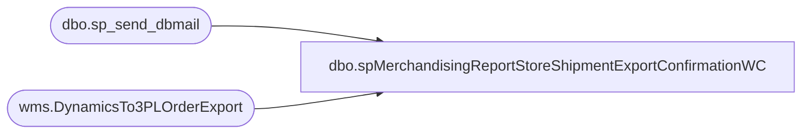

# dbo.spMerchandisingReportStoreShipmentExportConfirmationWC

**Database:** me_01  
**Server:** bedrockdb02  

## Architecture Diagram



## Table Dependencies

| Referenced Table |
|---|
| dbo.sp_send_dbmail |
| wms.DynamicsTo3PLOrderExport |

## Stored Procedure Code

```sql
CREATE proc [dbo].[spMerchandisingReportStoreShipmentExportConfirmationWC]

as 

-- =====================================================================================================
-- Name: spMerchandisingReportStoreShipmentExportConfirmationWC
--
--				 
-- Revision History
--		Name:			Date:			Comments: This Proc replaces existing DTS pkg on Beehive called Report_Warehouse_WC_Store_Shipment_Confirmation_V1
--		Dan Tweedie 	    03/20/2015		Created proc.	
--		Tim Callahan		2022-08-02		Updated Proc to point to new source table with integration of 3PW to Dynamics 
--		Tim Callahan		2022-08-04		Updated proc to leverage a new field on source data table and to update as exported after email send. 
-- =====================================================================================================

set nocount on

IF (Object_ID('tempdb..##WCExport') IS NOT NULL) DROP TABLE ##WCExport
--select	left(document_number,10) as "Store Shipment Number",
--		location_code as "Store Number",
--		rec_type as "REC TYPE",
--		rec_label as "REC Label",
--		sum(quantity) as "Quantity"
--into ##WCExport
--from	store_shipment_export 
--where	warehouse = '0960'
--and exported is null
--group by document_number, location_code, rec_type, rec_label
select	left(document_number,10) as "Store Shipment Number",
		destid as "Store Number",
		rec_type as "REC TYPE",
		[message] as "REC Label",
		sum(quantity) as "Quantity"
		--,ExportDate
into ##WCExport
from	[stl-ssis-p-01].[IntegrationStaging].wms.DynamicsTo3PLOrderExport
where	sourceid = '0960'
and SummaryReportExported is NULL
and ExportDate is not null 
group by document_number, destid, rec_type, [message], ExportDAte 


if (select count(*) from ##WCExport) > 0

begin
	DECLARE @1query VARCHAR(1000)
		,@1file_name VARCHAR(100)
		,@1file_location VARCHAR(100)
		,@1server VARCHAR(20)
		,@1database VARCHAR(20)
		,@1sqlcmd VARCHAR(1000)
		,@1query_text VARCHAR(1000)
		,@1file VARCHAR(1000)
		,@1body VARCHAR(1000)
		,@1subj VARCHAR(1000)

	SELECT @1query_text = 'set nocount on select * from ##WCExport'

	SET @1query = @1query_text
	SET @1file_location = '\\kermode\FileRepository\MERCHANDISING\WC_Distro\OUTBOUND\StoreShipmentConfirmation\'
	SET @1file_name = 'WC_store_shipments.csv'
	SET @1server = 'bedrockdb02'
	SET @1database = 'me_01'
	SET @1sqlcmd = 'sqlcmd -S' + @1server + ' -d' + @1database + ' -Q' + '"' + @1query + '"' + ' -o' + '"' + @1file_location + @1file_name + '"' + ' -s"," -w1000 -W'

	EXEC master..xp_cmdshell @1sqlcmd

	EXEC msdb.dbo.sp_send_dbmail 
		@profile_name = 'MerchAdmin',
		@recipients= 'wcdclogistics@buildabear.com;DistroBears@buildabear.com',
	--	@blind_copy_recipients = 'TimC@buildabear.com', 		
		@body = 'If you have any problems with this report, please contact EntSysSupport@buildabear.com',
		@subject = 'WC Store Shipment Confirmation',
		@file_attachments ='\\kermode\FileRepository\MERCHANDISING\WC_Distro\OUTBOUND\StoreShipmentConfirmation\WC_store_shipments.csv'
	
	--Remarked out old update statement on 8/4/2022
	--update store_shipment_export 
	--set exported = 1 
	--where exported is null
	--and warehouse = '0960'


	UPDATE [stl-ssis-p-01].[IntegrationStaging].wms.DynamicsTo3PLOrderExport
	Set SummaryReportExported = getdate()
	where SummaryReportExported is null 
	and sourceid = '0960'


end
```

