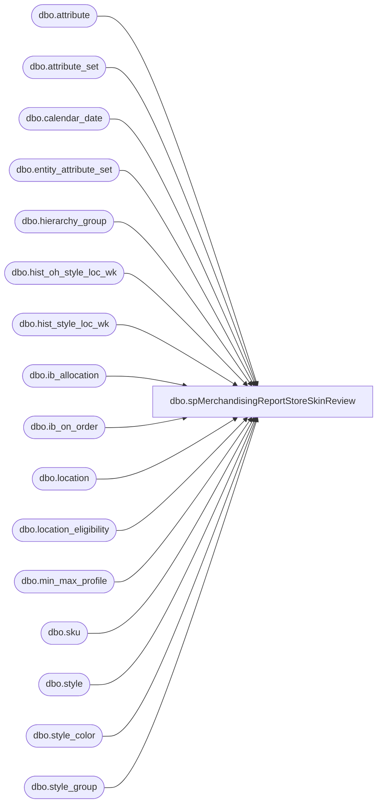

# dbo.spMerchandisingReportStoreSkinReview

**Database:** me_01  
**Server:** bedrockdb02  

## Architecture Diagram



## Table Dependencies

| Referenced Table |
|---|
| dbo.attribute |
| dbo.attribute_set |
| dbo.calendar_date |
| dbo.entity_attribute_set |
| dbo.hierarchy_group |
| dbo.hist_oh_style_loc_wk |
| dbo.hist_style_loc_wk |
| dbo.ib_allocation |
| dbo.ib_on_order |
| dbo.location |
| dbo.location_eligibility |
| dbo.min_max_profile |
| dbo.sku |
| dbo.style |
| dbo.style_color |
| dbo.style_group |

## Stored Procedure Code

```sql
-- =============================================
-- Author:		Keith Lee
-- Create date: 12/18/2017
-- Description:	<Description,,>
-- =============================================
CREATE PROCEDURE [dbo].[spMerchandisingReportStoreSkinReview]

AS
BEGIN
	-- SET NOCOUNT ON added to prevent extra result sets from
	-- interfering with SELECT statements.
	SET NOCOUNT ON;
		
			declare @current_week varchar(6)
			declare @1_week varchar(6)
			declare @2_week varchar(6)
			declare @3_week varchar(6)
			declare @4_week varchar(6)

			set @current_week = (select cast(merch_year as varchar(4)) + right('00' + cast(merch_week as varchar(2)),2) from calendar_date where 
					convert(varchar, calendar_date, 101)= convert(varchar, getdate(), 101))
			set @1_week = (select cast(merch_year as varchar(4)) + right('00' + cast(merch_week as varchar(2)),2) from calendar_date where 
					convert(varchar, calendar_date, 101)= convert(varchar, getdate()-7, 101))
			set @2_week = (select cast(merch_year as varchar(4)) + right('00' + cast(merch_week as varchar(2)),2) from calendar_date where 
					convert(varchar, calendar_date, 101)= convert(varchar, getdate()-14, 101))
			set @3_week = (select cast(merch_year as varchar(4)) + right('00' + cast(merch_week as varchar(2)),2) from calendar_date where 
					convert(varchar, calendar_date, 101)= convert(varchar, getdate()-21, 101))
			set @4_week = (select cast(merch_year as varchar(4)) + right('00' + cast(merch_week as varchar(2)),2) from calendar_date where 
					convert(varchar, calendar_date, 101)= convert(varchar, getdate()-28, 101))


			-- Gather locations
			select	location_id, location_code, location_name
			into	#locations
			from	location 
			where	active_flag = 1 
			and		location_type = 2
			and		location_code < '2500'


			--- Gather skin styles
			select	s.style_id,
					s.style_code,
					s.short_desc,
					s.distribution_multiple,
					hg_c.hierarchy_group_code as class,
					hg_c.hierarchy_group_label as class_label, 
					hg_sc.hierarchy_group_code as sub_class,
					hg_sc.hierarchy_group_label as sub_class_label,
					hg_d.hierarchy_group_code as department,
					hg_d.hierarchy_group_label as deparment_label
			into	#styles
			from	style s
			join	style_group sg on s.style_id = sg.style_id
			join	hierarchy_group hg_sc on sg.hierarchy_group_id = hg_sc.hierarchy_group_id
			join	hierarchy_group hg_c on hg_sc.parent_group_id = hg_c.hierarchy_group_id
			join	hierarchy_group hg_d on hg_c.parent_group_id = hg_d.hierarchy_group_id
			where	right(hg_d.hierarchy_group_code,2) = '02'
			and		s.active_flag = 1
			order by s.style_code


			--- Gather top 20 skin sales

			;WITH cte
			AS (
			select	l.location_code,
					s.style_code,
					sum((hslw.sales_total_units-hslw.return_units)) as this_week
					,ROW_NUMBER() OVER (
						PARTITION BY l.location_code ORDER BY (sum((hslw.sales_total_units-hslw.return_units))) DESC
					) as rownumber

			from	ma_01.dbo.hist_style_loc_wk hslw
			join	#locations l on hslw.location_id = l.location_id
			join	#styles s on hslw.style_id = s.style_id
			where	hslw.merch_year_wk = @1_week
			group by l.location_code, s.style_code
			--order by 1,3 desc

			)

			SELECT	c.location_code,c.style_code, c.this_week
			into	#top_20_sales
			FROM	cte c
			where	rownumber <=20


			-- Sales units
			select	l.location_code,
					s.style_code,
			--		t20s.this_week,
					sum((hslw.sales_total_units-hslw.return_units) * (1 - abs (sign (hslw.merch_year_wk - @current_week)))) as this_week,
					sum((hslw.sales_total_units-hslw.return_units) * (1 - abs (sign (hslw.merch_year_wk - @1_week)))) as one_week,
					sum((hslw.sales_total_units-hslw.return_units) * (1 - abs (sign (hslw.merch_year_wk - @2_week)))) as two_week,
					sum((hslw.sales_total_units-hslw.return_units) * (1 - abs (sign (hslw.merch_year_wk - @3_week)))) as three_week,
					sum((hslw.sales_total_units-hslw.return_units) * (1 - abs (sign (hslw.merch_year_wk - @4_week)))) as four_week
			into	#sales
			from	ma_01.dbo.hist_style_loc_wk hslw
			join	#locations l on hslw.location_id = l.location_id
			join	#styles s on hslw.style_id = s.style_id
			join	#top_20_sales t20s on l.location_code = t20s.location_code and s.style_code = t20s.style_code
			group by l.location_code, s.style_code, t20s.this_week
			order by 1,2


			--- Get on hand units
			select	l.location_code,
					s.style_code,
					SUM(hoslw.on_hand_units) as "total_on_hand_units",
					SUM((hoslw.on_hand_units) * (1 - abs (sign (inventory_status_id -1)))) as "available_units",
					SUM((hoslw.on_hand_units) * (1 - abs (sign (inventory_status_id -2)))) as "in_transit_units",
					SUM((hoslw.on_hand_units) * (1 - abs (sign (inventory_status_id -7)))) as "pending_shink_units"
			into	#on_hand
			from	ma_01.dbo.hist_oh_style_loc_wk hoslw
			join	location l on hoslw.location_id = l.location_id
			join	#styles s on hoslw.style_id = s.style_id
			where	hoslw.merch_year_wk = @current_week
			group by l.location_code,
					s.style_code
			order by l.location_code, s.style_code

			-- Get location attributes
			select	l.location_code,
					ats_STRCON.attribute_set_code as "STRCON",
					ats_DLVDAY.attribute_set_code as "DLVDAY",
					ats_DISDAY.attribute_set_code as "DISDAY"
			into	#location_attributes
			from	#locations l
			left join	ma_01.dbo.entity_attribute_set eas_STRCON on l.location_id = eas_STRCON.parent_id and eas_STRCON.attribute_id = 588
			left join	ma_01.dbo.attribute_set ats_STRCON on eas_STRCON.attribute_set_id = ats_STRCON.attribute_set_id
			left join	ma_01.dbo.attribute a_STRCON on ats_STRCON.attribute_id = a_STRCON.attribute_id and a_STRCON.attribute_type = 2
			left join	ma_01.dbo.entity_attribute_set eas_DLVDAY on l.location_id = eas_DLVDAY.parent_id and eas_DLVDAY.attribute_id = 19
			left join	ma_01.dbo.attribute_set ats_DLVDAY on eas_DLVDAY.attribute_set_id = ats_DLVDAY.attribute_set_id
			left join	ma_01.dbo.attribute a_DLVDAY on ats_DLVDAY.attribute_id = a_DLVDAY.attribute_id and a_DLVDAY.attribute_type = 2
			left join	ma_01.dbo.entity_attribute_set eas_DISDAY on l.location_id = eas_DISDAY.parent_id and eas_DISDAY.attribute_id = 18
			left join	ma_01.dbo.attribute_set ats_DISDAY on eas_DISDAY.attribute_set_id = ats_DISDAY.attribute_set_id
			left join	ma_01.dbo.attribute a_DISDAY on ats_DISDAY.attribute_id = a_DISDAY.attribute_id and a_DISDAY.attribute_type = 2
			order by 1


			-- Get style attribute
			select s.style_code,
					ats_MSTAT.attribute_set_code as "MSTAT"
			into	#style_attributes
			from	#styles s
			left join	entity_attribute_set eas_MSTAT on s.style_id = eas_MSTAT.parent_id and eas_MSTAT.attribute_id = 74
			left join	attribute_set ats_MSTAT on eas_MSTAT.attribute_set_id = ats_MSTAT.attribute_set_id
			order by 1

			--- Allocated units
			select	l.location_code,
					s.style_code,
					isnull(sum(ia.allocated_units),0) as allocation_units
			into	#allocations
			from	me_01.dbo.ib_allocation ia with (nolock) 
			join	me_01.dbo.sku sk with (nolock) on ia.sku_id = sk.sku_id
			join	me_01.dbo.style s with (nolock) on sk.style_id = s.style_id
			join	#styles s1 on s.style_code = s1.style_code
			join	me_01.dbo.style_color sc with (nolock) on s.style_id = sc.style_id and sc.reorder_flag = 1
			join	me_01.dbo.location l with (nolock) on ia.location_id = l.location_id
			group by l.location_code, 
					s.style_code, 
					s.long_desc,
					s.distribution_multiple
			order by 2


			-- On order
			--Build full on order table
			select	l.location_code,
					s.style_code,
					receipt_date, 
					sum(on_order_units) as on_order_units
			into	#all_on_order
			from	me_01.dbo.ib_on_order ioo,
					me_01.dbo.sku sk,
					me_01.dbo.style s,
					me_01.dbo.location l
			where	s.style_id = sk.style_id
			and		sk.sku_id = ioo.sku_id
			and		ioo.location_id = l.location_id
			group by s.style_code,l.location_code,receipt_date
			having	sum(on_order_units) >0
			order by 2

			-- Get next receipt date
			select	aoo.location_code,
					aoo.style_code,
					min(aoo.receipt_date) as next_receipt_date
			into	#next_oo_date
			from	#all_on_order aoo
			--where aoo.style_code = '022601'
			group by aoo.location_code,
					aoo.style_code
			order by 3

			-- On Order tables
			select	aoo.location_code,
					aoo.style_code,
					convert(varchar, nod.next_receipt_date,101) as next_receipt_date,
					aoo.on_order_units
			into	#on_order_980
			from	#all_on_order aoo,
					#next_oo_date nod,
					me_01.dbo.style s,
					me_01.dbo.hierarchy_group hg,
					me_01.dbo.style_group sg
			where	aoo.style_code = nod.style_code
			and		nod.style_code = s.style_code
			and		s.style_id = sg.style_id
			and		aoo.location_code = nod.location_code
			and		aoo.receipt_date = nod.next_receipt_date
			and		sg.hierarchy_group_id = hg.hierarchy_group_id
			and		left(hg.hierarchy_group_code,1)  = 'W'
			and		aoo.location_code = '0980'
			order by 2

			select	aoo.location_code,
					aoo.style_code,
					convert(varchar, nod.next_receipt_date,101) as next_receipt_date,
					aoo.on_order_units
			into	#on_order_960
			from	#all_on_order aoo,
					#next_oo_date nod,
					me_01.dbo.style s,
					me_01.dbo.hierarchy_group hg,
					me_01.dbo.style_group sg
			where	aoo.style_code = nod.style_code
			and		nod.style_code = s.style_code
			and		s.style_id = sg.style_id
			and		aoo.location_code = nod.location_code
			and		aoo.receipt_date = nod.next_receipt_date
			and		sg.hierarchy_group_id = hg.hierarchy_group_id
			and		left(hg.hierarchy_group_code,1)  = 'W'
			and		aoo.location_code = '0960'
			order by 2

			select	aoo.location_code,
					aoo.style_code,
					convert(varchar, nod.next_receipt_date,101) as next_receipt_date,
					aoo.on_order_units
			into	#on_order_2970
			from	#all_on_order aoo,
					#next_oo_date nod,
					me_01.dbo.style s,
					me_01.dbo.hierarchy_group hg,
					me_01.dbo.style_group sg
			where	aoo.style_code = nod.style_code
			and		nod.style_code = s.style_code
			and		s.style_id = sg.style_id
			and		aoo.location_code = nod.location_code
			and		aoo.receipt_date = nod.next_receipt_date
			and		sg.hierarchy_group_id = hg.hierarchy_group_id
			and		left(hg.hierarchy_group_code,1)  = 'W'
			and		aoo.location_code = '2970'
			order by 2

			-- Presentation Stock
			select	l.location_code,
					s.style_code,
					mmp.presentation_stock
			into	#presentation_stock
			from	me_01.dbo.min_max_profile mmp
			join	#locations l on mmp.location_id = l.location_id
			join	me_01.dbo.sku sk on mmp.sku_id = sk.sku_id
			join	#styles s on sk.style_id = s.style_id
			order by 1, 2


			-- Eligibility Flag
			select	l.location_code,
					s.style_code,
					le.eligibility_flag
			into	#eligibility_flag
			from	me_01.dbo.location_eligibility le
			join	#locations l on le.location_id = l.location_id
			join	#styles s on le.style_id = s.style_id
			order by 1,2

			--- Display Results 
			 select l.location_code,
					l.location_name,
					s.department,
					s.deparment_label,
					s.class,
					s.class_label,
					s.style_code,
					s.short_desc,
					oh.total_on_hand_units,
					la.STRCON,
					la.DISDAY,
					la.DLVDAY,
					ps.presentation_stock,
					ef.eligibility_flag,
					oh.available_units,
					oh.in_transit_units,
					a.allocation_units,
					isnull(oh.available_units,0) + isnull(oh.in_transit_units,0) + isnull(a.allocation_units,0) as effective_inventory,
					sls.this_week,
					sls.one_week,
					sls.two_week,
					sls.three_week,
					sls.four_week,
			-		
					case when oh.available_units = 0 or sls.one_week = 0
						then 0.00
					else cast(cast(oh.available_units as decimal(10,2))/sls.one_week * -1 as decimal(10,2)) --not sure why result is coming out negative.  Used *-1 for now.
					end as WOS,

					case when (isnull(oh.available_units,0) + isnull(oh.in_transit_units,0) + isnull(a.allocation_units,0)) = 0 or sls.one_week = 0
						then 0.00
					else cast((cast(isnull(oh.available_units,0) as decimal(10,2)) + isnull(oh.in_transit_units,0) + isnull(a.allocation_units,0))/sls.one_week as decimal(10,2))
					end as WOS2,

					s.distribution_multiple as casepack,
					isnull(oh_980.available_units,0) as bh_available,
					isnull(oo_980.on_order_units,0) as bh_oo,
					isnull(oo_980.next_receipt_date,'N/A') as bh_ETA,
					isnull(oh_960.available_units,0) as ddc_available,
					isnull(oo_960.on_order_units,0) as ddc_oo,
					isnull(oo_960.next_receipt_date,'N/A') as ddc_ETA,
					isnull(oh_2970.available_units,0) as clipper_available,
					isnull(oo_2970.on_order_units,0) as clipper_oo,
					isnull(oo_2970.next_receipt_date,'N/A') as clipper_ETA,
					sa.MSTAT
			from	#top_20_sales t20s
			join	#locations l on t20s.location_code = l.location_code
			join	#styles s on t20s.style_code = s.style_code
			left join	#on_hand oh on s.style_code = oh.style_code and l.location_code = oh.location_code

			left join	#on_hand oh_980 on s.style_code = oh_980.style_code and oh_980.location_code = '0980'
			left join	#on_hand oh_960 on s.style_code = oh_960.style_code and oh_960.location_code = '0960'
			left join	#on_hand oh_2970 on s.style_code = oh_2970.style_code and oh_2970.location_code = '2970'

			left join	#sales sls on s.style_code = sls.style_code and l.location_code = sls.location_code
			left join	#allocations a on s.style_code = a.style_code and l.location_code = a.location_code
			left join	#on_order_980 oo_980 on s.style_code = oo_980.style_code
			left join	#on_order_960 oo_960 on s.style_code = oo_960.style_code
			left join	#on_order_2970 oo_2970 on s.style_code = oo_2970.style_code
			left join	#location_attributes la on l.location_code = la.location_code
			left join	#style_attributes sa on s.style_code = sa.style_code
			left join	#presentation_stock ps on s.style_code = ps.style_code and l.location_code = ps.location_code
			left join	#eligibility_flag ef on s.style_code = ef.style_code and l.location_code = ef.location_code
			order by l.location_code, sls.one_week


END
```

