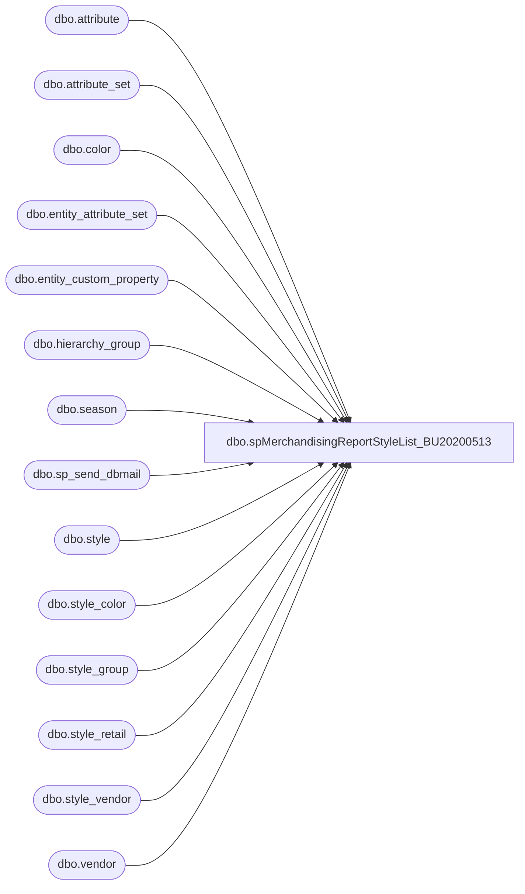

# dbo.spMerchandisingReportStyleList_BU20200513

**Database:** me_01  
**Server:** bedrockdb02  

## Architecture Diagram



## Table Dependencies

| Referenced Table |
|---|
| dbo.attribute |
| dbo.attribute_set |
| dbo.color |
| dbo.entity_attribute_set |
| dbo.entity_custom_property |
| dbo.hierarchy_group |
| dbo.season |
| dbo.sp_send_dbmail |
| dbo.style |
| dbo.style_color |
| dbo.style_group |
| dbo.style_retail |
| dbo.style_vendor |
| dbo.vendor |

## Stored Procedure Code

```sql
CREATE procedure [dbo].[spMerchandisingReportStyleList_BU20200513]
as
set nocount on
-- =====================================================================================================
-- Name: spMerchandisingReportStyleList
--
-- Description: Emails Style List
--
--				 
-- Revision History
--		Name:			Date:			Comments: This Proc replaces DTS pkg on Beehive called Report_Merch_V1
--		Dan Tweedie 	    03/03/2015		Created proc.
--		Keith Lee			10/19/2016		Removed some users from distribution email list and added Devon P.
-- =====================================================================================================

IF (Object_ID('tempdb..#availb') IS NOT null) DROP TABLE #availb
select s.style_code, att.attribute_set_code availb
into #availb
from style s (nolock)
join entity_attribute_set eas (nolock) on s.style_id = eas.parent_id
join attribute_set att (nolock) on eas.attribute_set_id = att.attribute_set_id
join attribute a (nolock) on att.attribute_id = a.attribute_id and a.parent_type = 1
where a.attribute_code = 'AVAILB'
and att.attribute_set_code in ('US', 'CA', 'UK')

IF (Object_ID('tempdb..##MAHITEMP6_XLS') IS NOT null) DROP TABLE ##MAHITEMP6_XLS
SELECT s.short_desc AS "Style DESC"
	,s.style_code AS "STYLE Code"
	,hg.hierarchy_group_code AS "Sub Class"
	,hg2.hierarchy_group_label AS "Class Label"
	,hg.hierarchy_group_label AS "Sub Class Label"
	,v.vendor_code AS "Vendor Code"
	,c.color_code AS "Color Code"
	,se.season_code AS "Season Code"
	,se.season_description AS "Season Description"
	,'$' + cast(sv.current_cost AS VARCHAR(10)) AS "Cost (USD)"
	,CASE 
		WHEN s.style_code in (select style_code from #availb where availb = 'UK')--left(hg3.hierarchy_group_code, 5) = 'R-B-U'
			THEN '€' + cast(sre.original_selling_retail AS VARCHAR(10))
		ELSE ''
		END AS "EURO"
	,CASE 
		WHEN s.style_code in (select style_code from #availb where availb = 'UK')--left(hg3.hierarchy_group_code, 5) = 'R-B-U'
			THEN '£' + cast(sru.original_selling_retail AS VARCHAR(10)) --as "Retail w/ VAT",		
		WHEN s.style_code in (select style_code from #availb where availb = 'CA')--WHEN left(hg3.hierarchy_group_code, 5) = 'R-B-C'
			THEN '$' + cast(src.original_selling_retail AS VARCHAR(10))
		ELSE '$' + cast(sr.original_selling_retail AS VARCHAR(10))
		END "Retail (w/ VAT)"
	,CASE 
		WHEN substring(hg.hierarchy_group_code, 7, 2) = '60'
			THEN ecpf.custom_property_value
		ELSE s.distribution_multiple
		END AS "ICASE"
	,s.order_multiple AS "OCASE"
	,att.attribute_set_label AS "WEB"
	,isnull(ecpi.custom_property_value, 'TBD') AS "IN DATE"
	,isnull(ecpo.custom_property_value, 'TBD') AS "OUT DATE"
	,attr.attribute_set_label AS "LICENSE ATTRIBUTE"
into ##MAHITEMP6_XLS
from style s with (nolock) 
join style_group sg with (nolock) on s.style_id = sg.style_id
join style_vendor sv with (nolock) on s.style_id = sv.style_id
join style_color sc with (nolock) on s.style_id = sc.style_id and sc.reorder_flag = 1
join style_retail sr  with (nolock) on s.style_id = sr.style_id and sr.jurisdiction_id = 1
join style_retail sru  with (nolock) on s.style_id = sru.style_id and sru.jurisdiction_id = 2
join style_retail src  with (nolock) on s.style_id = src.style_id and src.jurisdiction_id = 3
join style_retail sre  with (nolock) on s.style_id = sre.style_id and sre.jurisdiction_id = 4
join color c with (nolock) on sc.color_id = c.color_id
join vendor v  with (nolock) on sv.vendor_id = v.vendor_id and sv.primary_vendor_flag = 1
join season se  with (nolock) on s.season_id = se.season_id
join hierarchy_group hg  with (nolock) on sg.hierarchy_group_id = hg.hierarchy_group_id
join hierarchy_group hg2  with (nolock) on hg.parent_group_id = hg2.hierarchy_group_id
join hierarchy_group hg3  with (nolock) on hg2.parent_group_id = hg3.hierarchy_group_id and hg3.hierarchy_level_id = 10000005
join entity_attribute_set eas  with (nolock) on s.style_id = eas.parent_id
join attribute_set att  with (nolock) on eas.attribute_set_id = att.attribute_set_id and att.attribute_id = 104
left join entity_custom_property ecpi  with (nolock) on s.style_id = ecpi.parent_id and ecpi.custom_property_id = 5 and ecpi.parent_type = 1
left join entity_custom_property ecpo  with (nolock) on s.style_id = ecpo.parent_id and ecpo.custom_property_id = 6 and ecpo.parent_type = 1
left join entity_custom_property ecpf  with (nolock) on s.style_id = ecpf.parent_id and ecpf.custom_property_id = 2 and ecpf.parent_type = 1
join entity_attribute_set easr  with (nolock) on s.style_id = easr.parent_id and easr.attribute_id = 70
join attribute_set attr  with (nolock) on easr.attribute_set_id = attr.attribute_set_id
where (substring(hg3.hierarchy_group_code,7,2) <> '47' and substring(hg3.hierarchy_group_code,1,3)<> 'R-R')
and cast(convert(varchar(10),s.create_date,110)as datetime) between cast(convert(varchar(10),getdate()-8,110)as datetime) and cast(convert(varchar(10),getdate(),110)as datetime) 
order by hg3.hierarchy_group_code, s.style_code


if (select count(*) from ##MAHITEMP6_XLS) > 0

	
BEGIN 

             DECLARE @1query varchar(1000),
                     @1file_name varchar(100),
                     @1file_location varchar(100),
                     @1server varchar(20),
                     @1database varchar(20),
                     @1sqlcmd varchar(1000),
                     @1query_text varchar(1000),
                     @1file varchar(1000),
                     @1body varchar(1000),
                     @1subj varchar(1000)

                     select @1query_text = 'set nocount on select * from ##MAHITEMP6_XLS'
                     set @1query = @1query_text
                     set @1file_location = '\\kermode\FileRepository\MERCHANDISING\DBCompare\'  
                     set @1file_name = 'merch_report.csv'
                     set @1server = 'bedrockdb02'
                     set @1database = 'me_01'
                     set @1sqlcmd = 'sqlcmd -S' + @1server + ' -d' + @1database + ' -Q' + '"' + @1query + '"' + ' -o' + '"' + @1file_location + @1file_name + '"' + ' -s"," -w1000 -W'
                     exec master..xp_cmdshell @1sqlcmd


			EXEC   msdb.dbo.sp_send_dbmail
					@profile_name = 'MerchAdmin',
					@recipients = 'JenniferD@buildabear.com;BQTransfers@buildabear.com;distrobears@buildabear.com;plannerb@buildabear.com;BABWmerch@buildabear.com;uklogistics@buildabear.com;purchasing@buildabear.com;wcdclogistics@buildabear.com;physicalinventory@buildabear.com;shelih@buildabear.com;mistyj@buildabear.com;chadv@buildabear.com;devonp@buildabear.com;lindak@buildabear.com',
					@file_attachments ='\\kermode\FileRepository\MERCHANDISING\DBCompare\merch_report.csv',
					@body = 'If you have any problems with this report, please contact merchadmin@buildabear.com.


Technical Details:
Kermode SQL Agent - MERCHANDISING - Report - Merchandising Style List',
					@subject = 'Merchandising New Styles Weekly Report'
	
END
```

