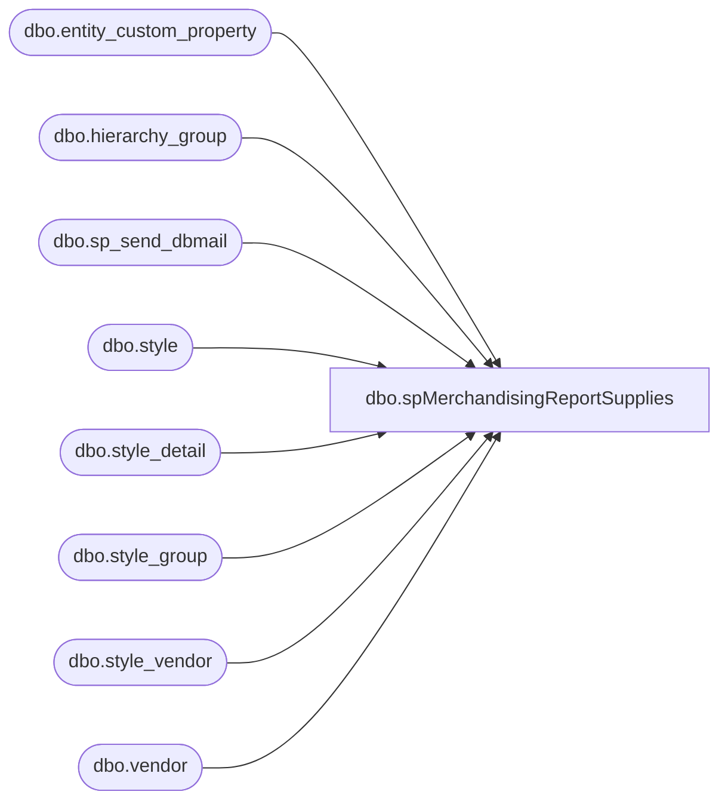

# dbo.spMerchandisingReportSupplies

**Database:** me_01  
**Server:** bedrockdb02  

## Architecture Diagram



## Table Dependencies

| Referenced Table |
|---|
| dbo.entity_custom_property |
| dbo.hierarchy_group |
| dbo.sp_send_dbmail |
| dbo.style |
| dbo.style_detail |
| dbo.style_group |
| dbo.style_vendor |
| dbo.vendor |

## Stored Procedure Code

```sql
CREATE procedure [dbo].[spMerchandisingReportSupplies]
as
set nocount on
-- =====================================================================================================
-- Name: spMerchandisingReportSupplies
--
-- Description: Sends email with suppli data
--
-- Input:	
--
-- Output: 
--
-- Dependencies: 
--				 
-- Revision History
--		Name:			Date:			Comments: This Proc replaces existing DTS pkg on Beehive called Report_Supplies_V1
--		Dan Tweedie 	    03/04/2015		Created proc.	
-- =====================================================================================================


IF (Object_ID('tempdb..##MAHITEMP8_XLS') IS NOT null) DROP TABLE ##MAHITEMP8_XLS
select top 50	s.style_code as "STYLE Code",
	s.short_desc as "Style DESC",
	hg.hierarchy_group_code as "Sub Class",
	hg2.hierarchy_group_label as "Class Label",
	hg.hierarchy_group_label as "Sub Class Label",
	v.vendor_code as "Vendor Code",
	ecp.custom_property_value as "FRCSTM",
	sv.current_cost as "Cost"
	into ##MAHITEMP8_XLS
from	style s (NOLOCK)
	JOIN style_detail sd (NOLOCK) ON s.style_id = sd.style_id
	JOIN style_group sg  (NOLOCK) ON s.style_id = sg.style_id
	JOIN style_vendor sv (NOLOCK) ON s.style_id = sv.style_id and sv.primary_vendor_flag = 1
	JOIN vendor v (NOLOCK) ON sv.vendor_id = v.vendor_id
	JOIN hierarchy_group hg (NOLOCK) ON  sg.hierarchy_group_id = hg.hierarchy_group_id
	JOIN hierarchy_group hg2 (NOLOCK) ON hg.parent_group_id = hg2.hierarchy_group_id
	JOIN hierarchy_group hg3 (NOLOCK) ON hg2.parent_group_id = hg3.hierarchy_group_id and hg3.hierarchy_level_id = 10000005
	LEFT JOIN entity_custom_property ecp (NOLOCK) ON  s.style_id = ecp.parent_id and ecp.custom_property_id = 2 and ecp.parent_type = 1 
where substring(hg3.hierarchy_group_code,7,2) =  '60'
and	cast(convert(varchar(10),s.create_date,110)as datetime) between cast(convert(varchar(10),getdate()-1,110)as datetime)  and cast(convert(varchar(10),getdate(),110)as datetime) 
order by hg3.hierarchy_group_code, s.style_code

if (select count(*) from ##MAHITEMP8_XLS) > 0


BEGIN 

             DECLARE @1query varchar(1000),
                     @1file_name varchar(100),
                     @1file_location varchar(100),
                     @1server varchar(20),
                     @1database varchar(20),
                     @1sqlcmd varchar(1000),
                     @1query_text varchar(1000),
                     @1file varchar(1000),
                     @1body varchar(1000),
                     @1subj varchar(1000)

                     select @1query_text = 'set nocount on select * from ##MAHITEMP8_XLS'
                     set @1query = @1query_text
                     set @1file_location = '\\kermode\FileRepository\MERCHANDISING\DBCompare\'  
                     set @1file_name = 'supplies_report.csv'
                     set @1server = 'bedrockdb02'
                     set @1database = 'me_01'
                     set @1sqlcmd = 'sqlcmd -S' + @1server + ' -d' + @1database + ' -Q' + '"' + @1query + '"' + ' -o' + '"' + @1file_location + @1file_name + '"' + ' -s"," -w1000 -W'
                     exec master..xp_cmdshell @1sqlcmd

			EXEC   msdb.dbo.sp_send_dbmail
					@profile_name = 'MerchAdmin',
					@recipients= 'naomib@buildabear.com;purchasing@buildabear.com;sisim@buildabear.com;LogisticsBears@buildabear.com;UKLogistics@buildabear.com;mikesc@buildabear.com;ohioin@buildabear.com;wcdclogistics@buildabear.com;santiagob@buildabear.com; TaylorRockwell@buildabear.com',
					@file_attachments ='\\kermode\FileRepository\MERCHANDISING\DBCompare\supplies_report.csv',
					@body = 'If you have any problems with this report, please contact EntSysSupport@buildabear.com',
					@subject = 'Supplies New Styles Daily Report'


END
```

