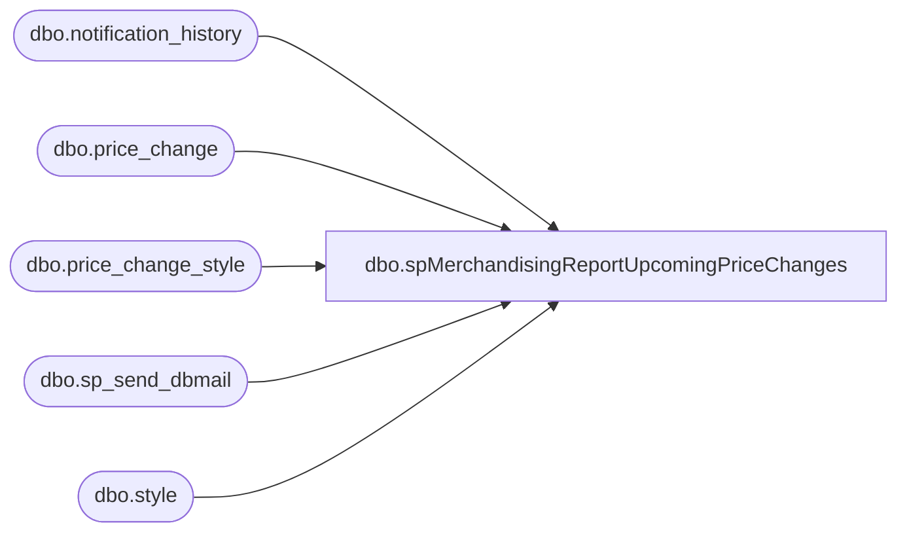

# dbo.spMerchandisingReportUpcomingPriceChanges

**Database:** me_01  
**Server:** bedrockdb02  

## Architecture Diagram



## Table Dependencies

| Referenced Table |
|---|
| dbo.notification_history |
| dbo.price_change |
| dbo.price_change_style |
| dbo.sp_send_dbmail |
| dbo.style |

## Stored Procedure Code

```sql
CREATE procedure [dbo].[spMerchandisingReportUpcomingPriceChanges]
as
set nocount on
-- =====================================================================================================
-- Name: spMerchandisingReportUpcomingPriceChanges
--
-- Description: 
--
-- Input:	
--
-- Output: 
--
-- Dependencies: 
--				 
-- Revision History
--		Name:			Date:			Comments: This Proc is replaces existing DTS pkg on Beehive called Report_Upcoming_Price_Chnges_V1
--		Dan Tweedie 	    03/04/2015		Created proc.	
--		Paul Beckman		10/24/2019		Updated to use notification_history table
-- =====================================================================================================

IF (Object_ID('tempdb..##MAHITEMP9_CSV') IS NOT NULL)DROP TABLE ##MAHITEMP9_CSV

SELECT pc.price_change_no AS "Document #"
	,replace(pc.price_change_description, ',', ' ') AS "Price Change Description"
	,CASE 
		WHEN pc.approval_status IN (
				2
				,0
				)
			THEN 'Approved'
		ELSE 'Pending Approval'
		END AS "Approval Status"
	,CASE 
		WHEN pc.state_no = 1
			THEN 'Preliminary'
		WHEN pc.state_no = 4
			THEN 'Canceled'
		WHEN pc.state_no = 5
			THEN 'Submitted'
		WHEN pc.state_no = 6
			THEN 'Issued'
		WHEN pc.state_no = 7
			THEN 'Effective'
		WHEN pc.state_no = 8
			THEN 'Completed'
		ELSE 'Not Available'
		END AS "Price Change Status"
	,pc.effective_from_date AS "Effective From Date"
	,pc.effective_to_date AS "Effective To Date"
	,pc.issue_date AS "Issue Date"
	,CASE 
		WHEN effective_to_date IS NOT NULL
			THEN 'Promotional'
		ELSE 'Permanent'
		END AS "Price Change Type"
	,pc.create_date
	,CASE 
		WHEN pc.jurisdiction_id = 1
			THEN 'USA'
		WHEN pc.jurisdiction_id = 2
			THEN 'UK'
		WHEN pc.jurisdiction_id = 3
			THEN 'Canada'
		WHEN pc.jurisdiction_id = 4
			THEN 'France'
		WHEN pc.jurisdiction_id = 5
			THEN 'Ireland'
		END AS "Jurisdiction"
	,s.style_code AS "Style Code"
	,s.short_desc AS "Short Description"
	,pcs.old_price AS "Old Price"
	,pcs.new_price AS "New Price"
INTO ##MAHITEMP9_CSV
FROM price_change pc(NOLOCK)
INNER JOIN price_change_style pcs(NOLOCK) ON pc.price_change_id = pcs.price_change_id
INNER JOIN style s(NOLOCK) ON pcs.style_id = s.style_id
WHERE cast(convert(VARCHAR, effective_from_date, 101) AS DATETIME) >= cast(convert(VARCHAR, getdate(), 101) AS DATETIME)
ORDER BY 4

if (select count(*) from ##MAHITEMP9_CSV) > 0

	begin

		DECLARE @1query VARCHAR(1000)
			,@1file_name VARCHAR(100)
			,@1file_location VARCHAR(100)
			,@1server VARCHAR(20)
			,@1database VARCHAR(20)
			,@1sqlcmd VARCHAR(1000)
			,@1query_text VARCHAR(1000)
			,@1file VARCHAR(1000)
			,@1body VARCHAR(1000)
			,@1subj VARCHAR(1000)

		SELECT @1query_text = 'set nocount on select * from ##MAHITEMP9_CSV'

		SET @1query = @1query_text
		SET @1file_location = '\\kermode\FileRepository\MERCHANDISING\DBCompare\'
		SET @1file_name = 'price_change_report.csv'
		SET @1server = 'bedrockdb02'
		SET @1database = 'me_01'
		SET @1sqlcmd = 'sqlcmd -S' + @1server + ' -d' + @1database + ' -Q' + '"' + @1query + '"' + ' -o' + '"' + @1file_location + @1file_name + '"' + ' -s"," -w1000 -W'

		EXEC master..xp_cmdshell @1sqlcmd

		EXEC msdb.dbo.sp_send_dbmail 
			@profile_name = 'MerchAdmin',
			@recipients = 'pricechanges@buildabear.com;EmilyH@buildabear.com',
			@file_attachments = '\\kermode\FileRepository\MERCHANDISING\DBCompare\price_change_report.csv',
			@body = 'Here is the report of all the upcoming price changes in the Merchandising system.  If you have any questions, please contact Enterprise Systems.',
			@subject = 'Upcoming Price Change Report '
	
	INSERT INTO notification_history
	(stored_proc_name,
	record_logged_datetime,
	issues_found,
	action_required,
	notification_sent,
	email_type,
	email_to,
	email_cc,
	email_subject,
	comment
	)
	VALUES (
	'spMerchandisingReportUpcomingPriceChanges', --<< Stored Proc name
	GETDATE(),
	'No', --<< Issues found - Yes / No
	'No', --<< Action required - Yes / No
	'Yes', --<< Notification sent - Yes / No
	'Notification Only', --<< Email type - Notification Only / Alert / Warning
	'pricechanges@buildabear.com;EmilyH@buildabear.com', --<< Email TO
	NULL, --<< Email CC
	'Upcoming Price Change Report', --<< Email Subject
	'Report attached of all the upcoming price changes in the Merchandising system' --<< Comment
	)
	end

if (select count(*) from ##MAHITEMP9_CSV) = 0

	begin

		--EXEC msdb.dbo.sp_send_dbmail 
		--	@profile_name = 'MerchAdmin',
		--	@recipients = 'pricechanges@buildabear.com',
		--	@body = 'There are NO upcoming price changes in the Merchandising system.  If you have any questions, please contact Enterprise Systems.',
		--	@subject = 'Upcoming Price Change Report: NO UPCOMING PRICE CHANGES'
	
	INSERT INTO notification_history
	(stored_proc_name,
	record_logged_datetime,
	issues_found,
	action_required,
	notification_sent,
	--email_type,
	--email_to,
	--email_cc,
	--email_subject,
	comment
	)
	VALUES (
	'spMerchandisingReportUpcomingPriceChanges', --<< Stored Proc name
	GETDATE(),
	'No', --<< Issues found - Yes / No
	'No', --<< Action required - Yes / No
	'No', --<< Notification sent - Yes / No
	--'Notification Only', --<< Email type - Notification Only / Alert / Warning
	--'pricechanges@buildabear.com', --<< Email TO
	--NULL, --<< Email CC
	--'Upcoming Price Change Report', --<< Email Subject
	'There are NO upcoming price changes in the Merchandising system' --<< Comment
	)
	end
```

