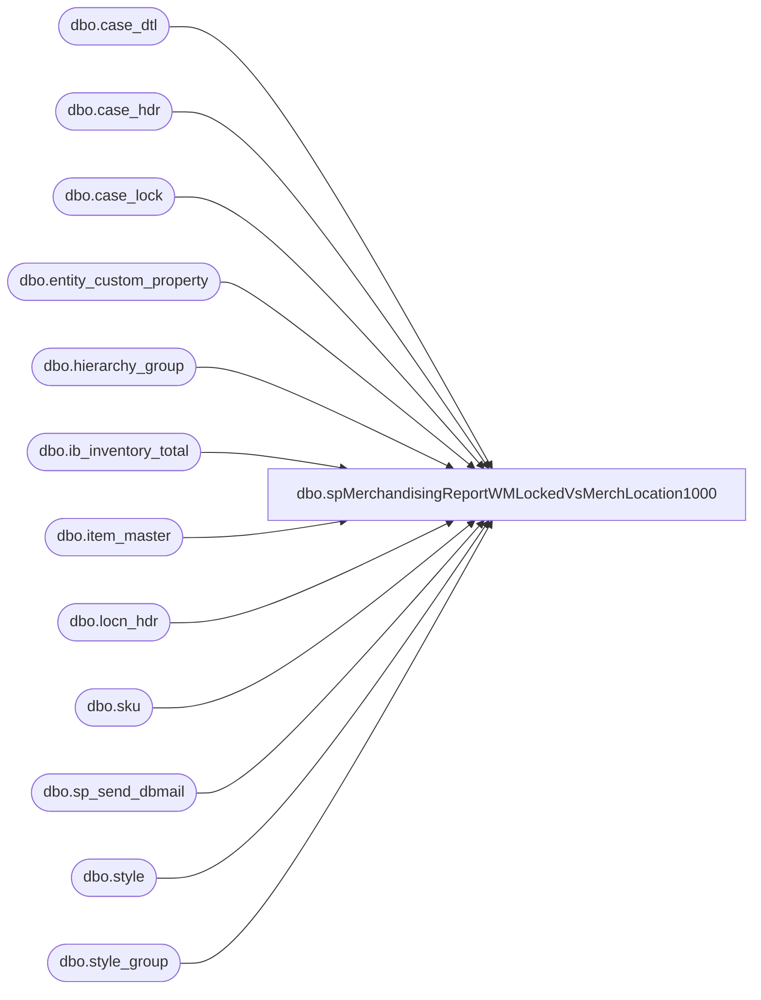

# dbo.spMerchandisingReportWMLockedVsMerchLocation1000

**Database:** me_01  
**Server:** bedrockdb02  

## Architecture Diagram



## Table Dependencies

| Referenced Table |
|---|
| dbo.case_dtl |
| dbo.case_hdr |
| dbo.case_lock |
| dbo.entity_custom_property |
| dbo.hierarchy_group |
| dbo.ib_inventory_total |
| dbo.item_master |
| dbo.locn_hdr |
| dbo.sku |
| dbo.sp_send_dbmail |
| dbo.style |
| dbo.style_group |

## Stored Procedure Code

```sql
CREATE proc [dbo].[spMerchandisingReportWMLockedVsMerchLocation1000]

as
-- =====================================================================================================
-- Name: spMerchandisingReportWMLockedVsMerchLocation1000
--
-- Description:	Captures and emails a summary of variances between WM Locked inventory and Merch location 1000
--				 
-- Revision History
--		Name:			Date:			Comments:
--		Dan Tweedie		07/28/2015		Created proc.	
--		Tim Callahan	02/14/2017		Modified Proc to only include Cases with HI Lock Code (held inventory), included inactive Merch styles and added ShaunS and EricD to email. 
--		Tim Callahan	02/22/2017		Modified proc to include cases in TAG locations with lock code PP per Shaun Starkey
--		Tim Callahan	03/01/2017		Modified proc to specify if line sumation is for units\cases in a TAG location
--		Tim Callahan	06/08/2017		Modified proc to remove TAG location inventory from report, this was causing confusion and served it's temporary purpose. 
--		Tim Callahan	08/14/2017		Modified proc to exclude styles that do not begin with a number (0-9) because 3PL styles beginn with alpha characters
--										Modified proc to send a No Discrepancy E-mail if applicable rather than only sending an e-mail if discrepancy exists. 
--		Tim Callahan	12/04/2018		Added Angel Gordon to the email receipients
-- =====================================================================================================

set nocount on

-- Find All existing TAG locations (These are locations the warehouse uses for sku conversion projects)
-- Remarked out on 6/8/2017
/*
IF (Object_ID('tempdb..#TAG_Locns') IS NOT NULL) DROP TABLE #TAG_Locns
select locn_id, locn_brcd
into #TAG_Locns
from wmdb01.wmprod.dbo.locn_hdr
where locn_brcd like 'TAG%'
and work_grp is null 

-- select * from #TAG_Locns
*/

IF (Object_ID('tempdb..#wmLocked') IS NOT NULL) DROP TABLE #wmLocked
select im.style,
	im.sku_desc,
	case when im.store_dept = 'SUP' 
		then cast(sum(cd.actl_qty)/im.std_pack_qty as int)
	else cast(sum(cd.actl_qty) as int) 
	end as  qty,
	'NO' as 'Is TAG Locn?'
into #wmLocked
from wmdb01.wmprod.dbo.case_lock cl 
join wmdb01.wmprod.dbo.case_hdr ch on cl.case_nbr = ch.case_nbr
join wmdb01.wmprod.dbo.locn_hdr lh on ch.locn_id = lh.locn_id
	and (lh.work_grp not in ('OUTL', 'WEB') or lh.work_grp is null)
join wmdb01.wmprod.dbo.case_dtl cd on ch.case_nbr = cd.case_nbr
join wmdb01.wmprod.dbo.item_master im on cd.sku_id = im.sku_id
where -- cl.INVN_LOCK_CODE = 'HI' -- Added Filter on 02/14/2017 -- Remarked out on 8/14/2017
cl.INVN_LOCK_CODE = 'HI' and im.style like '0%' -- Added filter on 8/14/2017 to ensure we are only including BAB styles (3PL styles begin with letters)
or cl.INVN_LOCK_CODE = 'HI' and im.style like '1%'
or cl.INVN_LOCK_CODE = 'HI' and im.style like '2%'
or cl.INVN_LOCK_CODE = 'HI' and im.style like '3%'
or cl.INVN_LOCK_CODE = 'HI' and im.style like '4%'
or cl.INVN_LOCK_CODE = 'HI' and im.style like '5%'
or cl.INVN_LOCK_CODE = 'HI' and im.style like '6%'
or cl.INVN_LOCK_CODE = 'HI' and im.style like '7%'
or cl.INVN_LOCK_CODE = 'HI' and im.style like '8%'
or cl.INVN_LOCK_CODE = 'HI' and im.style like '9%'


group by im.store_dept, im.style, im.std_pack_qty, im.sku_desc

/* -- Remarked out on 06/08/2017
union -- Added on 2/22/2017
select im.style,
	im.sku_desc,
	case when im.store_dept = 'SUP' 
		then cast(sum(cd.actl_qty)/im.std_pack_qty as int)
	else cast(sum(cd.actl_qty) as int)
	end as  qty,
	'YES' as 'Is TAG Locn?'
from wmdb01.wmprod.dbo.case_lock cl 
join wmdb01.wmprod.dbo.case_hdr ch on cl.case_nbr = ch.case_nbr
join wmdb01.wmprod.dbo.locn_hdr lh on ch.locn_id = lh.locn_id
	and (lh.work_grp not in ('OUTL', 'WEB') or lh.work_grp is null)
join wmdb01.wmprod.dbo.case_dtl cd on ch.case_nbr = cd.case_nbr
join wmdb01.wmprod.dbo.item_master im on cd.sku_id = im.sku_id
where lh.locn_id in (select locn_id from #TAG_Locns)
and cl.invn_lock_code = 'PP'
group by im.store_dept, im.style, im.std_pack_qty, im.sku_desc
order by style
*/


IF (Object_ID('tempdb..#merch') IS NOT NULL) DROP TABLE #merch
select s.style_code,
	   s.short_desc,
	   sum(iit.total_on_hand_units) qty
into #merch
from ib_inventory_total iit with (nolock)
join sku sk with (nolock) on iit.sku_id = sk.sku_id
	and		iit.location_id = 705 -- Location_Code 1000 in Merch
	and		iit.inventory_status_id = 1
join style s with (nolock) on sk.style_id = s.style_id
join style_group sg with (nolock) on s.style_id = sg.style_id
join hierarchy_group hg with (nolock) on hg.hierarchy_group_id = sg.hierarchy_group_id
left join entity_custom_property ecp with (nolock) on ecp.parent_id = s.style_id
	and ecp.custom_property_id = 2 -- FRCSTM
	and parent_type = 1
--where s.active_flag = 1 -- Remarked Out on 2/14/2017
group by s.style_code, s.short_desc

IF (Object_ID('tempdb..#compare') IS NOT NULL) DROP TABLE #compare
select isnull(m.style_code, wm.style) STYLE_CODE, isnull(m.short_desc, wm.sku_desc) SKU_DESC,
isnull(m.qty, 0) LOCN_1000, isnull(wm.qty, 0) WM_LOCKED, isnull(wm.[Is TAG Locn?], 'n\a') Is_Tag_Locn
into #compare
from #merch m
full outer join #wmLocked wm on m.style_code = wm.style
where isnull(m.qty, 0) <> isnull(wm.qty, 0)
order by 1, wm.[Is TAG Locn?] asc

if (select count(*) from #compare) > 0

	begin
	
		declare @text nvarchar(max)
		set @text = '<font face =arial size = 2>' + 
				'WM Locked Inventory Vs Merch Location 1000' +
				'<br>'+
					'<table border="1">' +
					'<tr><th>STYLE</th><th>DESCRIPTION</TH><th>WM LOCKED</th><th>LOCATION 1000</th></tr>' +
					CAST ( ( SELECT td = style_code, '',
									td = sku_desc, '',
									td = wm_locked, '',
									td = locn_1000, ''
									--td = [Is_Tag_Locn] -- Remarked out 06/08/2017
							  from #compare
							  order by style_code, [Is_Tag_Locn] 
							  FOR XML PATH('tr'), TYPE 
					) AS NVARCHAR(MAX) ) +
					'</font></table></font></p></p>
					<br>
					<br>
					------------------------------------------------------------------------------------------
					<br>
					Controlled by stored procedure: spMerchandisingReportWMLockedVsMerchLocation1000'

					EXEC bedrockdb02.msdb.dbo.sp_send_dbmail
					@recipients = 'tamib@buildabear.com;physicalinventory@buildabear.com;EricD@buildabear.com;ShaunS@buildabear.com;DennisH@buildabear.com;CandaceS@buildabear.com;ShandrayS@buildabear.com;AngelGo@buildabear.com',
					@copy_recipients = 'MerchAdmin@buildabear.com',
					@body = @text,
					@subject = 'WM Locked Inventory Vs Merch Location 1000',
					@profile_name = 'MerchAdmin',
					@body_format = 'HTML'
	end

if (select count(*) from #compare) = 0

	Begin 


		EXEC bedrockdb02.msdb.dbo.sp_send_dbmail
					@recipients = 'tamib@buildabear.com;physicalinventory@buildabear.com;EricD@buildabear.com;ShaunS@buildabear.com;DennisH@buildabear.com;CandaceS@buildabear.com;ShandrayS@buildabear.com;AngelGo@buildabear.com',
					@copy_recipients = 'MerchAdmin@buildabear.com',
					@body ='Discrepancies DO NOT exist between WM Locked Inventory and Merchandising Location 1000. 
	<br>
	<br>
	------------------------------------------------------------------------------------------

	<br>
	<br>
	Controlled by stored procedure: spMerchandisingReportWMLockedVsMerchLocation1000' ,
					@subject = 'WM Locked Inventory Vs Merch Location 1000',
					@profile_name = 'MerchAdmin',
					@body_format = 'HTML'


	End
```

