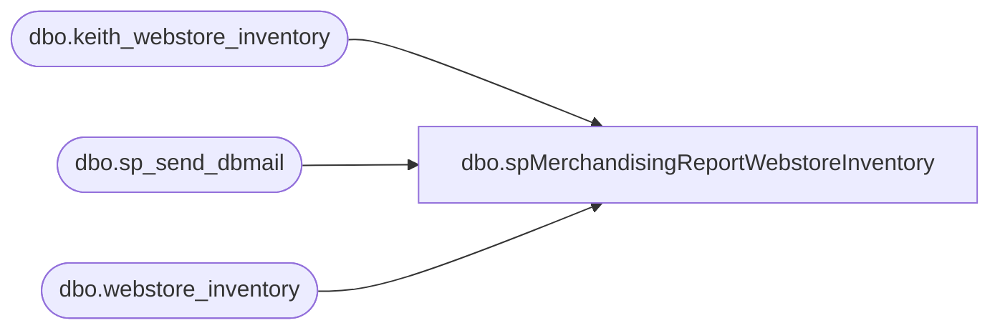

# dbo.spMerchandisingReportWebstoreInventory

**Database:** me_01  
**Server:** bedrockdb02  

## Architecture Diagram



## Table Dependencies

| Referenced Table |
|---|
| dbo.keith_webstore_inventory |
| dbo.sp_send_dbmail |
| dbo.webstore_inventory |

## Stored Procedure Code

```sql
CREATE proc [dbo].[spMerchandisingReportWebstoreInventory]

as 

-- =====================================================================================================
-- Name: spMerchandisingReportWebstoreInventory
--
-- Description:	Reports archived web inventory into CSV file for Accounting and Planning, sends email
--				Replaces DTS on wmetl01 called webstore_inventory_daily (Merch 4.1 LIVE)
--
-- Revision History
--		Name:			Date:			Comments:
--		Dan Tweedie		07/13/2015		Created proc
--		Lizzy Timm		04/24/2019		Removed Donna Robinson (donnar@buildabear.com) from email recepients
-- =====================================================================================================


set nocount on

delete from webstore_inventory 
where datediff(dd, load_date, getdate()) = 0

insert webstore_inventory
select SKU as STYLE,
replace(SKUDESC,',',' ') as SKU_DESC,
QUANTITY as AVAILABLE, 
load_date
from wmdb01.wmprod.dbo.keith_webstore_inventory

----Output csv file
declare @query varchar(1000),
		@file_name varchar(100),
		@file_location varchar(100),
		@server varchar(20),
		@database varchar(20),
		@sqlcmd varchar(1000),
		@query_text varchar(1000)

select @query_text = 'set nocount on select STYLE, SKU_DESC, AVAILABLE from webstore_inventory where datediff(dd, load_date, getdate()) = 0 order by STYLE'
set @query = @query_text
set @file_location = '\\sharebear1\groups\Planning\Inventory\'
set @file_name = 'webstore_inventory.csv'
set @server = 'oursmerchdb01'
set @database = 'me_01'
set @sqlcmd = 'sqlcmd -S' + @server + ' -d' + @database + ' -Q' + '"' + @query + '"' + ' -o' + '"' + @file_location + @file_name + '"' + ' -s"," -w1000 -W'
exec master..xp_cmdshell @sqlcmd

--sends email
exec msdb.dbo.sp_send_dbmail
@profile_name = 'MerchAdmin',
@recipients = 'seanw@buildabear.com',
@body = 'The Webstore Inventory Report is avaiilable here -> \\sharebear1\groups\Planning\Inventory\webstore_inventory.csv.  
If you have any problems with this report, please contactEntSysSupport@buildabear.com.


Technical Details:
BEDROCKDB02 SQL Agent - MERCHANDISING - Report - Webstore Inventory',
@subject = 'Webstore Inventory'
```

