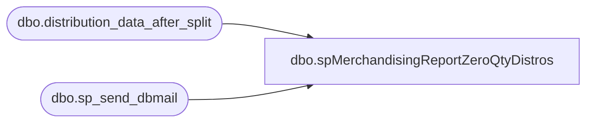

# dbo.spMerchandisingReportZeroQtyDistros

**Database:** me_01  
**Server:** bedrockdb02  

## Architecture Diagram



## Table Dependencies

| Referenced Table |
|---|
| dbo.distribution_data_after_split |
| dbo.sp_send_dbmail |

## Stored Procedure Code

```sql
CREATE proc [dbo].[spMerchandisingReportZeroQtyDistros]
as
-- =====================================================================================================
-- Name: spMerchandisingReportZeroQtyDistros
--
-- Description:	Sends email alert if distros are released with 0 qty
--				
--				
-- Input:	NA
--			
--
-- Output: 
--		
--
-- Dependencies: 
--				 
--
-- Revision History
--		Name:			Date:			Comments:
--		Dan Tweedie		10/22/2012		Created proc.	
-- =====================================================================================================

set nocount on 

if (select count(*) 
	from distribution_data_after_split
	where quantity = 0
	and datediff(dd, release_date, getdate()) = 0) 
	> 0

begin

declare @text nvarchar(max)
set @text = 
'<font face =arial size = 2><B>Distros Released With 0 Qty</B><br>' +
'</font>' +
	'<table border="1">' +
		'<tr><th><font face =arial size = 2>WHSE</font></th>' +
			'<th><font face =arial size = 2>STORE</font></th>' +
			'<th><font face =arial size = 2>DISTRO NBR</font></th>' +
			'<th><font face =arial size = 2>DISTRO LINE</font></th>' +
			'<th><font face =arial size = 2>STYLE</font></th></tr>' +
'<font face =arial size = 2>' +
    CAST ( ( SELECT td = sourceid,'',
                    td = destid, '',
                    td = distribution_number, '',
                    td = ref_field_1, '',
                    td = style_code, ''
              from distribution_data_after_split 
			  where quantity = 0 
			  and datediff(dd, release_date, getdate()) = 0
			  order by sourceid, destid, distribution_number, ref_field_1, style_code
              FOR XML PATH('tr'), TYPE 
    ) AS NVARCHAR(MAX) ) +
    '</font></table></font></p></p>
    <br>
    <font face =arial size = 1><B>This report was run from bedrockdb02 SQL Agent: Report - Zero Qty Distros.</B></font>
    <br>
    <br>
<font face =arial size = 1><i>The information in this message may be privileged, “confidential” and protected from disclosure and/or intended only for the addressee(s) named above.  If the reader of this message is not the intended recipient, or an employee or agent responsible for delivering this message to the intended recipient, you are hereby notified that any dissemination, distribution or copying of the communication is strictly prohibited.  If you have received this communication in error, please notify us immediately by replying to the message and deleting it from your computer.  Thank you beary much.</i></font>'


	exec msdb.dbo.sp_send_dbmail
	@profile_name = 'MerchAdmin',
	@recipients = 'merchadmin@buildabear.com',
	@body = @text,
	@subject = 'Zero Qty Distros',
	@body_format = 'html'


end
```

