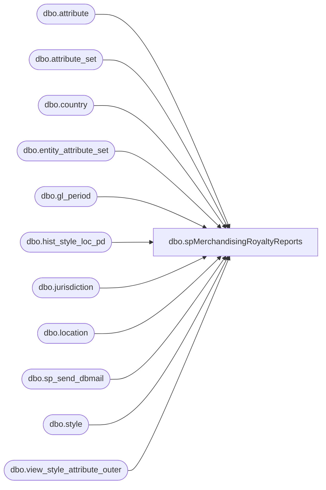

# dbo.spMerchandisingRoyaltyReports

**Database:** me_01  
**Server:** bedrockdb02  

## Architecture Diagram



## Table Dependencies

| Referenced Table |
|---|
| dbo.attribute |
| dbo.attribute_set |
| dbo.country |
| dbo.entity_attribute_set |
| dbo.gl_period |
| dbo.hist_style_loc_pd |
| dbo.jurisdiction |
| dbo.location |
| dbo.sp_send_dbmail |
| dbo.style |
| dbo.view_style_attribute_outer |

## Stored Procedure Code

```sql
CREATE proc [dbo].[spMerchandisingRoyaltyReports]
as
-- =============================================================================================================
-- Name: spMerchandisingRoyaltyReports
--
-- Description:	Royalty Report for Physical Inventory - consolidates a series of Smartlook reports into a single query
--
-- Input:		
--
-- Output: 
--
-- Dependencies: 
--
-- Revision History
--		Name:			Date:			Comments:
--		Dan Tweedie		11/15/2012		Created Proc
--		Dan Tweedie		03/12/2013		Modified the logic to determine the @period variable, 
--										assigning it as the period label from gl_period table,
--										based on the close date being today
--		Dan Tweedie		04/26/2013		Updated code to accurately capture the data for the styles with more complex attribute definitions, which require a distinct way to get the data, compared to the way of getting the more common ones
--		Lizzy Timm		06/01/2023		Removed MerchAdmin from recipients
-- =============================================================================================================
set nocount on

declare @max1 datetime
select @max1 = max(date_closed) from gl_period

if (select count(*) 
	from gl_period (nolock)
	where date_closed = @max1
	and datediff(dd, date_closed, getdate()) = 0) > 0

BEGIN

		declare @max datetime,
				@period varchar(60)

		select @max = max(date_closed) from gl_period

		select @period = gl_period_label
		from gl_period (nolock)
		where date_closed = @max
		and datediff(dd, date_closed, getdate()) = 0


		IF (Object_ID('tempdb..#sales') IS NOT NULL) DROP TABLE #sales
		SELECT @period Period,
			   a01.attribute_label RoyaltyAttribute,
			   d01.attribute_set_code RoyaltyPercentage, 
			   b.location_code, 
			   e.country_code,
			   a.style_code, 
			   a.short_desc, 
			   SUM((c.sales_total_units-c.return_units) * (1 - abs (sign (merch_year_pd -@period)))) as NetSalesUnits, 
			   SUM((c.sales_total_retail_te-c.return_retail_te) * (1 - abs (sign (merch_year_pd -@period)))) as NetSalesRetail, 
			   SUM(c.promo_pc_total_retail_te * (1 - abs (sign (merch_year_pd -@period)))) as PromoPcTotalRetail
		into #sales
		FROM ma_01.dbo.style a, 
			 ma_01.dbo.location b, 
			 ma_01.dbo.hist_style_loc_pd c, 
			 ma_01.dbo.attribute_set d01, 
			 ma_01.dbo.entity_attribute_set e01,
			 ma_01.dbo.country e, 
			 ma_01.dbo.jurisdiction g,
			 ma_01.dbo.attribute a01 
		WHERE a.style_id=c.style_id  
			AND b.location_id=c.location_id  
			AND a.style_id = e01.parent_id and e01.parent_type = 1 
			AND e01.attribute_id in (246,525,231,523,521,512,504,510,494,492,486,488,480,465,472,225,444,438,205,199,416,418,262,345,149,193,357,
				 264,191,125,400,241,243,300,314,351,252,426,175,195,308,339)
			AND d01.attribute_set_id =e01.attribute_set_id 
			AND b.jurisdiction_id = g.jurisdiction_id  
			AND g.country_id = e.country_id  
			AND d01.attribute_id = a01.attribute_id 
		GROUP BY a01.attribute_label, e.country_code, d01.attribute_set_code,b.location_code,a.style_code,a.short_desc,a.style_id,b.location_id,{fn IFNULL(d01.attribute_set_id,-1)} 
		order by a.style_code
		-------------------------------------------------------------
		-----NEW CODE HERE
				INSERT #sales
				SELECT		   @period Period,
					   a01.attribute_label RoyaltyAttribute,
					   d01.attribute_set_code RoyaltyPercentage, 
					   b.location_code, 
					   e.country_code,
					   a.style_code, 
					   a.short_desc, 
					   SUM((c.sales_total_units-c.return_units) * (1 - abs (sign (merch_year_pd -@period)))) as NetSalesUnits, 
					   SUM((c.sales_total_retail_te-c.return_retail_te) * (1 - abs (sign (merch_year_pd -@period)))) as NetSalesRetail, 
					   SUM(c.promo_pc_total_retail_te * (1 - abs (sign (merch_year_pd -@period)))) as PromoPcTotalRetail
				FROM ma_01.dbo.style a, ma_01.dbo.location b, ma_01.dbo.hist_style_loc_pd c, ma_01.dbo.attribute_set d01, ma_01.dbo.attribute_set d02, ma_01.dbo.country e, ma_01.dbo.entity_attribute_set f01, ma_01.dbo.entity_attribute_set f02, ma_01.dbo.jurisdiction g, ma_01.dbo.attribute a01
				WHERE a.style_id=c.style_id  
					AND b.location_id=c.location_id  
					AND a.style_id =f01.parent_id and f01.parent_type = 1 and f01.attribute_id = 120 
					AND a.style_id =f02.parent_id and f02.parent_type = 1 and f02.attribute_id = 353  
					AND d01.attribute_set_id =f01.attribute_set_id 
					AND d02.attribute_set_id =f02.attribute_set_id   
					AND b.jurisdiction_id =g.jurisdiction_id  
					AND g.country_id =e.country_id  
					AND d01.attribute_id = a01.attribute_id 
				GROUP BY a01.attribute_label, d01.attribute_set_code,d02.attribute_set_code,a.style_code,a.short_desc,e.country_code,b.location_code,a.style_id,b.location_id,{fn IFNULL(d01.attribute_set_id,-1)}, {fn IFNULL(d02.attribute_set_id,-1)} 
				UNION ALL
				SELECT		   @period Period,
							   a01.attribute_label RoyaltyAttribute,
							   d01.attribute_set_code RoyaltyPercentage, 
							   b.location_code, 
							   e.country_code,
							   a.style_code, 
							   a.short_desc, 
							   SUM((c.sales_total_units-c.return_units) * (1 - abs (sign (merch_year_pd -@period)))) as NetSalesUnits, 
							   SUM((c.sales_total_retail_te-c.return_retail_te) * (1 - abs (sign (merch_year_pd -@period)))) as NetSalesRetail, 
							   SUM(c.promo_pc_total_retail_te * (1 - abs (sign (merch_year_pd -@period)))) as PromoPcTotalRetail
				FROM ma_01.dbo.style a, ma_01.dbo.location b, ma_01.dbo.hist_style_loc_pd c, ma_01.dbo.attribute_set d01, ma_01.dbo.attribute_set d02, ma_01.dbo.country e, ma_01.dbo.entity_attribute_set f01, ma_01.dbo.entity_attribute_set f02, ma_01.dbo.jurisdiction g, ma_01.dbo.attribute a01 
				WHERE a.style_id=c.style_id  
					AND b.location_id=c.location_id  
					AND a.style_id =f01.parent_id and f01.parent_type = 1 and f01.attribute_id = 120 
					AND a.style_id =f02.parent_id and f02.parent_type = 1 and f02.attribute_id = 118  
					AND d01.attribute_set_id =f01.attribute_set_id 
					AND d02.attribute_set_id =f02.attribute_set_id   
					AND b.jurisdiction_id =g.jurisdiction_id  
					AND g.country_id =e.country_id 
					AND d01.attribute_id = a01.attribute_id  
				GROUP BY a01.attribute_label, d01.attribute_set_code,a.style_code,a.short_desc,e.country_code,d02.attribute_set_code,d02.attribute_set_label,d01.attribute_set_label,b.location_code,a.style_id,b.location_id,{fn IFNULL(d01.attribute_set_id,-1)}, {fn IFNULL(d02.attribute_set_id,-1)} 
				UNION ALL
				SELECT		   @period Period,
							   a01.attribute_label RoyaltyAttribute,
							   d03.attribute_set_code RoyaltyPercentage,
							   b.location_code, 
							   e.country_code,
							   a.style_code, 
							   a.short_desc, 
							   SUM((c.sales_total_units-c.return_units) * (1 - abs (sign (merch_year_pd -@period)))) as NetSalesUnits, 
							   SUM((c.sales_total_retail_te-c.return_retail_te) * (1 - abs (sign (merch_year_pd -@period)))) as NetSalesRetail, 
							   SUM(c.promo_pc_total_retail_te * (1 - abs (sign (merch_year_pd -@period)))) as PromoPcTotalRetail
				FROM ma_01.dbo.style a, ma_01.dbo.location b, ma_01.dbo.hist_style_loc_pd c, ma_01.dbo.attribute_set d01, ma_01.dbo.attribute_set d02, ma_01.dbo.attribute_set d03, ma_01.dbo.country e, ma_01.dbo.entity_attribute_set f01, ma_01.dbo.entity_attribute_set f02, ma_01.dbo.entity_attribute_set f03, ma_01.dbo.jurisdiction g, ma_01.dbo.attribute a01 
				WHERE a.style_id=c.style_id  
					AND b.location_id=c.location_id  
					AND a.style_id =f01.parent_id and f01.parent_type = 1 and f01.attribute_id = 135 
					AND a.style_id =f02.parent_id and f02.parent_type = 1 and f02.attribute_id = 137 
					AND a.style_id =f03.parent_id and f03.parent_type = 1 and f03.attribute_id = 404  
					AND d01.attribute_set_id =f01.attribute_set_id 
					AND d02.attribute_set_id =f02.attribute_set_id 
					AND d03.attribute_set_id =f03.attribute_set_id   
					AND b.jurisdiction_id =g.jurisdiction_id  
					AND g.country_id =e.country_id  
					AND d01.attribute_id = a01.attribute_id
				GROUP BY d02.attribute_set_code, d03.attribute_set_code,
				a01.attribute_label, d01.attribute_set_code, e.country_code,b.location_code,d01.attribute_set_label,d02.attribute_set_label,d03.attribute_set_code,a.style_code,a.short_desc,a.style_id,b.location_id,{fn IFNULL(d01.attribute_set_id,-1)}, {fn IFNULL(d02.attribute_set_id,-1)}, {fn IFNULL(d03.attribute_set_id,-1)} 
				UNION ALL
				SELECT		   @period Period,
							   a01.attribute_label RoyaltyAttribute,
							   d03.attribute_set_code RoyaltyPercentage,
							   b.location_code, 
							   e.country_code,
							   a.style_code, 
							   a.short_desc, 
							   SUM((c.sales_total_units-c.return_units) * (1 - abs (sign (merch_year_pd -@period)))) as NetSalesUnits, 
							   SUM((c.sales_total_retail_te-c.return_retail_te) * (1 - abs (sign (merch_year_pd -@period)))) as NetSalesRetail, 
							   SUM(c.promo_pc_total_retail_te * (1 - abs (sign (merch_year_pd -@period)))) as PromoPcTotalRetail
				FROM ma_01.dbo.style a, ma_01.dbo.location b, ma_01.dbo.hist_style_loc_pd c, ma_01.dbo.attribute_set d01, ma_01.dbo.attribute_set d02, ma_01.dbo.attribute_set d03, ma_01.dbo.country e, ma_01.dbo.entity_attribute_set f01, ma_01.dbo.entity_attribute_set f02, ma_01.dbo.entity_attribute_set f03, ma_01.dbo.jurisdiction g, ma_01.dbo.attribute a01 
				WHERE a.style_id=c.style_id  
					AND b.location_id=c.location_id  
					AND a.style_id =f01.parent_id and f01.parent_type = 1 and f01.attribute_id = 127 
					AND a.style_id =f02.parent_id and f02.parent_type = 1 and f02.attribute_id = 129 
					AND a.style_id =f03.parent_id and f03.parent_type = 1 and f03.attribute_id = 402  
					AND d01.attribute_set_id =f01.attribute_set_id 
					AND d02.attribute_set_id =f02.attribute_set_id 
					AND d03.attribute_set_id =f03.attribute_set_id   
					AND b.jurisdiction_id =g.jurisdiction_id  
					AND g.country_id =e.country_id  
					AND d01.attribute_id = a01.attribute_id
				GROUP BY d02.attribute_set_code, d03.attribute_set_code,
				a01.attribute_label, d01.attribute_set_code, e.country_code,b.location_code,d01.attribute_set_label,d02.attribute_set_label,d03.attribute_set_code,a.style_code,a.short_desc,a.style_id,b.location_id,{fn IFNULL(d01.attribute_set_id,-1)}, {fn IFNULL(d02.attribute_set_id,-1)}, {fn IFNULL(d03.attribute_set_id,-1)} 
				UNION ALL
				SELECT		   @period Period,
							   a01.attribute_label RoyaltyAttribute,
							   d02.attribute_set_code RoyaltyPercentage, 
							   b.location_code, 
							   e.country_code,
							   a.style_code, 
							   a.short_desc, 
							   SUM((c.sales_total_units-c.return_units) * (1 - abs (sign (merch_year_pd -@period)))) as NetSalesUnits, 
							   SUM((c.sales_total_retail_te-c.return_retail_te) * (1 - abs (sign (merch_year_pd -@period)))) as NetSalesRetail, 
							   SUM(c.promo_pc_total_retail_te * (1 - abs (sign (merch_year_pd -@period)))) as PromoPcTotalRetail
				FROM ma_01.dbo.style a, ma_01.dbo.location b, ma_01.dbo.hist_style_loc_pd c, ma_01.dbo.attribute_set d01, ma_01.dbo.attribute_set d02, ma_01.dbo.country e, ma_01.dbo.entity_attribute_set f01, ma_01.dbo.entity_attribute_set f02, ma_01.dbo.jurisdiction g, ma_01.dbo.attribute a01
				WHERE a.style_id=c.style_id  
					AND b.location_id=c.location_id  
					AND a.style_id =f01.parent_id and f01.parent_type = 1 and f01.attribute_id = 179 
					AND a.style_id =f02.parent_id and f02.parent_type = 1 and f02.attribute_id = 181  
					AND d01.attribute_set_id =f01.attribute_set_id 
					AND d02.attribute_set_id =f02.attribute_set_id   
					AND b.jurisdiction_id =g.jurisdiction_id  
					AND g.country_id =e.country_id  
					AND d01.attribute_id = a01.attribute_id 
				GROUP BY a01.attribute_label, d01.attribute_set_code,d02.attribute_set_code,a.style_code,a.short_desc,e.country_code,b.location_code,a.style_id,b.location_id,{fn IFNULL(d01.attribute_set_id,-1)}, {fn IFNULL(d02.attribute_set_id,-1)} 
				UNION ALL
				SELECT		   @period Period,
							   a01.attribute_label RoyaltyAttribute,
							   d02.attribute_set_code RoyaltyPercentage, 
							   b.location_code, 
							   e.country_code,
							   a.style_code, 
							   a.short_desc, 
							   SUM((c.sales_total_units-c.return_units) * (1 - abs (sign (merch_year_pd -@period)))) as NetSalesUnits, 
							   SUM((c.sales_total_retail_te-c.return_retail_te) * (1 - abs (sign (merch_year_pd -@period)))) as NetSalesRetail, 
							   SUM(c.promo_pc_total_retail_te * (1 - abs (sign (merch_year_pd -@period)))) as PromoPcTotalRetail
				FROM ma_01.dbo.style a, ma_01.dbo.location b, ma_01.dbo.hist_style_loc_pd c, ma_01.dbo.attribute_set d01, ma_01.dbo.attribute_set d02, ma_01.dbo.country e, ma_01.dbo.entity_attribute_set f01, ma_01.dbo.entity_attribute_set f02, ma_01.dbo.jurisdiction g, ma_01.dbo.attribute a01
				WHERE a.style_id=c.style_id  
					AND b.location_id=c.location_id  
					AND a.style_id =f01.parent_id and f01.parent_type = 1 and f01.attribute_id = 143 
					AND a.style_id =f02.parent_id and f02.parent_type = 1 and f02.attribute_id = 145  
					AND d01.attribute_set_id =f01.attribute_set_id 
					AND d02.attribute_set_id =f02.attribute_set_id   
					AND b.jurisdiction_id =g.jurisdiction_id  
					AND g.country_id =e.country_id  
					AND d01.attribute_id = a01.attribute_id 
				GROUP BY a01.attribute_label, d01.attribute_set_code,d02.attribute_set_code,a.style_code,a.short_desc,e.country_code,b.location_code,a.style_id,b.location_id,{fn IFNULL(d01.attribute_set_id,-1)}, {fn IFNULL(d02.attribute_set_id,-1)} 
				UNION ALL
				SELECT		   @period Period,
							   a01.attribute_label RoyaltyAttribute,
							   d03.attribute_set_code RoyaltyPercentage,
							   b.location_code, 
							   e.country_code,
							   a.style_code, 
							   a.short_desc, 
							   SUM((c.sales_total_units-c.return_units) * (1 - abs (sign (merch_year_pd -@period)))) as NetSalesUnits, 
							   SUM((c.sales_total_retail_te-c.return_retail_te) * (1 - abs (sign (merch_year_pd -@period)))) as NetSalesRetail, 
							   SUM(c.promo_pc_total_retail_te * (1 - abs (sign (merch_year_pd -@period)))) as PromoPcTotalRetail
				FROM ma_01.dbo.style a, ma_01.dbo.location b, ma_01.dbo.hist_style_loc_pd c, ma_01.dbo.attribute_set d01, ma_01.dbo.attribute_set d02, ma_01.dbo.attribute_set d03, ma_01.dbo.country e, ma_01.dbo.entity_attribute_set f01, ma_01.dbo.entity_attribute_set f02, ma_01.dbo.entity_attribute_set f03, ma_01.dbo.jurisdiction g, ma_01.dbo.attribute a01 
				WHERE a.style_id=c.style_id  
					AND b.location_id=c.location_id  
					AND a.style_id =f01.parent_id and f01.parent_type = 1 and f01.attribute_id = 349 
					AND a.style_id =f02.parent_id and f02.parent_type = 1 and f02.attribute_id = 169 
					AND a.style_id =f03.parent_id and f03.parent_type = 1 and f03.attribute_id = 322  
					AND d01.attribute_set_id =f01.attribute_set_id 
					AND d02.attribute_set_id =f02.attribute_set_id 
					AND d03.attribute_set_id =f03.attribute_set_id   
					AND b.jurisdiction_id =g.jurisdiction_id  
					AND g.country_id =e.country_id  
					AND d01.attribute_id = a01.attribute_id
				GROUP BY d02.attribute_set_code, d03.attribute_set_code,
				a01.attribute_label, d01.attribute_set_code, e.country_code,b.location_code,d01.attribute_set_label,d02.attribute_set_label,d03.attribute_set_code,a.style_code,a.short_desc,a.style_id,b.location_id,{fn IFNULL(d01.attribute_set_id,-1)}, {fn IFNULL(d02.attribute_set_id,-1)}, {fn IFNULL(d03.attribute_set_id,-1)} 
				UNION ALL
				SELECT		   @period Period,
							   a01.attribute_label RoyaltyAttribute,
							   d02.attribute_set_code RoyaltyPercentage, 
							   b.location_code, 
							   e.country_code,
							   a.style_code, 
							   a.short_desc, 
							   SUM((c.sales_total_units-c.return_units) * (1 - abs (sign (merch_year_pd -@period)))) as NetSalesUnits, 
							   SUM((c.sales_total_retail_te-c.return_retail_te) * (1 - abs (sign (merch_year_pd -@period)))) as NetSalesRetail, 
							   SUM(c.promo_pc_total_retail_te * (1 - abs (sign (merch_year_pd -@period)))) as PromoPcTotalRetail
				FROM ma_01.dbo.style a, ma_01.dbo.location b, ma_01.dbo.hist_style_loc_pd c, ma_01.dbo.attribute_set d01, ma_01.dbo.attribute_set d02, ma_01.dbo.country e, ma_01.dbo.entity_attribute_set f01, ma_01.dbo.entity_attribute_set f02, ma_01.dbo.jurisdiction g, ma_01.dbo.attribute a01
				WHERE a.style_id=c.style_id  
					AND b.location_id=c.location_id  
					AND a.style_id =f01.parent_id and f01.parent_type = 1 and f01.attribute_id = 310 
					AND a.style_id =f02.parent_id and f02.parent_type = 1 and f02.attribute_id = 312  
					AND d01.attribute_set_id =f01.attribute_set_id 
					AND d02.attribute_set_id =f02.attribute_set_id   
					AND b.jurisdiction_id =g.jurisdiction_id  
					AND g.country_id =e.country_id  
					AND d01.attribute_id = a01.attribute_id 
				GROUP BY a01.attribute_label, d01.attribute_set_code,d02.attribute_set_code,a.style_code,a.short_desc,e.country_code,b.location_code,a.style_id,b.location_id,{fn IFNULL(d01.attribute_set_id,-1)}, {fn IFNULL(d02.attribute_set_id,-1)} 
				UNION ALL
				SELECT	@period Period, 
						d01.attribute_set_code as RoyaltyAttribute, 
						d03.attribute_set_code as RoyaltyPercentage,
						b.location_code, 
						e.country_code,
						a.style_code, 
						a.short_desc, 
						SUM((c.sales_total_units-c.return_units) * (1 - abs (sign (merch_year_pd -201303)))) as Field_g, 
						SUM((c.sales_total_retail_te-c.return_retail_te) * (1 - abs (sign (merch_year_pd -201303)))) as Field_h, 
						SUM(c.promo_pc_total_retail_te * (1 - abs (sign (merch_year_pd -201303)))) as Field_i
				FROM ma_01.dbo.style a, ma_01.dbo.location b, ma_01.dbo.hist_style_loc_pd c, ma_01.dbo.attribute_set d01, ma_01.dbo.attribute_set d03,  ma_01.dbo.country e, ma_01.dbo.view_style_attribute_outer e02, ma_01.dbo.entity_attribute_set f01, ma_01.dbo.entity_attribute_set f03, ma_01.dbo.jurisdiction g
				WHERE a.style_id=c.style_id  
					AND b.location_id=c.location_id  
					AND a.style_id =f01.parent_id and f01.parent_type = 1 and f01.attribute_id = 139 
					AND a.style_id =f03.parent_id and f03.parent_type = 1 and f03.attribute_id = 141  
					AND d01.attribute_set_id =f01.attribute_set_id 
					AND d03.attribute_set_id =f03.attribute_set_id   
					AND a.style_id =e02.style_id and  e02.attribute_id = 139  
					AND b.jurisdiction_id =g.jurisdiction_id  
					AND g.country_id =e.country_id  
				GROUP BY b.location_code, e.country_code, a.style_code,a.short_desc,d01.attribute_set_code,e02.attribute_set_label,d03.attribute_set_code,a.style_id,b.location_id,{fn IFNULL(d01.attribute_set_id,-1)}, {fn IFNULL(d03.attribute_set_id,-1)} 

		------END NEW CODE
		-------------------------------------------------------------
		IF (Object_ID('tempdb..##due') IS NOT NULL) DROP TABLE ##due
		select s.*, 
			(s.NetSalesRetail + s.PromoPcTotalRetail) as GrossSales,
			case when isnumeric(s.royaltypercentage) = 1
				then cast((s.NetSalesRetail * s.royaltypercentage) as varchar)
				else 'Undetermined'
				end as RoyaltyDue
		into ##due
		from #sales s
		where s.NetSalesUnits <> 0
		------------------------------------------------
		declare @query varchar(1000),
				@date varchar(200),
				@file_name varchar(100),
				@file_location varchar(100),
				@server varchar(20),
				@database varchar(20),
				@sqlcmd varchar(1000),
				@query_text varchar(1000),
				@file varchar(1000),
				@body varchar(1000),
				@subj varchar(1000)

				select @query_text = 'set nocount on select * from ##due order by RoyaltyAttribute, style_code'
				set @date = convert(varchar, datepart(yyyy, getdate())) + '-' + convert(varchar, datepart(mm, getdate())) + '-' + convert(varchar, datepart(dd, getdate())) 
				set @query = @query_text
				set @file_location = '\\kermode\FileRepository\MERCHANDISING\DBCompare\RoyaltyReports\'  
				set @file_name = 'RoyaltyReport' + @date + '.csv'
				set @server = 'bedrockdb02'
				set @database = 'me_01'
				set @sqlcmd = 'sqlcmd -S' + @server + ' -d' + @database + ' -Q' + '"' + @query + '"' + ' -o' + '"' + @file_location + @file_name + '"' + ' -s"," -w1000 -W'
				exec master..xp_cmdshell @sqlcmd

				select @file = @file_location + @file_name
				select @body = 'Follow the link to find the Royalty Report for period ' + cast(@period as varchar) + '<br> -> ' + @file + '<br><br>This is still experimental, until the Physical Inventory team can validate that they get the same results as are found in the Smartlook views that are normally run.'
				select @subj = 'Royalty Report for period ' + cast(@period as varchar)

				exec msdb.dbo.sp_send_dbmail
				@profile_name = 'merchadmin',
				@recipients = 'physicalinventory@buildabear.com;', 
				@body = @body,
				@subject = @subj,
				@body_format = 'HTML'

END
```

