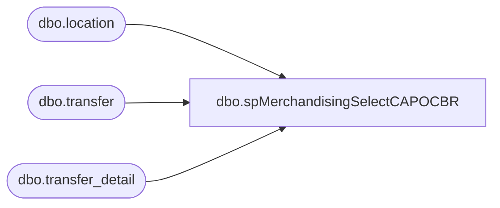

# dbo.spMerchandisingSelectCAPOCBR

**Database:** me_01  
**Server:** bedrockdb02  

## Architecture Diagram



## Table Dependencies

| Referenced Table |
|---|
| dbo.location |
| dbo.transfer |
| dbo.transfer_detail |

## Stored Procedure Code

```sql
CREATE proc [dbo].[spMerchandisingSelectCAPOCBR]
as

-- =====================================================================================================
-- Name: spMerchandisingSelectCAPOCBR
--
-- Description:	creates a carton batch receipt file for cartons transferred from 975 to 980
--
-- Input: NA
--
-- Output: na
--
-- Dependencies: na
--
-- Revision History
--		Name:			Date:			Comments:
--		Dan Tweedie		09/26/2011		Created proc.	
-- =====================================================================================================

set nocount on

IF (Object_ID('me_01..tmpCAPOcartons') IS NOT NULL) DROP TABLE tmpCAPOcartons
select      'BC' as type,
            'A' as action,
            td.carton_no as carton_number,
            l2.location_code as location_code,
            '099060166' as employee_code -- Admin
into tmpCAPOcartons
from  transfer t
join  transfer_detail td
on          t.transfer_id = td.transfer_id
join  location l1
on          t.from_location_id = l1.location_id
join  location l2
on          t.to_location_id = l2.location_id
where l1.location_code = '0975'
and         l2.location_code = '0980'
and         t.grouping_label = 'XFER 0975 to 0980'
and         t.document_status = 3 -- Sent Status
group by td.carton_no, l2.location_code


begin
		
	declare @query varchar(1000),
			@date varchar(52),
			@file_name varchar(100),
			@file_location varchar(100),
			@server varchar(20),
			@database varchar(20),
			@bcp varchar(1000)

	set @query = 'select * from me_01.dbo.tmpCAPOcartons'
	select @date = convert(varchar, datepart(yyyy, getdate())) + convert(varchar, datepart(mm, getdate())) + convert(varchar, datepart(dd, getdate())) + convert(varchar, datepart(hh, getdate())) + convert(varchar, datepart(mi, getdate())) + convert(varchar, datepart(ss, getdate())) + convert(varchar, datepart(ms, getdate()))
	set @file_location = '\\pipeapp01\E$\Company01\Text File to IM Import Tables  - Batch Carton\'
	set @file_name = 'STSIMCTN.CAPO' + convert(varchar, @date) +'.GO'
	set @server = 'bedrockdb02'
	set @database = 'me_01'
	set @bcp = 'bcp "' + @query + '" queryout "' + @file_location + @file_name + '"  -T -c -S' + @server

	exec master..xp_cmdshell @bcp

end
```

