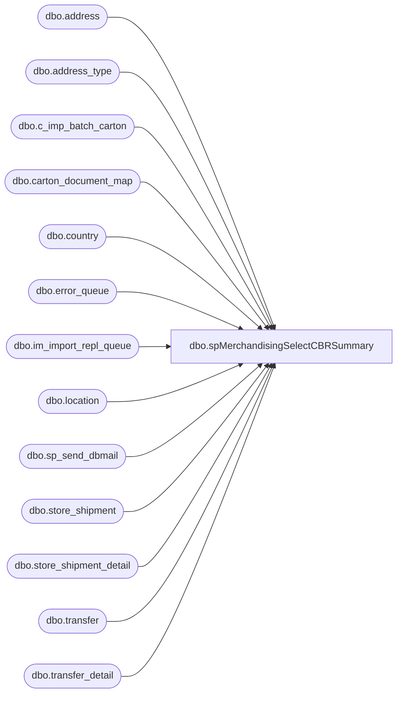

# dbo.spMerchandisingSelectCBRSummary

**Database:** me_01  
**Server:** bedrockdb02  

## Architecture Diagram



## Table Dependencies

| Referenced Table |
|---|
| dbo.address |
| dbo.address_type |
| dbo.c_imp_batch_carton |
| dbo.carton_document_map |
| dbo.country |
| dbo.error_queue |
| dbo.im_import_repl_queue |
| dbo.location |
| dbo.sp_send_dbmail |
| dbo.store_shipment |
| dbo.store_shipment_detail |
| dbo.transfer |
| dbo.transfer_detail |

## Stored Procedure Code

```sql
CREATE proc [dbo].[spMerchandisingSelectCBRSummary]
as
set nocount on
-- =====================================================================================================
-- Name: spMerchandisingSelectCBRSummary
--
-- Description:	Captures and emails a summary of Carton Batch Receipts processed from our warehouses into Merchandising.
--
-- Input:	
--
-- Output: report is emailed
--
-- Dependencies: na
--				 
-- Revision History
--		Name:			Date:			Comments:
--		Dan Tweedie		01/18/2011		Created proc.	
--		Tim Callahan	05/01/2018		Update Proc to create a global temp table for ##bc_summary table, so SQLcmd could locate the table 
-- =====================================================================================================

IF (Object_ID('tempdb..#bc_import') IS NOT NULL) DROP TABLE #bc_import
IF (Object_ID('tempdb..#bc_errors') IS NOT NULL) DROP TABLE #bc_errors
IF (Object_ID('tempdb..##bc_summary') IS NOT NULL) DROP TABLE ##bc_summary
IF (Object_ID('tempdb..#locations') IS NOT NULL) DROP TABLE #locations

select l.location_code as Location_Code,
l.location_code + ' - ' + a.address_city + ', ' + a.address_state as location
into #locations
from address a (nolock)
join address_type at (nolock) on a.address_type_id = at.address_type_id
join location l (nolock) on l.location_id = a.parent_id
join country c (nolock) on a.country_id = c.country_id
where a.parent_type = 2
and a.address_type_id = 1


--import tables - - file is imported from warehouse, stored in these import tables
--joins to shipment tables to see if received qty is > 0.
--there's not a way to capture a timestamp of the actual receipt posting
select distinct iirq.action_date, ----actual date that file is processed
	   case when t.document_no is not null then 'TRANSFER' 
			when ss.document_no is not null then 'SHIPMENT' 
			else 'n/a' 
		end as Carton_Type,
	   case when l1.location_code is not null then l1.location_code 
			when l3.location_code is not null then l3.location_code 
			else 'n/a' 
		end as Ship_From_Location,
	   case when l2.location_code is not null then l2.location_code
			when l4.location_code is not null then l4.location_code
			else 'n/a' 
		end as Ship_To_Location,
	   bc.location_code Receipt_Location,
	   bc.carton_no receipt_carton,
	   case when ss.document_no is not null then ss.document_no 
			when t.document_no is not null then t.document_no
			else 'n/a'
		end as Document,
	   case when ssd.carton_no is null and td.carton_no is null then 'NO' else 'YES' end Merch_Carton,
	   case when ssd.carton_no is not null then ssd.units_received
			when td.carton_no is not null then td.units_received
			else 'n/a'
		end as units_received
into #bc_import
from c_imp_batch_carton bc (nolock)
join carton_document_map cdm (nolock) on bc.carton_no = cdm.carton_no
join im_import_repl_queue iirq (nolock) on iirq.entity_id = bc.c_imp_batch_carton_id and iirq.entity_code = 116
left join store_shipment_detail ssd (nolock) on bc.carton_no = ssd.carton_no
left join store_shipment ss (nolock) on ss.store_shipment_id = ssd.store_shipment_id
left join location l1 (nolock) on l1.location_id = ssd.from_location_id
left join location l2 (nolock) on l2.location_id = ss.location_id
left join transfer_detail td (nolock) on bc.carton_no = td.carton_no
left join transfer t (nolock) on t.transfer_id = td.transfer_id
left join location l3 (nolock) on l3.location_id = t.from_location_id
left join location l4 (nolock) on l4.location_id = t.to_location_id
where ((datediff(dd, iirq.action_date, getdate()-1) = 0 and datepart(hh, iirq.action_date) >= 6)
  or (datediff(dd, iirq.action_date, getdate()) = 0 and datepart(hh, iirq.action_date) < 6))


--Pipeline Errors -- if there is an error during the posting to the production tables, it is written in the error table
select distinct bc.carton_no, substring(eq.error,78,CHARINDEX('.', substring(eq.error,78,500),1)+1) error_msg
into #bc_errors
from c_imp_batch_carton bc (nolock)
join carton_document_map cdm (nolock) on bc.carton_no = cdm.carton_no
join im_import_repl_queue iirq (nolock) on iirq.entity_id = bc.c_imp_batch_carton_id and iirq.entity_code = 116
join pipeapp01.PipelineRepository.dbo.error_queue eq on iirq.im_import_repl_queue_id = eq.sequence_id 
where iirq.entity_id in (select substring(entity_key,1,CHARINDEX('~', substring(entity_key,1,30),1)-1)
							from pipeapp01.PipelineRepository.dbo.error_queue
							where segment_id = 19000 and entity_code = 116)
and ((datediff(dd, iirq.action_date, getdate()-1) = 0 and datepart(hh, iirq.action_date) >= 6)
	or (datediff(dd, iirq.action_date, getdate()) = 0 and datepart(hh, iirq.action_date) < 6))

-----summary
select distinct cast(bci.action_date as varchar) PROCESS_START,
	   bci.carton_type CARTON_TYPE,
	   bci.ship_from_location SHIPPED_FROM, 
	   --bci.ship_to_location SHIPPED_TO,
	   l.location SHIPPED_TO,
	   --bci.receipt_location RECEIPT_LOCATION,
	   l2.location RECEIPT_LOCATION,
       bci.receipt_carton RECEIPT_CARTON,
       bci.document DOCUMENT,
       bci.merch_carton MERCH_CARTON,
       case when bci.units_received > 0 then 'YES' else 'NO' end as POSTED,
       case when bce.carton_no is not null and not bci.units_received > 0 then 'YES' else 'NO' end as ERROR,
       case when bce.carton_no is not null and not bci.units_received > 0 then isnull(bce.error_msg, 'n/a') else 'n/a' end ERROR_MSG	   
into ##bc_summary
from #bc_import bci
left join #bc_errors bce on bci.receipt_carton = bce.carton_no
join #locations l on l.location_code = bci.ship_to_location
join #locations l2 on l2.location_code = bci.receipt_location
order by l2.location, cast(bci.action_date as varchar)

----output a file for Physical Inventory team, 
begin

	declare @1query varchar(1000),
			@1date varchar(200),
			@1file_name varchar(100),
			@1file_location varchar(100),
			@1server varchar(20),
			@1database varchar(20),
			@1sqlcmd varchar(1000),
			@1query_text varchar(1000),
			@1file varchar(1000),
			@1body varchar(1000),
			@1subj varchar(1000)

			select @1query_text = 'set nocount on select * from ##bc_summary'
			set @1date = convert(varchar, datepart(yyyy, getdate())) + '-' + convert(varchar, datepart(mm, getdate())) + '-' + convert(varchar, datepart(dd, getdate())) 
			set @1query = @1query_text
			set @1file_location = '\\sharebear1\shared\Inventory Reports\'  
			set @1file_name = 'CBR_Summary' + @1date + '.csv'
			set @1server = 'bedrockdb02'
			set @1database = 'me_01'
			set @1sqlcmd = 'sqlcmd -S' + @1server + ' -d' + @1database + ' -Q' + '"' + @1query + '"' + ' -o' + '"' + @1file_location + @1file_name + '"' + ' -s"," -w1000 -W'
			exec master..xp_cmdshell @1sqlcmd
end


-------------
----------------------------------------------------------------------------
declare @date varchar(12),
		@today varchar(12),
		@subj varchar(52),
		@text nvarchar(max),
		@recip varchar(1000),
		@cc varchar(100),
		@wrong int

select @date = convert(varchar, getdate()-1, 101)
select @today = convert(varchar, getdate(), 101)
select @wrong = count(*) from ##bc_summary where shipped_to <> receipt_location

set @subj = 'Carton Batch Receipt Summary for ' + @date
set @recip = 'larryw@buildabear.com;dennish@buildabear.com;christh@buildabear.com;'

set @text = 
'<font face =arial size = 2><B>CARTON BATCH RECEIPT SUMMARY</B><br>' +
	'These carton batch receipts were sent to Merchandising between 6am on ' + @date + ' and 6am on ' + @today + '.' + '<br>' + 
	'Please note, there are <B>' + convert(varchar, @wrong) + '</B> records of cartons received at the incorrect location. ' +
	'<br><br>' +
'</font>' +
'<font face =arial size = 2><B>CARTONS RECEIVED AT WRONG LOCATION</B></font><br>' +
	'<table border="1">' +
		'<tr><th><font face =arial size = 2>CARTON TYPE</font></th>' +
			'<th><font face =arial size = 2>SHIP-FROM</font></th>' +
			'<th><font face =arial size = 2>SHIP-TO</font></th>' +
			'<th><font face =arial size = 2>RECEIPT LOCATION</font></th>' +
			'<th><font face =arial size = 2>RECEIPT CARTON</font></th>' +
			'<th><font face =arial size = 2>DOCUMENT</font></th>' +
	'<font face =arial size = 2>' +
    CAST ( ( SELECT td = carton_type,'',
                    td = shipped_from, '',
                    td = shipped_to, '',
                    td = receipt_location, '',
                    td = receipt_carton, '',
                    td = document, ''                    
              from ##bc_summary
              where shipped_to <> receipt_location
			  order by receipt_location, carton_type 
              FOR XML PATH('tr'), TYPE 
    ) AS NVARCHAR(MAX) ) +
    '</font></table></font></p></p>' +
	'<br><br>' +	
	'<font face =arial size = 2><B>CARTON RECEIPT SUMMARY</B><br>' +	
	'<table border="1">' +
		'<tr><th><font face =arial size = 2>CARTON TYPE</font></th>' +
			'<th><font face =arial size = 2>SHIP-TO</font></th>' +
			'<th><font face =arial size = 2>RECEIPT LOCATION</font></th>' +
			'<th><font face =arial size = 2>CARTONS</font></th>' +
			'<th><font face =arial size = 2>DOCUMENTS</font></th>' +
			'<th><font face =arial size = 2>MERCH CARTON</font></th>' +
			'<th><font face =arial size = 2>POSTED</font></th>' +
			'<th><font face =arial size = 2>ERROR</font></th>' +
			'<th><font face =arial size = 2>ERROR MSG</font></th>' +			
'<font face =arial size = 2>' +
    CAST ( ( SELECT td = carton_type,'',
                    td = shipped_to, '',
                    td = receipt_location, '',
                    td = count(distinct receipt_carton), '',
                    td = count(distinct document), '',
                    td = merch_carton, '',
                    td = posted, '',
                    td = error, '',
                    td = error_msg, ''                    
              from ##bc_summary
              group by carton_type, shipped_to, receipt_location, merch_carton, posted, error, error_msg
			  order by receipt_location, carton_type 
              FOR XML PATH('tr'), TYPE 
    ) AS NVARCHAR(MAX) ) +
    '</font></table></font></p></p>
    <br>
    <font face =arial size = 1><B>This report was run from bedrockdb02.me_01.dbo.spMerchandisingSelectCBRSummary.</B></font>
    <br>
    <br>
<font face =arial size = 1><i>The information in this message may be privileged, “confidential” and protected from disclosure and/or intended only for the addressee(s) named above.  If the reader of this message is not the intended recipient, or an employee or agent responsible for delivering this message to the intended recipient, you are hereby notified that any dissemination, distribution or copying of the communication is strictly prohibited.  If you have received this communication in error, please notify us immediately by replying to the message and deleting it from your computer.  Thank you beary much.</i></font>'

if (select count(*) from ##bc_summary) > 0
	begin
		exec msdb.dbo.sp_send_dbmail
			@profile_name = 'MerchAdmin',
			@recipients = @recip,
			@copy_recipients = @cc,
			@body = @text,
			@subject = @subj,
			@body_format = 'HTML'
	end
else
	begin
	set @text = '<font face =arial size = 2>No Carton Batch Receipts were sent to Merchandising between 6am on ' + @date + ' and 6am on ' + @today + '.</font>' +
				'<br><br>' +
				'<font face =arial size = 1><B>This report was run from bedrockdb02.me_01.dbo.spMerchandisingSelectCBRSummary' +
				'<br><br>' +
				'<i>The information in this message may be privileged, “confidential” and protected from disclosure and/or intended only for the addressee(s) named above.  If the reader of this message is not the intended recipient, or an employee or agent responsible for delivering this message to the intended recipient, you are hereby notified that any dissemination, distribution or copying of the communication is strictly prohibited.  If you have received this communication in error, please notify us immediately by replying to the message and deleting it from your computer.  Thank you beary much.</i></B></font>'
				
				
	exec msdb.dbo.sp_send_dbmail
			@profile_name = 'MerchAdmin',
			@recipients = @recip,
			@copy_recipients = @cc,
			@body = @text,
			@subject = @subj,
			@body_format = 'HTML'
	end
```

