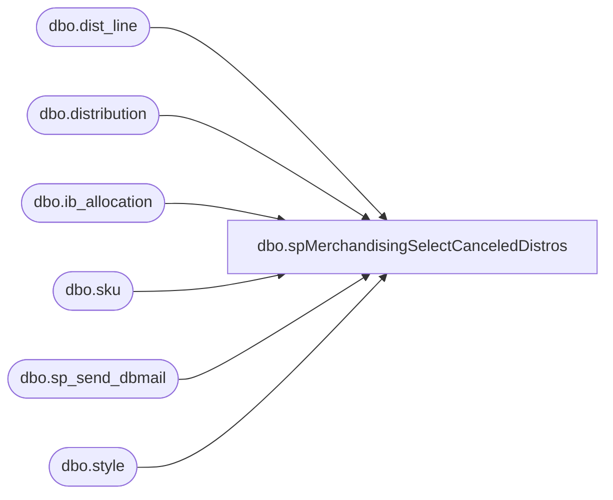

# dbo.spMerchandisingSelectCanceledDistros

**Database:** me_01  
**Server:** bedrockdb02  

## Architecture Diagram



## Table Dependencies

| Referenced Table |
|---|
| dbo.dist_line |
| dbo.distribution |
| dbo.ib_allocation |
| dbo.sku |
| dbo.sp_send_dbmail |
| dbo.style |

## Stored Procedure Code

```sql
CREATE procEDURE [dbo].[spMerchandisingSelectCanceledDistros]
AS
SET NOCOUNT ON

-- =====================================================================================================
-- Name: spMerchandisingSelectCanceledDistros
--
--				 
-- Revision History
--		Name:			Date:			Comments: This Proc is replaces existing DTS pkg on Beehive called Validation_Completed_Cancelled_Distros_Still_Allocated
--		Dan Tweedie 	    03/04/2015		Created proc.	
-- =====================================================================================================
IF (Object_ID('tempdb..##dis') IS NOT NULL) DROP TABLE ##dis
SELECT d.distribution_number
	,s.style_code
	,s.short_desc
	,sum(allocated_units) AS units
into ##dis
FROM ib_allocation ia(NOLOCK)
INNER JOIN distribution d(NOLOCK) ON d.distribution_number = ia.allocation_number
INNER JOIN dist_line dd(NOLOCK) ON d.distribution_id = dd.distribution_id
INNER JOIN sku sk(NOLOCK) ON dd.style_color_id = sk.style_color_id
INNER JOIN style s(NOLOCK) ON sk.style_id = s.style_id
WHERE d.distribution_status IN (8,9)
GROUP BY d.distribution_number
	,s.style_code
	,s.short_desc
HAVING sum(allocated_units) <> 0
ORDER BY d.distribution_number

if (select count(*) from ##dis) > 0

begin
	DECLARE @1query VARCHAR(1000)
		,@1file_name VARCHAR(100)
		,@1file_location VARCHAR(100)
		,@1server VARCHAR(20)
		,@1database VARCHAR(20)
		,@1sqlcmd VARCHAR(1000)
		,@1query_text VARCHAR(1000)
		,@1file VARCHAR(1000)
		,@1body VARCHAR(1000)
		,@1subj VARCHAR(1000)

	SELECT @1query_text = 'set nocount on select * from ##dis'

	SET @1query = @1query_text
	SET @1file_location = '\\kermode\FileRepository\MERCHANDISING\DBCompare\'
	SET @1file_name = 'DistroAllocatedProblem.csv'
	SET @1server = 'bedrockdb02'
	SET @1database = 'me_01'
	SET @1sqlcmd = 'sqlcmd -S' + @1server + ' -d' + @1database + ' -Q' + '"' + @1query + '"' + ' -o' + '"' + @1file_location + @1file_name + '"' + ' -s"," -w1000 -W'

	EXEC master..xp_cmdshell @1sqlcmd

	EXEC msdb.dbo.sp_send_dbmail 
		@profile_name = 'MerchAdmin',
		@recipients= 'EntSysSupport@buildabear.com',
		@body = 'If you have any problems with this report, please contactEntSysSupport@buildabear.com',
		@subject = 'Completed + Cancelled Distributions Still Allocated QTY - PROBLEM',
		@file_attachments ='\\kermode\FileRepository\MERCHANDISING\DBCompare\DistroAllocatedProblem.csv'


end
```

