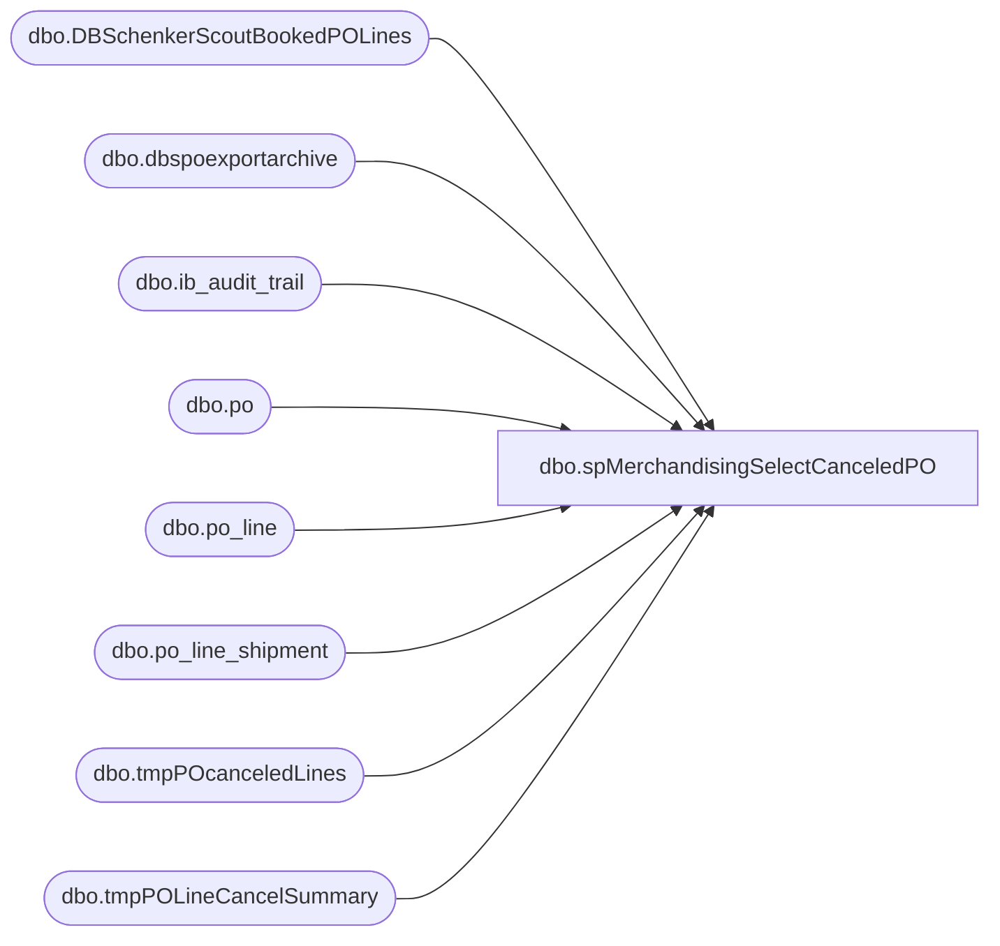

# dbo.spMerchandisingSelectCanceledPO

**Database:** me_01  
**Server:** bedrockdb02  

## Architecture Diagram



## Table Dependencies

| Referenced Table |
|---|
| dbo.DBSchenkerScoutBookedPOLines |
| dbo.dbspoexportarchive |
| dbo.ib_audit_trail |
| dbo.po |
| dbo.po_line |
| dbo.po_line_shipment |
| dbo.tmpPOcanceledLines |
| dbo.tmpPOLineCancelSummary |

## Stored Procedure Code

```sql
CREATE proc [dbo].[spMerchandisingSelectCanceledPO]

as 

-- =====================================================================================================
-- Name: spMerchandisingSelectCanceledPO
--
-- Description:	Captures records of PO data canceled or updated to 0 qty today, prepares for outbound export
--
-- Input:	NA
--
-- Output: log file and emails only if failure occurs
--
-- Dependencies: NA
--				 
-- Revision History
--		Name:			Date:			Comments:
--		Dan Tweedie		12/04/2012	Created proc.	
-- =====================================================================================================

set nocount on

truncate table tmpPOcanceledLines
truncate table tmpPOLineCancelSummary

IF (Object_ID('tempdb..#canceled_po') IS NOT NULL) DROP TABLE #canceled_po
select distinct iat.application_identifier as po_no
into #canceled_po
from ib_audit_trail iat (nolock)
join po po (nolock) on iat.application_identifier = po.po_no
left join DBSchenkerScoutBookedPOLines b (nolock) on iat.application_identifier = b.po_no 
join dbspoexportarchive dbsa (nolock) on iat.application_identifier = dbsa.purchaseorder
where iat.application = 'POM' 
and	iat.activity = 'Canceled'
and	po.po_status = 5 --canceled status
and datediff(dd, iat.entry_date, getdate()) = 0
and b.po_no is null
order by iat.application_identifier

if (select count(*) from #canceled_po) > 0 
begin
	--insert cancel records into tmpPOupdates table, which will be referenced in another script
	insert tmpPOcanceledLines
	select dbs.ProjID,dbs.PurchaseOrder, 'Cancel' as PurposeCode, dbs.Division,dbs.Department,dbs.Buyer,dbs.SupplierName,dbs.SupplierCode,
	dbs.SupplierAddress1,dbs.SupplierAddress2,dbs.SupplierAddress3,dbs.SupplierAddress4,dbs.UNLOCCodeValue,dbs.ScheduleKCode1,dbs.SupplierCity,dbs.SupplierState,dbs.SupplierCountry,dbs.SupplierPostal,dbs.
	OrderPaymentTerms,dbs.FreightPaymentTerms,dbs.OrderDate,dbs.PORef1,dbs.PORef2,dbs.PORef3,dbs.ShipToName,dbs.ShipToCode,dbs.ShipToEmail,dbs.ShipToAddress1,dbs.
	ShipToAddress2,dbs.ShipToAddress3,dbs.ShiptoAddress4,dbs.UNLOCCode1,dbs.ScheduleDorKCode,dbs.ShipToCountry,dbs.ShipToCity,dbs.ShipToState,dbs.ShipToZipCode,dbs.
	FactoryName,dbs.FactoryCode,dbs.FactoryAddress1,dbs.FactoryAddress2,dbs.FactoryAddress3,dbs.FactoryAddress4,dbs.UNLOCCode2,dbs.ScheduleKCode2,dbs.FactoryCity,dbs.
	FactoryState,dbs.FactoryCountry,dbs.FactoryPostal,dbs.ShipWindowStart,dbs.ShipWindowEnd,dbs.ShipWindowCancelDate,dbs.productdetailid,
	ProductDetailProductCode,dbs.ProductDetailProductDesc,dbs.ProductDetailHTS,dbs.ProductDetailOrderQuantity,dbs.QuantityUOM,dbs.UnitCost,dbs.Mode,dbs.
	ProductDetailMasterPackQty,dbs.ProductDetailNoOfPackages,dbs.ProductDetailInnerPackQty,dbs.ProductDetailTotalVolume,dbs.
	ProductDetailTotalWeight,dbs.ProductDetailProductPriority,dbs.ProductDetailManufacturerID,dbs.ProductDetailProductRef,dbs.
	ProductDetailProductRef2,dbs.ProductDetailProductRef3,dbs.ProductDetailProductRef4,dbs.ProductDetailProductRef5,dbs.
	OriginCountry,dbs.OriginCity,dbs.FinalDestination,dbs.POETA,dbs.ProductDate1,dbs.ProductDate2,dbs.Consolidator,dbs.Broker,dbs.Currency,dbs.
	SKUNumber,dbs.Size,dbs.Color,dbs.LineEndIndicator
	from dbspoexportarchive dbs
	join #canceled_po cp on dbs.purchaseorder = cp.po_no
	where dbs.exportdate in (select max(exportdate) from dbspoexportarchive where dbs.purchaseorder = purchaseorder and dbs.productdetailid = productdetailid) --since we may export the same po ship line multiple times, we want the most recent export
	order by dbs.purchaseorder, dbs.productdetailid
end
-------------

--Find PO's and shipment lines with shipment line qty set to 0 or deleted
	IF (Object_ID('tempdb..#canceled_lines') IS NOT NULL) DROP TABLE #canceled_lines
	select distinct po.po_no,
		   pl.po_line_id,
		   pls.po_line_shipment_id,
		   case when b.po_no is null then 'NO' else 'YES' end as booked
	into #canceled_lines
	from ib_audit_trail iat (nolock)
	join po po (nolock) on iat.application_identifier = po.po_no
	join po_line pl (nolock) on po.po_id = pl.po_id and substring(iat.application_key,9,100) = pl.line_no
	join po_line_shipment pls (nolock) on po.po_id = pls.po_id and pl.po_line_id = pls.po_line_id
	join dbspoexportarchive dbsa (nolock) on po.po_no = dbsa.purchaseorder and pls.po_line_shipment_id = dbsa.productdetailid --exported
	left join DBSchenkerScoutBookedPOLines b (nolock) on iat.application_identifier = b.po_no and pls.po_line_shipment_id = b.po_shipment_line --booked or not
	where iat.application = 'POM' 
	and	iat.action = 'Delete'
	and	iat.application_level = 'Order line'
	and	iat.field_affected = 'Order line'
	and	po.approval_status in (3,7) -- Approval
	and	po.po_status in (4,7) -- Open
	and (pls.quantity = 0 or pls.quantity is null)
	and datediff(dd, iat.entry_date, getdate()) = 0
	UNION ALL
	select distinct po.po_no,
		   pl.po_line_id,
		   pls.po_line_shipment_id,
		   case when b.po_no is null then 'NO' else 'YES' end as booked
	from ib_audit_trail iat (nolock)
	join po po (nolock) on iat.application_identifier = po.po_no
	join po_line pl (nolock) on po.po_id = pl.po_id 
	join po_line_shipment pls (nolock) on po.po_id = pls.po_id and pl.po_line_id = pls.po_line_id
	join dbspoexportarchive dbsa (nolock) on po.po_no = dbsa.purchaseorder and pls.po_line_shipment_id = dbsa.productdetailid --exported
	left join DBSchenkerScoutBookedPOLines b (nolock) on iat.application_identifier = b.po_no and pls.po_line_shipment_id = b.po_shipment_line --booked or not
	where iat.application = 'POM' 
	and	iat.action = 'Delete'
	and	iat.application_level = 'Order shipment'
	and	iat.field_affected = 'Order shipment'
	and	po.approval_status in (3,7) -- Approval
	and	po.po_status in (4,7) -- Open
	and (pls.quantity = 0 or pls.quantity is null)
	and datediff(dd, iat.entry_date, getdate()) = 0
	UNION ALL
	select distinct po.po_no,
		   pl.po_line_id,
		   pls.po_line_shipment_id,
		   case when b.po_no is null then 'NO' else 'YES' end as booked
	from ib_audit_trail iat (nolock)
	join po po (nolock) on iat.application_identifier = po.po_no
	join po_line pl (nolock) on po.po_id = pl.po_id 
	join po_line_shipment pls (nolock) on po.po_id = pls.po_id and pl.po_line_id = pls.po_line_id
		and	cast(substring(application_key,11,CHARINDEX(',', substring(application_key,11,500),1)-1) as int) = pls.po_line_id
	join dbspoexportarchive dbsa (nolock) on po.po_no = dbsa.purchaseorder and pls.po_line_shipment_id = dbsa.productdetailid --exported
	left join DBSchenkerScoutBookedPOLines b (nolock) on iat.application_identifier = b.po_no and pls.po_line_shipment_id = b.po_shipment_line --booked or not
	where iat.application = 'POM' 
	and	iat.action = 'Delete'
	and	iat.application_level = 'Order detail'
	and	iat.field_affected = 'Order detail'
	and	po.approval_status in (3,7) -- Approval
	and	po.po_status in (4,7) -- Open
	and	(pls.quantity is null or pls.quantity = 0)
	and datediff(dd, iat.entry_date, getdate()) = 0
	order by 1,2,3

	--find new lines created 
	if (select count(*) from #canceled_lines) > 0
	begin
		insert tmpPOLineCancelSummary
		select cl.po_no, cl.po_line_shipment_id canceled_line, cl.booked,
		pls.po_line_shipment_id new_line, pls.quantity
		from #canceled_lines cl
		join po (nolock) on cl.po_no = po.po_no
		join po_line pl (nolock) on po.po_id = pl.po_id and cl.po_line_id = pl.po_line_id
		join po_line_shipment pls (nolock) on po.po_id = pls.po_id and pl.po_line_id = pls.po_line_id
		where (pls.quantity is not null and pls.quantity <> 0)
		order by cl.po_no, cl.po_line_id, cl.po_line_shipment_id
	end

	if (select count(*) from #canceled_lines where booked = 'NO') > 0 
	begin
		--for lines not booked, prepare the cancel record
		insert tmpPOcanceledLines
		select distinct dbs.ProjID,dbs.PurchaseOrder, 'Cancel' as PurposeCode, dbs.Division,dbs.Department,dbs.Buyer,dbs.SupplierName,dbs.SupplierCode,
		dbs.SupplierAddress1,dbs.SupplierAddress2,dbs.SupplierAddress3,dbs.SupplierAddress4,dbs.UNLOCCodeValue,dbs.ScheduleKCode1,dbs.SupplierCity,dbs.SupplierState,dbs.SupplierCountry,dbs.SupplierPostal,dbs.
		OrderPaymentTerms,dbs.FreightPaymentTerms,dbs.OrderDate,dbs.PORef1,dbs.PORef2,dbs.PORef3,dbs.ShipToName,dbs.ShipToCode,dbs.ShipToEmail,dbs.ShipToAddress1,dbs.
		ShipToAddress2,dbs.ShipToAddress3,dbs.ShiptoAddress4,dbs.UNLOCCode1,dbs.ScheduleDorKCode,dbs.ShipToCountry,dbs.ShipToCity,dbs.ShipToState,dbs.ShipToZipCode,dbs.
		FactoryName,dbs.FactoryCode,dbs.FactoryAddress1,dbs.FactoryAddress2,dbs.FactoryAddress3,dbs.FactoryAddress4,dbs.UNLOCCode2,dbs.ScheduleKCode2,dbs.FactoryCity,dbs.
		FactoryState,dbs.FactoryCountry,dbs.FactoryPostal,dbs.ShipWindowStart,dbs.ShipWindowEnd,dbs.ShipWindowCancelDate,dbs.productdetailid,
		ProductDetailProductCode,dbs.ProductDetailProductDesc,dbs.ProductDetailHTS,dbs.ProductDetailOrderQuantity,dbs.QuantityUOM,dbs.UnitCost,dbs.Mode,dbs.
		ProductDetailMasterPackQty,dbs.ProductDetailNoOfPackages,dbs.ProductDetailInnerPackQty,dbs.ProductDetailTotalVolume,dbs.
		ProductDetailTotalWeight,dbs.ProductDetailProductPriority,dbs.ProductDetailManufacturerID,dbs.ProductDetailProductRef,dbs.
		ProductDetailProductRef2,dbs.ProductDetailProductRef3,dbs.ProductDetailProductRef4,dbs.ProductDetailProductRef5,dbs.
		OriginCountry,dbs.OriginCity,dbs.FinalDestination,dbs.POETA,dbs.ProductDate1,dbs.ProductDate2,dbs.Consolidator,dbs.Broker,dbs.Currency,dbs.
		SKUNumber,dbs.Size,dbs.Color,dbs.LineEndIndicator
		from dbspoexportarchive dbs
		join tmpPOLineCancelSummary cs on dbs.purchaseorder = cs.po_no and dbs.productdetailid = cs.canceled_line
		where cs.booked = 'NO'
		and dbs.exportdate in (select max(exportdate) from dbspoexportarchive where dbs.purchaseorder = purchaseorder and dbs.productdetailid = productdetailid) --since we may export the same po ship line multiple times, we want the most recent export
		order by dbs.purchaseorder, dbs.productdetailid
	end
```

