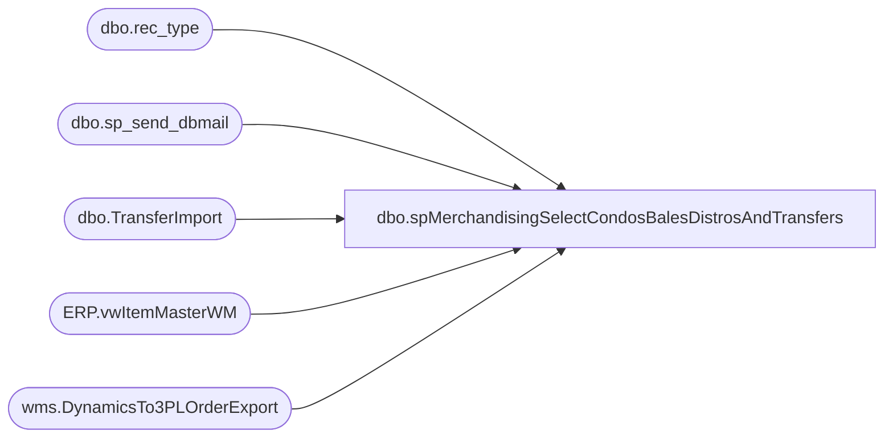

# dbo.spMerchandisingSelectCondosBalesDistrosAndTransfers

**Database:** me_01  
**Server:** bedrockdb02  

## Architecture Diagram



## Table Dependencies

| Referenced Table |
|---|
| dbo.rec_type |
| dbo.sp_send_dbmail |
| dbo.TransferImport |
| ERP.vwItemMasterWM |
| wms.DynamicsTo3PLOrderExport |

## Stored Procedure Code

```sql
CREATE proc [dbo].[spMerchandisingSelectCondosBalesDistrosAndTransfers]

as

-- =====================================================================================================
-- Name: spMerchandisingSelectCondosBalesDistrosAndTransfers
--
-- Description:	Sends and email with CSV attachment to report on Condos and Bales distros exported 'today' to 980 or 960, and pool point condo/bale transfers generated 'today'
--
-- Revision History
--		Name:			Date:			Comments:
--		Dan Tweedie		06/10/2014		Created proc.	
--		Lizzy Timm		01/28/2019		Added style code 056336 to where statement in the query that populates #condobales
--		Tim Callahan	01/30/2019		Changed logic to grab style case pack information from Dynamics Integration Database as Dynamics is now the system of record for Supply Styles 
--		Tim Callahan	08/04/2022		Updated Source For Temp Table #distros as related to 3PW integration with Dynamics
--		Lizzy Timm		10/17/2024		Added style code 057967 to where statement in the query that populates #condobales; BearAssist Ticket #53985
-- =====================================================================================================

set nocount on
--Remarked out and replaced pull from Aptos\Merch on 1/30/2019 as it is no longer the system of record for supply styles -- 01/30/2019 - TimC 
---get list of condo and bale styles, and their case pack custom property value
--if (object_id('tempdb..#condobales') is not null) drop table #condobales
--select s.style_code, s.short_desc, ecp.custom_property_value case_qty
--into #condobales
--from style s (nolock) 
--join style_group sg (nolock) on s.style_id = sg.style_id
--join hierarchy_group hg (nolock) on sg.hierarchy_group_id = hg.hierarchy_group_id
--left join entity_custom_property ecp on s.style_id = ecp.parent_id and ecp.parent_type = 1
--left join custom_property cp (nolock) on cp.custom_property_id = ecp.custom_property_id 
--where (hg.hierarchy_group_code in ('R-B-C-60-01-02', 'R-B-D-60-01-02') or s.style_code in ('000050', '100050', '400050','056336')) --Added 056336 per request by Eric Donald
--and cp.cust_prop_code = 'FRCSTM' -- Number of units in a pack custom property 


-- Added 01/30/2019
-- get list of condo and bale styles, and their case pack value from Dynamics as it is now the system of record for supplies
-- The specificed style list made need to change but this is basically all the applicable Aptos supply condo\bales styles that also exist in the Dynamics Integrations
if (object_id('tempdb..#condobales') is not null) drop table #condobales
select style as style_code, sku_desc as short_desc, STD_PACK_QTY as case_qty
into #condobales
from [stl-ssis-p-01].IntegrationStaging.ERP.vwItemMasterWM
where style in ('000050','009229','010391','011299','051394','054866','054946','055868','056123','056336','057967 ','854866','856150','856183','856184','856255')
and entity = '1100' -- Chose this as it is the primary Entity, if issues arise with report may have to build this differently 
order by 1


--get list of transfers created through transfer import process (which archives to the TransferImport table) for bales/condos
if (object_id('tempdb..#transfers') is not null) drop table #transfers
select 'Pool Point Transfer' as DocumentType,
ti.from_location SourceLocation,
ti.to_location DestinationLocation,
rt.message rec_type,
cb.style_code, 
cb.short_desc,
(ti.qty * cb.case_qty) unit_qty
into #transfers
from TransferImport ti (nolock)
join #condobales cb on right(ti.upc, 6) = cb.style_code
join rec_type rt (nolock) on ti.reason_code = rt.reasoncode
where datediff(dd, import_time, getdate()) = 0

--get list of distros exported today for bales/condos
if (object_id('tempdb..#distros') is not null) drop table #distros
--select 'Distro / Shipment' as DocumentType,
--ddas.sourceid SourceLocation,
--ddas.destid DestinationLocation,
--rt.message rec_type,
--cb.style_code, 
--cb.short_desc,
--(ddas.quantity * cb.case_qty) unit_qty
--into #distros
--from distribution_data_after_split ddas (nolock)
--join #condobales cb on ddas.style_code = cb.style_code
--join rec_type rt (nolock) on ddas.rec_type = rt.rectype
--where ddas.sourceid in ('0980', '0960')
--and released = 1
--and datediff(dd, ddas.release_date, getdate()) = 0

select 'Distro / Shipment' as DocumentType,
ddas.sourceid SourceLocation,
ddas.destid DestinationLocation,
rt.message rec_type,
cb.style_code, 
cb.short_desc,
(ddas.quantity * cb.case_qty) unit_qty
into #distros
from [stl-ssis-p-01].IntegrationStaging.wms.DynamicsTo3PLOrderExport ddas (nolock)
join #condobales cb on ddas.style_code = cb.style_code
join rec_type rt (nolock) on ddas.rec_type = rt.rectype
where ddas.sourceid in ('0980', '0960')
and ddas.ExportDate is not null 
and datediff(dd, ddas.ExportDate, getdate()) = 0


--summarize data into one table
if (object_id('tempdb..##summary') is not null) drop table ##summary
select DocumentType, SourceLocation, DestinationLocation, Rec_Type, Style_Code, Short_Desc, Sum(unit_qty) Unit_Qty
into ##summary
from #transfers
group by DocumentType, SourceLocation, DestinationLocation, Rec_Type, Style_Code, Short_Desc
union all
select DocumentType, SourceLocation, DestinationLocation, Rec_Type, Style_Code, Short_Desc, Sum(unit_qty) Unit_Qty
from #distros
group by DocumentType, SourceLocation, DestinationLocation, Rec_Type, Style_Code, Short_Desc
order by DocumentType, SourceLocation, DestinationLocation, Rec_Type, Style_Code

if (select count(*) from ##summary) > 0

begin

	----output csv file
	---CSV with headers
	declare @query varchar(1000),
			@date varchar(200),
			@file_name varchar(100),
			@file_location varchar(100),
			@server varchar(20),
			@username varchar(20),
			@password varchar(20),
			@database varchar(20),
			@sqlcmd varchar(1000),
			@query_text varchar(1000)

	select @query_text = 'set nocount on select DocumentType, SourceLocation, DestinationLocation, Rec_Type, Style_Code, Short_Desc, Unit_Qty from ##summary order by DocumentType, SourceLocation, DestinationLocation, Rec_Type, Style_Code'

	set @date = convert(varchar, datepart(yyyy, getdate())) + '-' + convert(varchar, datepart(mm, getdate())) + '-' + convert(varchar, datepart(dd, getdate()))
	set @query = @query_text
	set @file_location = '\\kermode\FileRepository\MERCHANDISING\BaleCondoReports\' 
	set @file_name = 'BalesAndCondosExportSummary.csv'
	set @server = 'bedrockdb02'
	set @database = 'me_01'
	set @sqlcmd = 'sqlcmd -S' + @server + ' -d' + @database + ' -Q' + '"' + @query + '"' + ' -o' + '"' + @file_location + @file_name + '"' + ' -s"," -w100 -W'
	exec master..xp_cmdshell @sqlcmd
	
	---send email
    exec msdb.dbo.sp_send_dbmail
	@profile_name = 'merchadmin',
	@recipients = 'truckingservices@buildabear.com;distrobears@buildabear.com',
	@body = 'See attached Bales and Condos Export Summary file',
	@subject = 'Bales & Condos Export Summary',
	@file_attachments = '\\kermode\FileRepository\MERCHANDISING\BaleCondoReports\BalesAndCondosExportSummary.csv'

	--rename file with datestamp and move it to history folder
	declare @rename varchar(1000)
	select @rename = 'ren \\kermode\FileRepository\MERCHANDISING\BaleCondoReports\BalesAndCondosExportSummary.csv BalesAndCondosExportSummary' + @date + '.csv'
		
	EXEC master..xp_cmdshell @rename
	EXEC master..xp_cmdshell 'move \\kermode\FileRepository\MERCHANDISING\BaleCondoReports\* \\kermode\FileRepository\MERCHANDISING\BaleCondoReports\History'
						

end

---if nothing exported, send email to say no exports
if (select count(*) from ##summary) = 0

begin
    exec msdb.dbo.sp_send_dbmail
	@profile_name = 'merchadmin',
	@recipients = 'truckingservices@buildabear.com;distrobears@buildabear.com; TaylorRockwell@buildabear.com;',
	@body = 'No condos or bales were exported today.',
	@subject = 'Bales & Condos Export Summary - *no exports today*'
end
```

