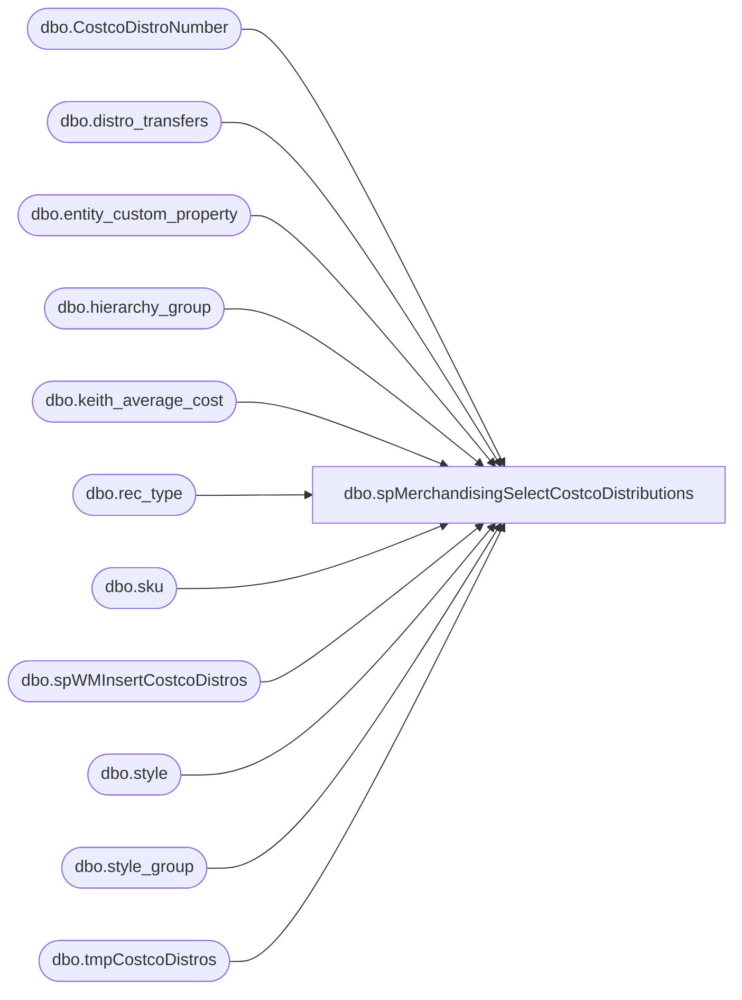

# dbo.spMerchandisingSelectCostcoDistributions

**Database:** me_01  
**Server:** bedrockdb02  

## Architecture Diagram



## Table Dependencies

| Referenced Table |
|---|
| dbo.CostcoDistroNumber |
| dbo.distro_transfers |
| dbo.entity_custom_property |
| dbo.hierarchy_group |
| dbo.keith_average_cost |
| dbo.rec_type |
| dbo.sku |
| dbo.spWMInsertCostcoDistros |
| dbo.style |
| dbo.style_group |
| dbo.tmpCostcoDistros |

## Stored Procedure Code

```sql
CREATE proc [dbo].[spMerchandisingSelectCostcoDistributions]

as

-- =====================================================================================================
-- Name: spMerchandisingSelectCostcoDistributions
--
-- Description:	Since we do not want Costco distributions to enter into Merch, this procedure will grab the distros
--				From distro_transfers push them over to WM's distro input table (inpt_store_distro)
--				
--				 
-- Revision History
--		Name:			Date:			Comments:
--		Dan Tweedie		08/30/2013 		Created proc.
--		Dan Tweedie		11/11/2013		Added handling for rec types 34 & 35	
--		Dan Tweedie		09/21/2014		Added logic to get average cost per unit for supplies (instead of per case as is the default for supplies), 
--										and to round the average cost to 2 decimals
--		Dan Tweedie		11/6/2014		Added handling for rec type 36
--		Dan Tweedie		11/18/2014		Added handling for rec type 37
-- =====================================================================================================


set nocount on

---this table is already created for this procedure
--create table CostcoDistroNumber
--(CostcoDistroNumber int)
--------------------------------------

--log the ID's of the records which need to export
IF (Object_ID('tempdb..#dt_id') IS NOT NULL) DROP TABLE #dt_id
select id 
into #dt_id
from distro_transfers (nolock)
where rec_type in (33, 34, 35, 36, 37)
and exported_date is null

if (select count(*) from #dt_id) > 0

	BEGIN
		
		declare @distribution_number varchar(52)

		select @distribution_number = max(CostcoDistroNumber)+1 from CostcoDistroNumber

		--stage data to be retrieved by proc on WM server
		IF (Object_ID('tempdb..#a') IS NOT NULL) DROP TABLE #a
		select right(('0000' + cast(dt.sourceid as varchar)), 4) as sourceid,
			   dt.destid as destid,
			   right(('000000' + cast(dt.upc_number as varchar)), 6) as style_code,
			  dt.quantity as quantity,
				dt.rec_type,
				rt.reasoncode,
				rt.priority,
				ROW_NUMBER () OVER (PARTITION BY sourceid, upc_number, rec_type ORDER BY destid) as sequencenbr,
				'C' + cast((@distribution_number + dense_rank() over (order by sourceid, upc_number, rec_type)) as varchar) as distribution_number,
				dt.groupinglabel as po_nbr,
				--case when att.attribute_set_code = 'YES' then 'Y' else 'N' end as active_pick_flag,
				'Y' as active_pick_flag,
				--kac.average_cost
				case when kac.average_cost is null then 0.01 
					else case when substring(hg.hierarchy_group_code,7,2) = '60' then kac.average_cost/ecp.custom_property_value 
						else kac.average_cost end 
				end as 'average_cost'
		into #a
		from distro_transfers dt (nolock)
		join style s (nolock) on right(('000000' + cast(dt.upc_number as varchar)), 6) = s.style_code
		join sku (nolock) on s.style_id = sku.style_id
		join style_group sg on s.style_id = sg.style_id
		join hierarchy_group hg on hg.hierarchy_group_id = sg.hierarchy_group_id
		left join entity_custom_property ecp on ecp.parent_id = s.style_id
			and ecp.custom_property_id = 2 -- FRCSTM --number of units in a pack
			and	parent_type = 1
		--join entity_attribute_set eas (nolock) on s.style_id = eas.parent_id
		--join attribute_set att (nolock) on eas.attribute_set_id = att.attribute_set_id
		--join attribute a (nolock) on att.attribute_id = a.attribute_id and a.parent_type = 1 and a.attribute_code in ('ACTIVE')
		left join keith_average_cost kac (nolock) on right(('000000' + cast(dt.upc_number as varchar)), 6) = kac.style_code
		join rec_type rt (nolock) on dt.rec_type = rt.rectype
		where dt.id in (select id from #dt_id)
		order by 7,6

		IF (Object_ID('me_01..tmpCostcoDistros') IS NOT NULL) DROP TABLE tmpCostcoDistros
		select sourceid, destid, style_code, quantity, rec_type, reasoncode, priority, sequencenbr, distribution_number, po_nbr, active_pick_flag, 
		CAST(round(average_cost, 2) AS DECIMAL(8,2)) average_cost
		into tmpCostcoDistros
		from #a
		-------------------------------------------------------------------------------------------------------------------------

		--runs on wm server, inserts data into inpt_store_distro, runs bridge to insert data into production store_distro table
		exec wmdb01.wmprod.dbo.spWMInsertCostcoDistros

		--archive max distro number used, so next time the process runs, it will generate a distro number with incremented value
		insert CostcoDistroNumber
		select substring(max(distribution_number),2,52) 
		from tmpCostcoDistros

		---set the exported_date value so we don't export these distros again when the process runs next time
		update distro_transfers
		set exported_date = getdate()
		where id in (select id from #dt_id)
		
	END
```

