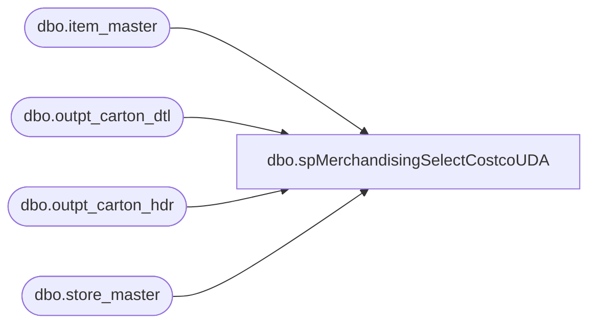

# dbo.spMerchandisingSelectCostcoUDA

**Database:** me_01  
**Server:** bedrockdb02  

## Architecture Diagram



## Table Dependencies

| Referenced Table |
|---|
| dbo.item_master |
| dbo.outpt_carton_dtl |
| dbo.outpt_carton_hdr |
| dbo.store_master |

## Stored Procedure Code

```sql
CREATE proc [dbo].[spMerchandisingSelectCostcoUDA]

as

-- =====================================================================================================
-- Name: spMerchandisingSelectCostcoUDA
--
-- Description:	Selects and formats Costco shipment data from WM to post as a UDA to Merch
--
-- Dependency: Called by spMerchandisingOutputCostcoUDA, which takes this data and puts it into a file and sends to pipeline
--				
-- Revision History
--		Name:			Date:			Comments:
--		Dan Tweedie		09/04/2013		Created proc.	
--		Dan Tweedie		11/11/2013		Revised code for integrity
--		Dan Tweedie		01/21/2014		Added join to store_master and address tables to ensure we capture all shipments shipped to Costco, regardless of ship_via
--		Dan Tweedie		07/23/2014		Added query at beginning of process to get list of costco locations, modified main query to join to list of store numbers
--		Dan Tweedie		06/10/2015		Added blank column to end of detail row per epicor's new spec
-- =====================================================================================================


set nocount on

--get list of costco location numbers
IF (Object_ID('tempdb..#locs') IS NOT NULL) DROP TABLE #locs
select store_nbr
into #locs
from wmdb01.wmprod.dbo.store_master
where name like '%costco%'

IF (Object_ID('tempdb..#shippedTotal') IS NOT NULL) DROP TABLE #shippedTotal
select ocd.style, 
		case when im.store_dept = 'SUP' 
			then ocd.units_pakd/im.std_pack_qty
      else ocd.units_pakd
		end 
		as qty, convert(varchar, och.mod_date_time, 112) datestamp
into #shippedTotal
from wmdb01.wmprod.dbo.outpt_carton_hdr och 
join wmdb01.wmprod.dbo.outpt_carton_dtl ocd on och.carton_nbr = ocd.carton_nbr
join wmdb01.wmprod.dbo.item_master im on ocd.style = im.style
join #locs l on och.ship_to = l.store_nbr
where datediff(dd, och.create_date_time, getdate()) = 0

IF (Object_ID('tempdb..#shipped') IS NOT NULL) DROP TABLE #shipped
select style, cast(sum(qty) as int) qty, datestamp
into #shipped
from #shippedTotal
group by style, datestamp


------------------------------------------------
declare @date varchar(12),
		@counter int,
		@total int,
		@recordtype varchar(1),
		@action_type varchar(1),
		@docnbr varchar(52),
		@recordtype2 varchar(1),
		@location varchar(4),
		@upc varchar(12),
		@units int

set @date = convert(varchar, getdate(), 101)
set @counter = 1
select @total = count(distinct style) from #shipped
select @docnbr = convert(varchar, datestamp) + 'CST' from #shipped
				
declare style cursor for 
						select ('000000' + style), sum(qty)*-1
						from #shipped
						group by ('000000' + style)
						order by ('000000' + style)

print 'H' + '	' + 'A' + '	' + convert(varchar, @docnbr) + '	' + @date + '	' + 'U' + '	' + 'MerchAdmin' + '	' + 'CostcoShipment' + '	' + '3' + '	' + 'CostcoShipmentUDA'

					
open style

	while @counter <= @total

		begin
			fetch next from style into @upc, @units
	
			print 'D' + '	' + 'A' + '	' + convert(varchar, @docnbr) + '	' + 'S' + '	' + '0980' + '	' + @upc +  '	' +  '	' +  '	' +  '	' +  '	' + '	' + convert(varchar, @units) + '	' + '	'  
							
			set @counter = @counter + 1

		end	

close style
deallocate style
```

