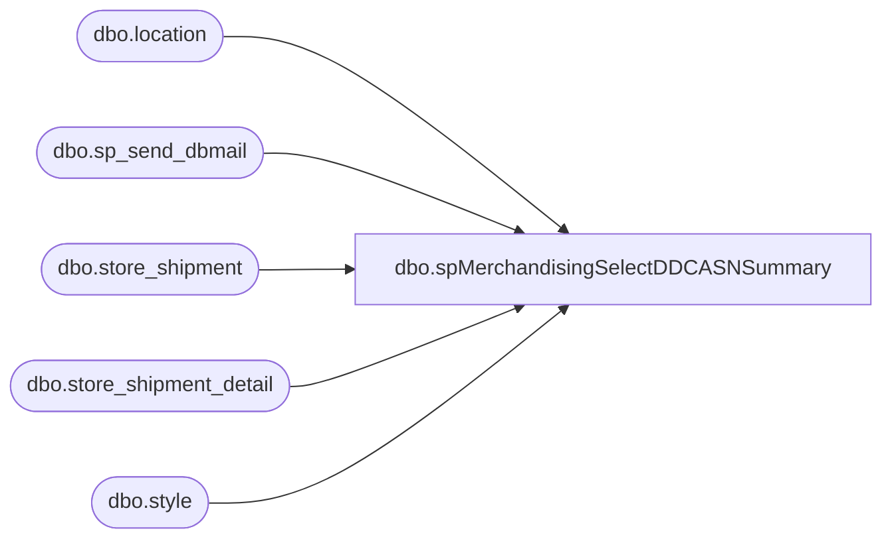

# dbo.spMerchandisingSelectDDCASNSummary

**Database:** me_01  
**Server:** bedrockdb02  

## Architecture Diagram



## Table Dependencies

| Referenced Table |
|---|
| dbo.location |
| dbo.sp_send_dbmail |
| dbo.store_shipment |
| dbo.store_shipment_detail |
| dbo.style |

## Stored Procedure Code

```sql
CREATE proc [dbo].[spMerchandisingSelectDDCASNSummary]
as
set nocount on

-- =====================================================================================================
-- Name: spMerchandisingSelectDDCASNSummary
--
-- Description:	Captures and emails a summary of shipments from DDC to the Ohio Bearhouse, for shipments shipped 'yesterday'.
--
-- Input:	
--
-- Output: report is emailed
--
-- Dependencies: na
--				 
-- Revision History
--		Name:			Date:			Comments:
--		Dan Tweedie		02/15/2011		Created proc.	
-- =====================================================================================================


if (select count(*)
	from store_shipment ss (nolock)
	join location l (nolock) on l.location_id = ss.location_id
	join location l2 (nolock) on l2.location_id = ss.from_location_id
	where (l.location_code = '0980' and l2.location_code = '0960')
	and datediff(dd, ss.ship_date, getdate()-1) = 0)
	> 0 
	
BEGIN

	declare @date varchar(12),
			@subj varchar(52),
			@text nvarchar(max),
			@recip varchar(1000),
			@cc varchar(100)

	select @date = convert(varchar, getdate()-1, 101)

	set @subj = 'ASN: DDC to Bearhouse'
	set @recip = 'OhioIN@buildabear.com'

	set @text = 
	'<font face =arial size = 2><B>ASN Summary</B><br>' +
		'The following shipments were shipped out of DDC on ' + @date + '<br>' + 
		'Please reference the Shipment number in the ''Blind Receipt''' + '<br>' + '<br>' + 
	'</font>' +
		'<table border="1">' +
			'<tr><th><font face =arial size = 2>SHIPMENT</font></th>' +
				'<th><font face =arial size = 2>STYLE</font></th>' +
				'<th><font face =arial size = 2>CARTONS</font></th>' +
				'<th><font face =arial size = 2>UNITS</font></th>' +
				'<th><font face =arial size = 2>EXPECTED RECEIPT DATE</font></th>' +
	'<font face =arial size = 2>' +
		CAST ( ( SELECT distinct 
						td = ss.document_no, '',
						td = s.style_code, '',
						td = count(distinct ssd.carton_no), '',
						td = sum(ssd.units_sent), '',
						td = convert(varchar, ss.expected_receipt_date, 101), ''
				  from store_shipment ss (nolock)
					join store_shipment_detail ssd (nolock) on ss.store_shipment_id = ssd.store_shipment_id
					join style s (nolock) on s.style_id = ssd.style_id
					join location l (nolock) on l.location_id = ss.location_id
					join location l2 (nolock) on l2.location_id = ss.from_location_id
					where (l.location_code = '0980' and l2.location_code = '0960')
					and datediff(dd, ss.ship_date, getdate()-1) = 0
					group by ss.document_no, s.style_code, convert(varchar, ss.expected_receipt_date, 101)
				  FOR XML PATH('tr'), TYPE 
		) AS NVARCHAR(MAX) ) +
		'</font></table></font></p></p>
		<br>
		<font face =arial size = 1><B>This report was run from bedrockdb02.me_01.dbo.spMerchandisingSelectDDCASNSummary.</B></font>
		<br>
		<br>
	<font face =arial size = 1><i>The information in this message may be privileged, “confidential” and protected from disclosure and/or intended only for the addressee(s) named above.  If the reader of this message is not the intended recipient, or an employee or agent responsible for delivering this message to the intended recipient, you are hereby notified that any dissemination, distribution or copying of the communication is strictly prohibited.  If you have received this communication in error, please notify us immediately by replying to the message and deleting it from your computer.  Thank you beary much.</i></font>'


			exec msdb.dbo.sp_send_dbmail
				@profile_name = 'MerchAdmin',
				@recipients = @recip,
				@body = @text,
				@subject = @subj,
				@body_format = 'HTML'

END
```

