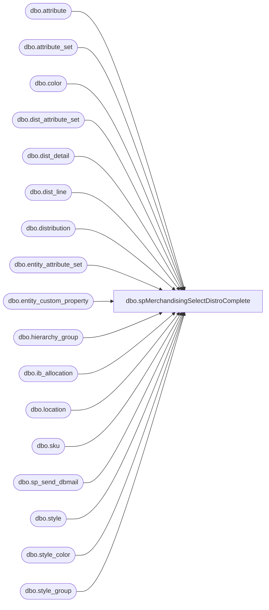

# dbo.spMerchandisingSelectDistroComplete

**Database:** me_01  
**Server:** bedrockdb02  

## Architecture Diagram



## Table Dependencies

| Referenced Table |
|---|
| dbo.attribute |
| dbo.attribute_set |
| dbo.color |
| dbo.dist_attribute_set |
| dbo.dist_detail |
| dbo.dist_line |
| dbo.distribution |
| dbo.entity_attribute_set |
| dbo.entity_custom_property |
| dbo.hierarchy_group |
| dbo.ib_allocation |
| dbo.location |
| dbo.sku |
| dbo.sp_send_dbmail |
| dbo.style |
| dbo.style_color |
| dbo.style_group |

## Stored Procedure Code

```sql
CREATE proc [dbo].[spMerchandisingSelectDistroComplete] 

as

-- =====================================================================================================
-- Name: spMerchandisingSelectDistroComplete
--
-- Description:	Creates a 'distribution complete' document for the Pipeline to close distros that are 14 days or older (28 days for franchisees) or with 0 allocated qty.
--				Sends an email to Distro team when distros are open for 21 days.
-- Input: N/A
--
-- Output: 
--
-- Dependencies: 
--
-- Revision History
--		Name:			Date:			Comments:
--		Dan Tweedie		08/11/2014		Created proc.	
--		Tim Callahan	02/15/2016		Added China Warehouses to 28 Day Logic
--		Keith Lee		10/6/2016		Added code to exclude MX distros 699144 and 699149 due to email from Shaun and Julia.
--		Tim Callahan	10/26/2016		Removed code to exclude MX distros 699144 and 699149 due to email as advised by Shaun 
--		Tim Callahan	12/04/2017		Added code to excluded Location Code 8723 (Harry's Kitchen) distributions from Distro Complete and E-mail Alert
--										This is because at this time we don't have an automated solution from Kerry Logistics (3970) for inventory movments from 3970 to 8723
--		Tim Callahan	01/05/2018		Added code to 8523 (Australia Franchisee) from 3970 as there are issues with the DC getting the shipment data back to us. 
--		Tim Callahan	04/09/2018		Specified some distribution docs to exclude as  as there are issues with the DC (3970) getting the shipment data back to us. 
--		Tim Callahan	04/23/2018		Removed exlusion filter defined on 4/9/2018, BQ user Tonya Robinson miskeyed these and didn't tell us. 
--		Tim Callahan	04/27/2018		Added additional IB_Allocation Transaction Codes - Unsure why these were excluded in the first place
--										Essentially it was not getting a true allocation sum because it wasn't excluding other ib_allocation transaction codes 
--		Tim Callahan	08/30/2018		Specified some distribution docs to exclude at request of TamiB due to delayed shipping. 
--		Tim Callahan	09/24/2018		Removed the filter distro docs from Tami's 8/30/2018  exclude request
--		Tim Callahan	10/23/2018		Added Rachel Lopez to email distro list per HEAT SR 23638
--		Lizzy Timm		03/05/2020		Modified date diff from 14 to 21 per HEAT SR 27488 
-- =====================================================================================================


IF (Object_ID('tempdb..##distros') IS NOT NULL) DROP TABLE ##distros
select distinct 'DC' as RecordType,
	d.distribution_number,
	'1' as LineNumber
into ##distros
from 	distribution d with (nolock)
join	dist_line dl with (nolock) on d.distribution_id = dl.distribution_id
join dist_detail dd with (nolock) on d.distribution_id = dd.distribution_id 
join location l2 with (nolock) on dd.location_id = l2.location_id
join entity_attribute_set easwc (nolock) on l2.location_id = easwc.parent_id
	and easwc.parent_type  = 2
join attribute_set atswc with (nolock) on easwc.attribute_set_id = atswc.attribute_set_id
join attribute awc (nolock) on atswc.attribute_id = awc.attribute_id
	and awc.attribute_code= 'DC'
where	d.distribution_status in (6,7) 
and datediff(dd, d.release_date, getdate()) >= 
	case when l2.location_code like '8___' or l2.location_code in ('9472', '9471','3970','3980','3981')
		then 28 
		else 21 -- Updated 03/05/2020, previously 14
	end
and l2.location_code not in ('8723') -- Added 12/4/2017
--and d.distribution_number not in ('121225','123740','123741','123742','123743','123744','123745','123746','123747','123748','123749','123751','123752','123753','123754','123756','123757','123758','123759','123760','123761','123762','123763','123764','123765','123766','123767','123768','123769','123770','123771','123772','123773','123774','123775','123776','123777','123778','123779','123780','123781','123782','123783','123785','123786','123787','123788','123790','123791','123792','123793','123794','123795','123796','123797','123798','123799','123800','123801','123802','123803','123804','123805','123806','123807','123808','123809','123810','123811','123812','123813','123814','123815','123816','123817','123818','123819','123820','123821','123822','123823','123824','123825','123826','123827','123828','123837','123838','123839','123840','123841','123842','123843','123844','123845','123846','123847','123848','123849','123850','123851','123853','123854','123855','123856','123857','123858','123859','123860','123861','123862','123865','123866','123867','123868','123869','123870','123871','123872','123874','123875','123876','123877','123878','123879','123880','123881','123882','123883','123884','123886','123887','123888','123889','123890','123891','123892','123893','123894','123895','123896','123897','123898','123899','123900','123901','123902','123903','123904','123905','123906','123908','123909','123910','123911','123912','123913','123914','123915','123916','123917','123918','123919','123920','123921','123922','123923','123924','123925','123926','123927','123928','123929','123930','123931','123932','123933','123934','123936','123937','123938','123939','123940','123941','123942','123943','123944','123946','123947','123948','123949','123950','123951','123952','123953','123954','123955','123957','123958','123959','123960','123961','123962','123963','123965','123966','123967','123968','123969','123970','123971','123972','123973','123974','123975','123976','123977','123978','123979','123980','123981','123982','123983','123984','123985','123986','123987','123989','123990','123991','123992','123995','123996','123997','123998','123999','124000','124001','124002','124004','124005','124006','124007','124008','124009','124011','124012','124013','124014','124015','124016','124017','124018','124019','124020','124021','124022','124023','124024','124025','124026','124027','124028','124029','124030','124031','124032','124033','124034','124035','124036','124037','124038','124039','124040','124041','124042','124043','124044','124045','124046','124047','124048','124049','124050','124051','124052','124053','124054','124056','124057','124058','124059','124060','124061','124062','124063','124064','124065','124066','124067','124068','124070','124071','124072','124073','124074','124075','124076','124077','124078','124079','124080','124081','124082','124083','124084','124085','124086','124087','124088','124089','124090','124091','124092','124093','124094','124095','124096','124097','124098','124099','124100','124101','124102','124103','124104','124105','124106','124107','124108','124109','124110','124111','124113','124114','124115','124116','124117','124118','124119','124120','124121','124122','124123','124124','124125','124126','124127','124128','124129','124130','124131','124132','124133','124134','124135','124136','124137','124138','124139','124140','124142','124143','124144','124145','124146','124149','124150','124151','124152','124153','124154','124160','124161','124162','124163','124164','124165','124166','124167','124168','124169','124170','124171','124172','124173','124174','124175','124176','124177','124178','124179','124180','124181','124182','124183','124184','124185','124186','124187','124188','124189','124190','124191','124192','124194','124195','124196','124197','124198','124199','124200','124201','124202','124203','124204','124206','124207','124208','124209','124210','124212','124214','124215','124217','124218','124219','124220','124221','124223','124224','124225','124226','124227','124229','124230','124231','124232','124233','124234','124235','124236','124237','124238','124239','124240','124241','124242','124243','124244','124245','124246','124247','124248','124249','124250','124251','124252','124253','124254','124255','124256','124257','124258','124259','124260','124261','124262','124263','124264','124265','124266','124267','124268','124269','124270','124271','124272','124273','124274','124275','124276','124277','124278','124279','124280','124281','124282','124283','124284','124285','124286','124287','124288','124289','124290','124291','124292','124293','124294','124295','124296','124297','124298','124299','124300','124301','124302','124303','124304','124305','124306','124307','124308','124309','124310','124311','124312','124313','124314','124315','124316','124317','124318','124319','124320','124321','124322','124323','124334','124336','124337','124338','124340','124341','124342','124343','124344','124345','124346','124347','124348','124351','124352','124354','124355','124357','124360','124362','124363','124364','124365','124368','124369','124371','124372','124373','124374','124376','124379','124380','124381','124382','124384','124385','124386','124390','124392','124393','124394','124395','124396','124397','124400','124401','124402','124431','124433','124435','124437','124439','124590','124608','124610','124621','124623','124624','124626','124629','124631','124633','124635','124636','124637','124640','127484','127485','127486','127487','127490','127491','127496','127498','127500','127502','127712','127717') -- Added 8/30/2018
union all
select distinct 'DC' as RecordType,
	d.distribution_number,
	'1' as LineNumber
from ib_allocation ia with (nolock)
join distribution d with (nolock) on ia.allocation_number = d.distribution_number
where d.distribution_status in (6,7)
and	ia.transaction_type_code in ('800','810','820','830','840','850') -- Updated 4/27/2018, previously only included transaction codes 800 and 820
--and d.distribution_number not in ('121225','123740','123741','123742','123743','123744','123745','123746','123747','123748','123749','123751','123752','123753','123754','123756','123757','123758','123759','123760','123761','123762','123763','123764','123765','123766','123767','123768','123769','123770','123771','123772','123773','123774','123775','123776','123777','123778','123779','123780','123781','123782','123783','123785','123786','123787','123788','123790','123791','123792','123793','123794','123795','123796','123797','123798','123799','123800','123801','123802','123803','123804','123805','123806','123807','123808','123809','123810','123811','123812','123813','123814','123815','123816','123817','123818','123819','123820','123821','123822','123823','123824','123825','123826','123827','123828','123837','123838','123839','123840','123841','123842','123843','123844','123845','123846','123847','123848','123849','123850','123851','123853','123854','123855','123856','123857','123858','123859','123860','123861','123862','123865','123866','123867','123868','123869','123870','123871','123872','123874','123875','123876','123877','123878','123879','123880','123881','123882','123883','123884','123886','123887','123888','123889','123890','123891','123892','123893','123894','123895','123896','123897','123898','123899','123900','123901','123902','123903','123904','123905','123906','123908','123909','123910','123911','123912','123913','123914','123915','123916','123917','123918','123919','123920','123921','123922','123923','123924','123925','123926','123927','123928','123929','123930','123931','123932','123933','123934','123936','123937','123938','123939','123940','123941','123942','123943','123944','123946','123947','123948','123949','123950','123951','123952','123953','123954','123955','123957','123958','123959','123960','123961','123962','123963','123965','123966','123967','123968','123969','123970','123971','123972','123973','123974','123975','123976','123977','123978','123979','123980','123981','123982','123983','123984','123985','123986','123987','123989','123990','123991','123992','123995','123996','123997','123998','123999','124000','124001','124002','124004','124005','124006','124007','124008','124009','124011','124012','124013','124014','124015','124016','124017','124018','124019','124020','124021','124022','124023','124024','124025','124026','124027','124028','124029','124030','124031','124032','124033','124034','124035','124036','124037','124038','124039','124040','124041','124042','124043','124044','124045','124046','124047','124048','124049','124050','124051','124052','124053','124054','124056','124057','124058','124059','124060','124061','124062','124063','124064','124065','124066','124067','124068','124070','124071','124072','124073','124074','124075','124076','124077','124078','124079','124080','124081','124082','124083','124084','124085','124086','124087','124088','124089','124090','124091','124092','124093','124094','124095','124096','124097','124098','124099','124100','124101','124102','124103','124104','124105','124106','124107','124108','124109','124110','124111','124113','124114','124115','124116','124117','124118','124119','124120','124121','124122','124123','124124','124125','124126','124127','124128','124129','124130','124131','124132','124133','124134','124135','124136','124137','124138','124139','124140','124142','124143','124144','124145','124146','124149','124150','124151','124152','124153','124154','124160','124161','124162','124163','124164','124165','124166','124167','124168','124169','124170','124171','124172','124173','124174','124175','124176','124177','124178','124179','124180','124181','124182','124183','124184','124185','124186','124187','124188','124189','124190','124191','124192','124194','124195','124196','124197','124198','124199','124200','124201','124202','124203','124204','124206','124207','124208','124209','124210','124212','124214','124215','124217','124218','124219','124220','124221','124223','124224','124225','124226','124227','124229','124230','124231','124232','124233','124234','124235','124236','124237','124238','124239','124240','124241','124242','124243','124244','124245','124246','124247','124248','124249','124250','124251','124252','124253','124254','124255','124256','124257','124258','124259','124260','124261','124262','124263','124264','124265','124266','124267','124268','124269','124270','124271','124272','124273','124274','124275','124276','124277','124278','124279','124280','124281','124282','124283','124284','124285','124286','124287','124288','124289','124290','124291','124292','124293','124294','124295','124296','124297','124298','124299','124300','124301','124302','124303','124304','124305','124306','124307','124308','124309','124310','124311','124312','124313','124314','124315','124316','124317','124318','124319','124320','124321','124322','124323','124334','124336','124337','124338','124340','124341','124342','124343','124344','124345','124346','124347','124348','124351','124352','124354','124355','124357','124360','124362','124363','124364','124365','124368','124369','124371','124372','124373','124374','124376','124379','124380','124381','124382','124384','124385','124386','124390','124392','124393','124394','124395','124396','124397','124400','124401','124402','124431','124433','124435','124437','124439','124590','124608','124610','124621','124623','124624','124626','124629','124631','124633','124635','124636','124637','124640','127484','127485','127486','127487','127490','127491','127496','127498','127500','127502','127712','127717') -- Added 8/30/2018
group by d.distribution_number
having sum(allocated_units) = 0

if (select count(*) from ##distros) > 0

begin
		
	declare @query varchar(1000),
			@date varchar(52),
			@file_name varchar(100),
			@file_location varchar(100),
			@server varchar(20),
			@database varchar(20),
			@bcp varchar(1000)

	set @query = 'select distinct * from ##distros'
	select @date = convert(varchar, datepart(yyyy, getdate())) + convert(varchar, datepart(mm, getdate())) + convert(varchar, datepart(dd, getdate())) + convert(varchar, datepart(hh, getdate())) + convert(varchar, datepart(mi, getdate())) + convert(varchar, datepart(ss, getdate())) 
	set @file_location = '\\pipeapp01\Company01\Text File to AR Import Tables - Distribution Complete\'
	set @file_name = 'NSBDISTCOMPLETE.' + @date +'.GO'
	set @server = 'bedrockdb02'
	set @database = 'me_01'
	set @bcp = 'bcp "' + @query + '" queryout "' + @file_location + @file_name + '"  -T -c -S' + @server

	exec master..xp_cmdshell @bcp

--------execute the pipeline segments
EXEC pipeapp01.master..xp_cmdshell 'PipelineScheduleClient Start 16502 0'

EXEC pipeapp01.master..xp_cmdshell 'PipelineScheduleClient Start 65000 0'

end


---send email alert to Distro team when franchisee distros are open for 21 days
IF (Object_ID('tempdb..##twenty_one') IS NOT NULL) DROP TABLE ##twenty_one
select d.distribution_number,
l1.location_code whse,
l2.location_code destination,
s.style_code, 
sum(dd.quantity) qty
into ##twenty_one
from 	distribution d with (nolock)
join	location l1 with (nolock) on d.location_id = l1.location_id
join	dist_line dl with (nolock) on d.distribution_id = dl.distribution_id
join	style_color sc with (nolock) on dl.style_color_id = sc.style_color_id
join	style s with (nolock) on sc.style_id = s.style_id
join	style_group sg with (nolock) on s.style_id = sg.style_id
join	hierarchy_group hg with (nolock) on sg.hierarchy_group_id = hg.hierarchy_group_id
join	color c with (nolock) on sc.color_id = c.color_id
join	sku sk with (nolock) on s.style_id = sk.style_id
join	dist_detail dd with (nolock) on sk.sku_id = dd.sku_id
	and		d.distribution_id = dd.distribution_id 
join	location l2 with (nolock) on dd.location_id = l2.location_id
join  entity_attribute_set easwc (nolock) on l2.location_id = easwc.parent_id
	and         easwc.parent_type  = 2
join  attribute_set atswc (nolock) on easwc.attribute_set_id = atswc.attribute_set_id
join  attribute awc (nolock) on atswc.attribute_id = awc.attribute_id
	and         awc.attribute_code= 'DC'
left outer join	dist_attribute_set das with (nolock) on d.distribution_id = das.distribution_id
left outer join	entity_custom_property ecp with (nolock) on s.style_id = ecp.parent_id
	and		ecp.parent_type = 1
	and		ecp.custom_property_id = 2
left join attribute_set ats (nolock) on das.attribute_set_id = ats.attribute_set_id
	and		ats.attribute_id = 112
where	d.distribution_status in (6,7) -- 2 = Preliminary 5 = Open 6 = Release 9 = Cancelled
and		dd.quantity > 0
and		sc.reorder_flag = 1
and datediff(dd, d.release_date, getdate()) = 21
and l1.location_code not in ('8723') -- Added 12/4/2017
group by d.distribution_number, l1.location_code, l2.location_code, s.style_code

if (select count(*) from ##twenty_one) > 0 

begin
	
	declare @text nvarchar(max)


	set @text = '<font face =arial size = 2>' + 
			'The distros listed below are open and 21 days old. These will be closed if they reach 28 days old.' +
			'<br>'+
				'<table border="1">' +
				'<tr><th>Distribution Number</th><th>Whse</th><th>Destination</th><th>Style Code</th><th>Qty</th></tr>' +
				CAST ( ( SELECT td = distribution_number,'',
								td = whse, '',
								td = destination, '',
								td = style_code, '',
								td = qty, ''
						  from ##twenty_one
						  order by distribution_number, destination, style_code
						  FOR XML PATH('tr'), TYPE 
				) AS NVARCHAR(MAX) ) +
				'</font></table></font></p></p>'

	exec msdb.dbo.sp_send_dbmail
		@profile_name = 'merchadmin',
		@recipients = 'distrobears@buildabear.com;imerchandising@buildabear.com;RachelL@buildabear.com',
		@body = @text,
		@subject = 'Distributions 21 Days Old',
		@body_format = 'HTML'

end
```

