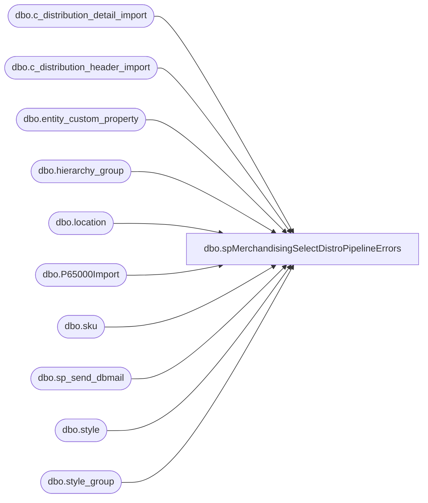

# dbo.spMerchandisingSelectDistroPipelineErrors

**Database:** me_01  
**Server:** bedrockdb02  

## Architecture Diagram



## Table Dependencies

| Referenced Table |
|---|
| dbo.c_distribution_detail_import |
| dbo.c_distribution_header_import |
| dbo.entity_custom_property |
| dbo.hierarchy_group |
| dbo.location |
| dbo.P65000Import |
| dbo.sku |
| dbo.sp_send_dbmail |
| dbo.style |
| dbo.style_group |

## Stored Procedure Code

```sql
CREATE proc [dbo].[spMerchandisingSelectDistroPipelineErrors]

as 

-- =====================================================================================================
-- Name: spMerchandisingSelectDistroPipelineErrors
--
-- Description:	Captures and emails details of records that failed to integrate from the distro_transfers table to the Merchandising system.
--				These records are normally exported via the paperclip or Access system and brought into distro_transfers.
--				From distro_transfers, the pipeline segment 65000 runs and drops the records into c_distribution_header_import.
--				Per Keith Lee, these records should leave the table as they are integrated into Merch. If that doesn't happen, it's a problem.
--				Our solution is to keep a record of the max distro from this table, then check for new records with a distro greater than the previous max.
--				There's about 200 records in there now which represent previous errors from the past several years.
-- Input:	
--
-- Output: report is emailed
--
-- Dependencies: na
--				 
-- Revision History
--		Name:			Date:			Comments:
--		Dan Tweedie		10/12/2012		Created proc.	
-- =====================================================================================================

set nocount on 

if (select max(distribution_id) from c_distribution_header_import) > (select max_distro from P65000Import)

--if records found above, proceed to send an email and archive the max distro number

BEGIN

--find records in the 65000 pipeline import table where the distro number is greater than the max distro number recorded previously from the table
	IF (Object_ID('tempdb..##distro_pipeline_error') IS NOT null) DROP TABLE ##distro_pipeline_error
	select h.distribution_id DISTRO_ID, 
		   l.location_code FROM_LOCN,
		   l2.location_code TO_LOCN, 
		   s.style_code STYLE, 
		   case when substring(hg.hierarchy_group_code,7,2) ='60' then 'Supply' else 'Merch' end as STYLE_TYPE, 
		   d.quantity QTY, 
		   case when substring(hg.hierarchy_group_code,7,2) ='60' 
				then ecp.custom_property_value 
				else s.distribution_multiple 
				end as DISTRO_MULTIPLE
	into ##distro_pipeline_error
	from dbo.c_distribution_header_import h (nolock)
	join dbo.c_distribution_detail_import d (nolock) on h.distribution_id = d.distribution_id
	left join location l (nolock) on h.location_id = l.location_id
	left join location l2 (nolock) on d.location_id = l2.location_id
	left join sku (nolock) on d.sku_id = sku.sku_id
	left join style s (nolock) on sku.style_id = s.style_id
	left join style_group sg (nolock) on s.style_id = sg.style_id
	left join hierarchy_group hg (nolock) on sg.hierarchy_group_id = hg.hierarchy_group_id
	left join entity_custom_property ecp (nolock) on s.style_id = ecp.parent_id
		and ecp.custom_property_id = 2
		and	ecp.parent_type = 1
	where h.distribution_id > (select max_distro from P65000Import)
	order by h.distribution_id, l.location_code, l2.location_code, s.style_code, d.quantity


	
	exec msdb.dbo.sp_send_dbmail
	@profile_name = 'merchadmin',
 	@recipients = 'EnterpriseSystemsAlerts@buildabear.com;',
	@body = 'At least one distribution record failed to integrate from distro_transfers into Merchandising. This needs to be investigated so the appropriate distro or purchasing person can rekey if necessary. 
	
	This message was brought to you by Bedrockdb02.me_01.dbo.spMerchandisingSelectDistroPipelineErrors',
	@subject = 'Access to A&R Pipeline 65000 Error',
	@query = 'set nocount on select * from ##distro_pipeline_error order by 1',
	@importance = high
	
	--truncate the table, as it always only needs 1 record
	truncate table P65000Import

	--insert the new max distribution into the table for reference when the job runs next time
	insert P65000Import
	select max(DISTRO_ID) max_distro
	from ##distro_pipeline_error

END
```

