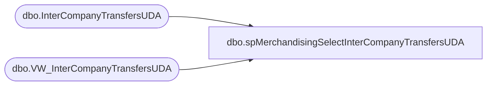

# dbo.spMerchandisingSelectInterCompanyTransfersUDA

**Database:** me_01  
**Server:** bedrockdb02  

## Architecture Diagram



## Table Dependencies

| Referenced Table |
|---|
| dbo.InterCompanyTransfersUDA |
| dbo.VW_InterCompanyTransfersUDA |

## Stored Procedure Code

```sql
CREATE proc [dbo].[spMerchandisingSelectInterCompanyTransfersUDA]

as 

-- =====================================================================================================
-- Name: spMerchandisingSelectInterCompanyTransfersUDA
--
-- Description:	Outputs data in format for UDA file for Pipeline
--
-- Revision History
--		Name:			Date:			Comments:
--		Keith Lee		08/12/2020		Created proc
-- =====================================================================================================

set nocount on


--STAGE UDA DATA	-- these are unreceived shipments and transfers to franchisee locations
IF (Object_ID('me_01..InterCompanyTransfersUDA ') IS NOT null) DROP TABLE InterCompanyTransfersUDA 
select *
into InterCompanyTransfersUDA 
from VW_InterCompanyTransfersUDA 

--IF UDA DATA IS STAGED, PROCEED TO REMAINING STEPS
if (select count(*) from InterCompanyTransfersUDA ) > 0 

begin


declare @date varchar(12),
		@location varchar(4),
		@upc varchar(12),
		@units varchar(100),
		@total int

select @date = convert(varchar, getdate(), 101)
select @total = count(*) from InterCompanyTransfersUDA 


print 'H' + '	' + 'A' + '	' + '' + '	' + @date + '	' + 'INTCO' + '	' + 'UDA Upload' + '	' + 'InterCoXfr' + '	' + '3' + '	' + ''

while @total > 0
	BEGIN
		
		select @location = max(location_code) from InterCompanyTransfersUDA 
		select @upc = max(upc) from InterCompanyTransfersUDA  where location_code = @location
		select @units = units from InterCompanyTransfersUDA  where location_code = @location and upc = @upc

		print 'D' + '	' + 'A' + '	' + '' + '	' + 'S' + '	' + @location + '	' + @upc +  '	' +  '	' +  '	' +  '	' +  '	' + '	' + @units + '	'  + '	'
		
		delete from InterCompanyTransfersUDA where location_code = @location and upc = @upc
		
		select @total = count(*) from InterCompanyTransfersUDA 

		if @total = 0
			break
		else
			continue
	END

END
```

