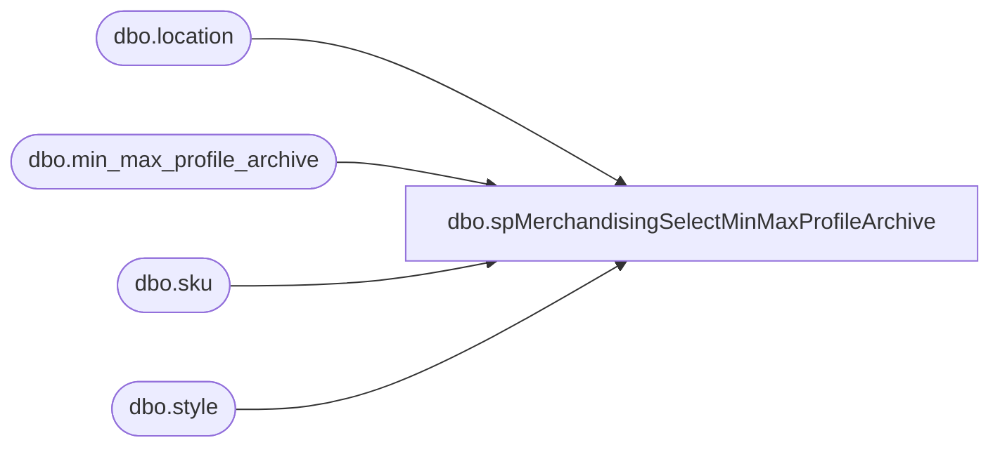

# dbo.spMerchandisingSelectMinMaxProfileArchive

**Database:** me_01  
**Server:** bedrockdb02  

## Architecture Diagram



## Table Dependencies

| Referenced Table |
|---|
| dbo.location |
| dbo.min_max_profile_archive |
| dbo.sku |
| dbo.style |

## Stored Procedure Code

```sql
CREATE proc [dbo].[spMerchandisingSelectMinMaxProfileArchive] 
		@style varchar(6) = '%',
		@loc varchar(4) = '%',
		@date1 varchar(10),
		@date2 varchar(10)
as

-- =====================================================================================================
-- Name: spMerchandisingSelectMinMaxProfileArchive
--
-- Description:	Selects from min_max_profile_archive table, is called from a Smartlook report.
--
-- Input:	NA
--
-- Output: NA
--
-- Dependencies: NA
--				 
-- Revision History
--		Name:			Date:			Comments:
--		Dan Tweedie		02/14/2010		Created proc.	
-- =====================================================================================================

select 
	convert(varchar, mm.archive_date, 101) archive_date,
	s.style_code,
	l.location_code,
	mm.presentation_stock,
	--mm.capacity_maximum,
	--mm.minimum,	
	--mm.maximum,	
	mm.dynamic_minimum,
	mm.dynamic_maximum,	
	mm.dynamic_start_date,
	--mm.order_point,
	mm.incl_pres_stock_with_ord_pt_fl,
	mm.[source],
	mm.last_activity_date,
	mm.updatestamp
from min_max_profile_archive mm (nolock)
join sku (nolock) on sku.sku_id = mm.sku_id
join style s (nolock) on s.style_id = sku.style_id
join location l (nolock) on l.location_id = mm.location_id
where s.style_code like @style
and l.location_code like @loc
and convert(varchar, mm.archive_date, 101) between @date1 and @date2
order by convert(varchar, mm.archive_date, 101), l.location_code, s.style_code
```

