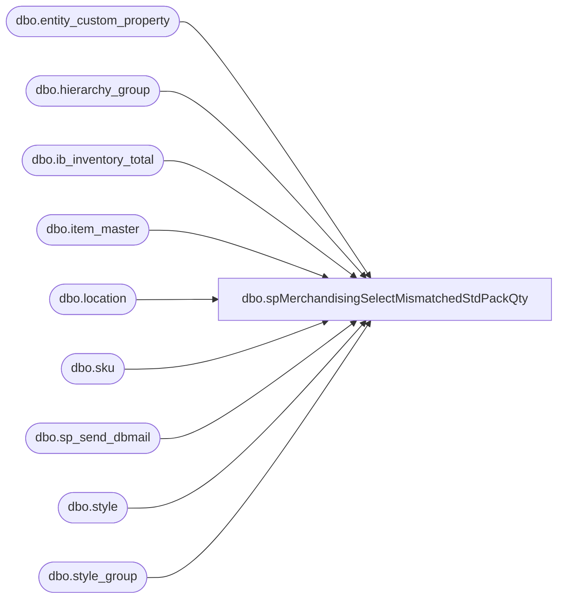

# dbo.spMerchandisingSelectMismatchedStdPackQty

**Database:** me_01  
**Server:** bedrockdb02  

## Architecture Diagram



## Table Dependencies

| Referenced Table |
|---|
| dbo.entity_custom_property |
| dbo.hierarchy_group |
| dbo.ib_inventory_total |
| dbo.item_master |
| dbo.location |
| dbo.sku |
| dbo.sp_send_dbmail |
| dbo.style |
| dbo.style_group |

## Stored Procedure Code

```sql
CREATE proc [dbo].[spMerchandisingSelectMismatchedStdPackQty] 

as

-- =====================================================================================================
-- Name: spMerchandisingSelectMismatchedStdPackQty 
--
-- Description:	Reports styles in Merch which have a different Std Pack Qty than what is in WM
--				
--
-- Input:	
--
-- Output: email
--
-- Dependencies: NA
--				 
-- Revision History
--		Name:			Date:			Comments:
--		Dan Tweedie		04/29/2013		created proc
--		Tim Callahan	10/01/2018		Updated proc to exclude supply styles as those are managed by D365 now 
-- =====================================================================================================


set nocount on


if (object_id('tempdb..##merch') is not null) drop table ##merch
select s.style_code, s.short_desc,
sum(ISNULL(iit.total_on_hand_units,0)) as total_on_hand_units,
case when substring(hg.hierarchy_group_code,7,2) = '60' then 'Supplies' else 'Merch' end as MerchOrSupply,
case when substring(hg.hierarchy_group_code,7,2)='60' then isnull(ecp2.custom_property_value,1) else s.distribution_multiple end as STD_PACK_QTY
into ##Merch
FROM style s (nolock) 
join sku sku (nolock) on s.style_id = sku.style_id 
join style_group sg (nolock) on s.style_id = sg.style_id
join hierarchy_group hg (nolock) on sg.hierarchy_group_id = hg.hierarchy_group_id
join ib_inventory_total iit (nolock) on sku.sku_id = iit.sku_id
join location l (nolock) on iit.location_id = l.location_id
left outer join entity_custom_property ecp2 (nolock) on	s.style_id = ecp2.parent_id
	and		ecp2.custom_property_id = 2 -- FRCSTM
	and		ecp2.parent_type = 1
WHERE iit.inventory_status_id = 1
and l.location_code = '0980'
and substring(hg.hierarchy_group_code,7,2)<>'60' -- Added 10/01/2018
group by s.style_code, s.short_desc, substring(hg.hierarchy_group_code,7,2), isnull(ecp2.custom_property_value,1), s.distribution_multiple
order by s.style_code

if (object_id('tempdb..##wm') is not null) drop table ##wm
select style, sku_desc, std_pack_qty
into ##wm
from wmdb01.wmprod.dbo.item_master im
where im.store_dept <> 'SUP' -- Added 10/01/2018

/* if (object_id('tempdb..##wm') is not null) drop table ##wm
select DISTINCT im.ItemNumber [style], 
	p.ProductName [sku_desc], 
	u.Factor [std_pack_qty]
  into ##wm
  from [stl-ssis-p-01].IntegrationStaging.Wms.ItemMasterProducts p
		LEFT JOIN [stl-ssis-p-01].IntegrationStaging.WMS.ItemMaster im
		  ON im.ItemNumber = p.ProductNumber
			AND im.Entity = p.Entity
		LEFT JOIN [stl-ssis-p-01].IntegrationStaging.WMS.ItemsUOM u
		  ON im.ItemNumber = u.ProductNumber		
			AND im.Entity = u.Entity
	where im.NecessaryProductionWorkingTimeSchedulingPropertyId <> 'Supplies'
		AND u.ToUnitSymbol = 'ea'
		AND u.FromUnitSymbol = 'ip' */ -- Uncomment out if report needed post WM upgrade

if (select count(m.style_code)
	from ##merch m 
	join ##wm wm on m.style_code = wm.style
	where m.std_pack_qty <> wm.std_pack_qty) > 0

begin

	declare @text nvarchar(max)
	
	set @text = '
		<font face =arial><H1>Mismatched Std Pack Qty Between Merchandising and WM</H1>' +
			'<table border="1">' +
			'<tr><th>STYLE</th><th>DESCRIPTION</th><th>Merch Std Pack QTy</th><th>WM Std Pack Qty</th><th>Qty On Hand</th></tr>' +
			'<font face =arial size = 2>' +
			CAST ( ( SELECT td = m.style_code,'',
							td = m.short_desc, '',
							td = cast(m.std_pack_qty as int), '',
							td = cast(wm.std_pack_qty as int), '',
							td = m.total_on_hand_units, ''
					from ##merch m 
					join ##wm wm on m.style_code = wm.style
					where m.std_pack_qty <> wm.std_pack_qty
					order by m.style_code
					  FOR XML PATH('tr'), TYPE 
			) AS NVARCHAR(MAX) ) +
			'</font></table></font></p></p>
			<br>
			<font face =arial size = 1>This report was run from bedrockdb02.me_01.dbo.spMerchandisingSelectMismatchedStdPackQty</font>
			<br>
			<br>
		<font face =arial size = 1><i>The information in this message may be privileged, “confidential” and protected from disclosure and/or intended only for the addressee(s) named above.  If the reader of this message is not the intended recipient, or an employee or agent responsible for delivering this message to the intended recipient, you are hereby notified that any dissemination, distribution or copying of the communication is strictly prohibited.  If you have received this communication in error, please notify us immediately by replying to the message and deleting it from your computer.  Thank you beary much.</i></font>'

	exec msdb.dbo.sp_send_dbmail
	@profile_name = 'MerchAdmin',
	@recipients = 'corieb@buildabear.com;karid@buildabear.com;tracyf@buildabear.com;merchadmin@buildabear.com',
	@body = @text,
	@subject = 'Mismatched std_pack_qty at 980',
	@body_format = 'HTML'

end
```

