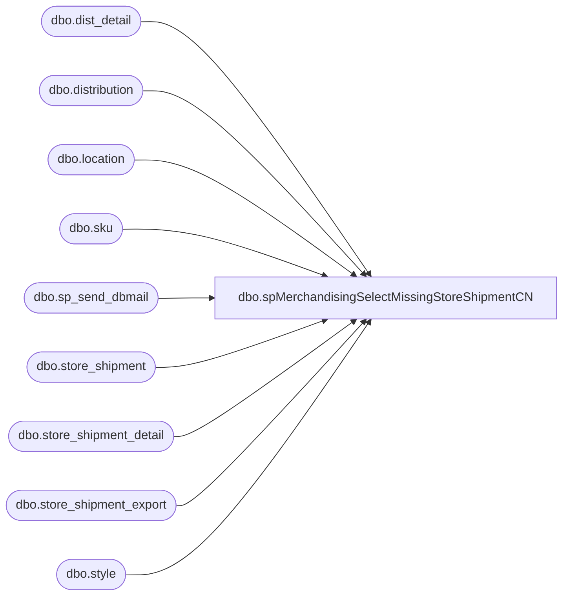

# dbo.spMerchandisingSelectMissingStoreShipmentCN

**Database:** me_01  
**Server:** bedrockdb02  

## Architecture Diagram



## Table Dependencies

| Referenced Table |
|---|
| dbo.dist_detail |
| dbo.distribution |
| dbo.location |
| dbo.sku |
| dbo.sp_send_dbmail |
| dbo.store_shipment |
| dbo.store_shipment_detail |
| dbo.store_shipment_export |
| dbo.style |

## Stored Procedure Code

```sql
CREATE procEDURE [dbo].[spMerchandisingSelectMissingStoreShipmentCN]
AS
SET NOCOUNT ON

-- =====================================================================================================
-- Name: spMerchandisingSelectMissingStoreShipmentCN
--
-- Description: 
--
-- Input:	
--
-- Output: 
--
-- Dependencies: 
--				 
-- Revision History
--		Name:			Date:			Comments: 
--		Tim Calahan	    05/24/2016		Created proc.	
--		Tim Callahan	06/02/2016		Remarked out Date Diff Logic for Release Date, Un-Remarked Logic for Date diff on Expected Ship Date
--		Tim Callahan	06/13/2016		Added expected_ship_date to CSV report fields, also update e-mail body text 
--		Tim Callahan	08/16/2016		Added Field to SSE Table, Cancelled, for shipments cancelled after export, this way we still have record. 
--		Tim Callahan	05/08/2018		Added Icn Chen as To line email and moved MerchAdmin to CC line. Expectation is that Icn is to notify our team if shipments intentionally delayed. 
--		Tim Callahan	06/14/2018		Added 8502 and 8505 to the included warehouses 
-- =====================================================================================================

IF (Object_ID('tempdb..#work_Validation_Missing_Store_Shipment_Report_CN') IS NOT NULL) DROP TABLE #work_Validation_Missing_Store_Shipment_Report_CN
SELECT cast(sse.document_number AS DECIMAL(20, 0)) AS document_number
	,sse.release_date
	,sse.distribution_number
	,sse.warehouse
	,sse.style_code
	,sse.location_code
	,sse.rec_type
	,sse.expected_ship_date
INTO #work_Validation_Missing_Store_Shipment_Report_CN
FROM store_shipment_export sse
LEFT JOIN store_shipment ss ON ss.document_no = left(sse.document_number, 10)
LEFT JOIN store_shipment_detail ssd ON ssd.store_shipment_id = ss.store_shipment_id
LEFT JOIN style s ON s.style_id = ssd.style_id AND sse.style_code = s.style_code
LEFT JOIN location l ON l.location_id = ss.location_id AND sse.location_code = l.location_code
INNER JOIN distribution d ON d.distribution_number = sse.distribution_number
WHERE ss.document_no IS NULL
	AND l.location_code IS NULL
	AND s.style_code IS NULL
	AND sse.warehouse in ('3970','8502','8505') -- Added to list on 6/14/2018
	AND sse.cancelled IS NULL -- Added 8/16/2016
	AND d.distribution_status NOT IN (8,9)
	--AND sse.release_date < cast(convert(VARCHAR, getdate() - 3, 101) AS DATETIME) -- This field will likely be obsolete when new development complete. 
	AND sse.Expected_Ship_Date < cast(convert(VARCHAR, getdate() - 1, 101) AS DATETIME) -- Once Future development is in place we will be using this field for determining if BAB should have this data back. 
ORDER BY sse.location_code --sse.document_number, sse.style_code

--select * from #work_Validation_Missing_Store_Shipment_Report_CN

-- 
IF (Object_ID('tempdb..##CN_Ship_Validation_CSV') IS NOT NULL) DROP TABLE ##CN_Ship_Validation_CSV
SELECT kt.document_number
	,kt.release_date
	,kt.distribution_number
	,kt.warehouse
	,kt.style_code
	,kt.location_code
	,kt.rec_type
	,kt.expected_ship_date
INTO ##CN_Ship_Validation_CSV
FROM #work_Validation_Missing_Store_Shipment_Report_CN kt
INNER JOIN distribution d(NOLOCK) ON kt.distribution_number = d.distribution_number
INNER JOIN style s(NOLOCK) ON kt.style_code = s.style_code
INNER JOIN sku sk(NOLOCK) ON s.style_id = sk.style_id
INNER JOIN dist_detail dd(NOLOCK) ON d.distribution_id = dd.distribution_id AND sk.sku_id = dd.sku_id
INNER JOIN location l(NOLOCK) ON dd.location_id = l.location_id AND kt.location_code = l.location_code
WHERE dd.quantity <> 0
ORDER BY 1,5

-- select * from  ##CN_Ship_Validation_CSV

if (select count(*) from ##CN_Ship_Validation_CSV) > 0

BEGIN
	DECLARE @1query VARCHAR(1000)
		,@1file_name VARCHAR(100)
		,@1file_location VARCHAR(100)
		,@1server VARCHAR(20)
		,@1database VARCHAR(20)
		,@1sqlcmd VARCHAR(1000)
		,@1query_text VARCHAR(1000)
		,@1file VARCHAR(1000)
		,@1body VARCHAR(1000)
		,@1subj VARCHAR(1000)

	SELECT @1query_text = 'set nocount on select * from ##CN_Ship_Validation_CSV'

	SET @1query = @1query_text
	SET @1file_location = '\\kermode\FileRepository\MERCHANDISING\DBCompare\'
	SET @1file_name = 'CN_missing_store_shipments.csv'
	SET @1server = 'bedrockdb02'
	SET @1database = 'me_01'
	SET @1sqlcmd = 'sqlcmd -S' + @1server + ' -d' + @1database + ' -Q' + '"' + @1query + '"' + ' -o' + '"' + @1file_location + @1file_name + '"' + ' -s"," -w1000 -W'

	EXEC master..xp_cmdshell @1sqlcmd

	EXEC msdb.dbo.sp_send_dbmail 
		@profile_name = 'MerchAdmin',
		@recipients='IcnC@buildabear.com;RachelL@buildabear.com',
		@copy_recipients = 'EntSysSupport@buildabear.com;',
		@file_attachments = '\\kermode\FileRepository\MERCHANDISING\DBCompare\CN_missing_store_shipments.csv',
		@body = 'Icn Chen\Rachel Lopez,
Here is a report of Store Shipments that were sent to the CN Warehouse but have not been fed back into Merchandising. Please investigate and provide an update to MerchAdmin@buildabear.com',
		@subject = 'Missing Store Shipments CN'

END
```

