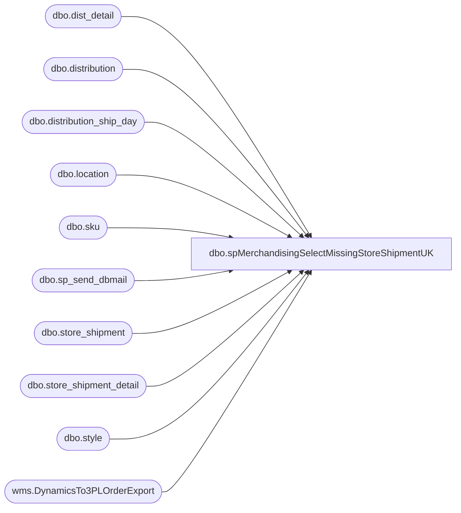

# dbo.spMerchandisingSelectMissingStoreShipmentUK

**Database:** me_01  
**Server:** bedrockdb02  

## Architecture Diagram



## Table Dependencies

| Referenced Table |
|---|
| dbo.dist_detail |
| dbo.distribution |
| dbo.distribution_ship_day |
| dbo.location |
| dbo.sku |
| dbo.sp_send_dbmail |
| dbo.store_shipment |
| dbo.store_shipment_detail |
| dbo.style |
| wms.DynamicsTo3PLOrderExport |

## Stored Procedure Code

```sql
CREATE procEDURE [dbo].[spMerchandisingSelectMissingStoreShipmentUK]
AS
SET NOCOUNT ON

-- =====================================================================================================
-- Name: spMerchandisingSelectMissingStoreShipmentUK
--
-- Description: 
--
-- Input:	
--
-- Output: 
--
-- Dependencies: 
--				 
-- Revision History
--		Name:			Date:			Comments: This Proc is replaces existing DTS pkg on Beehive called Validation_Missing_Store_Shipment_V1
--		Dan Tweedie 	    03/05/2015		Created proc.	
--		Tim Callahan		08/16/2016		Added Field to SSE Table, Cancelled, for shipments cancelled after export, this way we still have record. 
--		Tim Callahan		07/25/2018		Made some temporary changes until this code can be rewritten, isn't working as designed. 
--		Tim Callahan		10/23/2018		Changed the e-mail, putting the earnest on the Clipper Ops group to advise on the missing data 
--		Tim Callahan		12/12/2018		Changed the Report Sorting to be by document number
--		Tim Callahan		07/25/2019		Removed Tami B from email CC
--		Lizzy Timm			07/28/2022		Added Santiago B to email
--		Tim Callahan		08/04/2022		Updated Data Source due to changes related to 3PW Integationg with Dynamics
-- =====================================================================================================

IF (Object_ID('tempdb..#work_Validation_Missing_Store_Shipment_Report_UK') IS NOT NULL) DROP TABLE #work_Validation_Missing_Store_Shipment_Report_UK
SELECT
cast(sse.document_number AS DECIMAL(20, 0)) AS document_number
,cast(sse.ExportDate as date) as release_date
,sse.distribution_number
,sse.sourceid as warehouse
,sse.style_code 
,sse.destid as location_code
	,dsd.ship_day_1 AS ship_day
	,sse.rec_type
INTO #work_Validation_Missing_Store_Shipment_Report_UK
FROM [stl-ssis-p-01].[IntegrationStaging].wms.DynamicsTo3PLOrderExport sse
--LEFT JOIN store_shipment ss ON ss.document_no = sse.document_number
LEFT JOIN store_shipment ss ON ss.document_no = cast(cast(sse.document_number AS DECIMAL(10, 0)) AS VARCHAR)
LEFT JOIN store_shipment_detail ssd ON ssd.store_shipment_id = ss.store_shipment_id
LEFT JOIN style s ON s.style_id = ssd.style_id AND sse.style_code = s.style_code
LEFT JOIN location l ON l.location_id = ss.location_id AND sse.destid = l.location_code
INNER JOIN distribution d ON d.distribution_number = sse.distribution_number
INNER JOIN distribution_ship_day dsd ON sse.destid = dsd.location_code AND dsd.ship_day_1 = upper(datename(dw, getdate()))
WHERE ss.document_no IS  NULL
AND l.location_code IS NULL
AND s.style_code IS NULL
AND sse.sourceid = '2970'
AND cast(sse.ExportDate as date) < cast(convert(VARCHAR, getdate(), 101) AS DATETIME)	
AND d.distribution_status NOT IN (8,9)
AND sse.release_date > '08-01-2022' -- Temp Add on 7/25/2018
ORDER BY sse.destid

IF (Object_ID('tempdb..##MAHITEMP17_CSV') IS NOT NULL) DROP TABLE ##MAHITEMP17_CSV
SELECT kt.document_number
	,kt.release_date
	,kt.distribution_number
	,kt.warehouse
	,kt.style_code
	,kt.location_code
	,kt.ship_day
	,kt.rec_type
INTO ##MAHITEMP17_CSV
FROM #work_Validation_Missing_Store_Shipment_Report_UK kt
INNER JOIN distribution d(NOLOCK) ON kt.distribution_number = d.distribution_number
INNER JOIN style s(NOLOCK) ON kt.style_code = s.style_code
INNER JOIN sku sk(NOLOCK) ON s.style_id = sk.style_id
INNER JOIN dist_detail dd(NOLOCK) ON d.distribution_id = dd.distribution_id AND sk.sku_id = dd.sku_id
INNER JOIN location l(NOLOCK) ON dd.location_id = l.location_id AND kt.location_code = l.location_code
WHERE dd.quantity <> 0
ORDER BY 1,5

if (select count(*) from ##MAHITEMP17_CSV) > 0

BEGIN
	DECLARE @1query VARCHAR(1000)
		,@1file_name VARCHAR(100)
		,@1file_location VARCHAR(100)
		,@1server VARCHAR(20)
		,@1database VARCHAR(20)
		,@1sqlcmd VARCHAR(1000)
		,@1query_text VARCHAR(1000)
		,@1file VARCHAR(1000)
		,@1body VARCHAR(1000)
		,@1subj VARCHAR(1000)

	SELECT @1query_text = 'set nocount on select * from ##MAHITEMP17_CSV order by document_number'

	SET @1query = @1query_text
	SET @1file_location = '\\kermode\FileRepository\MERCHANDISING\DBCompare\'
	SET @1file_name = 'UK_missing_store_shipments.csv'
	SET @1server = 'bedrockdb02'
	SET @1database = 'me_01'
	SET @1sqlcmd = 'sqlcmd -S' + @1server + ' -d' + @1database + ' -Q' + '"' + @1query + '"' + ' -o' + '"' + @1file_location + @1file_name + '"' + ' -s"," -w1000 -W'

	EXEC master..xp_cmdshell @1sqlcmd


	EXEC msdb.dbo.sp_send_dbmail 
		@profile_name = 'MerchAdmin',
		@recipients= 'UKLogistics@buildabear.com;SantiagoB@buildabear.com',
		@copy_recipients = 'EntSysSupport@buildabear.com;',
		@blind_copy_recipients = 'TimC@buildabear.com', -- Temp add as it gets off and running 
		@file_attachments = '\\kermode\FileRepository\MERCHANDISING\DBCompare\UK_missing_store_shipments.csv',
		@body = '
Clipper Operations Team, 

Attached is a report of Store Shipments that were sent to the UK Warehouse but have not been fed back into the BAB Merchandising system.
Please review the attached report and advise if these shipments have shipped or not. 

If they have shipped, please forward\escalate to the Clipper IT team as we appear to be missing the necessary files. 
If they have not shipped, please reply all with expected ship date. 

Thank you,  ',
		@subject = 'Missing Store Shipments UK'


END
```

