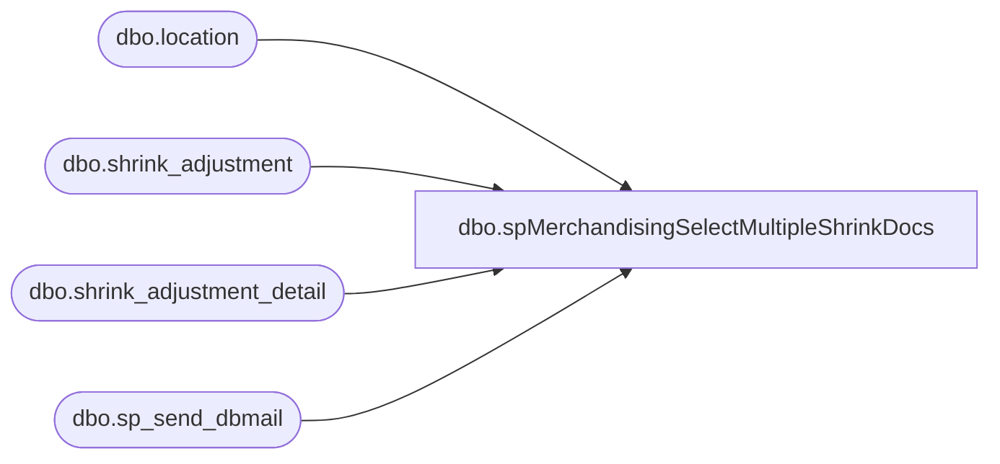

# dbo.spMerchandisingSelectMultipleShrinkDocs

**Database:** me_01  
**Server:** bedrockdb02  

## Architecture Diagram



## Table Dependencies

| Referenced Table |
|---|
| dbo.location |
| dbo.shrink_adjustment |
| dbo.shrink_adjustment_detail |
| dbo.sp_send_dbmail |

## Stored Procedure Code

```sql
CREATE proc [dbo].[spMerchandisingSelectMultipleShrinkDocs]

as

-- =====================================================================================================
-- Name: spMerchandisingSelectMultipleShrinkDocs
--
-- Description:	Sends email and text message if multiple nightly sync documents have posted for a single location on the same day
--				
--
-- Revision History
--		Name:			Date:			Comments:
--		Dan Tweedie		11/14/2014		Created proc
-- =====================================================================================================


IF (Object_ID('tempdb..#a') IS NOT null) DROP TABLE #a
select l.location_code, count(distinct sa.document_no) documents
into #a
from shrink_adjustment sa
join shrink_adjustment_detail sad on sad.shrink_adjustment_id = sa.shrink_adjustment_id
join location l on l.location_id = sad.location_id
where sa.external_system_name = 'WhseSyncFile'
and datediff(dd, sa.create_date, getdate()) = 0
group by l.location_code
having count(distinct sa.document_no) > 1

if (select count(*) from #a) > 0

BEGIN

	IF (Object_ID('tempdb..##multi_shrink') IS NOT null) DROP TABLE ##multi_shrink
	select sa.create_date, l.location_code, sa.document_no, count(*) lines
	into ##multi_shrink
	from shrink_adjustment sa
	join shrink_adjustment_detail sad on sad.shrink_adjustment_id = sa.shrink_adjustment_id
	join location l on l.location_id = sad.location_id
	where sa.external_system_name = 'WhseSyncFile'
	and datediff(dd, sa.create_date, getdate()) = 0
	and l.location_code in (select location_code from #a)
	group by l.location_code, sa.document_no, sa.create_date


	if (select count(*) from ##multi_shrink) > 0

	begin

				declare @text nvarchar(max)
				set @text = '
				<font face =arial size = 2> ' +
					'<b>MULTIPLE NIGHTLY SYNC SHRINK DOCUMENTS FOR A SINGLE LOCATION</b>' +
					'<br><br>' +
					'<table border="1" <font face =arial size = 2>' +
					'<tr><th>POST DATETIME</th><th>LOCATION</th><th>DOCUMENT</th><th>LINES</th></tr>' +
					CAST ( ( SELECT td = create_date, '',
									td = location_code, '',
									td = document_no, '',
									td = lines, ''
								from ##multi_shrink
								order by location_code, create_date
								FOR XML PATH('tr'), TYPE 
					) AS NVARCHAR(MAX) ) +
					'</font></table></font></p></p>
					<br>
					<br>
					Brought to you by bedrockdb02.SQL_AGENT.Validation - Multiple Nightly Sync Docs.'

				exec msdb.dbo.sp_send_dbmail
				@profile_name = 'merchadmin',
				@recipients = 'EnterpriseSystemsAlerts@buildabear.com;',
				@subject = 'Multiple Nightly Sync Documents Posted',
				@body = @text,
				@body_format = 'HTML'

	end

END
```

