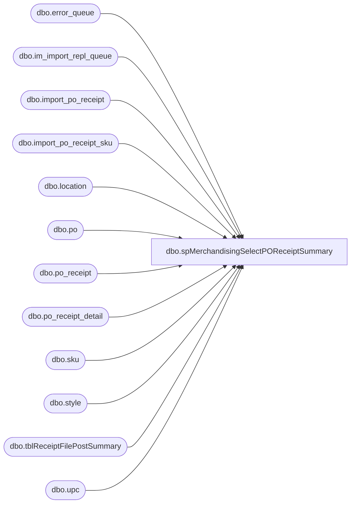

# dbo.spMerchandisingSelectPOReceiptSummary

**Database:** me_01  
**Server:** bedrockdb02  

## Architecture Diagram



## Table Dependencies

| Referenced Table |
|---|
| dbo.error_queue |
| dbo.im_import_repl_queue |
| dbo.import_po_receipt |
| dbo.import_po_receipt_sku |
| dbo.location |
| dbo.po |
| dbo.po_receipt |
| dbo.po_receipt_detail |
| dbo.sku |
| dbo.style |
| dbo.tblReceiptFilePostSummary |
| dbo.upc |

## Stored Procedure Code

```sql
CREATE proc [dbo].[spMerchandisingSelectPOReceiptSummary]
as
set nocount on
-- =====================================================================================================
-- Name: spMerchandisingSelectPOReceiptSummary
--
-- Description:	Captures and emails a summary of PO Receipts processed from our warehouses into Merchandising.
--
-- Input:	
--
-- Output: report is emailed
--
-- Dependencies: na
--				 
-- Revision History
--		Name:			Date:			Comments:
--		Dan Tweedie		01/12/2011		Created proc.	
-- =====================================================================================================

IF (Object_ID('tempdb..#pr_import') IS NOT NULL) DROP TABLE #pr_import
IF (Object_ID('tempdb..#pr_post') IS NOT NULL) DROP TABLE #pr_post
IF (Object_ID('tempdb..#pr_errors') IS NOT NULL) DROP TABLE #pr_errors
IF (Object_ID('tempdb..##pr_summary') IS NOT NULL) DROP TABLE ##pr_summary


--import tables - - file is imported from warehouse, stored in these import tables
select  iirq.action_date, --actual date that file is processed
		ipr.po_receipt_no, 
		ipr.receive_date, ---receipt date that is recorded in the file, this should be same as action date
		ipr.location_code, 
		ipr.po_no, 
		s.style_code, 
		iprs.units_received,
		ipr.packing_list_no, 
		ipr.imp_file_name
into #pr_import
from import_po_receipt ipr (nolock)
join import_po_receipt_sku iprs (nolock) on iprs.import_po_receipt_id = ipr.import_po_receipt_id
join upc (nolock) on upc.upc_number = iprs.upc_number
join sku (nolock) on sku.sku_id = upc.sku_id
join style s (nolock) on s.style_id = sku.style_id
join im_import_repl_queue iirq (nolock) on iirq.entity_id = ipr.import_po_receipt_id and iirq.entity_code = 20
where (datediff(dd, iirq.action_date, getdate()-1) = 0 and datepart(hh, iirq.action_date) >= 6)
or (datediff(dd, iirq.action_date, getdate()) = 0 and datepart(hh, iirq.action_date) < 6)

--production tables -- data is parsed from the import tables and posted to these production tables
select  pr.create_date, --actual date that receipt is posted
		pr.external_doc_no, 
		pr.receive_date, --receipt date that is recorded in the file, this should be same as create date
		l.location_code,
		po.po_no,
		s.style_code,
		prd.units_received
into #pr_post
from po_receipt pr (nolock)
join po (nolock) on po.po_id = pr.po_id
join po_receipt_detail prd (nolock) on prd.po_receipt_id = pr.po_receipt_id 
join location l (nolock) on l.location_id = pr.location_id
join style s (nolock) on prd.style_id = s.style_id
where datediff(dd, pr.create_date, getdate()) <= 1

--Pipeline Errors -- if there is an error during the posting to the production tables, it is written in the error table
select ipr.po_receipt_no,
	   ipr.receive_date, 
	   ipr.location_code,
	   ipr.po_no,
	   s.style_code,
	   iprs.units_received,
	   ipr.packing_list_no,
	   ipr.imp_file_name,
       substring(eq.error,157,CHARINDEX('.', substring(eq.error,157,500),1)+1) error_msg
into #pr_errors
from import_po_receipt ipr (nolock)
join im_import_repl_queue iirq (nolock) on iirq.entity_id = ipr.import_po_receipt_id and iirq.entity_code = 20
join import_po_receipt_sku iprs (nolock) on ipr.import_po_receipt_id = iprs.import_po_receipt_id
join pipeapp01.PipelineRepository.dbo.error_queue eq on iirq.im_import_repl_queue_id = eq.sequence_id 
join upc (nolock) on upc.upc_number = iprs.upc_number
join sku (nolock) on sku.sku_id = upc.sku_id
join style s (nolock) on s.style_id = sku.style_id
where iirq.entity_id in (select substring(entity_key,1,CHARINDEX('~', substring(entity_key,1,30),1)-1)
							from pipeapp01.PipelineRepository.dbo.error_queue
							where segment_id = 19000 and entity_code = 20)
and ((datediff(dd, iirq.action_date, getdate()-1) = 0 and datepart(hh, iirq.action_date) >= 6)
		or (datediff(dd, iirq.action_date, getdate()) = 0 and datepart(hh, iirq.action_date) < 6))


---summary -- receipt summary
select cast(pri.action_date as varchar) PROCESS_START,
	   pri.location_code WHSE, 
       pri.po_no PO, 
       pri.style_code STYLE, 
       pri.units_received QTY,
	   case when prp.po_no is null then 'NO' else 'YES' end as POSTED, 
	   isnull(cast(prp.create_date as varchar), 'n/a') POSTED_DATE,
	   case when pre.po_receipt_no is null then 'NO' else 'YES' end as ERROR,
	   isnull(pre.error_msg, 'n/a') ERROR_MSG,
	   pri.imp_file_name
into ##pr_summary
from #pr_import pri
left join #pr_post prp on pri.po_receipt_no = prp.external_doc_no and pri.po_no = prp.po_no and pri.style_code = prp.style_code 
left join #pr_errors pre on pri.po_receipt_no = pre.po_receipt_no and pri.po_no = pre.po_no and pri.style_code = pre.style_code

---insert summary into permanent table to reference elsewhere, but only on same day, hence the truncate --10/18/2011
truncate table tblReceiptFilePostSummary
insert tblReceiptFilePostSummary
select * from ##pr_summary


----output a file for Physical Inventory team, 
begin

	declare @1query varchar(1000),
			@1date varchar(200),
			@1file_name varchar(100),
			@1file_location varchar(100),
			@1server varchar(20),
			@1database varchar(20),
			@1sqlcmd varchar(1000),
			@1query_text varchar(1000),
			@1file varchar(1000),
			@1body varchar(1000),
			@1subj varchar(1000)

			select @1query_text = 'set nocount on select * from ##pr_summary'
			set @1date = convert(varchar, datepart(yyyy, getdate())) + '-' + convert(varchar, datepart(mm, getdate())) + '-' + convert(varchar, datepart(dd, getdate())) 
			set @1query = @1query_text
			set @1file_location = '\\sharebear1\shared\Inventory Reports\'  
			set @1file_name = 'PO_Receipt_Summary' + @1date + '.csv'
			set @1server = 'bedrockdb02'
			set @1database = 'me_01'
			set @1sqlcmd = 'sqlcmd -S' + @1server + ' -d' + @1database + ' -Q' + '"' + @1query + '"' + ' -o' + '"' + @1file_location + @1file_name + '"' + ' -s"," -w1000 -W'
			exec master..xp_cmdshell @1sqlcmd
end
```

