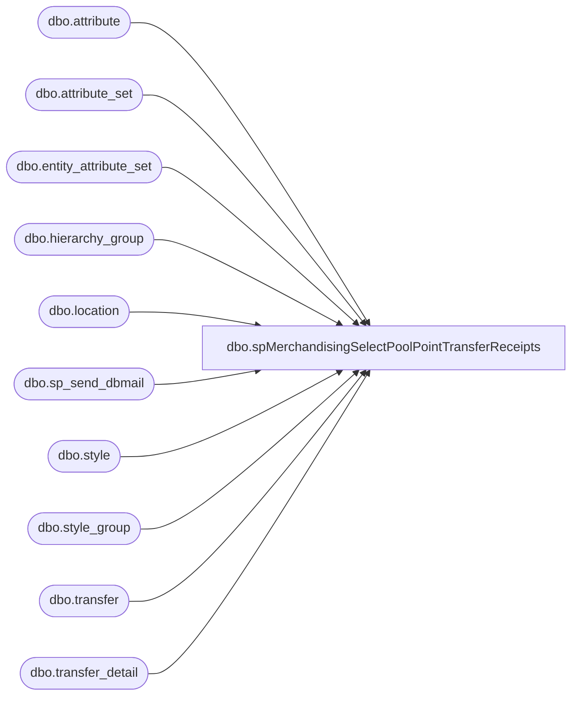

# dbo.spMerchandisingSelectPoolPointTransferReceipts

**Database:** me_01  
**Server:** bedrockdb02  

## Architecture Diagram



## Table Dependencies

| Referenced Table |
|---|
| dbo.attribute |
| dbo.attribute_set |
| dbo.entity_attribute_set |
| dbo.hierarchy_group |
| dbo.location |
| dbo.sp_send_dbmail |
| dbo.style |
| dbo.style_group |
| dbo.transfer |
| dbo.transfer_detail |

## Stored Procedure Code

```sql
CREATE proc [dbo].[spMerchandisingSelectPoolPointTransferReceipts]

as 

-- =====================================================================================================
-- Name: spMerchandisingSelectPoolPointTransferReceipts
--
-- Description:	Captures transfer receipts of condos or bales from pool points to stores, sends email to distro team
--				
--				 
-- Revision History
--		Name:			Date:			Comments:
--		Dan Tweedie		06/09/2014		Created proc.	
-- =====================================================================================================

set nocount on

--get list of condo and bale styles
if (object_id('tempdb..#a') is not NULL) drop table #a
select s.style_code
into #a
from style s (nolock)
join style_group sg (nolock) on s.style_id = sg.style_id
join hierarchy_group hg (nolock) on sg.hierarchy_group_id = hg.hierarchy_group_id
where hg.hierarchy_group_code in ('R-B-C-60-01-02', 'R-B-D-60-01-02')
or s.style_code in ('000050', '100050', '400050')

--get list of pool point locations
if(object_id('tempdb..#b') is not NULL) drop table #b
select l.location_id
into #b
from entity_attribute_set eas (nolock)
join location l (nolock) on eas.parent_id = l.location_id
join attribute_set att (nolock) on eas.attribute_set_id = att.attribute_set_id
	and att.attribute_set_code = 'POOL'
join attribute a (nolock) on att.attribute_id = a.attribute_id 
	and a.parent_type = 2
	and a.attribute_code = 'type'


--get tranfers and shipments received today with condos or bales from pool point locations 
if(object_id('tempdb..##receiptz') is not NULL) drop table ##receiptz
select 'Transfer' as Document,
	    t.document_no,
		s.style_code,
		s.short_desc,
		count(distinct td.carton_no) cartons,
		sum(td.units_received) units,
		l.location_code
into ##receiptz
from transfer t (nolock)
join transfer_detail td (nolock) on t.transfer_id = td.transfer_id
join style s (nolock) on td.style_id = s.style_id
join #a a on s.style_code = a.style_code
join #b b on t.from_location_id = b.location_id
join location l (nolock) on t.to_location_id = l.location_id
where (td.units_received is not null and td.units_received > 0)
and datediff(dd, t.receive_create_date, getdate()-1) = 0 --job will run at 6am, and will capture receipts from the previous day.
group by t.document_no, s.style_code, s.short_desc, l.location_code
order by 7, 2, 3

if (select count(*) from ##receiptz) > 0

begin
	declare @text nvarchar(max)
	
	set @text = '
	<font face =arial size = 2> '  +
		'</b><H1>Pool Point Condos/Bales Transfer Receipts</H1>' +
		'<table border="1">' +
		'<tr><th>DOCUMENT</th><th>DOCUMENT#</th><th>STYLE</th><th>SHORT DESCRIPTION</th><th>CARTONS</th><th>UNITS</th><th>LOCATION CODE</th></tr>' +
		CAST ( ( SELECT td = document,'',
						td = document_no, '',
						td = style_code, '',
						td = short_desc, '',
						td = cartons, '',
						td = units, '',
						td = location_code, ''
				  from ##receiptz
				  order by location_code, document_no, style_code
				  FOR XML PATH('tr'), TYPE 
		) AS NVARCHAR(MAX) ) +
		'</font></table></font></p></p><br>'
    
	exec msdb.dbo.sp_send_dbmail
	@profile_name = 'merchadmin',
    @recipients = 'distrobears@buildabear.com',
    @body = @text,
	@subject = 'Pool Point Condos/Bales Transfer Receipts',
	@body_format = 'HTML'
end
```

