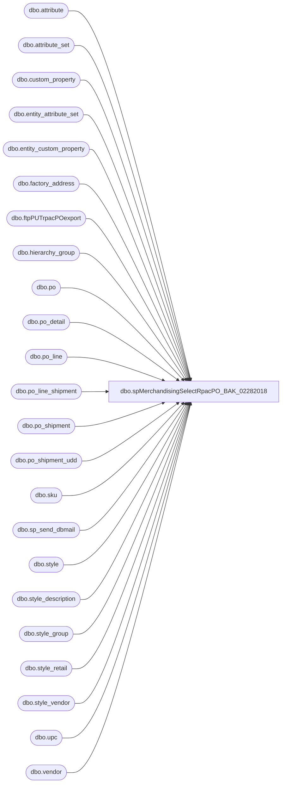

# dbo.spMerchandisingSelectRpacPO_BAK_02282018

**Database:** me_01  
**Server:** bedrockdb02  

## Architecture Diagram



## Table Dependencies

| Referenced Table |
|---|
| dbo.attribute |
| dbo.attribute_set |
| dbo.custom_property |
| dbo.entity_attribute_set |
| dbo.entity_custom_property |
| dbo.factory_address |
| dbo.ftpPUTrpacPOexport |
| dbo.hierarchy_group |
| dbo.po |
| dbo.po_detail |
| dbo.po_line |
| dbo.po_line_shipment |
| dbo.po_shipment |
| dbo.po_shipment_udd |
| dbo.sku |
| dbo.sp_send_dbmail |
| dbo.style |
| dbo.style_description |
| dbo.style_group |
| dbo.style_retail |
| dbo.style_vendor |
| dbo.upc |
| dbo.vendor |

## Stored Procedure Code

```sql
CREATE proc [dbo].[spMerchandisingSelectRpacPO_BAK_02282018]

as

-- =====================================================================================================
-- Name: spMerchandisingSelectRpacPO
--
-- Description:	Uploads a file to RPAC for PO's with styles that have a paw ID attribute.
--
-- Input:	
--
-- Output: report is emailed
--
-- Dependencies: na
--				 
-- Revision History
--		Name:			Date:			Comments:
--		Dan Tweedie		04/22/2014		Created proc.	
--		Dan Tweedie		07/14/2015		Pointed to Kermode instead of Oursmerchdb01
--		Scott Patten	08/11/2016		Added Packaging Attribute PACKG to be included on output report
--		Tim Callahan	10/14/2016		Changed String looking for in FTP validation
--		Scott Patten	01/11/2017		Added a number of new requested fields including FR & CN description and country retails
-- =====================================================================================================

set nocount on

--STEP 1 ** Drop all preivous Temp Tables, if they exist.
IF (Object_ID('tempdb..#packg') IS NOT NULL) DROP TABLE #packg
IF (Object_ID('tempdb..#po') IS NOT NULL) DROP TABLE #po
IF (Object_ID('tempdb..#desc') IS NOT NULL) DROP TABLE #desc
IF (Object_ID('tempdb..#desc1') IS NOT NULL) DROP TABLE #desc1
IF (Object_ID('tempdb..#ret') IS NOT NULL) DROP TABLE #ret
IF (Object_ID('tempdb..#retfinal') IS NOT NULL) DROP TABLE #retfinal
IF (Object_ID('tempdb..##rpack_po') IS NOT NULL) DROP TABLE ##rpack_po
IF (Object_ID('tempdb..##rpack_po2') IS NOT NULL) DROP TABLE ##rpack_po2
IF (Object_ID('tempdb..##rpack_ttl') IS NOT NULL) DROP TABLE ##rpack_ttl
IF (Object_ID('tempdb..#paw') IS NOT NULL) DROP TABLE #paw

--STEP 2 ** Get Style Data (PACKG = pk_id)
SELECT s.style_code, s.short_desc, sku.sku_id, att2.attribute_set_code pk_id,
CASE WHEN substring(hg.hierarchy_group_code,7,2) = '60' THEN 'SUP' ELSE 'MER' END AS MerchOrSupply, cp.cust_prop_label SupPackQty,
v.vendor_code, att.attribute_set_code factory_code,
fa.address_name, fa.port, fa.address, fa.city, fa.province, fa.country
INTO #packg
FROM style s (NOLOCK)
JOIN sku (NOLOCK) ON s.style_id = sku.style_id
JOIN style_vendor sv (NOLOCK) ON s.style_id = sv.style_id AND sv.primary_vendor_flag = 1
JOIN vendor v (NOLOCK) ON sv.vendor_id = v.vendor_id
JOIN style_group sg (NOLOCK) ON s.style_id = sg.style_id
JOIN hierarchy_group hg (NOLOCK) ON sg.hierarchy_group_id = hg.hierarchy_group_id
JOIN entity_attribute_set eas (NOLOCK) ON s.style_id = eas.parent_id
JOIN attribute_set att (NOLOCK) ON eas.attribute_set_id = att.attribute_set_id
JOIN attribute a (NOLOCK) ON att.attribute_id = a.attribute_id AND a.parent_type = 1 AND a.attribute_code = 'FACTRY' 
LEFT JOIN factory_address fa (NOLOCK) ON att.attribute_set_code = fa.attribute_set_code AND v.vendor_code = fa.vendor_code
JOIN entity_attribute_set eas2 (NOLOCK) ON s.style_id = eas2.parent_id
JOIN attribute_set att2 (NOLOCK) ON eas2.attribute_set_id = att2.attribute_set_id
JOIN attribute a2 (NOLOCK) ON att2.attribute_id = a2.attribute_id AND a2.parent_type = 1 AND a2.attribute_code = 'PACKG'
LEFT JOIN entity_custom_property ecp ON s.style_id = ecp.parent_id AND ecp.parent_type = 1 AND ecp.custom_property_id = 2
LEFT JOIN custom_property cp (NOLOCK) ON cp.custom_property_id = ecp.custom_property_id
ORDER BY s.style_code

--STEP 3 ** Get PO's with ship date that is in the future.
SELECT DISTINCT po_id
INTO #po
FROM po_shipment_udd
WHERE user_defined_date >= GETDATE()

--STEP 4 ** Create temp table with language French & Chinese langauage translations.
SELECT style_code AS 'Style Code',	
	   s.short_desc AS 'Description',
	   CASE WHEN language_id = '100002' THEN sd.short_desc 
		    ELSE ''
			END AS 'French Description',
	   CASE WHEN language_id = '100006' THEN sd.short_desc
			ELSE ''
			END AS 'Chinese Description'
INTO #desc
FROM style s
JOIN style_description sd ON sd.style_id = s.style_id

-- Creates a temp table that shows only the styles that have either a French or Chinese description in addition to the US description.
SELECT [Style Code], Description, [French Description], [Chinese Description]
INTO #desc1
FROM #desc
WHERE [French Description] <> ''
OR [Chinese Description] <> ''
ORDER BY [Style Code]

-- Deletes all records from #desc that are duplicated AND do not contain either a French or Chinese description.
DELETE FROM #desc
WHERE [Style Code] IN(SELECT [Style Code] FROM #desc1)
AND [French Description] = ''
AND [Chinese Description] = ''

--STEP 5 ** Create temp table with all jurisdiction retails.
SELECT style_code AS 'style',
	   sr.jurisdiction_id,
	   sr.current_selling_retail AS 'retail'
INTO #ret
FROM style s
JOIN style_retail sr ON sr.style_id = s.style_id

-- Creates another temp table that Pivots the retails to individual columns for each unique SKU.
SELECT style, --sku_id, 
[1] AS 'US Retail', 
[2] AS 'UK Retail', 
[3] AS 'Canada Retail', 
[5] AS 'IrelAND Retail', 
[7] AS 'Denmark Retail', 
[8] AS 'China Retail'
INTO #retfinal
FROM
(SELECT style,jurisdiction_id,retail FROM #ret
) AS SourceTable
PIVOT
(AVG([retail])
FOR [jurisdiction_id] IN ([1],[2],[3],[4],[5],[6],[7],[8])
) AS PivotTable;

--STEP 6 ** Get PO data, then JOIN to style data (pk_id).
SELECT po.po_no,
	   u.upc_number,
	   CASE WHEN LEFT(pk.style_code,1) = '0' THEN r.[US Retail] ELSE '0' END AS [US Retail],
	   CASE WHEN LEFT(pk.style_code,1) = '1' THEN r.[Canada Retail] ELSE '0' END AS [Canada Retail],
	   CASE WHEN LEFT(pk.style_code,1) = '4' THEN r.[UK Retail] ELSE '0' END AS [UK Retail],
	   CASE WHEN LEFT(pk.style_code,1) = '4' THEN r.[IrelAND Retail] ELSE '0' END AS [IrelAND Retail],
	   CASE WHEN LEFT(pk.style_code,1) = '4' THEN r.[Denmark Retail] ELSE '0' END AS [Denmark Retail],
	   CASE WHEN LEFT(pk.style_code,1) = '8' THEN r.[China Retail] ELSE '0' END AS [China Retail],
	   pk.style_code, 
	   pk.short_desc,
	   d.[French Description],
	   d.[Chinese Description],
	   pk.pk_id,
	   CASE WHEN pk.MerchOrSupply = 'SUP' THEN (SupPackQty * SUM(pls.quantity)) ELSE SUM(pls.quantity) END AS quantity,
	   psu.user_defined_date start_ship_date, 
	   psu2.user_defined_date cancel_date,
	   pk.factory_code,
	   REPLACE(pk.address_name, ',', '') factory_name,
	   pk.port,
	   REPLACE(pk.address, ',', '') address,
	   pk.city,
	   pk.province, 
	   pk.country   
INTO ##rpack_po
FROM po (NOLOCK) 
JOIN po_detail pd (NOLOCK) ON po.po_id = pd.po_id
JOIN #packg pk (NOLOCK) ON pd.sku_id = pk.sku_id
JOIN upc u (NOLOCK) ON pd.sku_id = u.sku_id
JOIN #desc d (NOLOCK) ON pk.style_code = d.[Style Code]
JOIN #retfinal r (NOLOCK) ON pk.style_code = r.style
JOIN po_line pl (NOLOCK) ON po.po_id = pl.po_id AND pd.po_line_id = pl.po_line_id
JOIN po_shipment ps (NOLOCK) ON po.po_id = ps.po_id AND pd.po_shipment_id = ps.po_shipment_id
JOIN po_line_shipment pls (NOLOCK) ON po.po_id = pls.po_id AND pl.po_line_id = pls.po_line_id AND ps.po_shipment_id = pls.po_shipment_id
JOIN po_shipment_udd psu (NOLOCK) ON po.po_id = psu.po_id AND ps.po_shipment_id = psu.po_shipment_id AND psu.po_date_type_id = 2
JOIN po_shipment_udd psu2 (NOLOCK) ON po.po_id = psu2.po_id AND ps.po_shipment_id = psu2.po_shipment_id AND psu2.po_date_type_id = 3
WHERE po.approval_status in (3,7) -- Approval
AND	po.po_status in (4,7) -- Open
AND psu.po_id in (SELECT po_id FROM #po)
GROUP BY pk.factory_code, pk.address_name, pk.port, pk.address, pk.city, pk.province, pk.country, pk.style_code, 
pk.short_desc, pk.pk_id, po.po_no, psu.user_defined_date, psu2.user_defined_date, pk.merchorsupply, pk.suppackqty, u.upc_number, 
d.[French Description], d.[Chinese Description], r.[US Retail], r.[Canada Retail], r.[UK Retail], r.[IrelAND Retail], r.[Denmark Retail], r.[China Retail]
ORDER BY psu.user_defined_date, pk.style_code
DELETE FROM ##rpack_po
WHERE LEFT(style_code,1) = '0'
AND LEFT (upc_number,6) NOT IN ('889794')

-- STEP 7 ** Insert results into newly created temp table.
SELECT po_no AS 'PO #',
	   CASE WHEN LEFT(style_code,1) = '4' THEN 'UK/IE/DENMARK'
			WHEN LEFT(style_code,1) = '0' THEN 'USA'
			WHEN LEFT(style_code,1) = '1' THEN 'CANADA'
			WHEN LEFT(style_code,1) = '8' THEN 'CHINA'
			WHEN LEFT(style_code,1) = '9' THEN 'MEXICO'
			ELSE ''
			END AS 'Region',
	   upc_number AS 'UPC Number',
	   [US Retail] AS 'US Retail',
	   [Canada Retail] AS 'Canada Retail',
	   [UK Retail] AS 'UK Retail',
	   [IrelAND Retail] AS 'IrelAND Retail',
	   [Denmark Retail] AS 'Denmark Retail',
	   [China Retail] AS 'China Retail',
	   style_code AS 'Style Code',
	   short_desc AS 'Description',
	   [French Description],
	   [Chinese Description],
	   '' AS [Spanish Description],
	   '' AS [MEX Origin Country],
	   '' AS [MEX Recommend Age],
	   '' AS [MEX QTY],
	   '' AS [MEX Battery Type],
	   pk_id AS 'Paw & Pack ID',
	   quantity AS 'Quantity',
	   start_ship_date AS 'XF Start Ship',
	   cancel_date AS 'XF Cancel Ship',
	   factory_code AS 'Factory Code',
	   factory_name AS 'Factory Name',
	   port AS 'Port',
	   address AS 'Address',
	   city AS 'City',
	   province AS 'Province',
	   country AS 'Country',
	   '' AS [Japanese Description]
INTO ##rpack_ttl
FROM ##rpack_po

-- STEP 8 ** Get Style Data (PAWID = paw_id)
SELECT s.style_code, s.short_desc, sku.sku_id, att2.attribute_set_code paw_id,
CASE WHEN SUBSTRING(hg.hierarchy_group_code,7,2) = '60' THEN 'SUP' ELSE 'MER' END AS MerchOrSupply, cp.cust_prop_label SupPackQty,
v.vendor_code, att.attribute_set_code factory_code,
fa.address_name, fa.port, fa.address, fa.city, fa.province, fa.country
INTO #paw
FROM style s (NOLOCK)
JOIN sku (NOLOCK) ON s.style_id = sku.style_id
JOIN style_vendor sv (NOLOCK) ON s.style_id = sv.style_id AND sv.primary_vendor_flag = 1
JOIN vendor v (NOLOCK) ON sv.vendor_id = v.vendor_id
JOIN style_group sg (NOLOCK) ON s.style_id = sg.style_id
JOIN hierarchy_group hg (NOLOCK) ON sg.hierarchy_group_id = hg.hierarchy_group_id
JOIN entity_attribute_set eas (NOLOCK) ON s.style_id = eas.parent_id
JOIN attribute_set att (NOLOCK) ON eas.attribute_set_id = att.attribute_set_id
JOIN attribute a (NOLOCK) ON att.attribute_id = a.attribute_id AND a.parent_type = 1 AND a.attribute_code = 'FACTRY' 
LEFT JOIN factory_address fa (NOLOCK) ON att.attribute_set_code = fa.attribute_set_code AND v.vendor_code = fa.vendor_code
JOIN entity_attribute_set eas2 (NOLOCK) ON s.style_id = eas2.parent_id
JOIN attribute_set att2 (NOLOCK) ON eas2.attribute_set_id = att2.attribute_set_id
JOIN attribute a2 (NOLOCK) ON att2.attribute_id = a2.attribute_id AND a2.parent_type = 1 AND a2.attribute_code = 'PAWID'
LEFT JOIN entity_custom_property ecp (NOLOCK) ON s.style_id = ecp.parent_id AND ecp.parent_type = 1 AND ecp.custom_property_id = 2
LEFT JOIN custom_property cp (NOLOCK) ON cp.custom_property_id = ecp.custom_property_id
order by s.style_code

-- STEP 9 ** Get PO data, then JOIN to style data (paw_id).
IF (Object_ID('tempdb..##rpack_po2') IS NOT NULL) DROP TABLE ##rpack_po2
SELECT po.po_no,
	   u.upc_number,
	   CASE WHEN LEFT(p.style_code,1) = '0' THEN r.[US Retail] ELSE '0' END AS [US Retail],
	   CASE WHEN LEFT(p.style_code,1) = '1' THEN r.[Canada Retail] ELSE '0' END AS [Canada Retail],
	   CASE WHEN LEFT(p.style_code,1) = '4' THEN r.[UK Retail] ELSE '0' END AS [UK Retail],
	   CASE WHEN LEFT(p.style_code,1) = '4' THEN r.[IrelAND Retail] ELSE '0' END AS [IrelAND Retail],
	   CASE WHEN LEFT(p.style_code,1) = '4' THEN r.[Denmark Retail] ELSE '0' END AS [Denmark Retail],
	   CASE WHEN LEFT(p.style_code,1) = '8' THEN r.[China Retail] ELSE '0' END AS [China Retail],
	   p.style_code, 
	   p.short_desc,
	   d.[French Description],
	   d.[Chinese Description],
	   p.paw_id,
	   CASE WHEN p.MerchOrSupply = 'SUP' THEN (SupPackQty * SUM(pls.quantity)) ELSE SUM(pls.quantity) END AS quantity,
	   psu.user_defined_date start_ship_date, 
	   psu2.user_defined_date cancel_date,
	   p.factory_code,
	   REPLACE(p.address_name, ',', '') factory_name,
	   p.port,
	   REPLACE(p.address, ',', '') address,
	   p.city,
	   p.province, 
	   p.country   
INTO ##rpack_po2
FROM po (NOLOCK) 
JOIN po_detail pd (NOLOCK) ON po.po_id = pd.po_id
JOIN #paw p (NOLOCK) ON pd.sku_id = p.sku_id
JOIN upc u (NOLOCK) ON pd.sku_id = u.sku_id
JOIN #desc d (NOLOCK) ON p.style_code = d.[Style Code]
JOIN #retfinal r (NOLOCK) ON p.style_code = r.style
JOIN po_line pl (NOLOCK) ON po.po_id = pl.po_id AND pd.po_line_id = pl.po_line_id
JOIN po_shipment ps (NOLOCK) ON po.po_id = ps.po_id AND pd.po_shipment_id = ps.po_shipment_id
JOIN po_line_shipment pls (NOLOCK) ON po.po_id = pls.po_id AND pl.po_line_id = pls.po_line_id AND ps.po_shipment_id = pls.po_shipment_id
JOIN po_shipment_udd psu (NOLOCK) ON po.po_id = psu.po_id AND ps.po_shipment_id = psu.po_shipment_id AND psu.po_date_type_id = 2
JOIN po_shipment_udd psu2 (NOLOCK) ON po.po_id = psu2.po_id AND ps.po_shipment_id = psu2.po_shipment_id AND psu2.po_date_type_id = 3
WHERE po.approval_status in (3,7) -- Approval
AND	po.po_status in (4,7) -- Open
AND psu.po_id in (SELECT po_id FROM #po)
GROUP BY p.factory_code, p.address_name, p.port, p.address, p.city, p.province, p.country, p.style_code, 
p.short_desc, p.paw_id, po.po_no, psu.user_defined_date, psu2.user_defined_date, p.merchorsupply, p.suppackqty, u.upc_number,
d.[French Description], d.[Chinese Description], r.[US Retail], r.[Canada Retail], r.[UK Retail], r.[IrelAND Retail], r.[Denmark Retail], r.[China Retail]
ORDER BY psu.user_defined_date, p.style_code
DELETE FROM ##rpack_po2
WHERE LEFT(style_code,1) = '0'
AND LEFT (upc_number,6) NOT IN ('889794')

-- STEP 10 ** Insert data into previously created temp table.
INSERT INTO ##rpack_ttl
SELECT po_no AS 'PO #',
       CASE WHEN LEFT(style_code,1) = '4' THEN 'UK/IE/DENMARK'
			WHEN LEFT(style_code,1) = '0' THEN 'USA'
			WHEN LEFT(style_code,1) = '1' THEN 'CANADA'
			WHEN LEFT(style_code,1) = '8' THEN 'CHINA'
			WHEN LEFT(style_code,1) = '9' THEN 'MEXICO'
			ELSE ''
			END AS 'Region',
	   upc_number AS 'UPC Number',
	   [US Retail] AS 'US Retail',
	   [Canada Retail] AS 'Canada Retail',
	   [UK Retail] AS 'UK Retail',
	   [IrelAND Retail] AS 'IrelAND Retail',
	   [Denmark Retail] AS 'Denmark Retail',
	   [China Retail] AS 'China Retail',
	   style_code AS 'Style Code',
	   short_desc AS 'Description',
	   [French Description],
	   [Chinese Description],
	   '' AS [Spanish Description],
	   '' AS [MEX Origin Country],
	   '' AS [MEX Recommend Age],
	   '' AS [MEX QTY],
	   '' AS [MEX Battery Type],
	   paw_id AS 'Paw & Pack ID',
	   quantity AS 'Quantity',
	   start_ship_date AS 'XF Start Ship',
	   cancel_date AS 'XF Cancel Ship',
	   factory_code AS 'Factory Code',
	   factory_name AS 'Factory Name',
	   port AS 'Port',
	   address AS 'Address',
	   city AS 'City',
	   province AS 'Province',
	   country AS 'Country',
	   '' AS [Japanese Description]
FROM ##rpack_po2

-- STEP 11 ** Output .csv file.
IF (SELECT COUNT(*) from ##rpack_ttl) > 0

BEGIN

	declare @query varchar(1000),
			@date varchar(52),
			@file_name varchar(100),
			@file_location varchar(100),
			@server varchar(20),
			@username varchar(20),
			@password varchar(20),
			@database varchar(20),
			@bcp varchar(1000)

	set @query = 'set nocount on select * from ##rpack_ttl order by [PO #], [Style Code], [XF Start Ship]'
	select @date = convert(varchar, datepart(yyyy, getdate())) + convert(varchar, datepart(mm, getdate())) + convert(varchar, datepart(dd, getdate())) + convert(varchar, datepart(hh, getdate())) + convert(varchar, datepart(mi, getdate())) + convert(varchar, datepart(ss, getdate())) + convert(varchar, datepart(ms, getdate()))
	set @file_location = '\\kermode\FileRepository\MERCHANDISING\APAC\RPAC\'
	set @file_name = 'BABW_PAW_PO' + @date + '.csv'
	set @server = 'bedrockdb02'
	set @database = 'me_01'
	set @bcp = 'bcp "' + @query + '" queryout "' + @file_location + @file_name + '"   -T -w -S' + @server 
	
	exec master..xp_cmdshell @bcp


-- STEP 12 ** FTP upload.
	declare @ftpPUT varchar(1000),
					@Log_query varchar(1000),
					@Log_filename varchar(100),
					@Log_file_location varchar(100),
					@Log_bcp varchar(1000),
					@body varchar(4000)
							
			set @ftpPUT = 'ftp -d -s:\\kermode\FileRepository\MERCHANDISING\APAC\RPAC\FTP\SCRIPTS\ftpPUT.txt' 

			--Create temp tables for ftp logs.
			IF (Object_ID('me_01..ftpPUTrpacPOexport') IS NOT NULL) DROP TABLE ftpPUTrpacPOexport
			create table ftpPUTrpacPOexport
			(ftpLog varchar(4000))

			--Execute sql/ftp.
			--Connect to ftp server, if connection unsuccessful, send email.
					insert ftpPUTrpacPOexport exec master..xp_cmdshell @ftpPUT
					if (select count(*) from ftpPUTrpacPOexport where ftplog like '%Transfer complete%') < 1 -- 10/14/2016 Previously looked for: File received ok
						begin
							set @Log_query = 'select * from bedrockdb02.me_01.dbo.ftpPUTrpacPOexport'
							set @Log_filename = 'ftpPUTLog.txt'
							set @Log_file_location = '\\kermode\FileRepository\MERCHANDISING\APAC\RPAC\FTP\LOGS\'
							set @Log_bcp = 'bcp "' + @Log_query + '" queryout "' + @Log_file_location + @Log_filename + '" -t, -T -c -Sbedrockdb02'

							exec master..xp_cmdshell @Log_bcp
															
							set @body =	'An attempt to FTP a PO Export file from BAB to R-PAC failed.' 
										+ char(10) + char(13) + 
										'See the attached log for details.'
										+ char(10) + char(13) + 
										+ char(10) + char(13) + 
										'This process is managed by bedrockdb02.me_01.dbo.spMerchandisingSelectRpacPO'
							
							EXEC bedrockdb02.msdb.dbo.sp_send_dbmail
							@profile_name = 'MerchAdmin',
							@recipients = 'merchadmin@buildabear.com',
							@subject = 'FTP Failure: PO Export from BAB R-PAC',
							@body = @body,
							@file_attachments = '\\kermode\FileRepository\MERCHANDISING\APAC\RPAC\FTP\LOGS\ftpPUTLog.txt',
							@importance = 'HIGH'
						end
					else
						begin
							EXEC master..xp_cmdshell 'move \\kermode\FileRepository\MERCHANDISING\APAC\RPAC\* \\kermode\FileRepository\MERCHANDISING\APAC\RPAC\done'
						end

end
```

