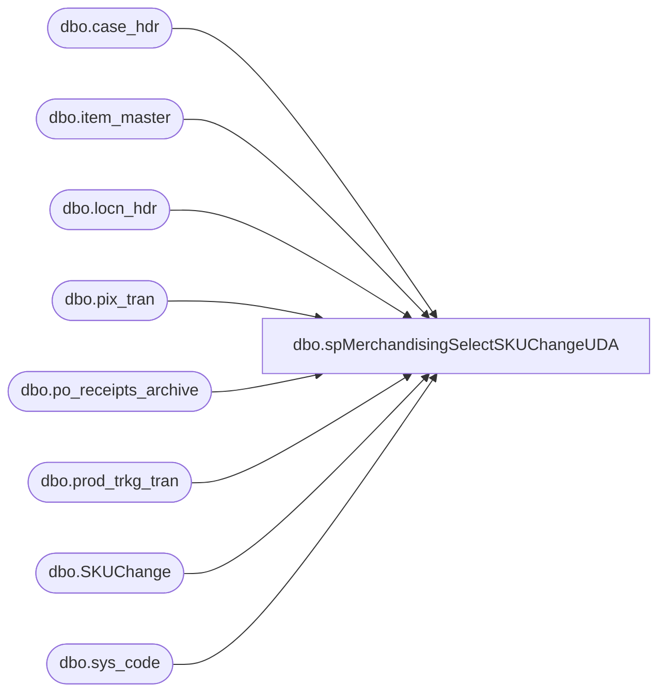

# dbo.spMerchandisingSelectSKUChangeUDA

**Database:** me_01  
**Server:** bedrockdb02  

## Architecture Diagram



## Table Dependencies

| Referenced Table |
|---|
| dbo.case_hdr |
| dbo.item_master |
| dbo.locn_hdr |
| dbo.pix_tran |
| dbo.po_receipts_archive |
| dbo.prod_trkg_tran |
| dbo.SKUChange |
| dbo.sys_code |

## Stored Procedure Code

```sql
CREATE proc [dbo].[spMerchandisingSelectSKUChangeUDA]

as

-- =====================================================================================================
-- Name: spMerchandisingSelectSKUChangeUDA
--
-- Description:	Captures data from WM if they add a Canadian SKU into inventory and flag it with 'SKU Change' in the blind ASN in WM.
--				
--
-- Input:
--
-- Output: 
--        
-- Dependencies: NA
--				 
-- Revision History
--		Name:			Date:			Comments:
--		Dan Tweedie		11/14/2013		created proc
--		Dan Tweedie		06/10/2015		Added blank column to end of detail row per epicor's new spec
-- =====================================================================================================


set nocount on

--capture po receipt data into work table ---Only allowing receipts for valid PO's
if (object_id('me_01..SKUChange') is not null) drop table SKUChange
create table SKUChange
(Reference varchar(20),
ASN varchar(20),
Style varchar(12),
Units int,
id int identity(100, 1))

insert SKUChange
select	pt.ref_field_3 as Reference, 
		pt.ref_field_1 as ASN,
		pt.style as Style, 
		case when im.store_dept = 'SUP' then (sum(pt.invn_adjmt_qty)/im.std_pack_qty) else sum(pt.invn_adjmt_qty) end as Units
from wmdb01.wmprod.dbo.pix_tran pt (nolock)
join wmdb01.wmprod.dbo.item_master im (nolock) on im.style = pt.style
where	pt.tran_type = 300
		and pt.tran_code = 01
		and pt.actn_code in (06, 20)
		and pt.ref_field_4 = 'PP'
		and pt.ref_field_3 = 'SKU CHANGE'
		and datediff(dd, pt.create_date_time, getdate()) = 0 
		and pt.case_nbr not in (select case_nbr from wmdb01.wmprod.dbo.po_receipts_archive)
group by pt.ref_field_3, pt.ref_field_1, pt.style, im.std_pack_qty, im.store_dept
union all 
select ptt.ref_field_3 as Reference,
	ptt.ref_field_1 as ASN,
	im.style as Style,
	sum(cast(ptt.ref_field_2 as numeric)) qty
from wmdb01.wmprod.dbo.prod_trkg_tran ptt 
join wmdb01.wmprod.dbo.item_master im on ptt.sku_id = im.sku_id
join wmdb01.wmprod.dbo.sys_code sc on ptt.rsn_code = sc.code_id 
	and sc.code_type = 051 and sc.rec_type = 'B'
join wmdb01.wmprod.dbo.case_hdr ch on ptt.cntr_nbr = ch.case_nbr and ch.stat_code = 99
join wmdb01.wmprod.dbo.locn_hdr lh on ch.prev_locn_id = lh.locn_id
where datediff(dd, ptt.create_date_time, getdate()) = 0
and ptt.module_name = 'Modify'
and ptt.menu_optn_name = 'Modify Cs Contents'
and lh.locn_brcd like 'tag%'
and ptt.ref_field_3 = 'SKU Change'
group by ptt.ref_field_3, ptt.ref_field_1, im.style


if (select count(*) from SKUChange) > 0


BEGIN

declare @docnbr varchar(52),
		@date varchar(12),
		@styles int,
		@style varchar(6),
		@upc varchar(12),
		@units int

select @docnbr = convert(varchar, getdate(), 112) + 'SKUChange'
select @date = convert(varchar, getdate(), 101)

print 'H' + '	' + 'A' + '	' + convert(varchar, @docnbr) + '	' + @date + '	' + 'U' + '	' + 'MerchAdmin' + '	' + 'BearhouseSKUChange' + '	' + '3' + '	' + 'BearhouseSKUChange'

select @styles = count(style) from SKUChange

while @styles > 0

begin
	select @style = max(style) from SKUChange
	select @upc = '000000' + @style
	select @units = units from SKUChange where style = @style

	print 'D' + '	' + 'A' + '	' + convert(varchar, @docnbr) + '	' + 'S' + '	' + '0980' + '	' + @upc +  '	' +  '	' +  '	' +  '	' +  '	' + '	' + convert(varchar, @units) + '	'  + '	'
	
	delete from SKUChange where style = @style

	select @styles = count(style) from SKUChange

	if @styles < 1
		break
			else
		continue
	end

END
```

