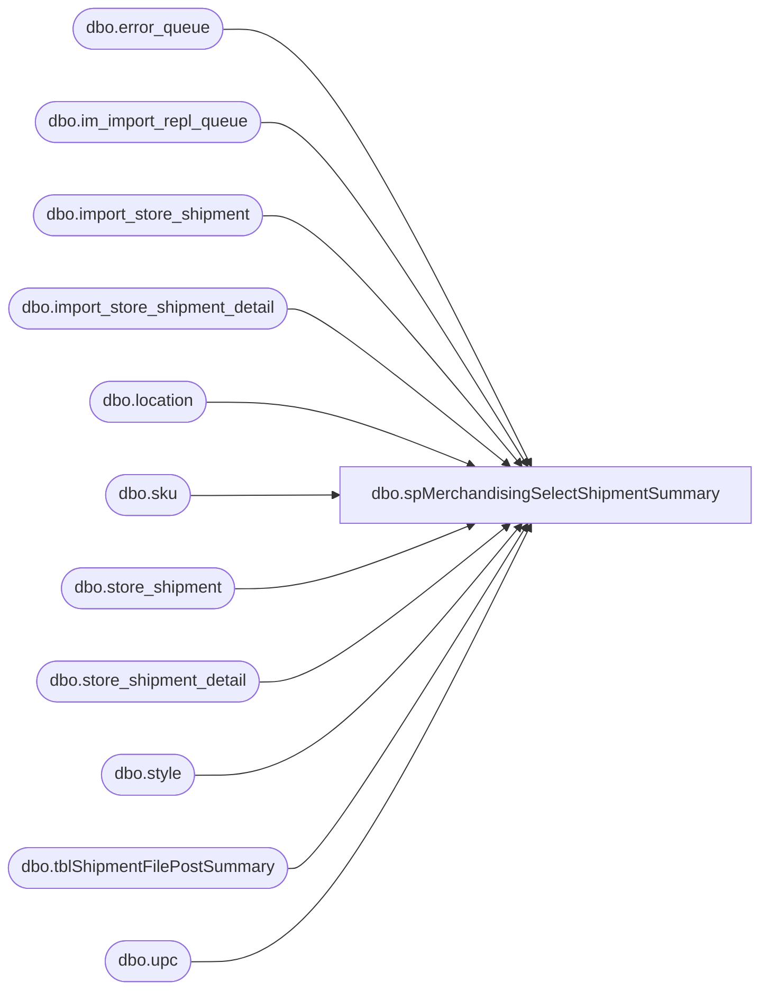

# dbo.spMerchandisingSelectShipmentSummary

**Database:** me_01  
**Server:** bedrockdb02  

## Architecture Diagram



## Table Dependencies

| Referenced Table |
|---|
| dbo.error_queue |
| dbo.im_import_repl_queue |
| dbo.import_store_shipment |
| dbo.import_store_shipment_detail |
| dbo.location |
| dbo.sku |
| dbo.store_shipment |
| dbo.store_shipment_detail |
| dbo.style |
| dbo.tblShipmentFilePostSummary |
| dbo.upc |

## Stored Procedure Code

```sql
CREATE proc [dbo].[spMerchandisingSelectShipmentSummary]
as
set nocount on
-- =====================================================================================================
-- Name: spMerchandisingSelectShipmentSummary
--
-- Description:	Captures and emails a summary of Store Shipments processed from our warehouses into Merchandising.
--
-- Input:	
--
-- Output: report is emailed
--
-- Dependencies: na
--				 
-- Revision History
--		Name:			Date:			Comments:
--		Dan Tweedie		01/13/2011		Created proc.	
--		Dan Tweedie		01/17/2011		Added new HTML table to show styles shipped summary.
-- =====================================================================================================


IF (Object_ID('tempdb..#sh_import') IS NOT NULL) DROP TABLE #sh_import
IF (Object_ID('tempdb..#sh_post') IS NOT NULL) DROP TABLE #sh_post
IF (Object_ID('tempdb..#sh_errors') IS NOT NULL) DROP TABLE #sh_errors
IF (Object_ID('tempdb..##sh_summary') IS NOT NULL) DROP TABLE ##sh_summary

--import tables - - file is imported from warehouse, stored in these import tables
select iirq.action_date, ----actual date that file is processed
	   iss.ship_date, --shipment date recorded in the file, this should be same as action date
	   iss.from_location_code from_location, 
	   iss.location_code to_location,
	   issd.distribution_no,
	   iss.document_no shipment, 
	   s.style_code,
	   issd.carton_no,
	   issd.units_sent,
	   iss.imp_file_name
into #sh_import
from import_store_shipment iss (nolock)
join import_store_shipment_detail issd (nolock) on iss.import_store_shipment_id = issd.import_store_shipment_id
join upc (nolock) on upc.upc_number = issd.upc_number
join sku (nolock) on sku.sku_id = upc.sku_id
join style s (nolock) on s.style_id = sku.style_id
join im_import_repl_queue iirq (nolock) on iirq.entity_id = iss.import_store_shipment_id and iirq.entity_code = 70
where (datediff(dd, iirq.action_date, getdate()-1) = 0 and datepart(hh, iirq.action_date) >= 6)
or (datediff(dd, iirq.action_date, getdate()) = 0 and datepart(hh, iirq.action_date) < 6)
order by iirq.action_date, iss.from_location_code, issd.distribution_no, iss.document_no, s.style_code, issd.carton_no

--production tables -- data is parsed from the import tables and posted to these production tables
select ss.create_date, --actual timestamp of shipment being posted to Merchandising
	   ss.ship_date, -- ship date recorded in shipment file, should be same as create date
	   l2.location_code from_location, 
	   l.location_code to_location,
	   ssd.distribution_no,
	   ss.document_no shipment, 
	   s.style_code,
	   ssd.carton_no,
	   ssd.units_sent
into #sh_post
from store_shipment ss (nolock)
join store_shipment_detail ssd (nolock) on ss.store_shipment_id = ssd.store_shipment_id
join style s (nolock) on s.style_id = ssd.style_id
join location l (nolock) on l.location_id = ss.location_id
join location l2 (nolock) on l2.location_id = ss.from_location_id
where datediff(dd, ss.create_date, getdate()) <= 1

--Pipeline Errors -- if there is an error during the posting to the production tables, it is written in the error table
select iirq.action_date,
	   iss.ship_date,
	   iss.from_location_code from_location,
	   iss.location_code to_location,
	   issd.distribution_no,
	   iss.document_no shipment,
	   s.style_code,
	   issd.carton_no,
	   substring(eq.error,166,CHARINDEX('.', substring(eq.error,167,500),1)+1) error_msg,
	   iss.imp_file_name
into #sh_errors
from import_store_shipment iss (nolock)
join import_store_shipment_detail issd (nolock) on iss.import_store_shipment_id = issd.import_store_shipment_id
join upc (nolock) on upc.upc_number = issd.upc_number
join sku (nolock) on sku.sku_id = upc.sku_id
join style s (nolock) on s.style_id = sku.style_id
join im_import_repl_queue iirq (nolock) on iirq.entity_id = iss.import_store_shipment_id and iirq.entity_code = 70
join pipeapp01.PipelineRepository.dbo.error_queue eq on iirq.im_import_repl_queue_id = eq.sequence_id 
where iirq.entity_id in (select substring(entity_key,1,CHARINDEX('~', substring(entity_key,1,30),1)-1)
							from pipeapp01.PipelineRepository.dbo.error_queue
							where segment_id = 19000 and entity_code = 70)
and ((datediff(dd, iirq.action_date, getdate()-1) = 0 and datepart(hh, iirq.action_date) >= 6)
	or (datediff(dd, iirq.action_date, getdate()) = 0 and datepart(hh, iirq.action_date) < 6))

-----summary
select cast(shi.action_date as varchar) PROCESS_START,
	   shi.from_location WHSE, 
	   shi.shipment SHIPMENT, 
	   shi.distribution_no DISTRO,
	   shi.style_code STYLE, 
       shi.carton_no CARTON,
       shi.units_sent QTY,
	   shi.to_location DESTINATION,
       case when (shp.shipment is null or shp.carton_no is null) then 'NO' else 'YES' end as POSTED, 
       isnull(cast(shp.create_date as varchar), 'n/a') POSTED_DATE,
	   case when she.shipment is null then 'NO' else 'YES' end as ERROR,
	   isnull(she.error_msg, 'n/a') ERROR_MSG,
	   shi.imp_file_name IMPORT_FILE
into ##sh_summary
from #sh_import shi
left join #sh_post shp on shi.distribution_no = shp.distribution_no
						and shi.shipment = shp.shipment
						and shi.from_location = shp.from_location
						and shi.to_location = shp.to_location
						and shi.carton_no = shp.carton_no
						and shi.style_code = shp.style_code
						and shi.units_sent = shp.units_sent
left join #sh_errors she on she.distribution_no = shi.distribution_no 
						and she.shipment = shi.shipment
						and she.from_location = shi.from_location
						and she.to_location = shi.to_location
						and she.carton_no = shi.carton_no 
						and she.style_code = shi.style_code

---insert summary into permanent table to reference elsewhere, but only on same day, hence the truncate --10/18/2011
truncate table tblShipmentFilePostSummary
insert tblShipmentFilePostSummary
select * from ##sh_summary
----output a file for Physical Inventory team, 
begin

	declare @1query varchar(1000),
			@1date varchar(200),
			@1file_name varchar(100),
			@1file_location varchar(100),
			@1server varchar(20),
			@1database varchar(20),
			@1sqlcmd varchar(1000),
			@1query_text varchar(1000),
			@1file varchar(1000),
			@1body varchar(1000),
			@1subj varchar(1000)

			select @1query_text = 'set nocount on select * from ##sh_summary'
			set @1date = convert(varchar, datepart(yyyy, getdate())) + '-' + convert(varchar, datepart(mm, getdate())) + '-' + convert(varchar, datepart(dd, getdate())) 
			set @1query = @1query_text
			set @1file_location = '\\sharebear1\shared\Inventory Reports\'  
			set @1file_name = 'Shipments' + @1date + '.csv'
			set @1server = 'bedrockdb02'
			set @1database = 'me_01'
			set @1sqlcmd = 'sqlcmd -S' + @1server + ' -d' + @1database + ' -Q' + '"' + @1query + '"' + ' -o' + '"' + @1file_location + @1file_name + '"' + ' -s"," -w1000 -W'
			exec master..xp_cmdshell @1sqlcmd
end
```

