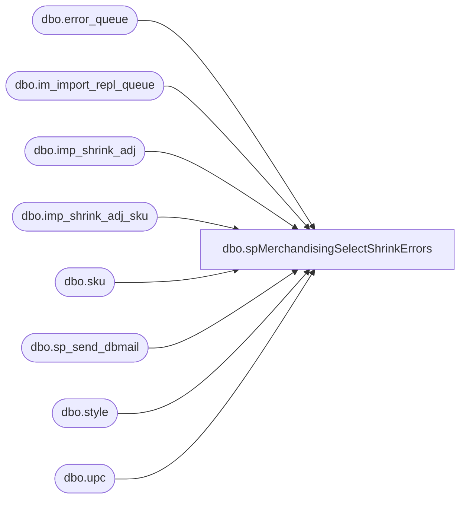

# dbo.spMerchandisingSelectShrinkErrors

**Database:** me_01  
**Server:** bedrockdb02  

## Architecture Diagram



## Table Dependencies

| Referenced Table |
|---|
| dbo.error_queue |
| dbo.im_import_repl_queue |
| dbo.imp_shrink_adj |
| dbo.imp_shrink_adj_sku |
| dbo.sku |
| dbo.sp_send_dbmail |
| dbo.style |
| dbo.upc |

## Stored Procedure Code

```sql
CREATE proc [dbo].[spMerchandisingSelectShrinkErrors]

-- =====================================================================================================
-- Name: spMerchandisingSelectShrinkErrors
--
-- Description:	Captures and emails a summary of shrink adjustments errors logged from the pipeline for non warehouse shrink adjustments
--
-- Input:	
--
-- Output: report is emailed
--
-- Dependencies: na
--				 
-- Revision History
--		Name:			Date:			Comments:
--		Dan Tweedie		06/28/2012		Created proc.	
--		Dan Tweedie		09/17/2015		Added Distro Bears to email recipients
-- =====================================================================================================
as 

set nocount on 


IF (Object_ID('tempdb..#sa_errors') IS NOT NULL) DROP TABLE #sa_errors
--Pipeline Errors -- if there is an error during the posting to the production tables, it is written in the error table
select iirq.action_date, ----actual date that file is processed
	   isa.document_no,
	   isa.submit_date, --submit date recorded in the file, this should be same as action date
	   isa.grouping_label,
	   isas.location_code, 
	   s.style_code,
	   substring(eq.error,166,CHARINDEX('.', substring(eq.error,167,500),1)+1) error_msg,
	   isa.imp_file_name
into #sa_errors
from imp_shrink_adj isa (nolock)
join imp_shrink_adj_sku isas (nolock) on isa.imp_shrink_adj_id = isas.imp_shrink_adj_id
join upc (nolock) on upc.upc_number = isas.upc_number
join sku (nolock) on sku.sku_id = upc.sku_id
join style s (nolock) on s.style_id = sku.style_id
join im_import_repl_queue iirq (nolock) on iirq.entity_id = isa.imp_shrink_adj_id and iirq.entity_code = 1
join pipeapp01.PipelineRepository.dbo.error_queue eq on iirq.im_import_repl_queue_id = eq.sequence_id 
where iirq.entity_id in (select substring(entity_key,1,CHARINDEX('~', substring(entity_key,1,30),1)-1)
							from pipeapp01.PipelineRepository.dbo.error_queue
							where segment_id = 19000 and entity_code = 1)
and isas.location_code not in ('0960', '0980', '2970', '0975', '0013')

if (select count(*) from #sa_errors) > 0
begin
---------
	declare @subj varchar(152),
			@text nvarchar(max),
			@recip varchar(1000),
			@cc varchar(100)


	set @subj = 'Shrink Adjustment Errors (non warehouse)' 
	set @recip = 'distrobears@buildabear.com;PhysicalInventory@buildabear.com'
	set @cc = 'EntSysSupport@buildabear.com'

	set @text = 
	'<font face =arial size = 2><B>SHRINK ADJUSTMENT ERRORS (non warehouse)</B><br></font>' +
		'<table border="1">' +
			'<tr><th><font face =arial size = 2>ACTION DATE</font></th>' +
				'<th><font face =arial size = 2>DOCUMENT</font></th>' +
				'<th><font face =arial size = 2>LOCATION</font></th>' +
				'<th><font face =arial size = 2>STYLE</font></th>' +
				'<th><font face =arial size = 2>ERROR MSG</font></th>' +
				'<th><font face =arial size = 2>IMPORT FILE</font></th></tr>' +
	'<font face =arial size = 2>' +
		CAST ( ( SELECT td = action_date,'',
						td = document_no, '',
						td = location_code, '',
						td = style_code, '',
						td = error_msg, '',
						td = imp_file_name, ''
				  from #sa_errors order by action_date, location_code, style_code
				  FOR XML PATH('tr'), TYPE 
		) AS NVARCHAR(MAX) ) +
		'</font></table></font></p></p>
		<br>
		<font face =arial size = 1><B>This report was run from bedrockdb02.me_01.dbo.spMerchandisingSelectShrinkErrors.</B></font>
		<br>
		<br>
	<font face =arial size = 1><i>The information in this message may be privileged, “confidential” and protected from disclosure and/or intended only for the addressee(s) named above.  If the reader of this message is not the intended recipient, or an employee or agent responsible for delivering this message to the intended recipient, you are hereby notified that any dissemination, distribution or copying of the communication is strictly prohibited.  If you have received this communication in error, please notify us immediately by replying to the message and deleting it from your computer.  Thank you beary much.</i></font>'


	exec msdb.dbo.sp_send_dbmail
	@profile_name = 'MerchAdmin',
	@recipients = @recip,
	@blind_copy_recipients = @cc,
	@body = @text,
	@subject = @subj,
	@body_format = 'HTML'

end
```

