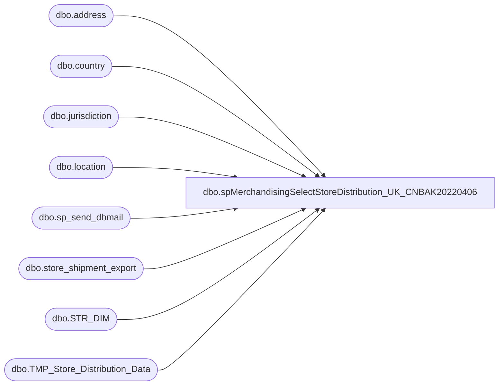

# dbo.spMerchandisingSelectStoreDistribution_UK_CNBAK20220406

**Database:** me_01  
**Server:** bedrockdb02  

## Architecture Diagram



## Table Dependencies

| Referenced Table |
|---|
| dbo.address |
| dbo.country |
| dbo.jurisdiction |
| dbo.location |
| dbo.sp_send_dbmail |
| dbo.store_shipment_export |
| dbo.STR_DIM |
| dbo.TMP_Store_Distribution_Data |

## Stored Procedure Code

```sql
create proc [dbo].[spMerchandisingSelectStoreDistribution_UK_CNBAK20220406]
as

-- =====================================================================================================
-- Name: spMerchandisingSelectStoreDistribution_UK_CN
--
-- Description:	Captures summary of distributions created by store, emails Excel file to stores.
-- Revision History
--		Name:			Date:			Comments: -- This replaces DTS packages on Beehive called UK_Store_Shipment_Confirmation_Load_Table (part 1) & UK_Store_Shipment_Confirmation_Email (part 2)
--		Dan Tweedie		03/20/2015		Created proc.	
--		Dan Tweedie		04/26/2016		Added China
-- =====================================================================================================

set nocount on

IF (Object_ID('tempdb..#stores') IS NOT null) DROP TABLE #stores
select distinct right('0000' + cast(s.STR_NUM as varchar(4)), 4) store 
into #stores
FROM kodiak.BABWMstrData.dbo.STR_DIM s
join location l (nolock) on right('0000' + cast(s.STR_NUM as varchar(4)), 4) = l.location_code
join jurisdiction j (nolock) on j.jurisdiction_id = l.jurisdiction_id
join address a (nolock) on l.location_id = a.parent_id
join country c (nolock) on a.country_id = c.country_id
where j.jurisdiction_code in ('DK','FR','IE','UK', 'CN')
order by 1

--distro data, including 'misc cartons' flag from above
IF (Object_ID('me_01..TMP_Store_Distribution_Data') IS NOT null) DROP TABLE TMP_Store_Distribution_Data
select	cast (sse.document_number as decimal (10,0)) as [Store Shipment Number],
		sse.location_code [Store],
		sse.rec_label [Rec Type Label],
		sse.style_code [Style Code],
		replace(sse.short_desc, ',', '') [Style Short Description],
		sse.quantity [Quantity],
		sse.release_date [Exported to Warehouse Date],
		0 [Exported]
into	TMP_Store_Distribution_Data
from	store_shipment_export sse
where datediff(dd, sse.release_date, getdate()) = 0
and	sse.location_code in (select store from #stores)
and	sse.warehouse in ('2970', '3970')
order by 2,1


if (select count(*) from TMP_Store_Distribution_Data) > 0
BEGIN
		--------------------------------------- DISTRIBUTE REPORTS VIA EMAIL
		declare @email_address varchar(25), 
				@store_nbr varchar(4), 
				@counter int, 
				@total_stores int
				
				
		set @counter = 1

		---find out how many stores have shipments today
		select @total_stores = count(distinct store)
							  from TMP_Store_Distribution_Data


		--declare cursor for stores with shipments today -- the goal is to capture the distinct store numbers
		declare store_nbr cursor for 
							select distinct store
							from TMP_Store_Distribution_Data
							order by store

		open store_nbr

		while @counter <= @total_stores 
			begin

				fetch next from store_nbr into @store_nbr

			---generate the email address to be used for each store
				select @email_address = 
						case when @store_nbr like '0%' 
							 then 'store' + right(@store_nbr, 3) + '@buildabear.com'
							 else 'store' + @store_nbr + '@buildabear.com'
						end	
			
			---output report to Excel
				declare @query varchar(1000),
						@date varchar(200),
						@file_name varchar(100),
						@file_location varchar(100),
						@server varchar(20),
						@database varchar(20),
						@sqlcmd varchar(1000),
						@query_text varchar(1000)

				select @query_text = 'set nocount on select [Store Shipment Number],[Store],[Rec Type Label],[Style Code],[Style Short Description],[Quantity],[Exported to Warehouse Date] from me_01.dbo.TMP_Store_Distribution_Data where store = ' + @store_nbr + ' order by [Store Shipment Number],[Style Code],[Rec Type Label]'

				set @date = convert(varchar, datepart(yyyy, getdate())) + '-' + convert(varchar, datepart(mm, getdate())) + '-' + convert(varchar, datepart(dd, getdate())) 
				set @query = @query_text
				set @file_location = '\\kermode\FileRepository\MERCHANDISING\DBCompare\'  
				set @file_name = 'Store-' + @store_nbr + '-Store-Shipment-Report-' + @date + '.csv'
				set @server = 'bedrockdb02'
				set @database = 'me_01'
				set @sqlcmd = 'sqlcmd -S' + @server + ' -d' + @database + ' -Q' + '"' + @query + '"' + ' -o' + '"' + @file_location + @file_name + '"' + ' -s"," -w1000 -W'
				exec master..xp_cmdshell @sqlcmd
				
			--email report
				declare @text nvarchar(max), 
						@attach varchar(200),
						@subj varchar(100),
						@recip varchar(100),
						@copy varchar(100)

				select @attach = @file_location + @file_name
				
					---generate subject line	
				select @subj = 'Store ' + @store_nbr	+ ' Store Shipment File'
				
				set @text = '
					<font face =arial size = 2> ' +
						'PLEASE NOTE:  This report is your initial distribution before it has been processed by the warehouse. Due to product availability, some items may not be available to be shipped and will not arrive on your shipment.' +
						'</font>
						<br>
						<br>
						<br>
						<font face =arial size = 1>This report was run from bedrockdb02.me_01.dbo.spMerchandisingSelectStoreDistribution_UK_CN.</font>
						<br>
						<br>
					<font face =arial size = 1><i>The information in this message may be privileged, “confidential” and protected from disclosure and/or intended only for the addressee(s) named above.  If the reader of this message is not the intended recipient, or an employee or agent responsible for delivering this message to the intended recipient, you are hereby notified that any dissemination, distribution or copying of the communication is strictly prohibited.  If you have received this communication in error, please notify us immediately by replying to the message and deleting it from your computer.  Thank you beary much.</i></font>'

					set @recip = @email_address 
							

					exec msdb.dbo.sp_send_dbmail
						@profile_name = 'merchadmin',
						@recipients = @recip, 
						@body = @text,
						@subject = @subj,
						@file_attachments = @attach,
						@body_format = 'HTML'
				
				
				set @counter = @counter + 1

			end

		close store_nbr
		deallocate store_nbr


END
```

