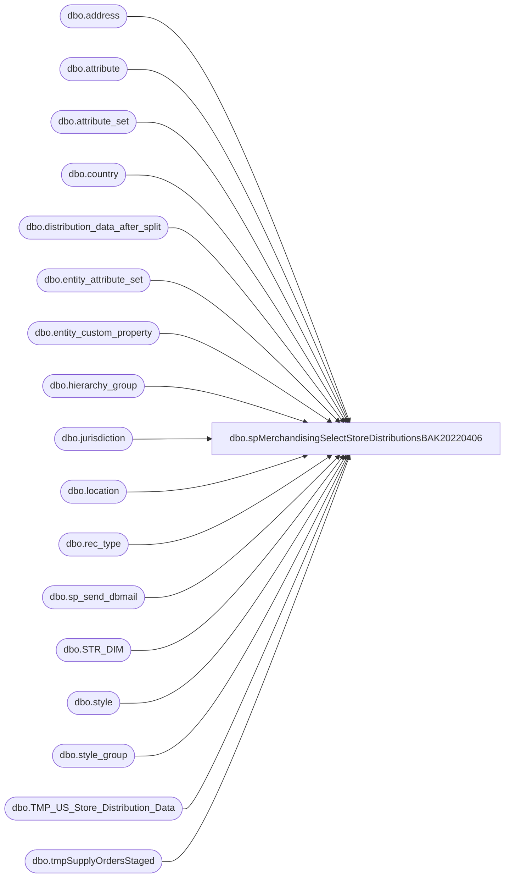

# dbo.spMerchandisingSelectStoreDistributionsBAK20220406

**Database:** me_01  
**Server:** bedrockdb02  

## Architecture Diagram



## Table Dependencies

| Referenced Table |
|---|
| dbo.address |
| dbo.attribute |
| dbo.attribute_set |
| dbo.country |
| dbo.distribution_data_after_split |
| dbo.entity_attribute_set |
| dbo.entity_custom_property |
| dbo.hierarchy_group |
| dbo.jurisdiction |
| dbo.location |
| dbo.rec_type |
| dbo.sp_send_dbmail |
| dbo.STR_DIM |
| dbo.style |
| dbo.style_group |
| dbo.TMP_US_Store_Distribution_Data |
| dbo.tmpSupplyOrdersStaged |

## Stored Procedure Code

```sql
create proc [dbo].[spMerchandisingSelectStoreDistributionsBAK20220406]
as
-- =====================================================================================================
-- Name: spMerchandisingSelectStoreDistributions
--
-- Description:	Captures summary of distributions created by store, emails Excel file to stores.
--
-- Input: NA
--
-- Output: Excel file is generated and emailed, then deleted
--
-- Dependencies: na
--
-- Revision History
--		Name:			Date:			Comments:
--		Dan Tweedie		6/30/2011		Created proc.	
--		Dan Tweedie		07/27/2011		Added capture of U.S. stores from Kodiak
--		Dan Tweedie		08/30/2011		Added new join to hierarchy group to get department level category descriptions -- commented in the code
--		Dan Tweedie		11/30/2011		Removed code that deletes csv files, in order to keep archive of csv files sent, so distro team can review.
--		Dan Tweedie		07/24/2013		Removed 'k.dCoalitiondate' flag in the store lookup query 
--		Dan Tweedie		10/16/2013		Changed store lookup query to get store list from new str_dim db
--		Dan Tweedie		10/16/2014		Order output by ship service so FedEx is first, then first deliver, second deliver, third delivery
--		Tim Callahan	06/19/2017		No change but made some notes about an issue on 6/14/2017 which needed left joins to complete the query 
--		Tim Callahan	01/08/2018		TamiB Requested to be CCd (copied) on the e-mail to store 0200 in addition to store 0052
--		Tim Callahan	11/05/2018		TamiB Requested to be CCd (copied) on the e-mail to store 0417 in addition to store 0052, 0200
--		Lizzy Timm		03/04/2020		Removed logic querying against WMDB01.  Business has agreed that carton type info is not needed in the report.
--		Dan TWeedie		2020-10-15		Updated to include new staged data from Dynamics in table tmpSupplyOrdersStaged, populated by SSIS WMS_EmailDistributionsCreatedToday
--		Tim Callahan	2021-04-02		Updated  to create a Temp Table for DDC stores rather than joining to attribute table in TMP_US_Store_Distribution_Data query 
-- =====================================================================================================
set nocount on

IF (Object_ID('tempdb..#stores') IS NOT null) DROP TABLE #stores
select distinct right('0000' + cast(s.STR_NUM as varchar(4)), 4) store 
into #stores
FROM kodiak.BABWMstrData.dbo.STR_DIM s
join location l (nolock) on right('0000' + cast(s.STR_NUM as varchar(4)), 4) = l.location_code
join jurisdiction j (nolock) on j.jurisdiction_id = l.jurisdiction_id
join address a (nolock) on l.location_id = a.parent_id
join country c (nolock) on a.country_id = c.country_id
where s.STR_NUM < 3000
and j.jurisdiction_code in ('HOME', 'CA')
order by 1

-- Added 2021/04/02
IF (Object_ID('tempdb..#DDC') IS NOT null) DROP TABLE #DDC
select l.location_code
into #DDC
from location l with (nolock)
join entity_attribute_set easwc (nolock) on l.location_id = easwc.parent_id -- Note: On 6/14/2017, this proc would stall until we created a left join here, keep in mind if occurs again and consult DBA
    and easwc.parent_type = 2
join attribute_set atswc (nolock) on easwc.attribute_set_id = atswc.attribute_set_id -- Note: On 6/14/2017, this proc would stall until we created a left join here, keep in mind if occurs again and consult DBA
join attribute awc (nolock) on atswc.attribute_id = awc.attribute_id -- Note: On 6/14/2017, this proc would stall until we created a left join here, keep in mind if occurs again and consult DBA
    and awc.attribute_code= 'DC'
where atswc.attribute_set_code ='960'


--distro data, including 'misc cartons' flag from above
IF (Object_ID('me_01..TMP_US_Store_Distribution_Data') IS NOT null) DROP TABLE TMP_US_Store_Distribution_Data
select l.location_code Store,
   	   case when ddc.location_code is not null and ddas.rec_type in (1,3,7) and ddas.sourceid = '0980'
			then 'GROUND SHIPPING'
			else rt.message
		end as RecTypeLabel,
	   s.style_code StyleCode,
	   s.short_desc StyleShortDescription,
	   case when substring(hg.hierarchy_group_code,7,2) ='60'
			then ecp.custom_property_value * ddas.quantity
			else ddas.quantity * s.distribution_multiple
	   end as Quantity,
	   case when substring(hg.hierarchy_group_code,7,2)='60' 
			then 'Supplies'
			--else hg.hierarchy_group_short_label
			else hg2.hierarchy_group_label --changed from hg.hierarchy_group_short_label 08/30/2011
		end as Category,
		/*case when m.style is not null 
			 then 'Misc'
			 else 'Non Misc'
		end as 'Type',*/ -- Business agreed that misc carton/type info is no longer needed. LT 03/04/2020
		ecp.custom_property_value,
		s.distribution_multiple
into TMP_US_Store_Distribution_Data
from distribution_data_after_split ddas (nolock)
join location l (nolock) on l.location_code = ddas.destid
join jurisdiction j (nolock) on j.jurisdiction_id = l.jurisdiction_id
left join #DDC ddc on l.location_code=ddc.location_code
--join entity_attribute_set easwc (nolock) on l.location_id = easwc.parent_id -- Note: On 6/14/2017, this proc would stall until we created a left join here, keep in mind if occurs again and consult DBA
--	and easwc.parent_type = 2
--join attribute_set atswc (nolock) on easwc.attribute_set_id = atswc.attribute_set_id -- Note: On 6/14/2017, this proc would stall until we created a left join here, keep in mind if occurs again and consult DBA
--join attribute awc (nolock) on atswc.attribute_id = awc.attribute_id -- Note: On 6/14/2017, this proc would stall until we created a left join here, keep in mind if occurs again and consult DBA
--	and awc.attribute_code= 'DC'
join rec_type rt (nolock) on rt.rectype = ddas.rec_type
join style s (nolock) on s.style_code = ddas.style_code
join style_group sg (nolock) on s.style_id = sg.style_id
join hierarchy_group hg (nolock) on sg.hierarchy_group_id = hg.hierarchy_group_id
join hierarchy_group hg2 (nolock) on left(hg.hierarchy_group_code,8) = hg2.hierarchy_group_code --added 08/30/2011
left join entity_custom_property ecp (nolock) on s.style_id = ecp.parent_id
	and ecp.custom_property_id = 2
	and	ecp.parent_type = 1
/*left join #misc_cartons m on m.style = s.style_code*/ -- Business agreed that misc carton/type info is no longer needed. LT 03/04/2020
where ddas.released = '1'
and j.jurisdiction_code in ('HOME', 'CA')
and datediff(dd, ddas.release_date, getdate()) = 0
and (ddas.destid < '1000' and ddas.destid not in ('0013', '0960', '0975'))
and ddas.destid in (select store from #stores)
and ddas.rec_type in ('1','3','7')
UNION
select 
	LocationCode as Store,
	'Standard' as RecTypeLabel,
	ItemNumber as StyleCode,
	ProductDescription as StyleShortDescription,
	OrderQty as Quantity,
	'Supplies' as Category,
	NULL as custom_property_value,
	NULL as distribution_multiple
from tmpSupplyOrdersStaged
where datediff(dd, OrderDate, getdate()) = 0

if (select count(*) from TMP_US_Store_Distribution_Data) > 0
BEGIN
		--------------------------------------- DISTRIBUTE REPORTS VIA EMAIL
		declare @email_address varchar(25), 
				@store_nbr varchar(4), 
				@counter int, 
				@total_stores int
				
				
		set @counter = 1

		---find out how many stores have shipments today
		select @total_stores = count(distinct store)
							  from TMP_US_Store_Distribution_Data


		--declare cursor for stores with shipments today -- the goal is to capture the distinct store numbers
		declare store_nbr cursor for 
							select distinct store
							from TMP_US_Store_Distribution_Data
							order by store

		open store_nbr

		while @counter <= @total_stores 
			begin

				fetch next from store_nbr into @store_nbr

			---generate the email address to be used for each store
				select @email_address = 
						case when @store_nbr like '0%' 
							 then 'store' + right(@store_nbr, 3) + '@buildabear.com'
							 else 'store' + @store_nbr + '@buildabear.com'
						end	
			
			---output report to Excel
				declare @query varchar(1000),
						@date varchar(200),
						@file_name varchar(100),
						@file_location varchar(100),
						@server varchar(20),
						@username varchar(20),
						@password varchar(20),
						@database varchar(20),
						@sqlcmd varchar(1000),
						@query_text varchar(1000)

				select @query_text = 'set nocount on select Store,RecTypeLabel,StyleCode,StyleShortDescription,sum(Quantity) Quantity,Category from me_01.dbo.TMP_US_Store_Distribution_Data where store = ' + @store_nbr + ' group by Store,RecTypeLabel,StyleCode,StyleShortDescription,Category, StyleCode'

				set @date = convert(varchar, datepart(yyyy, getdate())) + '-' + convert(varchar, datepart(mm, getdate())) + '-' + convert(varchar, datepart(dd, getdate())) 
				set @query = @query_text
				set @file_location = '\\kermode\FileRepository\MERCHANDISING\Store Shipment Reports\StoreDistributions\'  --'\\kermode\FileRepository\MERCHANDISING\StoreDistroReports\'
				set @file_name = 'Store-' + @store_nbr + '-Distros-' + @date + '.csv'
				set @server = 'bedrockdb02'
				set @database = 'me_01'
				set @sqlcmd = 'sqlcmd -S' + @server + ' -d' + @database + ' -Q' + '"' + @query + '"' + ' -o' + '"' + @file_location + @file_name + '"' + ' -s"," -w100 -W'
				exec master..xp_cmdshell @sqlcmd
				
			--email report
				declare @text nvarchar(max), 
						@attach varchar(200),
						@cartons int,
						@subj varchar(100),
						@recip varchar(100),
						@copy varchar(100)

				/*select @cartons = isnull(sum(NonMiscCartons), 0)
				from
						(select store, stylecode,
								case when category = 'supplies'
									 then quantity / custom_property_value
									 else quantity / distribution_multiple
								end as 'NonMiscCartons'
								from TMP_US_Store_Distribution_Data								
								where type = 'Non Misc' and store = @store_nbr) as totals*/ -- Business agreed that misc carton/type info is no longer needed. LT 03/04/2020
			
				select @cartons = isnull(sum(Cartons), 0) -- Updated carton logic LT 03/04/2020
					from
						(select store, stylecode
						,case when category = 'supplies'
									 then quantity / custom_property_value
									 else quantity / distribution_multiple
								end as 'Cartons'								
						from TMP_US_Store_Distribution_Data
						where store = @store_nbr) as totals

				select @attach = @file_location + @file_name
				
					---generate subject line	
				select @subj = 'Distributions Created Today For Store ' + @store_nbr	+ ' (' + convert(varchar, @cartons) + ' Cartons)'
				
				set @text = '
					<font face =arial size = 2> ' +
						'The following distributions were created today for store ' + @store_nbr + '.' +
						'<br>Please expect approximately <b>' + convert(varchar, @cartons) + '</b> Cartons.' +
						'<br><br><b>PLEASE NOTE:</b> This report is your initial distribution before it has been processed by the warehouse. Due to product availability, some items may not be available to be shipped and may not arrive on your shipment.' +
						'<br>Please do not reply to this email, as this is for informational purposes only.' +
						'<br><br>' +
						'<table border="1">' +
						'<tr><th>STORE</th><th>REC TYPE LABEL</th><th>STYLE CODE</th><th>STYLE SHORT DESCRIPTION</th><th>QUANTITY</th><th>CATEGORY</th>' +
						'</tr><font face =arial size = 2>' +
						CAST ( ( SELECT td = Store,'',
										td = RecTypeLabel, '',
										td = StyleCode, '',
										td = StyleShortdescription, '',
										td = sum(Quantity), '',
										td = Category, ''
										/*,td = Type, ''*/ -- Business agreed that misc carton/type info is no longer needed. LT 03/04/2020
								 from me_01.dbo.TMP_US_Store_Distribution_Data where store = @store_nbr 
								 group by Store,RecTypeLabel,StyleCode,StyleShortDescription,Category
								 order by case rectypelabel when 'Ground Shipping' then 1 when 'Regular Truck' then 2 when 'Supply 2nd delivery' then 3 when 'SUPPLY 3RD DELIVERY' then 4 else 5 end, StyleCode
								  FOR XML PATH('tr'), TYPE 
						) AS NVARCHAR(MAX) ) +
						'</font></table></font></p></p>
						<br>
						<font face =arial size = 1>This report was run from bedrockdb02.me_01.dbo.spMerchandisingSelectStoreDistributions.</font>
						<br>
						<br>
					<font face =arial size = 1><i>The information in this message may be privileged, “confidential” and protected from disclosure and/or intended only for the addressee(s) named above.  If the reader of this message is not the intended recipient, or an employee or agent responsible for delivering this message to the intended recipient, you are hereby notified that any dissemination, distribution or copying of the communication is strictly prohibited.  If you have received this communication in error, please notify us immediately by replying to the message and deleting it from your computer.  Thank you beary much.</i></font>'

					set @recip = @email_address 
															
					if @counter = 1
						set @copy = 'merchadmin@buildabear.com'
						else set @copy = NULL
					
					if @store_nbr in ('0019','0119','0022','0001','0056','0086','0196','0018','0007','0020','0198','0072','0042') 
						set @copy = 'SantiagoB@buildabear.com'
						else set @copy = NULL
						


					exec msdb.dbo.sp_send_dbmail
						@profile_name = 'merchadmin',
						@recipients = @recip, 
						@copy_recipients = @copy,
						@body = @text,
						@subject = @subj,
						@file_attachments = @attach,
						@body_format = 'HTML'
				
--DT 11/30 - removed delete statement
--				--delete file
--				declare @filedel varchar(100)
--				set @filedel = 'del ' + @file_location + @file_name
--				exec master..xp_cmdshell @filedel
					
				
				set @counter = @counter + 1

			end

		close store_nbr
		deallocate store_nbr


END
```

