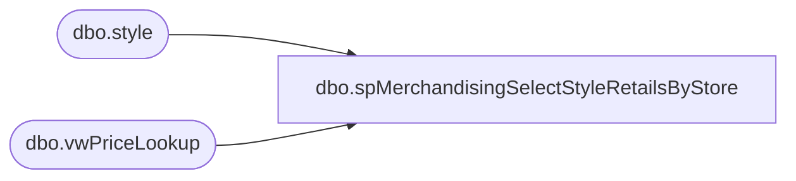

# dbo.spMerchandisingSelectStyleRetailsByStore

**Database:** me_01  
**Server:** bedrockdb02  

## Architecture Diagram



## Table Dependencies

| Referenced Table |
|---|
| dbo.style |
| dbo.vwPriceLookup |

## Stored Procedure Code

```sql
CREATE proc [dbo].[spMerchandisingSelectStyleRetailsByStore] 
@style varchar(6), @location varchar(4) 

as

-- =====================================================================================================
-- Name: spMerchandisingSelectStyleRetailsByStore
--
-- Description:	Captures Current Selling Retail per style, per store
--				 
-- Revision History
--		Name:			Date:			Comments:
--		Dan Tweedie		09/08/2015		Created proc.	
-- =====================================================================================================

set nocount on

if @location <> '0000'

	begin
		select distinct bv.style_code, 
						bv.short_desc,
						bv.location_code,
			case when isnull(bv.promo_local_price, bv.current_local_price) > bv.current_local_price
				then bv.current_local_price
				else isnull(bv.promo_local_price, bv.current_local_price) 
			end as CurrentSellingRetail
		from vwPriceLookup bv with (nolock)
		where bv.style_code = right(('000000' + @style), 6)
		and bv.location_code = right(('0000' + @location), 4)
	end

else if @location = '0000'

	begin
		select distinct
			   s.style_code,
			   s.short_desc, 
			   '0000' as location, 
			   'N/A' as CurrentSellingRetail  -- This is the Promo price, unless promo is greater than permanent
		from style s with (nolock)
		where s.style_code = right(('000000' + @style), 6)
	end
```

