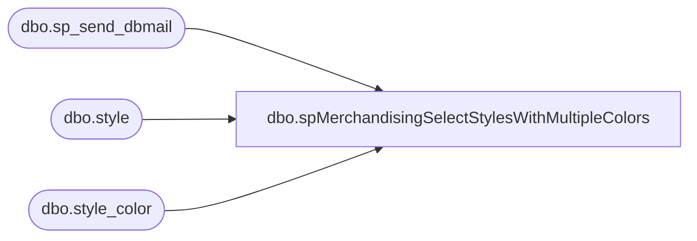

# dbo.spMerchandisingSelectStylesWithMultipleColors

**Database:** me_01  
**Server:** bedrockdb02  

## Architecture Diagram



## Table Dependencies

| Referenced Table |
|---|
| dbo.sp_send_dbmail |
| dbo.style |
| dbo.style_color |

## Stored Procedure Code

```sql
CREATE proc [dbo].[spMerchandisingSelectStylesWithMultipleColors]
as

-- =====================================================================================================
-- Name: spMerchandisingSelectStylesWithMultipleColors
--
-- Description:	Sends summary email to notify us of styles with multiple colors flagged as reorderable.
--				This can cause duplicates when exporting distros.
--				
--				 
-- Revision History
--		Name:			Date:			Comments:
--		Dan Tweedie		05/23/2014		Created proc.	
--		Lizzy Timm		03/08/2023		Removed MerchAdmin from recipients
-- =====================================================================================================

set nocount on

if (object_id('tempdb..##colors') is not null) drop table ##colors
select s.style_code 'Style Code', count(sc.style_color_id) 'Reoderable Colors'
into ##colors
from style s (nolock)
join style_color sc (nolock) on s.style_id = sc.style_id and sc.reorder_flag = 1
group by s.style_code
having count(sc.style_color_id) > 1


if (select count(*) from ##colors) > 0
begin

	exec msdb.dbo.sp_send_dbmail
	@profile_name = 'merchadmin',
	@recipients = 'shelih@buildabear.com',
	@body = 'The following styles need to be modified in Merchandising to ensure they have only one color code flagged as Reorderable.
	',
	@subject = 'Styles with Multiple Reorderable Color Codes',
	@query = 'set nocount on select * from ##colors'

end
```

